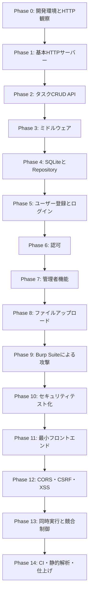

# ロードマップ



各フェーズは、前のフェーズのコードを拡張して進めます。

### 完了条件の使い方

各Phaseの最後に、そのPhase固有の完了条件をチェックリスト形式で記載しています。

- 原則として、チェック項目を満たしてから次のPhaseへ進みます。
- 完璧な設計になるまで進めないのではなく、そのPhaseの学習目的を満たしたかで判断します。
- 発展的な改善点が残る場合は、未解決課題として記録したうえで次へ進んで構いません。
- 後のPhaseで設計を変更した場合は、以前のPhaseのテストが引き続き成功することを確認します。

## Phase 0：開発環境とHTTP通信の観察

### 目的

コードを書く前に、HTTP通信がどのように見えるかを確認します。

### 学ぶこと

- リクエストとレスポンス
- HTTPメソッド
- URL
- ヘッダー
- ボディ
- ステータスコード
- Cookie
- ブラウザ開発者ツールのNetworkタブ
- `curl -v`
- `curl -i`

### 実践課題

- ブラウザのNetworkタブでHTTP通信を確認する
- `curl -v`でGETリクエストを送る
- `curl -i`でレスポンスヘッダーを確認する
- GETとPOSTの違いを観察する

### 完了条件

#### 理解
- [ ] HTTPリクエストのメソッド、パス、クエリ、ヘッダー、ボディを区別して説明できる
- [ ] HTTPレスポンスのステータスコード、ヘッダー、ボディを区別して説明できる
- [ ] GETとPOSTで、送信されるHTTPメッセージがどのように異なるか説明できる

#### 手動確認・記録
- [ ] ブラウザ開発者ツールのNetworkタブで、1件以上の通信を確認した
- [ ] `curl -v`と`curl -i`を使って通信を確認した
- [ ] 観察した通信の各要素を学習メモへ記録した

---

## Phase 1：基本HTTPサーバー

### 目的

Goの`net/http`を使い、HTTPサーバーの基本を実装します。

### 実装するエンドポイント

```http
GET  /health
GET  /hello?name=megamaru
POST /echo
```

#### `GET /health`

```json
{
  "status": "ok"
}
```

#### `GET /hello?name=megamaru`

```json
{
  "message": "Hello, megamaru"
}
```

#### `POST /echo`

受け取ったJSONを返します。

```json
{
  "message": "HTTPを勉強する"
}
```

### 実装要件

- HTTPメソッドを検証する
- `Content-Type`を検証する
- JSON解析エラーを処理する
- JSONレスポンスを共通化する
- エラーレスポンスを共通化する
- 不正なJSONを拒否する
- 複数のJSON値を拒否する
- リクエストログを出力する
- `httptest`でテストを書く

### エラー形式

```json
{
  "error": {
    "code": "invalid_json",
    "message": "JSONの形式が正しくありません"
  }
}
```

### 主なテストケース

- `GET /health`が`200`
- `POST /health`が`405`
- 正常な`POST /echo`が`200`
- 壊れたJSONが`400`
- 空のボディが`400`
- `Content-Type`なしが`415`
- 未知のJSONフィールドをどう扱うか

### 完了条件

#### 実装
- [ ] `GET /health`、`GET /hello`、`POST /echo`が仕様どおり動作する
- [ ] 許可していないHTTPメソッドを適切に拒否する
- [ ] `Content-Type`を検証している
- [ ] 不正なJSON、空ボディ、複数のJSON値を適切に拒否する
- [ ] JSONレスポンスとエラーレスポンスの共通処理がある
- [ ] リクエストログを出力できる

#### テスト・記録
- [ ] すべてのエンドポイントに`httptest`がある
- [ ] 正常系と主要な異常系をテストしている
- [ ] `curl`による確認コマンドと期待結果を記録した
- [ ] 使用したHTTPメソッドとステータスコードの理由を説明できる

---

## Phase 2：メモリ上のタスクCRUD API

### 目的

HTTPメソッド、パスパラメータ、クエリパラメータ、JSON、ステータスコードを実装を通して理解します。

### 実装するAPI

```http
GET    /api/tasks
GET    /api/tasks/{id}
POST   /api/tasks
PUT    /api/tasks/{id}
PATCH  /api/tasks/{id}
DELETE /api/tasks/{id}
```

### Task構造体の例

```go
type Task struct {
	ID          int       `json:"id"`
	Title       string    `json:"title"`
	Description string    `json:"description"`
	Completed   bool      `json:"completed"`
	CreatedAt   time.Time `json:"created_at"`
	UpdatedAt   time.Time `json:"updated_at"`
}
```

### 実装内容

- タスク一覧
- ID指定取得
- 新規作成
- 全体更新
- 部分更新
- 削除
- ID採番
- バリデーション
- 404処理
- JSONエラー処理
- メソッド制限

### バリデーション例

- `title`は必須
- `title`は1〜100文字
- `description`は最大1000文字
- 未知のJSONフィールドを拒否する
- JSONの後ろに余分な値がある場合は拒否する

### 一覧APIの追加課題

```http
GET /api/tasks?completed=false
GET /api/tasks?sort=created_at
GET /api/tasks?order=desc
GET /api/tasks?limit=10&offset=20
```

### 学ぶポイント

- `POST`と`PUT`と`PATCH`の違い
- `200`、`201`、`204`の使い分け
- `400`、`404`、`409`、`422`の使い分け
- パスとクエリパラメータの使い分け
- 冪等性
- 同じリクエストを複数回送った場合の挙動

---

### 完了条件

#### 実装
- [ ] タスクの一覧・取得・作成・全体更新・部分更新・削除が動作する
- [ ] `PUT`と`PATCH`の挙動を自分で定義し、仕様どおり実装している
- [ ] 入力値、存在しないID、不正なID、未知のJSONフィールドを適切に処理する
- [ ] 絞り込み、並び替え、ページングを実装している
- [ ] 同じリクエストを複数回送った場合の挙動を確認している

#### HTTP・テスト
- [ ] 作成・更新・削除・エラー時のステータスコードを使い分けている
- [ ] パスパラメータとクエリパラメータを目的に応じて使い分けている
- [ ] 各APIに正常系と複数の異常系テストがある
- [ ] フィルター、ソート、ページングの組み合わせをテストしている
- [ ] 主要な操作の`curl`コマンドと期待結果を記録した

---

## Phase 3：ルーターとミドルウェア

### 目的

複数のハンドラーで共通する処理を分離します。

### 作成するミドルウェア

- `LoggingMiddleware`
- `RecoveryMiddleware`
- `RequestIDMiddleware`
- `ContentTypeMiddleware`
- `CORSMiddleware`

### リクエストID

レスポンスにリクエストIDを含めます。

```http
X-Request-ID: 550e8400-e29b-41d4-a716-446655440000
```

ログにも同じIDを出します。

```text
request_id=xxx method=POST path=/api/tasks status=201 duration=2ms
```

### Recovery

ハンドラー内で`panic`が発生しても、サーバー全体を停止させずに`500 Internal Server Error`を返します。

学習用として、開発環境のみ有効なエンドポイントを用意しても構いません。

```http
GET /debug/panic
```

### 注意点

- ログへパスワードやセッションIDを出力しない
- パニックの詳細をクライアントへ返しすぎない
- ミドルウェアの実行順序を意識する

---

### 完了条件

#### 実装
- [ ] ログ、Recovery、リクエストIDなどがミドルウェアとして分離されている
- [ ] レスポンスとログのリクエストIDが一致する
- [ ] `panic`が発生してもサーバーが停止せず、`500`を返す
- [ ] ログにメソッド、パス、ステータスコード、処理時間を記録できる
- [ ] ミドルウェアの適用順序を意図して決めている

#### セキュリティ・テスト
- [ ] パスワード、Cookie、セッションIDをログへ出していない
- [ ] 内部エラーの詳細をクライアントへ過剰に返していない
- [ ] 各ミドルウェアのテストがある
- [ ] ミドルウェアの実行順序と理由を記録した

---

## Phase 4：SQLiteとRepository層

### 目的

メモリ上のデータ保存をSQLiteへ置き換え、SQLと永続化を学びます。

### テーブル例

```sql
CREATE TABLE tasks (
    id INTEGER PRIMARY KEY AUTOINCREMENT,
    title TEXT NOT NULL,
    description TEXT NOT NULL DEFAULT '',
    completed INTEGER NOT NULL DEFAULT 0,
    created_at DATETIME NOT NULL,
    updated_at DATETIME NOT NULL
);
```

### 実装内容

- SQLite接続
- マイグレーション
- Repository層
- CRUD
- SQLエラー処理
- プレースホルダー
- トランザクション
- テスト用DB
- 接続のクローズ
- `context.Context`の利用

### 追加課題

タスク作成と操作ログ保存を、一つのトランザクションにします。

```text
tasks
audit_logs
```

タスク作成に成功しても操作ログ保存に失敗した場合は、両方をロールバックします。

### 注意点

値をSQL文字列へ直接連結しないこと。

危険な例：

```go
query := "SELECT * FROM users WHERE name = '" + name + "'"
```

プレースホルダーを使用します。

```go
row := db.QueryRowContext(
	ctx,
	"SELECT id, name FROM users WHERE name = ?",
	name,
)
```

---

### 完了条件

#### 実装
- [ ] アプリを再起動してもタスクが保持される
- [ ] 空のデータベースからマイグレーションを実行して起動できる
- [ ] HTTPハンドラーとデータアクセス処理が分離されている
- [ ] SQL実行でプレースホルダーを使用している
- [ ] DB処理に`context.Context`を渡している

#### トランザクション・テスト
- [ ] 複数更新を一つのトランザクションとして扱う処理がある
- [ ] 途中で失敗した場合にすべてロールバックされる
- [ ] Repository層の正常系・異常系テストがある
- [ ] テストごとにDB状態を分離または初期化できる
- [ ] DB接続などのリソースを適切に閉じている

---

## Phase 5：ユーザー登録・ログイン・セッション

### 目的

認証とCookieベースのセッション管理を実装します。

### API

```http
POST /api/users
POST /api/login
POST /api/logout
GET  /api/me
```

### usersテーブル例

```sql
CREATE TABLE users (
    id INTEGER PRIMARY KEY AUTOINCREMENT,
    email TEXT NOT NULL UNIQUE,
    password_hash TEXT NOT NULL,
    role TEXT NOT NULL DEFAULT 'user',
    created_at DATETIME NOT NULL
);
```

### 実装内容

- メールアドレス検証
- パスワード検証
- パスワードハッシュ化
- ログイン判定
- セッション作成
- Cookie設定
- ログアウト
- 認証ミドルウェア
- セッション有効期限
- セッション無効化

### Cookie属性

- `HttpOnly`
- `SameSite`
- `Secure`
- `Path`
- `Max-Age`

ローカルHTTP環境では、`Secure`の有無を環境変数などで切り替えます。

### 主なテストケース

- 登録成功
- メールアドレス重複
- 弱いパスワード
- 間違ったパスワード
- 存在しないユーザー
- ログイン成功
- Cookieなしで`/api/me`
- 無効なCookie
- 期限切れセッション
- ログアウト後のCookie
- 同じログインリクエストの連続送信

### 注意点

- パスワードを平文で保存しない
- パスワードをログへ出さない
- セッションIDを推測可能な値にしない
- Cookie内のユーザーIDや権限を無条件に信用しない
- 暗号処理は独自実装しない

---

### 完了条件

#### 実装
- [ ] ユーザー登録、ログイン、ログアウト、`GET /api/me`が動作する
- [ ] パスワードを安全なハッシュとして保存している
- [ ] 推測困難なセッションを発行する
- [ ] ログアウト時にサーバー側セッションを無効化する
- [ ] セッション有効期限切れを処理できる
- [ ] 認証が必要なAPIを認証ミドルウェアで保護している

#### Cookie・テスト
- [ ] `HttpOnly`、`SameSite`、`Path`、有効期限を意図して設定している
- [ ] 環境に応じて`Secure`属性を切り替えられる
- [ ] Cookie内の値だけで権限を確定していない
- [ ] 登録、重複、ログイン失敗、期限切れ、ログアウト後の再利用をテストしている
- [ ] Cookieの発行・送信・削除をHTTPヘッダーで説明できる

---

## Phase 6：ユーザーごとの認可

### 目的

ログイン済みかどうかだけでなく、対象データを操作する権限があるかを検証します。

### tasksテーブルへの追加

```sql
ALTER TABLE tasks
ADD COLUMN owner_id INTEGER NOT NULL;
```

### 実装方針

タスク作成時の所有者は、リクエストボディから受け取りません。

危険な設計：

```json
{
  "title": "task",
  "owner_id": 999
}
```

所有者は、認証済みセッションから取得します。

```go
user := authenticatedUserFromContext(r.Context())
task.OwnerID = user.ID
```

### 検証する内容

- ユーザーAが自分のタスクを取得できる
- ユーザーAがユーザーBのタスクを取得できない
- ユーザーAがユーザーBのタスクを更新できない
- ユーザーAがユーザーBのタスクを削除できない
- 未ログインユーザーはタスクAPIを利用できない

### SQL例

```sql
SELECT *
FROM tasks
WHERE id = ?
  AND owner_id = ?;
```

### 重要な問い

各APIについて、必ず次を考えます。

```text
誰がこのAPIを呼べるか
そのユーザーはどのデータを操作できるか
URLのIDを書き換えられても安全か
JSON内の値を書き換えられても安全か
```

---

### 完了条件

#### 実装
- [ ] タスクの所有者を認証済みセッションから決定している
- [ ] 一覧APIではログインユーザー自身のタスクだけを返す
- [ ] ユーザーAがユーザーBのタスクを取得・更新・削除できない
- [ ] `owner_id`を書き換えても他人の所有物として登録できない
- [ ] 未ログインと権限不足を区別して処理している
- [ ] `403`または`404`を使う方針が統一されている

#### 検証・テスト
- [ ] ユーザーA・ユーザーB・管理者のテストデータを用意した
- [ ] Burp Suiteまたは`curl`でURLやJSONのIDを書き換えて確認した
- [ ] GET、PATCH、PUT、DELETEの認可テストがある
- [ ] 認証と認可の違いを自作アプリの処理で説明できる

---

## Phase 7：管理者機能

### 目的

一般ユーザーと管理者の権限差を実装します。

### API

```http
GET    /api/admin/users
GET    /api/admin/tasks
PATCH  /api/admin/users/{id}/role
DELETE /api/admin/users/{id}
```

### 権限制御

```text
未ログイン     → 401 Unauthorized
一般ユーザー   → 403 Forbidden
管理者         → 処理を許可
```

### 攻撃課題

一般ユーザーとして送信したリクエストをBurp Suiteで取得し、次のような値を書き換えます。

```json
{
  "role": "user"
}
```

```json
{
  "role": "admin"
}
```

サーバーがクライアントから送られた権限をそのまま受け入れないことを確認します。

### 注意点

- 管理者用画面を非表示にするだけでは不十分
- API側で必ず権限を検証する
- 自分自身の管理者権限を誤って失うケースを考える
- 最後の管理者を削除してよいかを仕様化する

---

### 完了条件

#### 実装
- [ ] 管理者用APIが仕様どおり動作する
- [ ] 未ログインは`401`、一般ユーザーは`403`として拒否される
- [ ] 管理者だけがユーザー一覧、全タスク、権限変更を実行できる
- [ ] クライアントから送られた`role`を無条件に信用していない
- [ ] 自分自身の権限変更や最後の管理者削除について仕様を決めている
- [ ] 重要な管理者操作を監査できる形で記録している

#### 検証・テスト
- [ ] 一般ユーザーのリクエストを改変しても管理者操作が拒否される
- [ ] URL、メソッド、JSONの権限値をそれぞれ改変して確認した
- [ ] 一般ユーザーと管理者の自動テストがある
- [ ] 管理者権限の境界条件を記録した

---

## Phase 8：ファイルアップロード

### 目的

`multipart/form-data`とファイルアップロード時のセキュリティを学びます。

### API

```http
POST /api/profile/image
Content-Type: multipart/form-data
```

### 実装要件

- ファイルサイズ上限
- MIMEタイプ検証
- 拡張子検証
- ランダムな保存ファイル名
- 保存先ディレクトリの固定
- パストラバーサル対策
- 既存画像の置き換え
- 削除処理
- 画像以外のファイルを拒否
- ファイル名を信用しない

### 攻撃として試すもの

```text
../../main.go
空ファイル
巨大ファイル
拡張子だけ.jpg
実体がHTMLの画像
二重拡張子 image.php.jpg
同名ファイル
不正なContent-Type
```

### 注意点

- ユーザー指定のパスをそのまま使わない
- アップロード先を実行可能な場所にしない
- ファイルの拡張子だけで判定しない
- 本物の個人情報を含む画像を使わない

---

### 完了条件

#### 実装
- [ ] 正常な画像をアップロード・置換・削除できる
- [ ] ファイルサイズ上限を超えた場合に拒否する
- [ ] 拡張子、申告MIMEタイプ、実際の内容の一つだけで判断していない
- [ ] 保存ファイル名をサーバー側で生成している
- [ ] 保存先が固定され、ディレクトリ外へ移動できない
- [ ] アップロード先がスクリプトなどを実行する場所になっていない

#### 検証・テスト
- [ ] パストラバーサルを含むファイル名を安全に処理できる
- [ ] 空ファイル、巨大ファイル、偽装ファイル、二重拡張子を試した
- [ ] 壊れたmultipartデータや不正な`Content-Type`を試した
- [ ] 正常系と主要な攻撃ケースを自動テストしている
- [ ] 検証手順と許可基準を記録した

---

## Phase 9：Burp Suiteによる手動セキュリティ検査

### 目的

自分が実装したAPIを、攻撃者の視点から検査します。

### 基本操作

```text
Proxyで通信を取得する
  ↓
Repeaterへ送る
  ↓
値を書き換える
  ↓
リクエストを再送する
  ↓
レスポンスを比較する
```

### 認証の検査

- Cookieを削除する
- Cookieを書き換える
- ログアウト済みCookieを再利用する
- 別ユーザーのCookieに差し替える
- 期限切れセッションを送る
- 同じログインを連続送信する

### 認可の検査

- 他人のタスクIDに変更する
- 一般ユーザーで管理者APIを呼ぶ
- JSON内の`owner_id`を書き換える
- JSON内の`role`を書き換える
- GETだけでなくPATCH・DELETEも試す

### 入力値の検査

- 空文字
- 非常に長い文字列
- 不正なJSON
- JSONを複数送信
- 未知のフィールド
- 異なる`Content-Type`
- 負数のID
- 巨大なID
- 不正な文字コード

### HTTPメソッドの検査

- GETをPOSTへ変更
- POSTをDELETEへ変更
- HEADを送る
- OPTIONSを送る
- 未対応メソッドを送る

### 再送の検査

- 同じPOSTを2回送る
- 同じDELETEを2回送る
- 同じ更新を繰り返す
- 同じログインを連打する

---

### 完了条件

#### Burp Suiteの操作
- [ ] Proxyで自作アプリの通信を取得できる
- [ ] リクエストをRepeaterへ送り、編集して再送できる
- [ ] リクエストとレスポンスの差分を比較できる

#### 検査・記録
- [ ] 認証、認可、入力値、HTTPメソッド、再送を一通り検査した
- [ ] URL、Cookie、ヘッダー、JSONボディをそれぞれ変更して試した
- [ ] 作成・更新・削除系APIも検査した
- [ ] 発見した問題の再現手順と期待する安全な挙動を記録した
- [ ] 問題が見つからなかった項目も、何を試したか記録した
- [ ] 検査対象をlocalhostまたは許可された環境に限定した

---

## Phase 10：Burp Suiteの検査を自動テスト化する

### 目的

手動検査で発見した問題を、再発防止テストとして残します。

### テスト分類

```text
unit test
handler test
repository test
integration test
security test
```

### テスト例

```go
func TestUserCannotDeleteAnotherUsersTask(t *testing.T) {
	userA := createTestUser(t)
	userB := createTestUser(t)

	taskB := createTaskForUser(t, userB)
	sessionA := loginTestUser(t, userA)

	req := httptest.NewRequest(
		http.MethodDelete,
		fmt.Sprintf("/api/tasks/%d", taskB.ID),
		nil,
	)
	req.AddCookie(sessionA.Cookie)

	res := httptest.NewRecorder()
	handler.ServeHTTP(res, req)

	if res.Code != http.StatusNotFound {
		t.Fatalf(
			"expected %d, got %d",
			http.StatusNotFound,
			res.Code,
		)
	}
}
```

### 学習サイクル

```text
Burp Suiteで攻撃する
  ↓
攻撃が成功する
  ↓
原因コードを調査する
  ↓
修正する
  ↓
Burp Suiteで攻撃が失敗することを確認する
  ↓
同じ攻撃をGoテストとして残す
```

---

### 完了条件

#### 自動テスト化
- [ ] Burp Suiteで確認した重要な攻撃ケースをGoテストへ変換した
- [ ] 修正前には失敗し、修正後には成功する再発防止テストを確認した
- [ ] 認証、認可、入力検証、再送などのテストが整理されている
- [ ] テストデータとセッションをテストごとに独立して作成できる
- [ ] テストが実行順序に依存していない

#### 品質
- [ ] テスト名から「誰が・何をしたとき・どう拒否されるか」が分かる
- [ ] `go test ./...`で全テストが成功する
- [ ] Burp Suiteの検査記録と対応するテストを追跡できる

---

## Phase 11：最小限のフロントエンド

### 目的

ブラウザ固有のHTTP動作を学びます。

### 作成する画面

- ログイン
- タスク一覧
- タスク作成
- タスク更新・削除
- 管理者画面
- プロフィール画像アップロード

### 技術選択

最初は次のどちらかで十分です。

- 素のHTML・CSS・JavaScript
- 最小構成のReact + Vite

デザインには時間をかけず、`fetch`によるHTTP通信を中心にします。

### 学ぶ内容

- `fetch`
- Cookieの自動送信
- `credentials: "include"`
- ブラウザ開発者ツール
- リダイレクト
- フォーム送信
- `localStorage`とCookieの違い

---

### 完了条件

#### 画面・通信
- [ ] ログイン、タスクCRUD、管理者操作、画像アップロードを画面から実行できる
- [ ] `fetch`で送るメソッド、ヘッダー、ボディを意識して実装している
- [ ] Cookie認証に必要な`credentials`設定を理解している
- [ ] APIエラーを画面上で適切に扱っている
- [ ] 開発者ツールで各操作のHTTP通信を確認した

#### セキュリティ・学習範囲
- [ ] パスワードやセッションIDを`localStorage`へ保存していない
- [ ] 管理者用UIを非表示にするだけでなく、API側の認可が維持されている
- [ ] ブラウザ通信をBurp Suiteで取得・改変できる
- [ ] デザインへ過度に広げず、HTTP学習に必要な最小構成に収めた
- [ ] CLIとブラウザクライアントの違いを説明できる

---

## Phase 12：CORS・CSRF・XSS

### 目的

CLIだけでは再現しにくい、ブラウザ固有のセキュリティを学びます。

### 開発環境例

```text
フロントエンド：http://localhost:3000
バックエンド：http://localhost:8080
```

### 学ぶ内容

- Same-Origin Policy
- CORS
- プリフライトリクエスト
- `Access-Control-Allow-Origin`
- `Access-Control-Allow-Methods`
- `Access-Control-Allow-Headers`
- `Access-Control-Allow-Credentials`
- Cookieの`SameSite`
- CSRF
- XSS
- CSP

### 重要な違い

```text
curlでAPIを呼べる
  ≠
ブラウザのJavaScriptからレスポンスを読める
```

CORSはブラウザが適用する仕組みであり、`curl`やBurp Suiteは同じ制限を強制しません。

### 実践課題

- CORS設定を意図的に壊す
- ブラウザから拒否される様子を確認する
- Cookieありのクロスオリジン通信を試す
- CSRF対策の有無を比較する
- 入力文字列をHTMLへ表示し、XSS対策を確認する
- CSPの有無による違いを確認する

---

### 完了条件

#### CORS
- [ ] 許可オリジンから成功し、未許可オリジンではブラウザが拒否する
- [ ] 単純リクエストとプリフライトを確認した
- [ ] Cookieを伴うCORSを安全に設定している
- [ ] `curl`ではCORS制限が再現されない理由を説明できる

#### CSRF・XSS・CSP
- [ ] CSRF対策がない状態と、対策後の違いを確認した
- [ ] 採用したCSRF対策の理由を説明できる
- [ ] ユーザー入力を表示する箇所でスクリプトが実行されない
- [ ] 出力エスケープや安全なDOM操作を確認した
- [ ] CSPによって許可・拒否されるリソースの違いを確認した
- [ ] CORS、CSRF、XSSの違いを自作アプリの例で説明できる

---

## Phase 13：同時実行・競合・タイムアウト

### 目的

Goらしい同時実行と、Web APIの競合制御を学びます。

### 実装・検証内容

- 同時に100件のタスクを作成する
- ID重複が発生しないことを確認する
- `go test -race ./...`
- 同じタスクを同時更新する
- 楽観ロック
- コンテキストのタイムアウト
- クライアント切断時のDB処理キャンセル
- Graceful Shutdown

### 楽観ロックの例

```sql
ALTER TABLE tasks
ADD COLUMN version INTEGER NOT NULL DEFAULT 1;
```

```sql
UPDATE tasks
SET title = ?,
    version = version + 1
WHERE id = ?
  AND version = ?;
```

更新件数が0件だった場合は、競合として`409 Conflict`を返します。

---

### 完了条件

#### 同時実行・競合
- [ ] 複数の同時リクエストでもデータ破損やID重複が発生しない
- [ ] `go test -race ./...`が警告なしで完了する
- [ ] 同じタスクへの同時更新を再現できる
- [ ] 採用した競合制御を実装している
- [ ] 古いバージョンで更新した場合に`409 Conflict`などで拒否する
- [ ] 競合時に一方の更新を黙って上書きしない

#### タイムアウト・終了処理
- [ ] リクエストキャンセルや期限切れがDB処理へ伝播する
- [ ] サーバー停止時に処理中リクエストを可能な範囲で完了できる
- [ ] 同時実行・競合・キャンセルのテストが安定して成功する
- [ ] 採用した制御方法とトレードオフを記録した

---

## Phase 14：CI・静的解析・仕上げ

### 目的

開発時の確認を自動化し、リポジトリを完成させます。

### 導入するもの

- `go test ./...`
- `go test -race ./...`
- `go vet ./...`
- `staticcheck`
- `govulncheck`
- Dependabot
- CodeQL
- secret scanning
- GitHub Actions
- Docker
- 環境変数
- 構造化ログ
- Graceful Shutdown
- OpenAPI

### GitHub Actionsで確認する内容

- ビルド
- 単体テスト
- 統合テスト
- Race Detector
- 静的解析
- 脆弱性検査

### 最終成果物

- 動作するAPI
- 最小フロントエンド
- API仕様
- テストコード
- セキュリティテスト
- Burp Suite検査記録
- アーキテクチャ説明
- 学習記録
- 実行手順
- CI設定

---

### 完了条件

#### CI・自動検査
- [ ] GitHub Actionsでビルドと`go test ./...`が実行される
- [ ] Race Detector、`go vet`、`staticcheck`、`govulncheck`が自動実行される
- [ ] CodeQL、Dependabot、secret scanningを設定している
- [ ] CI失敗時に、どの検査で失敗したか判別できる

#### 配布・ドキュメント
- [ ] 新しい環境でREADMEの手順だけを使って起動できる
- [ ] 環境依存値や秘密情報を環境変数へ分離している
- [ ] `.env`や秘密情報がGit履歴に含まれていない
- [ ] OpenAPIなどでAPI仕様を確認できる
- [ ] アーキテクチャ、認証・認可、主要な対策を説明する文書がある
- [ ] クリーンなcloneからセットアップ、テスト、起動を再現できる
- [ ] 未解決課題と今後の改善点を記録した

---
