# CloudFrontの中継とキャッシュの仕組み

## この文書の目的

この文書では、`curl`でWebサイトへ複数回アクセスしたときに生じた、次の疑問を整理します。

1. CloudFrontは中継サーバーなのか、キャッシュサーバーなのか
2. CloudFrontと、`Via`に表示された中継サーバーは違うものなのか
3. `Age`はクライアントごとに管理されているのか

観察したレスポンスヘッダーは次のとおりです。

```text
1回目
x-cache: Hit from cloudfront
via: 1.1 a0c8ca5c55854408aacaabfb864516d0.cloudfront.net (CloudFront)
x-amz-cf-pop: NRT57-P1
x-amz-cf-id: stynVAgnn9bWjLQaS9fHmfDU4AjzOZzJcrpQ4bZO471Lhvn6Z91dzA==
age: 171510
```

```text
2回目
x-cache: Hit from cloudfront
via: 1.1 6b3df82b11020ffd9f07adedfc60be70.cloudfront.net (CloudFront)
x-amz-cf-pop: NRT57-P1
x-amz-cf-id: VvmOIdlakIl0eL85R30r5WkdW--28JdWELZcIGG_h5gtkh1WfJNvkg==
age: 293097
```

---

## 1. 最初に用語を整理する

CloudFrontの仕組みを理解するために、登場するものを整理します。

| 用語 | 意味 |
|---|---|
| ビューワー | CloudFrontへリクエストを送るブラウザやcurlなどのクライアント |
| オリジン | 元のコンテンツを保持するWebサーバーやS3バケット |
| CDN | 各地域の拠点を使ってコンテンツを効率よく配信する仕組み |
| POP | 利用者からのリクエストを受け付けるCloudFrontのエッジ拠点 |
| リージョナルエッジキャッシュ | POPとオリジンの間にある、より大きなCloudFrontのキャッシュ |
| キャッシュオブジェクト | CloudFrontが保存して再利用するレスポンス |
| キャッシュキー | どのキャッシュオブジェクトを使うか識別するための値 |

全体の位置関係は、次のようになります。

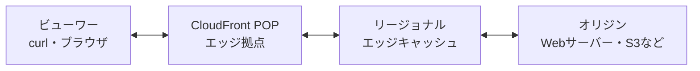

すべてのリクエストが必ずこの全経路を通るわけではありません。POPに利用可能なキャッシュがあれば、POPからビューワーへ直接レスポンスを返せます。

---

## 2. CloudFrontは中継サーバーか、キャッシュサーバーか

結論は、CloudFrontは中継サーバーであり、同時にキャッシュサーバーでもある、です。

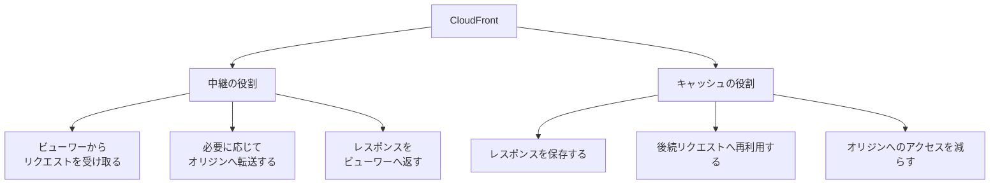

### 中継サーバーとしての役割

CloudFrontは、ビューワーとオリジンの間に入ります。

```text
ビューワー → CloudFront → オリジン
ビューワー ← CloudFront ← オリジン
```

ビューワーは通常、オリジンへ直接接続するのではなく、CloudFrontへ接続します。CloudFrontは必要に応じてオリジンと通信します。

このように、オリジンサーバーの前段でクライアントからのリクエストを受け付ける仕組みは、リバースプロキシとも呼ばれます。

### キャッシュサーバーとしての役割

CloudFrontは、オリジンから取得したレスポンスを保存し、後続の同等なリクエストへ再利用できます。

HTTPの用語では、CloudFrontのように複数の利用者が使うキャッシュを共有キャッシュと呼びます。

| 種類 | 利用者 | 例 |
|---|---|---|
| プライベートキャッシュ | 原則として1人 | ブラウザキャッシュ |
| 共有キャッシュ | 複数の利用者 | CDN、プロキシキャッシュ |

CloudFrontは、世界各地にある共有キャッシュを利用するCDNです。

---

## 3. キャッシュヒット時の処理

今回のレスポンスには、次のヘッダーがあります。

```text
x-cache: Hit from cloudfront
```

`Hit`は、CloudFrontに利用可能なキャッシュオブジェクトがあり、それを使ってレスポンスを返したことを示します。

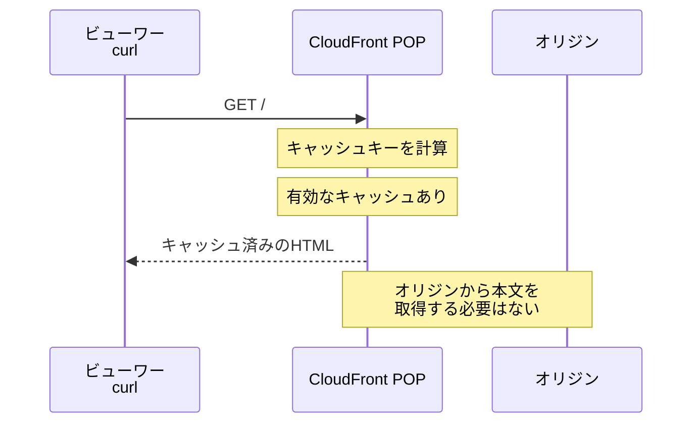

キャッシュヒットには、次の効果があります。

- ビューワーに近い拠点から高速に返せる
- オリジンサーバーまでの通信を減らせる
- オリジンサーバーの負荷を減らせる
- ネットワーク全体のデータ転送を減らせる

---

## 4. キャッシュミス時の処理

利用可能なキャッシュがない場合は、キャッシュミスになります。

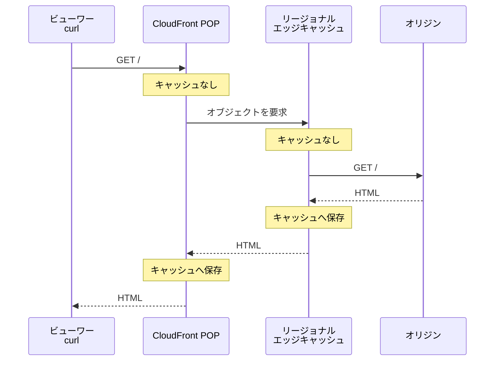

一度取得したレスポンスをCloudFrontがキャッシュできれば、次回以降のリクエストで再利用できます。

ただし、実際の経路は設定やリクエストの種類によって異なります。リージョナルエッジキャッシュを通らず、POPからオリジンへ直接アクセスする場合もあります。

---

## 5. CloudFrontと`Via`の中継サーバーは違うのか

今回の`Via`に表示されている中継システムはCloudFrontです。

```text
via: 1.1 a0c8ca5c55854408aacaabfb864516d0.cloudfront.net (CloudFront)
```

したがって、次のように別々のものが並んでいるわけではありません。

```text
誤ったイメージ

curl
  ↓
CloudFront
  ↓
Viaに表示された別の中継サービス
  ↓
オリジン
```

基本的には、次のように考えます。

```text
今回の観察

curl
  ↓
CloudFront
  └── ViaにもCloudFrontを経由した情報が表示されている
```

`Via`は、HTTPメッセージがプロキシやCDNなどの中継点を経由したことを示すヘッダーです。

---

## 6. CloudFront関連ヘッダーの違い

各ヘッダーは、CloudFrontの異なる側面を表しています。

| ヘッダー | 観察できること | 今回の値 |
|---|---|---|
| `X-Cache` | キャッシュが利用されたか | `Hit from cloudfront` |
| `Via` | CloudFrontが中継に関わったこと | `...cloudfront.net (CloudFront)` |
| `X-Amz-Cf-Pop` | 処理したCloudFrontのPOP | `NRT57-P1` |
| `X-Amz-Cf-Id` | 個々のCloudFrontリクエストの識別子 | リクエストごとに異なる値 |
| `Age` | キャッシュ済みレスポンスの現在の古さ | `171510`、`293097` |

関係を図にすると、次のようになります。

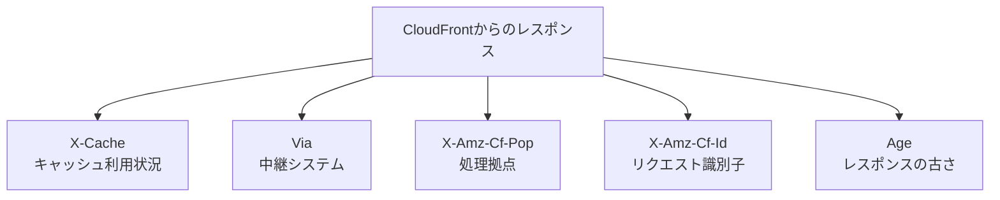

### `X-Amz-Cf-Pop`

```text
x-amz-cf-pop: NRT57-P1
```

`NRT57-P1`は、リクエストを処理したCloudFront POPのコードです。

2回とも同じPOPだったのは、同じ場所から近い時間にアクセスしたことで、同じPOPが低遅延な配信拠点として選ばれたためだと考えられます。

ただし、次のような要因によって、同じクライアントでも別のPOPへ接続される可能性があります。

- クライアントの現在地
- ネットワークの経路
- 通信遅延
- CloudFront側のルーティング
- 障害やメンテナンス

したがって、常に同じPOPになるとは限りません。

### `X-Amz-Cf-Id`

`X-Amz-Cf-Id`は、CloudFrontがリクエストの追跡に利用する識別子です。

```text
1回目
stynVAgnn9bWjLQaS9fHmfDU4AjzOZzJcrpQ4bZO471Lhvn6Z91dzA==

2回目
VvmOIdlakIl0eL85R30r5WkdW--28JdWELZcIGG_h5gtkh1WfJNvkg==
```

別々のリクエストなので、値が異なるのは自然です。同じキャッシュを利用したかどうかを、このIDの一致・不一致で判断するものではありません。

---

## 7. 同じPOPでも`Via`の値が変わった理由

2回のレスポンスでは、`X-Amz-Cf-Pop`は同じですが、`Via`内のホスト名は変化しています。

| 項目 | 1回目 | 2回目 |
|---|---|---|
| POP | `NRT57-P1` | `NRT57-P1` |
| `Via`のホスト名 | `a0c8ca...cloudfront.net` | `6b3df8...cloudfront.net` |

CloudFrontは大規模な分散システムです。1つのPOPを、1台だけの物理サーバーと考える必要はありません。

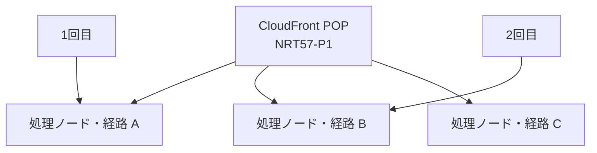

そのため、次のように理解するのが適切です。

> 2回とも同じCloudFront POPで処理されたが、`Via`に記録されたCloudFront内部の識別情報は異なっていた。

ただし、`Via`の値だけから、次のことまでは断定できません。

- 物理サーバーが確実に変わった
- 具体的にどの内部サーバーを通った
- CloudFront内部で何段のキャッシュを通った
- オリジンサーバーへアクセスした

`X-Cache: Hit from cloudfront`があるため、今回のレスポンス本文はCloudFrontのキャッシュから提供されたと判断できます。

進捗資料へ記録する場合は、次の表現が適切です。

> どちらもCloudFrontを中継しており、処理したPOPは`NRT57-P1`で同じだった。一方、`Via`のCloudFront内部識別情報は変化していた。

---

## 8. キャッシュはクライアントごとに管理されるのか

CloudFrontの共有キャッシュは、基本的にクライアントごとではなく、キャッシュキーごとに管理されます。

キャッシュキーは、リクエストに対してどのキャッシュオブジェクトを利用できるかを判断する識別子です。

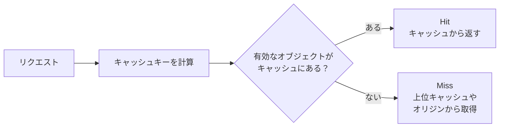

CloudFrontのデフォルトのキャッシュキーには、主に次の情報が含まれます。

- CloudFrontディストリビューションのドメイン名
- リクエストされたURLパス

設定によって、次の情報もキャッシュキーへ含められます。

- URLのクエリ文字列
- 特定のHTTPリクエストヘッダー
- Cookie

重要なのは、「リクエストの全文が完全に同じか」ではなく、「設定された項目から同じキャッシュキーが作られるか」です。

---

## 9. 異なるクライアントによるキャッシュの共有

異なる利用者でも、同じPOPへ到達し、同じキャッシュキーが生成されれば、同じキャッシュオブジェクトを利用できます。

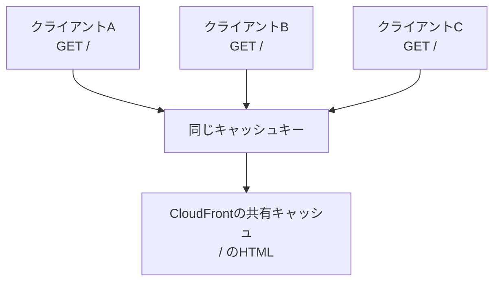

したがって、次の認識で問題ありません。

> 同一クライアントごとにキャッシュを管理するのではなく、同じキャッシュキーになるリクエストに対して、キャッシュ済みレスポンスを再利用する。

ただし、世界中のすべてのCloudFront POPが、常に1つの物理キャッシュを直接共有しているわけではありません。

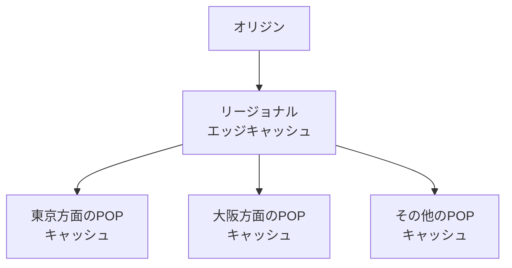

そのため、同じURLへアクセスしても、接続したPOPやキャッシュの状態によって次の値が変わる場合があります。

- `X-Cache`
- `Age`
- `X-Amz-Cf-Pop`
- `Via`

---

## 10. 個人ごとに異なるレスポンスはどうするのか

ログイン後の画面など、利用者によって内容が違うレスポンスを無条件に共有すると、別の利用者へ誤った内容を返す危険があります。

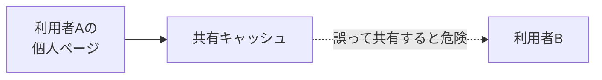

そのため、サービス設計では次のような方法を使い分けます。

- キャッシュさせない
- Cookieや必要なヘッダーをキャッシュキーへ含める
- 利用者に依存しない静的コンテンツだけを共有キャッシュする
- `Cache-Control: private`や`no-store`などを適切に設定する

キャッシュキーへ含める項目は、オリジンがどの情報によってレスポンス内容を変えるかに合わせる必要があります。

---

## 11. `Age`は何を表しているのか

`Age`は、共有キャッシュが計算したレスポンスの現在の古さを秒単位で表します。

より具体的には、オリジンサーバーでレスポンスが生成された、または正常に再検証された時点からの経過時間の推定値です。

```text
1回目: age: 171510
2回目: age: 293097
```

差を計算すると、次のようになります。

```text
293097 - 171510
= 121587秒
= 33時間46分27秒
```

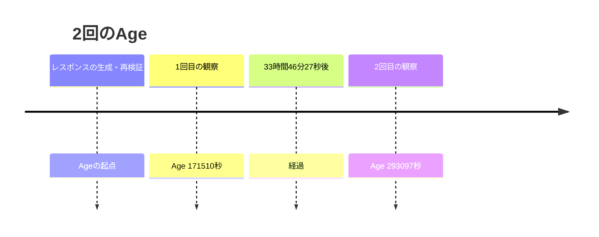

`Age`は、次の時間ではありません。

| 誤解 | 実際 |
|---|---|
| 特定のクライアントが最後にアクセスしてからの時間 | クライアント単位ではない |
| curlを起動してからの時間 | curlの実行時間ではない |
| ファイルが作成されてからの時間 | ファイルシステム上の作成時刻ではない |
| 必ず現在のPOPだけに保存されていた時間 | 複数の共有キャッシュを経由した時間を含む可能性がある |

---

## 12. `Date`と`Age`を組み合わせて観察する

2回のレスポンスでは、`Date`が同じでした。

```text
date: Fri, 24 Jul 2026 05:07:23 GMT
```

一方で、`Age`は増えています。

```text
1回目: age: 171510
2回目: age: 293097
```

この組み合わせから、次のように考えられます。

> 2回とも、同じ時点に生成または再検証されたレスポンスを起点とするキャッシュが使われ、時間の経過に応じて`Age`が増加した可能性が高い。

ただし、この情報だけでは、2回とも同じ物理サーバーに保存された同一のキャッシュデータを使ったとは断定できません。

キャッシュオブジェクトが上位キャッシュからPOPへ転送された場合も、それまでの古さを引き継いで`Age`が計算されるためです。

---

## 13. キャッシュの有効期限が切れたらどうなるか

キャッシュされたレスポンスは、無期限にそのまま使われるとは限りません。

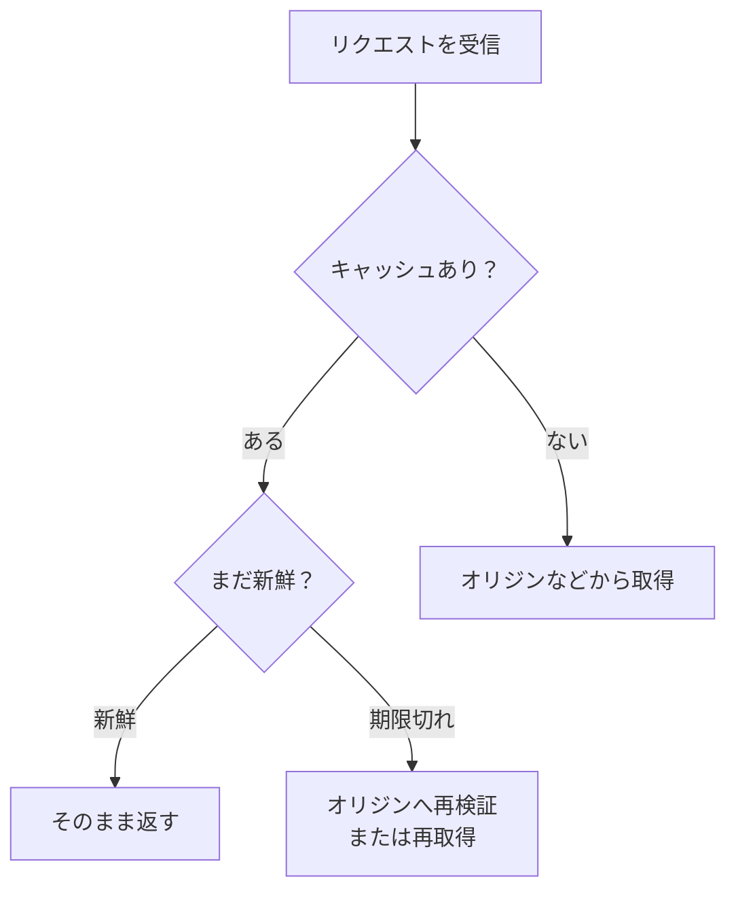

キャッシュが古くなった場合、CloudFrontは設定やレスポンスヘッダーに従って、次のような処理を行います。

- オリジンへ再検証する
- オリジンから新しいレスポンスを取得する
- 条件によって古いレスポンスを一時的に使う
- 新しいレスポンスでキャッシュを更新する

したがって、`Age`が増え続けて永久に同じレスポンスが返されるわけではありません。

---

## 14. 今回の観察から確認できること

観察できる事実と、そこからの推測を分けます。

| 分類 | 内容 |
|---|---|
| 確認できる | 2回とも`X-Cache`は`Hit from cloudfront`だった |
| 確認できる | 2回ともPOPコードは`NRT57-P1`だった |
| 確認できる | `Via`内のCloudFrontホスト名は異なっていた |
| 確認できる | `X-Amz-Cf-Id`はリクエストごとに異なっていた |
| 確認できる | `Age`は`171510`から`293097`へ増えた |
| 推測できる | 同じ時点に生成または再検証されたレスポンスを起点とするキャッシュが使われた可能性が高い |
| 断定できない | 2回とも同じ物理サーバーが処理した |
| 断定できない | 2回とも同じ物理キャッシュに保存されたデータを返した |
| 断定できない | CloudFront内部で通過したすべてのサーバーと経路 |

---

## 15. 進捗資料へ記録する例

```markdown
- CloudFrontは、ビューワーとオリジンの間で通信を中継するCDNであり、複数の利用者が使う共有キャッシュとしても動作する。
- 2回のレスポンスでは、どちらも`X-Cache: Hit from cloudfront`だったため、CloudFrontのキャッシュが利用された。
- `X-Amz-Cf-Pop`はどちらも`NRT57-P1`であり、同じCloudFront POPで処理された。
- `Via`に表示されたCloudFront内部識別情報は変化した。ただし、この情報だけでは物理サーバーが変わったとは断定できない。
- CloudFrontのキャッシュはクライアント単位ではなく、キャッシュキー単位で選択される。異なる利用者でも、同じキャッシュキーになれば共有キャッシュを利用できる。
- `Age`はクライアントごとの経過時間ではなく、キャッシュされたレスポンスの現在の古さを秒単位で示す。
- `Date`が同じまま`Age`が増えているため、同じ時点に生成または再検証されたレスポンスを起点とするキャッシュが使われた可能性が高い。
```

---

## 16. 3つの疑問への回答

| 疑問 | 回答 |
|---|---|
| CloudFrontは中継サーバーか、キャッシュサーバーか | 両方。ビューワーとオリジンの間で通信を中継し、キャッシュ可能なレスポンスを保存・再利用する |
| CloudFrontとレスポンスの中継サーバーは違うか | 今回の`Via`に表示された中継システムもCloudFront。`Via`、POP、リクエストIDはCloudFrontの異なる情報を示している |
| `Age`やキャッシュはクライアントごとか | クライアントごとではない。共有キャッシュから、キャッシュキーが一致するリクエストへレスポンスを再利用する |

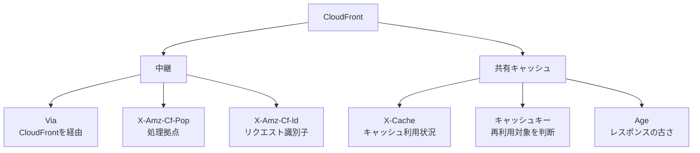

---

## 17. 関連ドキュメント

- [HTTP Cookieと`HttpOnly`の仕組み](http-cookies-and-httponly.md)
- [`curl -v`で観察するHTTPレスポンス](http-response-structure-and-headers.md)
- [HTTP/1.1とHTTP/2のストリーム](http1.1-vs-http2-streams.md)
- [`curl -v`で観察するTLS 1.3ハンドシェイク](tls-1.3-handshake-flow.md)

---

## 18. 参考資料

- [Amazon CloudFront：コンテンツ配信の仕組み](https://docs.aws.amazon.com/AmazonCloudFront/latest/DeveloperGuide/HowCloudFrontWorks.html)
- [Amazon CloudFront：キャッシュキーの理解](https://docs.aws.amazon.com/AmazonCloudFront/latest/DeveloperGuide/understanding-the-cache-key.html)
- [Amazon CloudFront：キャッシュと可用性](https://docs.aws.amazon.com/AmazonCloudFront/latest/DeveloperGuide/ConfiguringCaching.html)
- [RFC 9110：HTTP Semantics](https://www.rfc-editor.org/rfc/rfc9110.html)
- [RFC 9111：HTTP Caching](https://www.rfc-editor.org/rfc/rfc9111.html)
