# Cookie・セッション・Domain・SameSiteの総合整理

## この文書の目的

この文書では、Cookieについて学ぶ中で生じた次の疑問を、基礎から順に整理します。

- Cookieの値とサーバー側のセッションは、どこに保存されるのか
- HTTPがステートレスであることと、ログイン処理のステートフル／ステートレスは同じ話なのか
- ステートレス認証では、ユーザー情報もサーバーに保存しないのか
- domain、host、subdomainは何が違うのか
- ブラウザは、どの通信にどのCookieを自動で付けるのか
- originとsiteは何が違うのか
- `SameSite`は、どのようにCSRFを防ぐのか
- Partitioned Cookieは、通常のCookieと何が違うのか
- Chrome DevToolsのCookies欄には何が表示されるのか

既存の[HTTP Cookieと`HttpOnly`の仕組み](./http-cookies-and-httponly.md)は、
`HttpOnly`とcurlによる確認を中心に説明しています。
この文書では、それを前提に、セッション、名前の範囲、クロスサイト通信までを一続きの仕組みとして説明します。

> [!IMPORTANT]
> 最初に押さえるべき点は、Cookie、セッション、ユーザー情報が同じものではないことです。

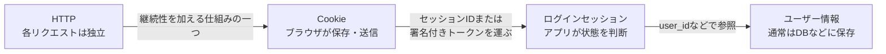

---

## 1. Cookieとは何か

Cookieは、ブラウザが名前と値、および送信条件を保存し、条件に合う後続のHTTPリクエストへ自動で付ける仕組みです。

代表的な用途は次のとおりです。

| 用途 | Cookieに入れる値の例 |
|---|---|
| ログインセッション | 推測困難なセッションID |
| 表示設定 | 言語、テーマ |
| カート | カートを識別するID |
| 計測 | 利用者や閲覧を識別するID |

Cookieは、HTTPヘッダーを使って設定・送信されます。

| 方向 | HTTPヘッダー | 役割 |
|---|---|---|
| サーバー → ブラウザ | `Set-Cookie` | Cookieの値と保存・送信条件を指定する |
| ブラウザ → サーバー | `Cookie` | 条件に一致したCookieの名前と値を送る |

### 基本的な流れ

```mermaid
sequenceDiagram
    actor U as 利用者
    participant B as ブラウザ
    participant A as アプリケーションサーバー

    U->>B: ログイン操作
    B->>A: POST /login
    A-->>B: Set-Cookie: session_id=abc123;<br/>HttpOnly; Secure; SameSite=Lax
    Note over B: 値と属性をCookieストアに保存
    U->>B: マイページを開く
    B->>B: URLとCookie属性を照合
    B->>A: GET /mypage<br/>Cookie: session_id=abc123
    A-->>B: ログイン中のページ
```

重要なのは、後続の`Cookie`ヘッダーでは通常、名前と値だけを送ることです。

```http
Cookie: session_id=abc123
```

`Domain`、`Path`、`HttpOnly`、`Secure`、`SameSite`などの属性は、ブラウザが送信可否を判断するために保存します。
これらの属性を毎回サーバーへ送り返すわけではありません。

---

## 2. 誰が何を担当するのか

Cookieは、アプリケーションだけ、またはブラウザだけで完結する機能ではありません。

| 関係者 | 主な担当 |
|---|---|
| バックエンド開発者 | Cookieの用途、値、属性、期限を決め、`Set-Cookie`を返す。セッション検証やCSRF対策も実装する |
| ブラウザ | Cookieを保存し、属性とリクエストの状況を照合して、自動送信するか決める |
| フロントエンド開発者 | 必要に応じてFetch APIの`credentials`などを設定する。`HttpOnly` Cookieの値はJavaScriptから読めない前提で設計する |
| インフラ担当者 | HTTPS、TLS終端、DNS、リバースプロキシ、正しいホスト・スキーム情報の連携を整える |
| 利用者 | ブラウザ設定でCookieを削除・拒否できる。DevToolsでは保存内容を確認できる |

### 自動と実装の境界

- ブラウザは、受け取ったCookieの保存と条件に合う通信への付与を自動で行う
- アプリケーションは、どのCookieを何のために発行するかを実装する
- JavaScriptも非`HttpOnly` Cookieを設定できるが、認証Cookieは通常、サーバーが`Set-Cookie`で安全な属性とともに発行する
- ブラウザの自動送信だけでは、ログイン、認可、CSRF対策は完成しない
- サーバーは、受け取った値を無条件に信用せず、セッションや署名を検証する

---

## 3. Cookieの値とサーバー側の情報

### Cookieはどこに保存されるのか

Cookieは、基本的にブラウザ側のCookieストアへ保存されます。
ただし、ログイン処理がステートフル方式の場合、Cookieの値に対応するセッション情報をサーバー側にも保存します。

| 保存場所 | ステートフルなログインの例 |
|---|---|
| ブラウザ | `session_id=abc123` |
| セッションストア | `abc123 → user_id=42, role=member, expires_at=...` |
| ユーザーDB | `user_id=42 → 名前、メールアドレス、パスワードハッシュなど` |

セッションストアには、次のような場所を利用できます。

- アプリケーションプロセスのメモリ
- Redisなどのインメモリデータストア
- RDBなどのデータベース

本番環境で複数のアプリケーションサーバーから同じセッションを使う場合は、共有できるRedisやDBなどがよく利用されます。

### `Value`は何を表すのか

DevToolsの`Value`は、Cookieそのものの値です。必ず「サーバーに保存されたセッション情報そのもの」とは限りません。

| 設計 | `Value`の例 | サーバーで行うこと |
|---|---|---|
| ステートフルセッション | ランダムな`session_id` | IDをキーにセッションストアを検索する |
| ステートレストークン | 署名付きトークン | 署名、有効期限、発行者などを検証する |
| 表示設定 | `theme=dark` | 必要に応じて値を利用する |

セッションIDは、ユーザー情報そのものではなく、サーバー側のセッション情報を引くための鍵に近い値です。

### クライアントから値を確認できるか

| 確認手段 | `HttpOnly`でないCookie | `HttpOnly` Cookie |
|---|---:|---:|
| Chrome DevTools | 確認できる | 確認できる |
| HTTP通信を確認できるデバッグ手段 | 確認できる | 確認できる |
| ページ内JavaScriptの`document.cookie` | 確認できる | 確認できない |

`HttpOnly`は「利用者やDevToolsから隠す」属性ではありません。
ページ内のJavaScript APIから読み取れないようにする属性です。

そのため、Cookieの値は表示上の秘密情報としてではなく、漏えいすれば悪用される可能性がある認証情報として扱います。
画面共有、ログ、スクリーンショットへ実値を残さないように注意します。

---

## 4. HTTPのステートレスと、ログイン方式のステート

### HTTPがステートレスであるとは

HTTPでは、各リクエストがそれぞれ必要な情報を持ち、前のリクエストを自動的に前提としません。

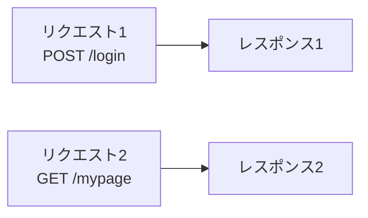

HTTPプロトコルが「リクエスト1の利用者とリクエスト2の利用者は同じ」と自動で記憶するわけではありません。
そこで、アプリケーションはCookieなどを使って、複数のリクエストにまたがるログイン状態を実現します。

### 二つの「ステートレス」を分ける

| 対象 | 「ステートレス」の意味 |
|---|---|
| HTTP | 一つ一つのリクエストを独立したメッセージとして扱う |
| アプリケーションのログイン方式 | サーバーがログインセッションごとの状態を保持しない |

両者は関係していますが、同じ範囲の話ではありません。

- HTTPの性質は変わらない
- その上で、アプリケーションがステートフルまたはステートレスなログイン方式を選ぶ
- Cookieは情報を運ぶ手段であり、それ自体がステートフル方式とは限らない

---

## 5. ステートフルなセッション

ステートフル方式では、サーバー側がログインセッションごとの状態を保存します。

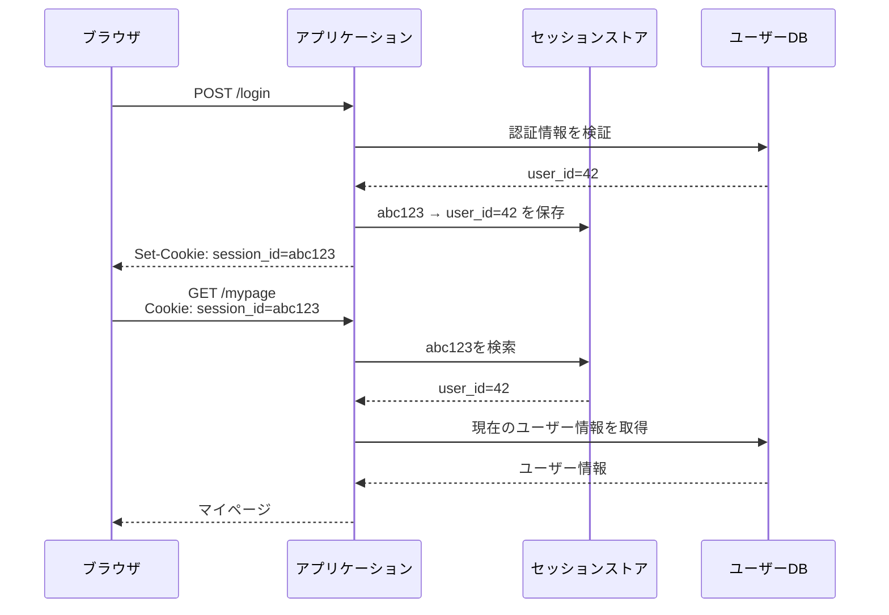

### 特徴

- Cookieには推測困難なセッションIDだけを入れやすい
- サーバー側でセッションを削除すれば、すぐにログアウトさせやすい
- 権限変更などを現在のサーバー情報へ反映しやすい
- リクエストごとにセッションストアの参照が必要になることが多い
- 複数サーバーでは、共有セッションストアなどを考える必要がある

---

## 6. ステートレスな署名付きトークン

ステートレス方式では、認証判断に必要な情報を署名付きトークンへ持たせ、サーバーはログインセッションごとのレコードを原則として保存しません。
JWTはその実現方法の一例です。

トークン内の`sub`（利用者の識別子）、`role`（役割）、`exp`（有効期限）などの情報をclaim（トークンが表す情報）と呼びます。

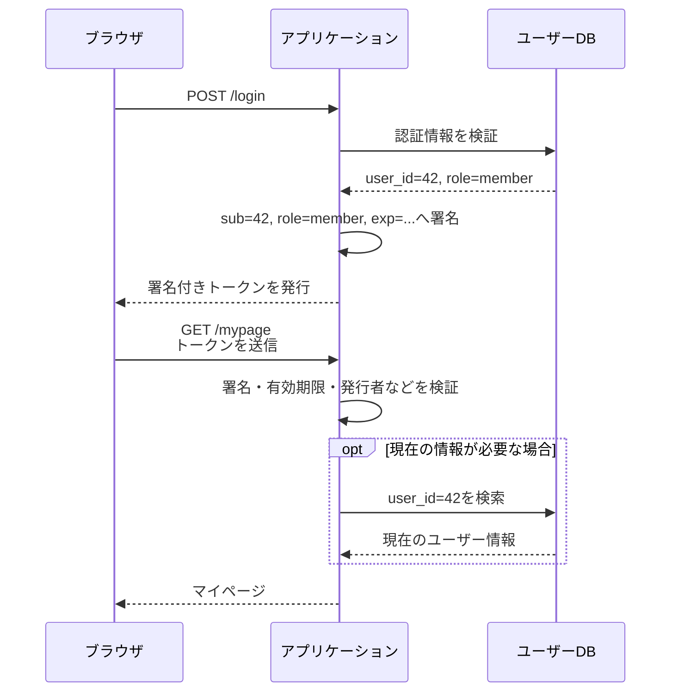

### サーバーに同じトークンを保存して照合するのか

純粋なステートレス方式では、受け取ったトークンを、サーバーに保存した同一トークンと突き合わせるのではありません。

サーバーは、秘密鍵または公開鍵などを使って次の項目を検証します。

- 署名が正しく、内容が改ざんされていないか
- 有効期限が切れていないか
- 想定した発行者か
- 想定した利用先のトークンか

トークンの失効リストや現在有効なトークン一覧をサーバーへ保存して毎回調べる設計にすると、その部分には状態が加わります。
「ステートフルかステートレスか」は、二者択一ではなく、両方を組み合わせる設計もあります。

### 署名は暗号化ではない

署名の主な目的は、改ざんの検出です。内容を読めなくすることではありません。

- Base64URLで表現されたJWTのpayloadは、暗号化されていなければ読める
- パスワードやカード番号などの秘密情報を安易に入れない
- ブラウザから送られた任意のユーザー情報ではなく、署名検証に成功したclaimだけを認証判断に利用する
- 最新情報が必要なら、検証後の`user_id`を使ってDBを参照する

### ステートフル方式との比較

| 観点 | ステートフルセッション | ステートレストークン |
|---|---|---|
| ブラウザ側 | 主にセッションID | 主に署名付きトークン |
| ログイン状態の保存 | セッションストアに保存 | 個々のログイン状態は原則保存しない |
| リクエスト時 | セッションIDを検索 | 署名やclaimを検証 |
| 即時失効 | 比較的行いやすい | 追加の失効管理がないと難しい |
| トークンの大きさ | 小さくしやすい | claimの分だけ大きくなりやすい |
| 情報の鮮度 | サーバーの現在値を使いやすい | 発行時のclaimが期限まで残ることがある |

> [!IMPORTANT]
> ステートレスとは「ユーザー情報を一切保存しない」という意味ではありません。
> 「ユーザーごとのログインセッション状態を、サーバーが原則として保存しない」という意味です。

通常は、どちらの方式でもユーザーの名前、メールアドレス、パスワードハッシュ、権限などをDBへ保存します。
外部の認証サービスへ管理を委ねる場合もありますが、その場合もユーザー情報が世界のどこにも保存されないわけではありません。

### 「セッションCookie」と「セッションID Cookie」

似た言葉ですが、分類の基準が違います。

| 用語 | 意味 |
|---|---|
| セッションCookie | `Expires`や`Max-Age`がなく、ブラウザセッション単位で扱われるCookie |
| セッションID Cookie | ログインセッションを識別するIDを入れたCookie |

セッションID Cookieに有効期限を付けることもできます。
そのため、「セッションIDを入れているから、必ずセッションCookie」とは限りません。

---

## 7. domain、host、subdomainを整理する

次のURLを例にします。

```text
https://api.example.com:8443/users?id=42
\___/   \_____________/ \__/ \____/ \___/
 scheme        host       port  path  query
```

### 用語

| 用語 | この例 | 役割 |
|---|---|---|
| scheme | `https` | 通信方法やURLの種類を表す |
| host | `api.example.com` | 接続先を識別するURLの構成要素 |
| port | `8443` | 接続先ホスト内のサービスの受付口を識別する |
| path | `/users` | 接続先の中のリソースを表す |
| domain name | `api.example.com` | DNSで扱う階層的な名前 |
| registrable domain | `example.com` | 通常、登録者が取得・管理する基準となる範囲 |
| subdomain | `api.example.com` | 親ドメインの下に追加した名前。`api`はその階層のラベル |

### 名前は階層になっている

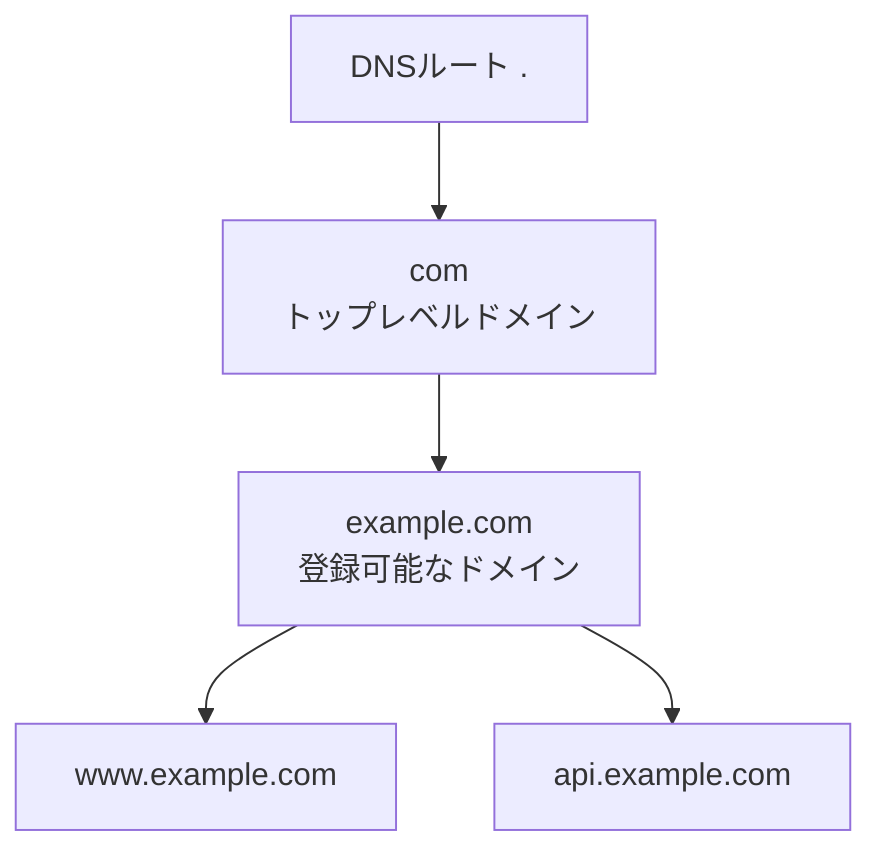

`www`や`api`はDNSのラベルであり、一般にはサブドメイン部分と呼ばれます。
サービスの用途が分かる名前としてよく使われますが、名前そのものに特別な機能はありません。

### 「hostの中にdomainが含まれる」のか

厳密には、次のように考えると混乱しにくくなります。

- hostは、URLの「接続先を表す欄」の名前
- domain nameは、その欄へ書ける階層的な名前の一種
- hostには、`api.example.com`のようなdomain nameのほか、IPアドレスが使われる場合もある

したがって、「hostの中にdomainが含まれる」というより、
「URLのhostという欄に、domain nameが指定されることが多い」と考える方が正確です。

### サブドメインとサーバーは一対一ではない

`www`や`api`はサーバーそのものではなく、宛先を表す名前です。

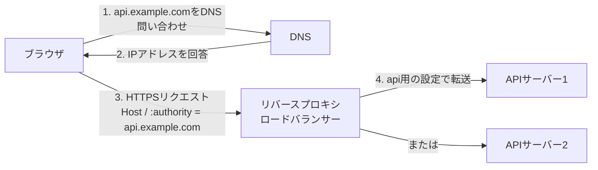

- 複数のサブドメインを同じIPアドレスへ向けられる
- 一つの名前を複数のIPアドレスへ向けられる
- リバースプロキシはhost名やpathを見て転送先を選べる
- `api`という名前だけで、自動的にAPIサーバーへ接続されるわけではない

DNSやリバースプロキシの設定によって、名前と実際の処理先が結び付けられます。

---

## 8. Cookieの`Domain`が決める送信先

Cookieの`Domain`属性は、そのCookieをどのhostへ送れるかを決めます。

### `Domain`を省略した場合

`www.example.com`から次のCookieを受け取ったとします。

```http
Set-Cookie: session_id=abc123; Path=/; Secure; HttpOnly
```

これはhost-only Cookieです。原則として、発行元と同じ`www.example.com`だけへ送られます。

| リクエスト先 | 送信 |
|---|---:|
| `https://www.example.com/` | する |
| `https://api.example.com/` | しない |
| `https://example.com/` | しない |

### `Domain=example.com`を指定した場合

```http
Set-Cookie: session_id=abc123; Domain=example.com; Path=/; Secure; HttpOnly
```

このCookieは、`example.com`とそのサブドメインに一致します。

| リクエスト先 | 送信候補になるか |
|---|---:|
| `https://example.com/` | なる |
| `https://www.example.com/` | なる |
| `https://api.example.com/` | なる |
| `https://example.net/` | ならない |

実際に送信されるには、さらに`Path`、`Secure`、`SameSite`、有効期限などの条件も満たす必要があります。

### 安全上の注意

- サーバーは、無関係な他社ドメインのCookieを設定できない
- `Domain=com`や`Domain=co.jp`のようなpublic suffixへの設定は受け入れられない
- Cookieの範囲にポート番号は含まれない
- 必要がなければ`Domain`を省略し、host-onlyにした方が送信範囲を狭くできる
- `Path`は送信範囲を調整する機能であり、強いセキュリティ境界ではない

> [!NOTE]
> 古い表記では`Domain=.example.com`のように先頭へ`.`を付ける例があります。
> 現在のCookie処理では、先頭の`.`に特別な意味はありません。

---

## 9. originとsiteの違い

`SameSite`を理解するには、originとsiteを分ける必要があります。

### origin

originは、次の組み合わせです。

```text
origin = scheme + host + port
```

例：`https://api.example.com:443`

いずれかが異なれば、原則として別originです。

### site

現在の主要ブラウザでは、siteは概ね次の組み合わせで判定されます。

```text
site = scheme + registrable domain
```

`www`や`api`などのサブドメイン、およびポートの違いは、通常siteの違いになりません。
`co.jp`のような階層はPublic Suffix Listなどを使って判定されます。

### 比較例

| A | B | Same-Origin | Same-Site | 理由 |
|---|---|---:|---:|---|
| `https://www.example.com` | `https://api.example.com` | いいえ | はい | hostは違うが、schemeと登録可能ドメインが同じ |
| `https://example.com:443` | `https://example.com:8443` | いいえ | はい | portはoriginに影響するが、siteには通常影響しない |
| `http://example.com` | `https://example.com` | いいえ | いいえ | 現在のschemeful same-siteではschemeも見る |
| `https://example.com` | `https://other.com` | いいえ | いいえ | 登録可能ドメインが異なる |

したがって、Same-SiteはSame-Originより広い範囲ですが、
「hostが同じならSame-Site」という理解では不十分です。

### Cookieの`Domain`、origin、siteは用途が違う

| 概念 | 主に見るもの | 主な用途 |
|---|---|---|
| Cookieの`Domain` | 送信先host | Cookieを送れる名前の範囲を決める |
| origin | scheme、host、port | JavaScriptから別originのデータへアクセスする制約など |
| site | scheme、登録可能ドメイン | `SameSite`やサイトをまたぐ文脈の判定など |

---

## 10. ブラウザはどのCookieを自動送信するのか

### 「対象サイト」とはレスポンスのコンテンツではない

Cookieの送信先を考えるときの対象は、個々のHTTPリクエストの宛先URLです。

HTMLの中に画像、CSS、JavaScript、iframe、APIなどのURLがあれば、ブラウザはそれぞれに別のHTTPリクエストを送ります。

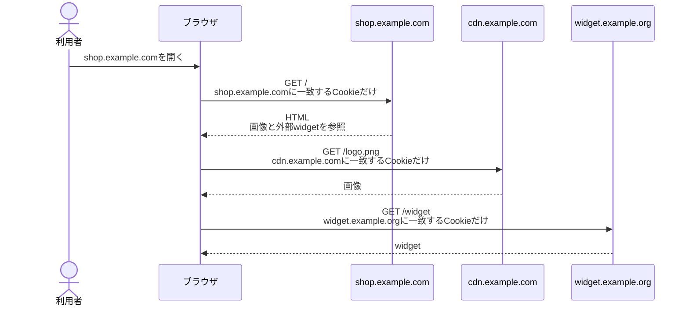

このとき、`shop.example.com`のCookieを`widget.example.org`へ渡すわけではありません。
ブラウザは各リクエスト先について、その宛先に一致するCookieをCookieストアから探します。

### 送信可否の判定

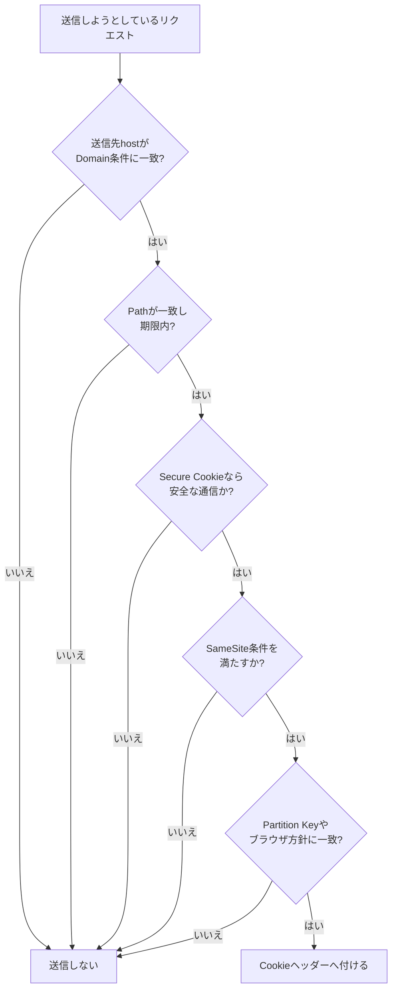

実際には、Fetch APIの`credentials`設定やブラウザの第三者Cookie方針なども影響します。

### Fetch APIを使う場合の注意

JavaScriptから別originへ`fetch`するときは、Cookie属性だけでなく、Fetch APIとCORSの設定も関係します。

- `credentials: "same-origin"`は既定値で、cross-originリクエストへ認証情報を付けない
- cross-originでCookieを扱うには、通常`credentials: "include"`が必要
- サーバー側にも、具体的なoriginを指定したCORS応答などが必要
- CORSは主にJavaScriptがcross-originレスポンスを読めるかを制御する仕組みで、CSRF対策そのものではない

---

## 11. クロスサイト通信と`SameSite`

クロスサイト通信とは、表示中のトップレベルのsiteとは異なるsiteを宛先とするリクエストが発生することです。

トップレベルsiteとは、基本的にはブラウザのアドレスバーに表示されているページのsiteです。
ページ内のiframeに表示されたsiteとは区別します。

例として、利用者が`evil.example.net`を表示している間に、ページが`bank.example.com`へフォーム送信を発生させる状況を考えます。

### なぜCookieが関係するのか

悪意のあるサイトは、通常、銀行サイトのCookieの値を読み取って自分で利用するわけではありません。
利用者のブラウザに銀行サイトへのリクエストを発生させる点が問題です。

```mermaid
sequenceDiagram
    actor U as 利用者
    participant B as ブラウザ
    participant BANK as bank.example.com
    participant EVIL as evil.example.net

    U->>B: 銀行へログイン
    B->>BANK: POST /login
    BANK-->>B: Set-Cookie: session_id=bank123<br/>Secure; HttpOnly; SameSite=Lax
    Note over B: bank.example.com用Cookieを保存

    U->>B: evil.example.netを開く
    B->>EVIL: GET /
    EVIL-->>B: bank.example.comへ送信する悪意あるフォーム
    B->>B: bank.example.com用Cookieを候補にする<br/>表示中siteと送信先siteを比較
    B->>BANK: POST /transfer<br/>SameSite=LaxなのでCookieを付けない
    BANK-->>B: 未認証として拒否
```

ここで`SameSite`は、Cookieが「どこで作成されたか」という文字列を悪意のあるサイトへ見せる機能ではありません。
ブラウザがリクエストの状況を計算し、cross-siteな状況でCookieを付けてよいか判断するための方針です。

### `SameSite`の値

| 値 | cross-siteな状況での主な動作 | 主な用途・注意 |
|---|---|---|
| `Strict` | 原則として送信しない | 最も厳格。外部サイトのリンクから来た直後も未ログインに見える場合がある |
| `Lax` | 原則送信しないが、通常のトップレベル遷移かつ安全なメソッドなどでは送る | 一般的なセッションCookieの候補 |
| `None` | Cookie属性上はcross-siteでも送信可能 | `Secure`が必須。第三者Cookie規制で送られない場合もある |

属性を省略した場合、現在の主要ブラウザは概ね`Lax`相当として扱います。
ただし互換性のための例外もあるため、セキュリティ要件があるCookieでは明示します。

### `Domain`と`SameSite`の役割は異なる

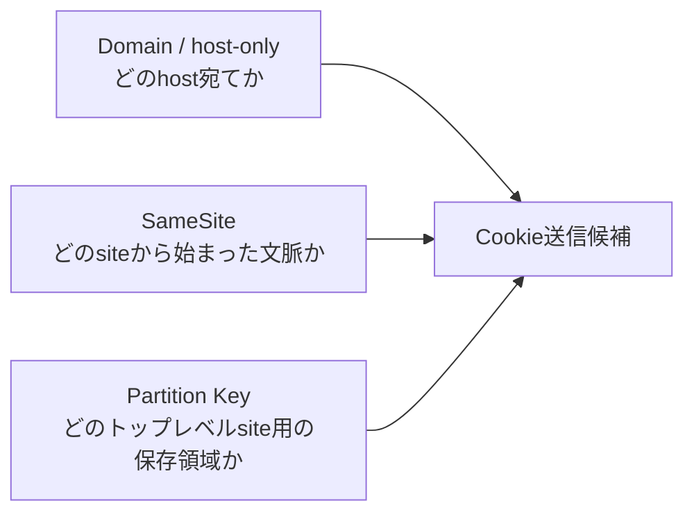

| 属性・概念 | 答える質問 |
|---|---|
| `Domain`またはhost-only | このCookieは、どのhost宛てのリクエストへ送れるか |
| `SameSite` | cross-siteな状況でも、このCookieを付けてよいか |
| Partition Key | どのトップレベルsiteの下で保存したCookieか |

### `SameSite`だけに頼らない

`SameSite`は重要な防御ですが、完全なCSRF対策ではありません。

- 状態を変更する処理を`GET`で実装しない
- 推測できないCSRFトークンを検証する
- `Origin`や必要に応じて`Referer`を検証する
- 再認証や利用者の確認が必要な重要操作を設ける
- 信頼できないサブドメインを放置しない

### 攻撃と対策を混同しない

| 問題 | 攻撃者はCookie値を読むか | 主な対策 |
|---|---:|---|
| CSRF | 通常は読まない。ブラウザに正規サイトへ送らせる | `SameSite`、CSRFトークン、`Origin`検証 |
| XSSによるCookie窃取 | 読もうとする | `HttpOnly`、XSS対策、CSP |
| 通信経路での盗聴 | 通信から盗もうとする | HTTPS、`Secure` |
| 盗まれたCookieの再利用 | すでに値を持っている | 有効期限、失効、再認証、セッション管理 |

`SameSite`は、ブラウザ外で盗まれたCookieを直接送信する攻撃者までは防ぎません。

---

## 12. Partitioned Cookieとは何か

Partitioned Cookieは、`Partitioned`属性を付け、トップレベルsiteごとに分離して保存するCookieです。
CHIPS（Cookies Having Independent Partitioned State）とも呼ばれます。

完全に別形式のCookieというより、通常のCookieへ保存方法を変える属性を加えたものです。

```http
Set-Cookie: widget_session=abc; SameSite=None; Secure; Partitioned
```

`Partitioned`には`Secure`が必要です。
cross-siteの埋め込みで利用する場合は、一般に`SameSite=None`も必要になります。

### なぜ分離するのか

同じwidgetサービスが、二つの異なるsiteへ埋め込まれる例を考えます。

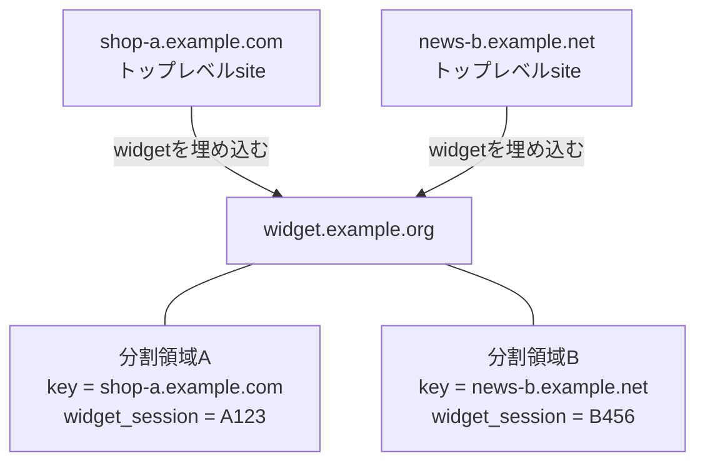

通常の第三者Cookieを共通利用すると、widget側が複数siteで同じ利用者を関連付けられる可能性があります。
Partitioned Cookieではトップレベルsiteごとに保存領域を分けるため、同じCookieをサイト横断で共有しにくくします。

### DevToolsの関連項目

| 項目 | 意味 |
|---|---|
| `Partition Key Site` | そのPartitioned Cookieが属するトップレベルsite |
| `Cross Site` | Chromeでは、partition keyにcross-siteな祖先フレームが含まれる状況を示す補助情報 |

`Cross Site`欄は、すべてのCookieについて「現在の通信がcross-siteか」を単純に表す一般的な欄ではありません。
主にPartitioned Cookieの保存キーを正確に理解するための、ブラウザ実装寄りの情報です。

### Cookieの「種類」は一つの分類ではない

Cookieは、複数の軸で重なって分類されます。

| 分類軸 | 分類例 |
|---|---|
| 保存期間 | セッションCookie／永続Cookie |
| hostの範囲 | host-only Cookie／Domain Cookie |
| 保存領域 | unpartitioned Cookie／Partitioned Cookie |
| JavaScriptからの読み取り | `HttpOnly`／非`HttpOnly` |
| 安全な通信の要求 | `Secure`／非`Secure` |
| siteをまたぐ送信方針 | `Strict`／`Lax`／`None` |
| 用途 | セッション、設定、カート、計測など |

例えば、一つのCookieが同時に「永続Cookie」「host-only」「Partitioned」「HttpOnly」「Secure」になることもあります。

---

## 13. Chrome DevToolsのCookies欄

Networkパネルでリクエストを選択し、Cookies欄を見ると、送信Cookieと受信Cookieを調べられます。

- Request Cookies：ブラウザがリクエストで送ったCookie
- Response Cookies：レスポンスの`Set-Cookie`で受け取ったCookie
- blocked reason：保存または送信されなかった理由

### 各カラム

| カラム | 表示内容 | 確認のポイント |
|---|---|---|
| `Name` | Cookie名 | セッション用、設定用などの役割を識別する |
| `Value` | Cookie値 | セッションIDやトークンの可能性があるため、共有時は伏せる |
| `Domain` | 送信対象となるhostの範囲 | host-onlyか、サブドメインまで含むかを確認する |
| `Path` | 送信対象となるURL pathの範囲 | 意図したpathに一致するかを確認する |
| `Expires / Max-Age` | 有効期限または残り時間 | 期限切れ、時刻ずれ、セッションCookieかを確認する |
| `Size` | Cookieの大きさ | HTTP全体のサイズではない。Cookieを大きくし過ぎない |
| `Http Only` | JavaScriptの`document.cookie`から読めないか | 認証Cookieでは原則有効化を検討する |
| `Secure` | 安全な通信でのみ送信するか | 本番の認証Cookieでは原則有効化する |
| `SameSite` | cross-siteな状況での送信方針 | `Strict`、`Lax`、`None`と利用目的を照合する |
| `Partition Key Site` | Partitioned Cookieのトップレベルsiteキー | 埋め込み先siteごとに分離されているか確認する |
| `Cross Site` | partition keyのcross-siteな祖先情報 | 通常のSameSite判定欄と混同しない |
| `Priority` | ChromiumにおけるCookie削除時の優先度の目安 | `Low`、`Medium`、`High`。非標準かつ非推奨（deprecated）で、認証の強さではない |

### 属性の補足

- `Max-Age`と`Expires`が両方ある場合、通常は`Max-Age`が優先される
- `HttpOnly`はHTTPSを強制しない
- `Secure`はCookieの値を暗号化する属性ではない
- `SameSite=None`には`Secure`が必要
- `Priority`はHTTPリクエストの処理優先度ではない
- Cookieには容量と個数の制限があるため、大きなユーザー情報を入れる場所には向かない

### Cookieが送られないときの確認順

1. Response Headersに意図した`Set-Cookie`があるか
2. DevToolsにblocked reasonが表示されていないか
3. リクエスト先hostと`Domain`またはhost-only条件が一致するか
4. `Path`が一致するか、有効期限内か
5. `Secure`なのにHTTPで接続していないか
6. `SameSite`とトップレベルsiteの関係が適切か
7. Partition Keyが現在のトップレベルsiteと一致するか
8. Fetch APIの`credentials`とCORS応答が適切か
9. ブラウザの第三者Cookie設定やプライバシー機能に遮断されていないか

---

## 14. 今回の疑問、誤解、修正内容

ここでは、学習中に生じた疑問を、最初の認識と修正後の理解が比較できる形で整理します。

### Cookieとセッション

| 疑問・最初の認識 | 修正後の理解 | 理由 |
|---|---|---|
| Cookie情報はサーバー側に保存されるのか | Cookieはブラウザが保存する。ステートフル方式では、対応するセッション情報をサーバー側にも保存する | Cookieストアとセッションストアは別のもの |
| `Value`はサーバー側のセッション情報そのものか | 多くの場合は、セッション情報を検索するためのランダムなID。署名付きトークンや設定値の場合もある | Cookieの設計によって値の意味が異なる |
| `HttpOnly`ならクライアントから値を確認できないのか | DevToolsや通信のデバッグでは確認できる。ページ内JavaScriptからは読めない | `HttpOnly`が制限するのはJavaScript API |
| HTTPのステートレスと、ログイン方式のステートレスは同じ話か | 関係はあるが対象が違う。HTTPの各リクエストは独立し、その上にアプリがログイン状態を構築する | プロトコルの性質とアプリの保存設計を分ける必要がある |
| ステートレスならユーザー情報を保存しないのか | 保存しないのは原則としてログインセッションごとの状態。ユーザー情報は通常DBなどに保存する | ログイン状態と永続的なユーザーデータは別 |
| ステートレストークンをサーバー上の同じトークンと照合するのか | 純粋な方式では、保存済みの同一トークンではなく署名鍵などで検証する | 同一トークンを毎回検索すると、その管理部分はstateになる |
| ブラウザが送ったユーザー情報をそのまま使うのか | 署名を検証したclaimだけを利用し、必要なら`user_id`で現在のDB情報を取得する | クライアントからの未検証データは信用できない |
| 署名付きトークンなら内容も秘密になるのか | 署名は主に改ざんを検出する。暗号化されていなければ内容を読める | 署名と暗号化は目的が異なる |

### domain、host、subdomain

| 疑問・最初の認識 | 修正後の理解 | 理由 |
|---|---|---|
| hostの中にdomainが含まれるのか | hostはURLの接続先欄で、そこへdomain nameが指定されることが多い。IPアドレスの場合もある | 「URL上の役割」と「名前の形式」を分ける |
| `www`や`api`はサーバーごとのラベルか | 用途を表すDNSラベルとして使えるが、物理・仮想サーバーと一対一ではない | DNSとリバースプロキシの設定で実際の処理先が決まる |
| `example.com`のCookieは自動的に`www`や`api`にも送られるか | `Domain=example.com`を明示したCookieは候補になる。`Domain`を省略したhost-only Cookieは発行hostだけ | CookieのDomain指定方法によって範囲が変わる |
| Cookieの範囲にはportも含まれるか | 含まれない | Cookieのhost範囲とSame-Originの範囲は別 |

### cross-site、`SameSite`、Partitioned Cookie

| 疑問・最初の認識 | 修正後の理解 | 理由 |
|---|---|---|
| Same-Siteはhostだけ同じならよいのか | 現在は概ねschemeと登録可能ドメインで判定する。サブドメインとportが違ってもSame-Siteになり得る | originより広いが、host一致だけの判定ではない |
| HTMLが外部サイトを使うと、元サイトのCookieも外部サイトへ送るのか | 各リクエストには、その宛先hostに一致するCookieだけを候補として付ける | Cookieは個々の送信先URLに対して選択される |
| 悪意あるサイトが銀行のCookieを取得し、その値を使うのか | 典型的なCSRFではCookie値を取得しない。利用者のブラウザに銀行へのリクエストを起こさせ、ブラウザが銀行のCookieを付けることを悪用する | Cookieの自動送信がCSRFの前提になる |
| `SameSite`はCookieに作成元siteを記録し、悪意あるsiteが使えなくするのか | `SameSite`は送信方針。ブラウザが、現在の文脈とリクエスト先がsame-siteかを都度判定する | 作成元siteを相手へ渡す仕組みではない |
| Cookieがcross-site通信を意識するのは、別siteへ同じ値を渡すからか | 同じCookieを別siteへ渡すからではない。別siteから正規の送信先へのリクエストを起こされたとき、自動送信を制限するため | 送信先と、リクエストを始めた文脈は別の観点 |
| Partitioned Cookieは完全に別種類のCookieか | 通常のCookieに`Partitioned`属性を付け、トップレベルsiteごとに保存領域を分けたもの | Cookieの分類は複数の属性軸が重なる |
| `Cross Site`欄は、現在の全リクエストがcross-siteかを表すのか | Chromeでは主にPartition Keyのcross-site祖先情報を表す | `SameSite`欄や一般的なリクエスト文脈とは用途が異なる |

---

## 15. 最後に覚える要点

### 全体像

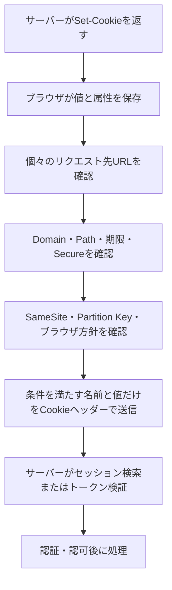

### 誤解を修正した最終まとめ

| テーマ | 誤解しやすい認識 | 正しい要点 |
|---|---|---|
| Cookieとセッション | Cookieとサーバーセッションは同じ | Cookieはブラウザ側の情報。サーバーセッションとはIDなどで対応付ける |
| ステートレス | ユーザー情報を保存しない | 原則としてログインセッションごとのstateを保存しない |
| 署名付きトークン | 保存した同一トークンと照合する／内容も秘密 | 鍵で署名などを検証する。署名だけでは内容を隠せない |
| hostとdomain | hostがdomainの上位概念として中に持つ | hostはURL上の欄で、domain nameはそこに使える名前の形式 |
| サブドメイン | 一つのサーバーを直接表す | DNS上の名前。DNS・プロキシ設定により一つまたは複数の処理先へ結び付く |
| Cookieの`Domain` | 親ドメインなら常に全サブドメインへ送る | `Domain`を明示した場合とhost-onlyの場合で範囲が異なる |
| Same-Site | hostが同じこと | 概ねschemeと登録可能ドメインが同じこと |
| 外部リソース | 元ページのCookieを外部サイトへ渡す | 各宛先に一致するCookieだけを、別々のリクエストで選ぶ |
| CSRF | 悪意あるサイトがCookie値を読み取る | ブラウザに正規サイトへの認証付きリクエストを送らせる |
| `SameSite` | Cookieの作成元siteを記録する | cross-siteな文脈で送信するかをブラウザへ指示する |
| Partitioned Cookie | 別形式の特殊なCookie | `Partitioned`属性でトップレベルsiteごとに保存を分離するCookie |

### 学習確認チェックリスト

- [ ] `Set-Cookie`と`Cookie`の通信方向を説明できる
- [ ] Cookieストア、セッションストア、ユーザーDBを区別できる
- [ ] HTTPのステートレスとログイン方式のステートレスを区別できる
- [ ] ステートフルセッションと署名付きトークンの通信を説明できる
- [ ] host、domain name、subdomainの役割を説明できる
- [ ] host-only CookieとDomain Cookieの範囲を説明できる
- [ ] Same-OriginとSame-Siteの違いを例で判定できる
- [ ] ブラウザがリクエストごとにCookieを選ぶ流れを説明できる
- [ ] CSRFで攻撃者がCookie値を読まなくても攻撃が成立する理由を説明できる
- [ ] `SameSite`、`HttpOnly`、`Secure`が防ぐ問題の違いを説明できる
- [ ] Partitioned Cookieがトップレベルsiteごとに分離される理由を説明できる

---

## 16. 関連ドキュメント

- [HTTP Cookieと`HttpOnly`の仕組み](./http-cookies-and-httponly.md)
- [HTTP/1.1とHTTP/2の接続・ストリーム](./http1.1-vs-http2-streams.md)
- [DB接続プールとTCPポート・ソケット](./db-connection-pool-and-tcp-ports.md)

## 17. 参考資料

- [RFC 9110: HTTP Semantics](https://www.rfc-editor.org/rfc/rfc9110.html)
- [Cookies: HTTP State Management Mechanism（RFC 6265bis draft）](https://datatracker.ietf.org/doc/html/draft-ietf-httpbis-rfc6265bis-22)
- [RFC 6265: HTTP State Management Mechanism](https://www.rfc-editor.org/rfc/rfc6265.html)
- [RFC 6454: The Web Origin Concept](https://www.rfc-editor.org/rfc/rfc6454.html)
- [WHATWG URL Standard](https://url.spec.whatwg.org/)
- [WHATWG Fetch Standard](https://fetch.spec.whatwg.org/)
- [RFC 7519: JSON Web Token](https://www.rfc-editor.org/rfc/rfc7519.html)
- [OWASP Session Management Cheat Sheet](https://cheatsheetseries.owasp.org/cheatsheets/Session_Management_Cheat_Sheet.html)
- [OWASP Cross-Site Request Forgery Prevention Cheat Sheet](https://cheatsheetseries.owasp.org/cheatsheets/Cross-Site_Request_Forgery_Prevention_Cheat_Sheet.html)
- [Chrome DevTools: View, add, edit, and delete cookies](https://developer.chrome.com/docs/devtools/application/cookies/)
- [Chrome DevTools Network reference: View cookies](https://developer.chrome.com/docs/devtools/network/reference/#view-cookies)
- [Chrome: Cookies Having Independent Partitioned State](https://developer.chrome.com/docs/privacy-security/chips/)
- [Chrome 128: Cross-site ancestor chain bit for CookiePartitionKey](https://developer.chrome.com/release-notes/128#cross-site_ancestor_chain_bit_for_cookiepartitionkey_of_partitioned_cookies)
