# DB接続プールとTCPポートの関係

## この文書の目的

この文書では、DB接続プールとTCPポートの関係を、次の疑問を出発点として整理します。

- DB接続プールに6本の接続があると、ポートも6個開くのか
- DB接続プールとポートは同じものなのか
- 1つのポートに確立できるTCP接続は1本だけなのか
- 「接続プールの最大数が6」と「6本の接続が確立済み」は同じなのか
- 複数のTCP接続から、同じポートへ同時にデータを送れるのか
- データはポートで1列に並んで処理されるのか
- 1つのポートに確立できるTCP接続数に上限はあるのか
- ポートがデータの通り道でなければ、データは詰まらないのか
- ソケットは通信路なのか、TCP接続1本につき何個あるのか

先に結論を示すと、DBサーバーは通常、**1つの待受ポートで複数のTCP接続を受け付けられます**。

```text
DBサーバーの待受ポート：1個
実際のTCP接続          ：6本
アプリ側の送信元ポート  ：通常6個
```

> この文書では、アプリケーションサーバーからDBサーバーへ、TCPを使って直接接続する一般的な構成を前提とします。

---

## 1. 最初に用語を区別する

DB接続プール、TCP接続、ポート、ソケットは、それぞれ別の概念です。

| 用語 | 主な管理者・層 | 意味 |
|---|---|---|
| DB接続プール | アプリケーション・DBドライバー | 確立したDB接続を保持し、貸し出し、再利用する仕組み |
| DB接続 | アプリケーションとDBの論理的な通信経路 | SQLの送信や結果の受信に使う接続。一般的には1本のTCP接続を利用する |
| TCP接続 | OS・TCP | 2つの端点の間に確立される双方向の通信経路 |
| ポート番号 | OS・TCP | 端末内の通信先サービスを識別する番号 |
| ソケット | OS | IPアドレスやポートなどを使って通信するための端点・操作対象 |

関係を大まかに表すと、次のようになります。

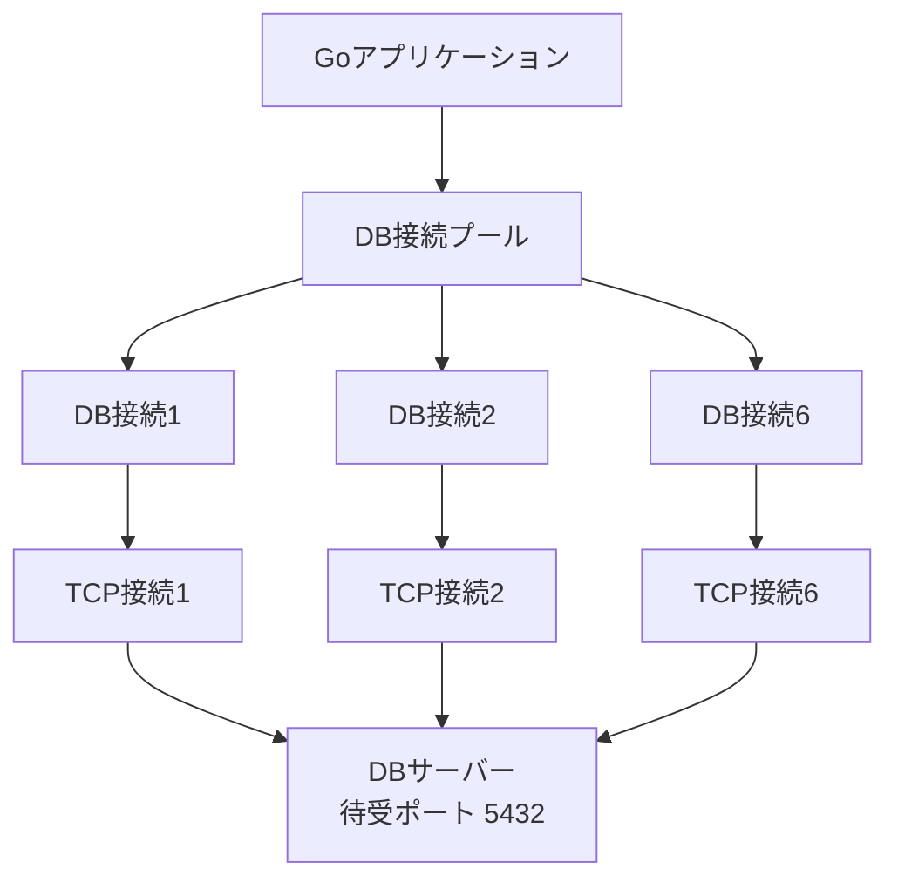

DB接続プールは、ポートをまとめたものではありません。アプリケーションが複数のDB接続を効率よく管理するための仕組みです。

---

## 2. DB接続プールとは何か

DB接続プールは、一度確立したDB接続をアプリケーション内に保持し、複数の処理で再利用する仕組みです。

### 接続プールを使わない場合

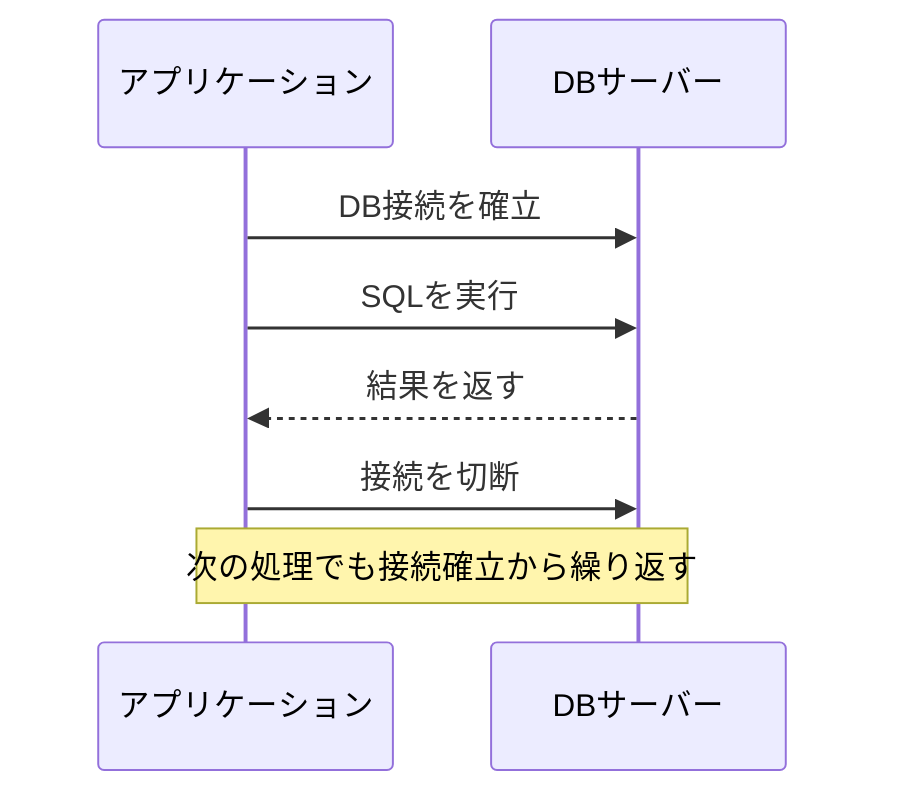

処理のたびに接続を作り直すと、認証や通信の準備が繰り返されます。

### 接続プールを使う場合

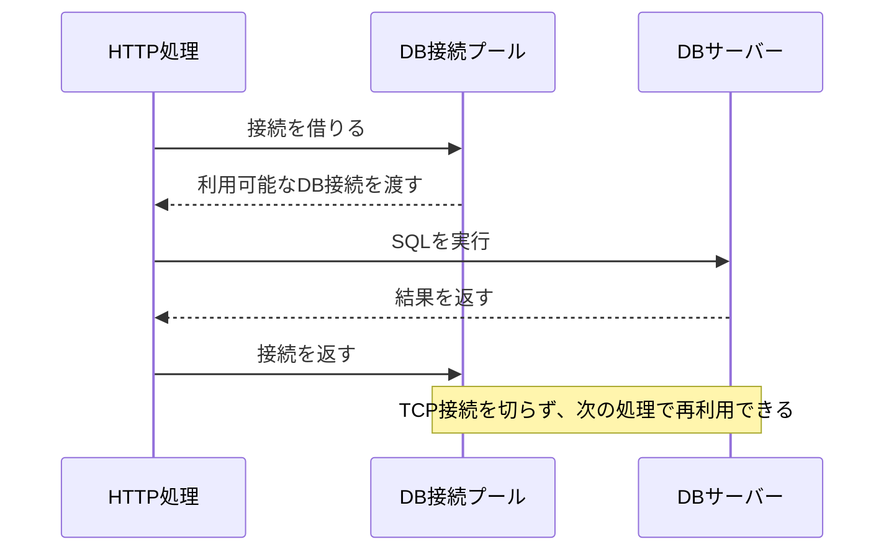

接続プールには、主に次の役割があります。

- 確立済みの接続を再利用する
- 同時に開く接続数を制限する
- 使用中の接続と待機中の接続を管理する
- DBサーバーへ接続が集中しすぎることを防ぐ

### Goの`database/sql`の場合

Goの`sql.DB`は、単一のDB接続ではなく、DB接続プールを表します。

```go
db.SetMaxOpenConns(6) // 使用中を含め、同時に開ける接続数の上限
db.SetMaxIdleConns(3) // 未使用のまま保持できる接続数の上限
```

`SetMaxOpenConns(6)`は、「起動直後から必ず6本接続する」という指定ではありません。必要に応じて接続を作ります。

```text
最大接続数：6

起動直後       実際の接続数 0本の場合がある
アクセス増加中  実際の接続数 1～6本
上限到達時      最大6本。空きがなければ処理が待つ
```

したがって、次の2つは区別する必要があります。

| 状態 | 意味 |
|---|---|
| 接続プールの最大数が6 | 設定上、最大6本まで接続できる |
| 6本の接続が確立済み | 現在、実際に6本のDB接続が開かれている |

---

## 3. ポート番号とは何か

ポート番号は、同じコンピューター上にある複数の通信サービスを識別するための番号です。

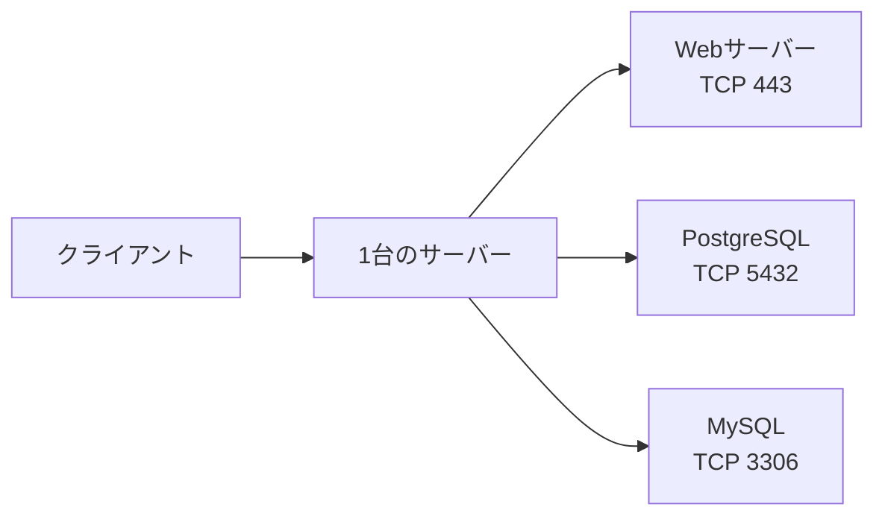

代表的な例は次のとおりです。

| サービス | 一般的なポート番号 |
|---|---:|
| HTTPS | TCP 443 |
| PostgreSQL | TCP 5432 |
| MySQL | TCP 3306 |

ポート番号は、接続そのものではなく、接続先や接続元を識別する情報の一部です。

---

## 4. 1つの待受ポートで複数の接続を扱える

PostgreSQLを例にすると、DBサーバーは通常`5432`番ポートで新しい接続を待ち受けます。

アプリケーションサーバーから6本のDB接続を確立しても、DBサーバー側で6種類の待受ポートを用意するわけではありません。

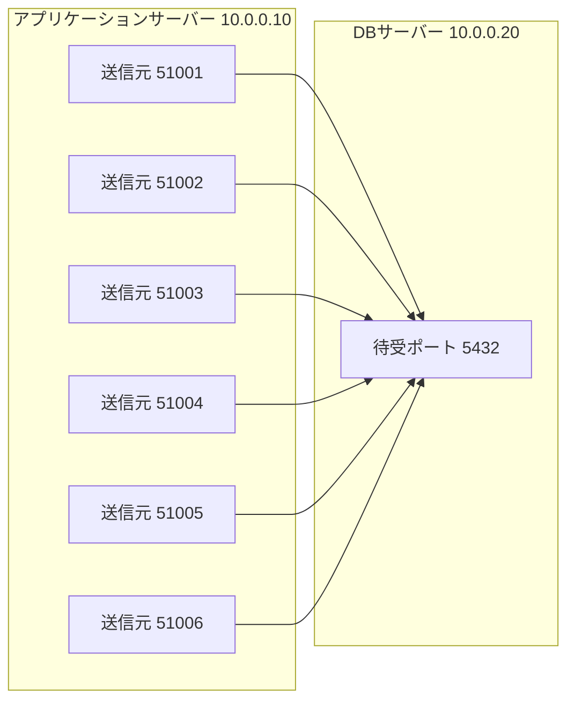

このとき、状態は次のようになります。

| 場所 | ポートの使われ方 | 数え方 |
|---|---|---:|
| DBサーバー | `5432`番ポートで待ち受ける | 待受ポートは1個 |
| アプリケーションサーバー | OSが一時的な送信元ポートを割り当てる | 通常6個 |
| アプリ・DB間 | 個別の通信経路を確立する | TCP接続は6本 |

そのため、「DB側で6個のポートが開いている」より、次の表現が正確です。

> DBサーバーは1つのポートで待ち受けており、そのポートに対して6本のTCP接続が確立されている。

---

## 5. TCP接続は4つの情報で区別する

TCP接続は、基本的に次の4つの組み合わせで識別されます。この組み合わせを**4タプル**と呼びます。

```text
送信元IPアドレス
送信元ポート
宛先IPアドレス
宛先ポート
```

先ほどの6本は、例えば次のように区別できます。

| 接続 | 送信元 | 宛先 |
|---:|---|---|
| 1 | `10.0.0.10:51001` | `10.0.0.20:5432` |
| 2 | `10.0.0.10:51002` | `10.0.0.20:5432` |
| 3 | `10.0.0.10:51003` | `10.0.0.20:5432` |
| 4 | `10.0.0.10:51004` | `10.0.0.20:5432` |
| 5 | `10.0.0.10:51005` | `10.0.0.20:5432` |
| 6 | `10.0.0.10:51006` | `10.0.0.20:5432` |

すべての宛先ポートは`5432`ですが、送信元ポートが異なるため、OSは別々のTCP接続として管理できます。

### 1ポートにつき1接続ではない

```text
誤った理解
  DBサーバーの5432番ポート = TCP接続1本だけ

正しい理解
  DBサーバーの5432番ポート
    ├── TCP接続1
    ├── TCP接続2
    ├── TCP接続3
    └── その他のTCP接続
```

サーバーの待受ポートは、新しい接続を受け付け続けます。接続が成立すると、OSは各接続を個別のソケットとして管理します。

---

## 6. `LISTEN`と`ESTABLISHED`の違い

「ポートが開いている」と「接続が確立している」は、同じ状態ではありません。

| TCPの状態 | 意味 | DBの例 |
|---|---|---|
| `LISTEN` | 新しい接続を受け付けるために待っている | DBサーバーが`5432`番ポートで待機する |
| `ESTABLISHED` | クライアントとサーバー間の接続が確立している | アプリとDBがSQLを送受信できる |

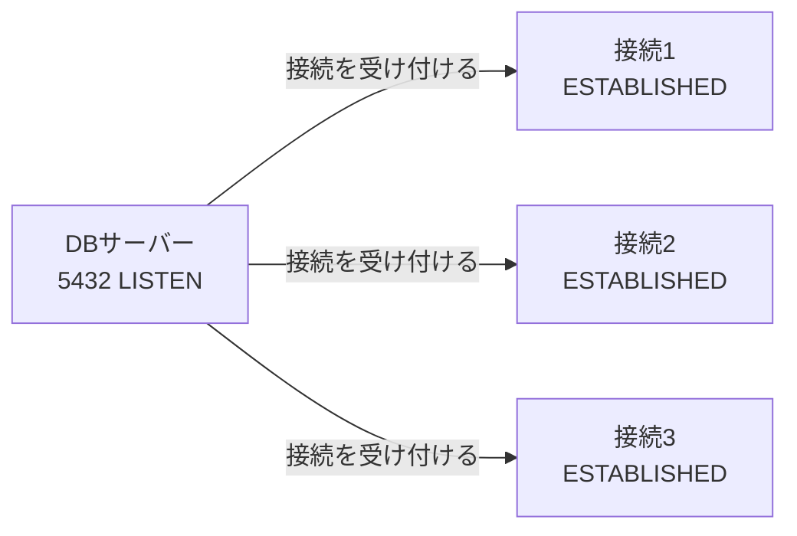

待受用のソケットは新しい接続を受け付けるために残り、確立した接続はそれぞれ別に管理されます。

---

## 7. ソケットは通信路ではなく通信の端点

### 疑問：ソケットは通信路と考えてよいか

ソケットは、通信路そのものではなく、**通信路の端点**です。TCP接続が、クライアント側とサーバー側の2つのソケットを結びます。

```text
アプリ側ソケット  ←──── TCP接続（通信路）────→  DB側ソケット
```

| 用語 | 役割 |
|---|---|
| ソケット | OSが管理する通信の端点。アプリがデータを送受信する操作対象 |
| TCP接続 | 両端のソケットを結ぶ、論理的な双方向通信路 |
| ポート番号 | ソケットを構成し、端末内のサービスを識別する情報の一部 |
| ファイルディスクリプタ | Unix系OSで、アプリがソケットを操作するために使う番号 |

### 疑問：TCP接続1本につきソケットは1個か

ネットワーク全体で見ると、TCP接続1本の両端に、接続済みソケットが1個ずつあります。

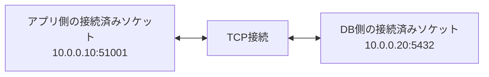

ただし、片方のアプリケーションから見れば、自分が操作するソケットは1個です。そのため、文脈によっては「TCP接続1本に対してソケット1個」のように説明されることがあります。

```text
ネットワーク全体から見る
  TCP接続1本 = 両端に接続済みソケットが1個ずつ

片方のアプリから見る
  TCP接続1本 = 自分が操作する接続済みソケット1個
```

### 待受ソケットと接続済みソケット

DBサーバーには、接続済みソケットとは別に、接続要求を受け付ける待受ソケットがあります。

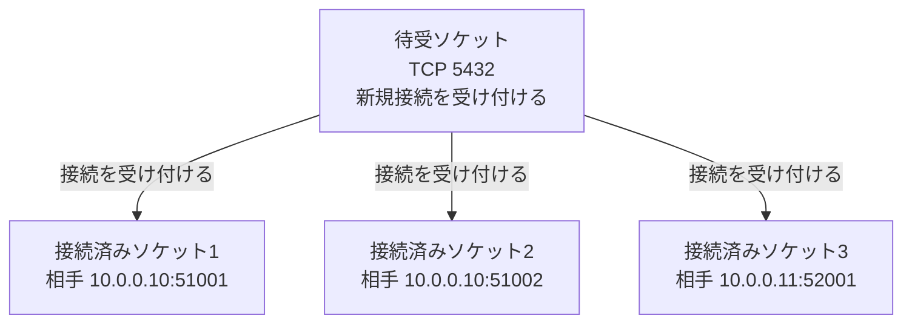

| ソケット | 主な役割 | データの扱い |
|---|---|---|
| 待受ソケット | 新しいTCP接続を受け付ける | 確立済み接続のSQLデータを直接読み書きするものではない |
| 接続済みソケット | 特定の相手と通信する | SQLなどのデータを送受信する |

TCPで直接接続する一般的な構成で、DB接続プールに6本の接続が確立されている場合は、次のようになります。

```text
アプリケーション側
  接続済みソケット：6個

DBサーバー側
  待受ソケット    ：1個
  接続済みソケット：6個
```

---

## 8. 同じポートへ複数接続のデータが届く仕組み

### 疑問：同じポートへ同時に複数のデータを送れるか

複数のTCP接続から、同じ待受ポート番号を使うサービスへ、ほぼ同時にデータを送れます。

ただし、ポートはデータが流れる物理的な管ではありません。OSが通信先サービスを判断するために使う識別情報です。

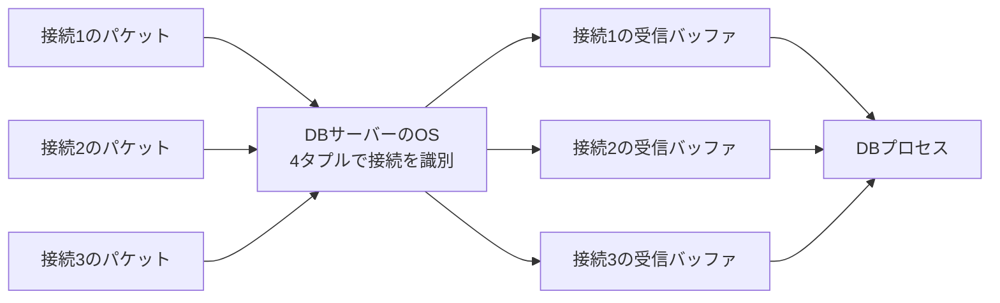

1本の物理的な通信回線上では、データはフレームやパケットとして順番に転送されます。複数接続のパケットが短い間隔で交互に届くため、アプリケーションからは並行して通信しているように見えます。

```text
受信する順番の例

接続1のパケットA
接続2のパケットA
接続1のパケットB
接続3のパケットA
接続2のパケットB
```

OSは4タプルを確認し、パケットを対応する接続済みソケットの受信バッファへ振り分けます。そのため、`5432`番ポートにすべてのデータを入れる共通のキューが1個だけある、という仕組みではありません。

### 疑問：2つのデータは1列のキューで処理されるか

TCP接続ごとに送信・受信バッファがあり、異なる接続のデータは別々に管理されます。一方で、通信処理全体には複数のキューや待ち場所があります。

| 待ち場所 | 何が待つか | 接続単位か |
|---|---|---|
| NIC・OSのパケットキュー | ネットワークから届いたパケット | 複数接続を含む場合がある |
| 接続済みソケットの受信バッファ | アプリがまだ読み取っていないデータ | TCP接続ごと |
| 待受ソケットの接続キュー | アプリがまだ受け取っていない新規接続 | 新規接続用 |
| DB内部の処理待ち | SQL、ロック、ディスクI/Oなど | DBの実装や処理内容による |
| DB接続プールの待ち | 空いているDB接続を借りたい処理 | アプリケーション側 |

待受ソケットの接続キューは、確立済み接続のデータを1列に並べるものではありません。主に、新しい接続要求をアプリケーションが受け取るまで待たせるためのものです。

また、データを複数接続から受信できることと、DBがSQLを同時実行できることは別問題です。DB内部のCPU、ロック、トランザクション、ディスクI/Oなどによって待ちが発生する場合があります。

### 同じTCP接続内のデータ

同じTCP接続に複数回データを書き込む場合、TCPはそれらを順序のある1本のバイト列として扱います。書き込み時の区切りは保持しません。

```text
送信側
  1回目：ABC
  2回目：DEF

TCP上のバイト列
  ABCDEF

受信側の読み取り例
  ABCDEF
  または AB と CDEF
```

DBプロトコルなど、TCPより上位のプロトコルが、どこからどこまでを1つのメッセージとして扱うかを決めます。

---

## 9. 1つのポートに接続できる数とデータの詰まり

### 疑問：1つのポートに最大何本のTCP接続を確立できるか

ポート番号だけで決まる、すべての環境に共通する最大接続数はありません。

TCP接続は4タプルで区別されるため、同じ宛先ポートでも、送信元IPアドレスや送信元ポートが違えば別の接続として扱えます。

```text
10.0.0.10:51001 → 10.0.0.20:5432
10.0.0.10:51002 → 10.0.0.20:5432
10.0.0.11:51001 → 10.0.0.20:5432
```

ポート番号は16ビットですが、「1つの待受ポートへ最大約65,000接続」という意味ではありません。

- 同じ送信元IPから、同じ宛先IP・ポートへ接続する場合は、通常、接続ごとに異なる利用可能な送信元ポートが必要
- 異なる送信元IPなら、同じ送信元ポートを使用しても4タプルを区別できる
- 多数のクライアントから接続するサーバーでは、1つの待受ポートに約65,000本を超える接続を持つことも理論上可能
- 実際には、OS、DB、アプリケーション、ネットワークなどの制限が先に問題になることが多い

### OSのソケット数だけが上限なのか

OSが管理できるソケット数は重要な制限の1つですが、それだけで最大接続数が決まるわけではありません。

| 制限要因 | 具体例 |
|---|---|
| OSのファイルディスクリプタ数 | 1プロセスまたはOS全体で開けるソケット数 |
| メモリ | ソケット情報、送受信バッファなどに必要なメモリ |
| CPU | TCP処理、暗号化、DB処理などに必要なCPU時間 |
| DBの最大接続数 | DBサーバーが設定として許可する接続数 |
| アプリの接続プール | `SetMaxOpenConns`などで設定した上限 |
| 送信元ポート | 同じクライアントやNAT装置から同じ宛先へ接続するときのポート数 |
| 接続待ちキュー | 新規接続が集中したときに待たせられる数 |
| ネットワーク帯域 | 単位時間あたりに転送できるデータ量 |

したがって、「OSが作成できるソケット数に制限があるため無限にTCP接続を作れない」という理解は正しいですが、より正確には次のようになります。

> TCP接続数は、ソケット数だけでなく、ファイルディスクリプタ、メモリ、CPU、送信元ポート、DB設定、アプリ設定など複数の有限な資源に制限されるため、無限には増やせない。

### 疑問：ポートが通り道でなければデータは詰まらないか

ポート番号そのものが物理的な管のように詰まることはありません。しかし、データが通過して処理される各場所では、混雑や待ちが発生します。


| 混雑する場所 | 起こり得ること |
|---|---|
| ネットワーク | 帯域不足、遅延、パケット損失、再送 |
| OS | パケット処理やソケット読み取りが追いつかない |
| TCP受信バッファ | アプリが読み取るまでデータが待つ |
| 新規接続キュー | 新しい接続が失敗またはタイムアウトする |
| DBプロセス | CPUやメモリの不足で処理が遅くなる |
| SQL実行 | ロックやディスクI/Oを待つ |
| DB接続プール | 空いている接続が返るまでHTTP処理などが待つ |

受信側がデータを読み取る速度より送信が速い場合、TCP受信バッファの空きが減ります。TCPのフロー制御によって送信量が抑えられ、空きがなくなれば送信側は一時的に送信を待ちます。

```text
DBの読み取りが遅い
        ↓
TCP受信バッファの空きが減る
        ↓
受信側が送信可能量を小さく通知する
        ↓
送信側が送信量を減らす、または一時的に待つ
```

「ポートが詰まっている」という表現が使われることもありますが、実際には、そのポートで待ち受けるサービス、OS、ネットワークなどの処理能力が限界に近いことを指す場合が多いです。

---

## 10. HTTP接続数とDB接続数は一致しない

クライアントからアプリへのHTTP接続と、アプリからDBへの接続は別々に管理されます。

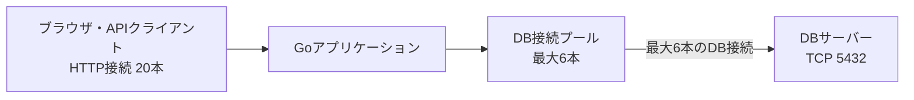

例えば、アプリへのHTTP接続が20本あっても、DB接続プールの上限が6本なら、DBへの接続は最大6本です。

- DBを使わないHTTP処理もある
- 1本のDB接続を複数のHTTP処理が順番に再利用できる
- 6本すべて使用中なら、次の処理は接続が返却されるまで待つ
- HTTP接続が終了しても、DB接続はプールに残して再利用できる

したがって、HTTP接続とDB接続は1対1ではありません。

---

## 11. 誰が何を管理するのか

| 対象 | 主な管理者 | 主な役割 |
|---|---|---|
| 接続プールの上限・待機接続数 | アプリケーション開発者、DBライブラリ | アプリからDBへ開く接続数を制御する |
| 接続の貸し出し・返却 | `database/sql`やDBドライバー | 使用可能な接続を処理へ割り当てる |
| 一時的な送信元ポート | アプリケーションサーバーのOS | 空いているポートを接続へ割り当てる |
| DBの待受ポート | DB管理者、DBサーバー | 接続を受け付けるポートを設定する |
| TCP接続とソケット | 両サーバーのOS | 接続状態、送受信、切断を管理する |
| DBの最大接続数 | DB管理者、DBサーバー | DB全体が受け付ける接続数を制限する |

アプリケーションの接続プール上限は、DBサーバーの最大接続数以下なら何本でもよい、とは限りません。複数のアプリケーションサーバーがある場合、合計接続数を考える必要があります。

```text
アプリ1台あたり最大6本 × アプリ5台 = 最大30本のDB接続
```

接続数を決めるときは、DBの性能、アプリの台数、SQLの実行時間などを確認します。

---

## 12. 例外となる構成

ここまでの説明は、アプリケーションがDBサーバーへTCPで直接接続する場合です。次の構成では、接続数の対応が変わることがあります。

### DBプロキシを利用する場合


PgBouncerやクラウドのDBプロキシなどが間にある場合、次の接続数は一致しないことがあります。

- アプリケーションからDBプロキシへの接続数
- DBプロキシからDBサーバーへの接続数

### Unixドメインソケットを利用する場合

アプリケーションとDBが同じマシンにあり、Unixドメインソケットで接続する構成では、TCPのIPアドレスやポート番号を使いません。

---

## 13. よくある誤解

| 誤解 | 正しい理解 |
|---|---|
| 接続プールが6本なら、DBサーバーは6個の待受ポートを開く | DBサーバーは通常1つのポートで待ち受け、そこへ6本の接続を確立する |
| ポート1つにつきTCP接続は1本 | 1つの待受ポートで複数のTCP接続を扱える |
| ポートはデータが流れる共通の管 | ポートはサービスを識別する情報。データは接続ごとのソケットやバッファで扱われる |
| 同じポートへ届いたデータは、すべて1つのキューに並ぶ | OSが4タプルで振り分け、確立済み接続ごとの受信バッファで管理する |
| TCP接続1本にソケットは合計1個 | 両端に接続済みソケットが1個ずつあり、サーバーには別途、待受ソケットがある |
| ポート自体が詰まらないなら、通信も詰まらない | ネットワーク、OSのバッファ、DB処理、接続プールなどでは混雑や待ちが発生する |
| 最大接続数はポート番号だけで決まる | OS、メモリ、CPU、DB設定、送信元ポートなど複数の制約で決まる |
| `SetMaxOpenConns(6)`なら常に6本接続される | 6本は上限であり、実際の本数は負荷などで変わる |
| HTTP接続6本ならDB接続も6本 | HTTP接続とDB接続は別々に管理され、1対1ではない |
| 接続をプールへ返すとTCP接続が切れる | 通常は切断せず、次の処理で再利用する |

---

## 14. 要点

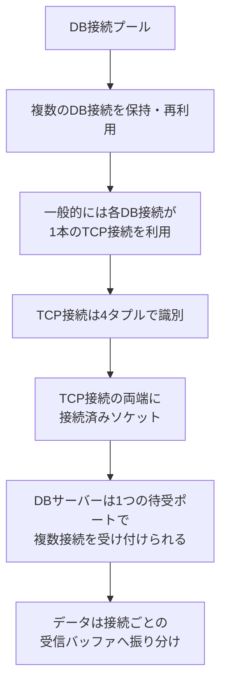

- DB接続プールとTCPポートは別の概念
- DB接続プールは、複数のDB接続を保持・再利用・制限する
- TCPポートは、通信するサービスや端点を識別する番号
- DBサーバーは、1つの待受ポートで複数のTCP接続を受け付けられる
- 同じDBサーバーの同じポートへ接続する場合、アプリ側では通常、接続ごとに異なる一時ポートが使われる
- TCP接続は、送信元IP、送信元ポート、宛先IP、宛先ポートの4タプルで区別される
- ソケットは通信路そのものではなく、通信路の端点
- TCP接続1本の両端には、接続済みソケットが1個ずつある
- サーバーは待受ソケットで新規接続を受け付け、接続済みソケットでデータを送受信する
- 同じ待受ポートに届いたデータは、OSによって接続ごとの受信バッファへ振り分けられる
- ポート番号だけで最大接続数は決まらず、OS、メモリ、CPU、DB設定など複数の制約がある
- ポート番号自体は詰まらないが、ネットワーク、OS、DB処理、接続プールなどでは混雑や待ちが発生する
- 接続プールの最大数と、現在確立している接続数は同じとは限らない
- HTTP接続数とDB接続数は一致するとは限らない

---

## 15. 参考資料

- [Go公式：Managing connections](https://go.dev/doc/database/manage-connections)
- [Go公式：`database/sql.DB`](https://pkg.go.dev/database/sql#DB)
- [RFC 9293：Transmission Control Protocol（TCP）](https://www.rfc-editor.org/rfc/rfc9293.html)
- [PostgreSQL公式：Connections and Authentication](https://www.postgresql.org/docs/current/runtime-config-connection.html)
