# HTTP Cookieと`HttpOnly`の仕組み

## この文書の目的

この文書では、`curl -v`の観察から生じた次の疑問を整理します。

- CookieはHTTPリクエストやレスポンスに含まれるのか
- ブラウザのCookieがcurlの通信に表示されないのはなぜか
- サーバーとブラウザは、Cookieをどのように送受信するのか
- `HttpOnly`は何を防ぐのか
- `HttpOnly`は誰が設定し、誰が制限を実行するのか
- 後続のリクエストに`HttpOnly`という文字も含まれるのか

最初に結論をまとめると、次のようになります。

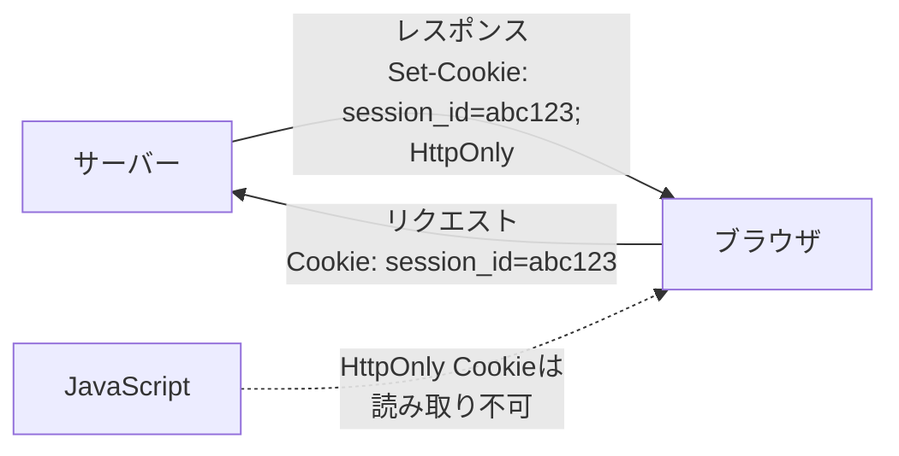

- サーバーは、HTTPレスポンスの`Set-Cookie`でCookieを設定する
- ブラウザは、Cookieとその属性を保存する
- ブラウザは、条件に一致するCookieを後続のHTTPリクエストで自動送信する
- `HttpOnly`は、サーバーが`Set-Cookie`へ付けるCookie属性
- ブラウザが`HttpOnly`の制限を実行し、JavaScriptからの読み取りを禁止する
- リクエストではCookieの名前と値だけを送り、`HttpOnly`属性は送り返さない

---

## 1. Cookieが必要な理由

HTTPは、基本的にリクエストとレスポンスの組み合わせで処理されます。

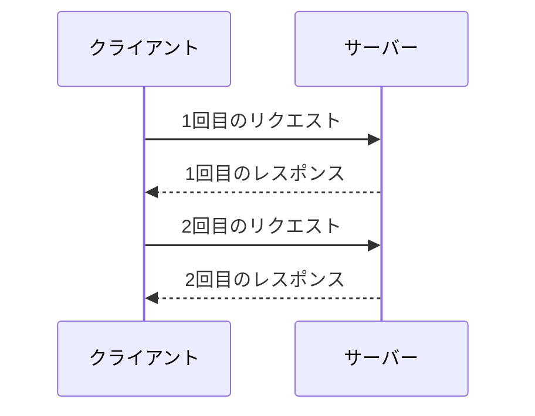

サーバーは、何も仕組みを用意しなければ、別々のリクエストが同じ利用者から送られたものか判断できません。

Cookieを利用すると、サーバーが発行した識別情報をクライアントに保存させ、後続のリクエストで送り返してもらえます。

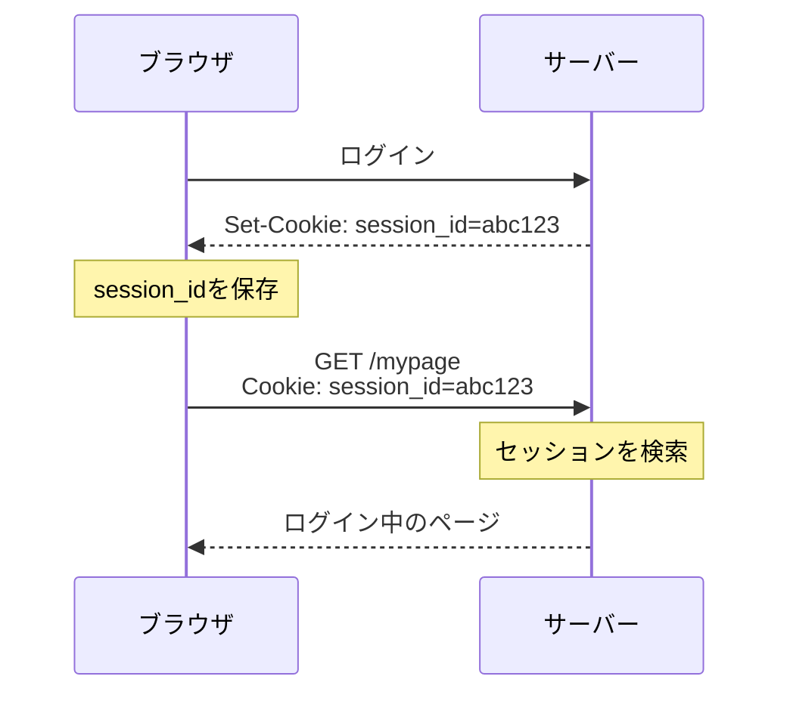

Cookieの代表的な用途は次のとおりです。

| 用途 | 例 |
|---|---|
| セッション管理 | ログイン状態を識別する |
| 個人設定 | 言語、テーマ、表示方法を保存する |
| ショッピングカート | カートの識別情報を保持する |
| 計測 | アクセスや利用状況を識別する |

Cookieには機密情報や個人に関係する情報が含まれる場合があるため、用途と保存内容を慎重に設計する必要があります。

---

## 2. CookieはHTTPリクエストとレスポンスに含まれる

Cookieは、HTTPヘッダーを使って送受信されます。

| 通信方向 | ヘッダー | 役割 |
|---|---|---|
| サーバーからクライアント | `Set-Cookie` | Cookieを作成、更新、削除する |
| クライアントからサーバー | `Cookie` | 保存済みCookieの名前と値を送る |

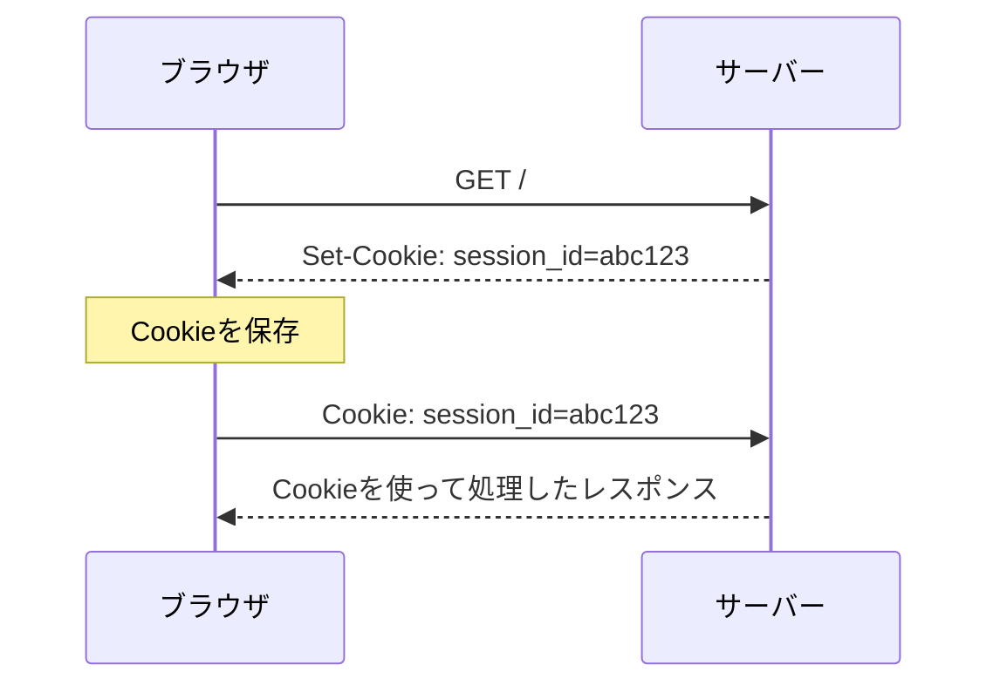

Cookieは常に通信へ含まれるわけではありません。

- サーバーがCookieを設定しないレスポンスには`Set-Cookie`がない
- クライアントに送信対象のCookieがなければ`Cookie`がない
- ドメインやパスなどの条件に一致しなければ送信されない
- 利用者やブラウザの設定によってCookieが拒否されることがある

---

## 3. サーバーからブラウザへの`Set-Cookie`

サーバーは、HTTPレスポンスの`Set-Cookie`ヘッダーでCookieを設定します。

```http
HTTP/2 200
Content-Type: text/html
Set-Cookie: session_id=abc123; Path=/; Secure; HttpOnly; SameSite=Lax
```

この例では、次の情報をブラウザへ伝えています。

| 部分 | 意味 |
|---|---|
| `session_id` | Cookieの名前 |
| `abc123` | Cookieの値 |
| `Path=/` | `/`以下のパスへ送信する |
| `Secure` | 安全な通信で送信する |
| `HttpOnly` | スクリプト用APIからのアクセスを制限する |
| `SameSite=Lax` | 別サイトを起点とする送信を一定範囲で制限する |

`Set-Cookie`はレスポンス全体に対する設定ではなく、特定のCookieを設定するためのヘッダーです。

サーバーは、1つのレスポンスで複数のCookieを設定できます。

```http
Set-Cookie: session_id=abc123; Path=/; Secure; HttpOnly
Set-Cookie: theme=dark; Path=/
```

この場合、`HttpOnly`が付いているのは`session_id`だけです。

| Cookie | `HttpOnly` | JavaScriptからの読み取り |
|---|---:|---|
| `session_id` | あり | 不可 |
| `theme` | なし | 可能 |

---

## 4. ブラウザによるCookieの保存

ブラウザは`Set-Cookie`を受信すると、Cookieの名前と値だけでなく、属性もCookieストアへ保存します。

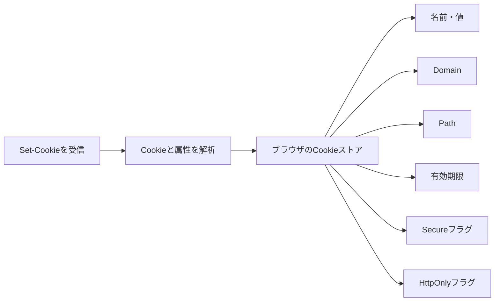

ただし、ブラウザはすべての`Set-Cookie`を必ず受け入れるわけではありません。

- Cookieの形式が不正
- 利用者がCookieを拒否している
- ブラウザのプライバシー設定で拒否される
- 第三者Cookieとして制限される
- ドメインなどの設定が不正

このような場合は、受信した`Set-Cookie`を保存しないことがあります。

---

## 5. ブラウザからサーバーへの`Cookie`

ブラウザはHTTPリクエストを送るとき、保存済みCookieの中から送信条件に一致するものを選びます。

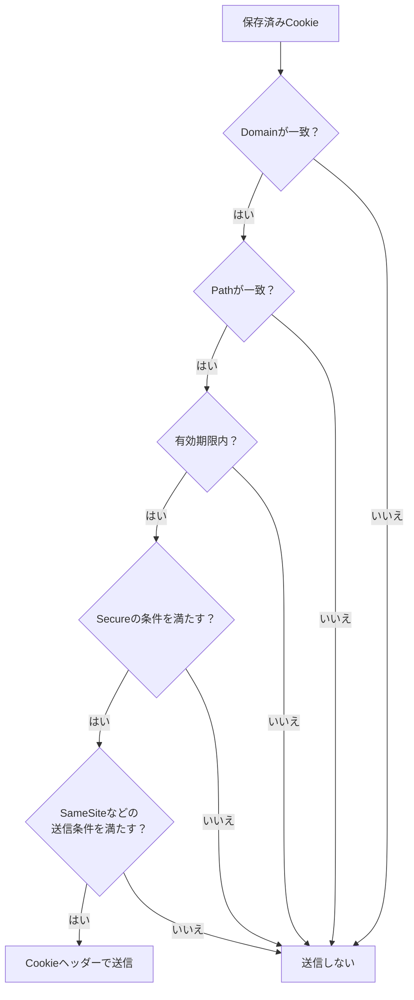

送信する場合、HTTPリクエストは次のようになります。

```http
GET /mypage HTTP/2
Host: example.com
Cookie: session_id=abc123; theme=dark
```

`Cookie`リクエストヘッダーには、Cookieの名前と値が並びます。

---

## 6. Cookie属性はリクエストで送り返さない

サーバーから受信したレスポンスには、Cookie属性が含まれます。

```http
Set-Cookie: session_id=abc123; Path=/; Secure; HttpOnly; SameSite=Lax
```

一方、後続のリクエストは次のようになります。

```http
Cookie: session_id=abc123
```

次のようにはなりません。

```http
Cookie: session_id=abc123; Path=/; Secure; HttpOnly; SameSite=Lax
```

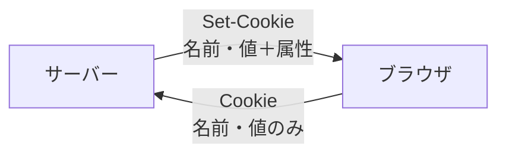

属性は、どのCookieを保存し、いつ送信し、どのAPIからアクセス可能にするかをブラウザが判断するためのルールです。

サーバーは、後続の`Cookie`リクエストヘッダーだけを見ても、そのCookieへ以前`Secure`や`HttpOnly`を付けたか判断できません。サーバー側では、自分がどのCookieをどの属性で設定する設計なのかを管理します。

---

## 7. `HttpOnly`は誰が設定するのか

`HttpOnly`を指定するのは、基本的にサーバーです。

サーバーは、HTTPレスポンスの`Set-Cookie`ヘッダーへ`HttpOnly`を付けます。

```http
Set-Cookie: session_id=abc123; HttpOnly
```

役割分担は次のとおりです。

| 処理 | 担当 |
|---|---|
| `HttpOnly`を`Set-Cookie`へ付ける | サーバー |
| Cookieと`HttpOnly`属性を保存する | ブラウザ |
| JavaScriptからのアクセスを拒否する | ブラウザ |
| 条件に一致するHTTPリクエストへCookieを付ける | ブラウザ |
| 送られたCookieを使ってセッションを処理する | サーバー |

```mermaid
sequenceDiagram
    participant B as ブラウザ
    participant S as サーバー

    B->>S: ログインリクエスト
    S-->>B: Set-Cookie:<br/>session_id=abc123; HttpOnly
    Note over B: CookieとHttpOnly属性を保存
    Note over B: JavaScriptからの読み取りを禁止
    B->>S: Cookie: session_id=abc123
    Note over S: セッションを識別
```

したがって、次の理解が正確です。

> サーバーがレスポンスの`Set-Cookie`で`HttpOnly`を指定し、ブラウザがその制限を保存・実行する。

---

## 8. `HttpOnly`は何を制限するのか

`HttpOnly`は、JavaScriptなどが利用する非HTTPのCookieアクセスAPIから、そのCookieへアクセスできないようにします。

ブラウザ上のJavaScriptでは、通常`document.cookie`を使ってCookieへアクセスできます。

```javascript
console.log(document.cookie);
```

`HttpOnly`が付いたCookieは、`document.cookie`の結果に含まれません。

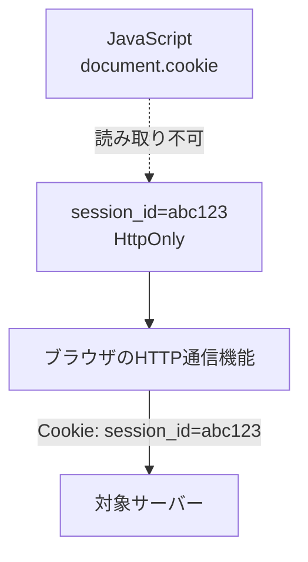

重要なのは、JavaScriptから読み取れないことと、HTTPリクエストで送信しないことは別だという点です。

| 操作 | `HttpOnly` Cookie |
|---|---|
| JavaScriptの`document.cookie`で読む | 読み取れない |
| 条件に一致するHTTPリクエストで送る | ブラウザが自動送信する |
| サーバーが`Cookie`ヘッダーから読む | 読み取れる |
| ブラウザ内部で管理する | 管理される |

---

## 9. `HttpOnly`とXSS

`HttpOnly`の主な目的は、XSSによって不正なJavaScriptを実行されたときに、セッションCookieそのものを盗まれる危険を減らすことです。

### `HttpOnly`がない場合

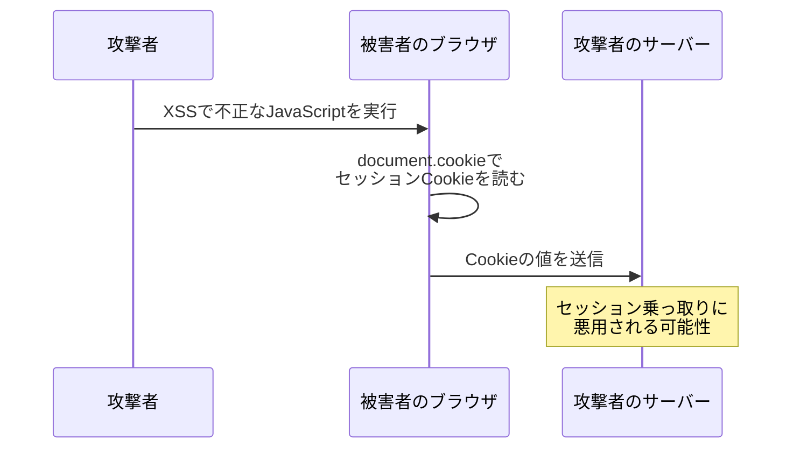

### `HttpOnly`がある場合

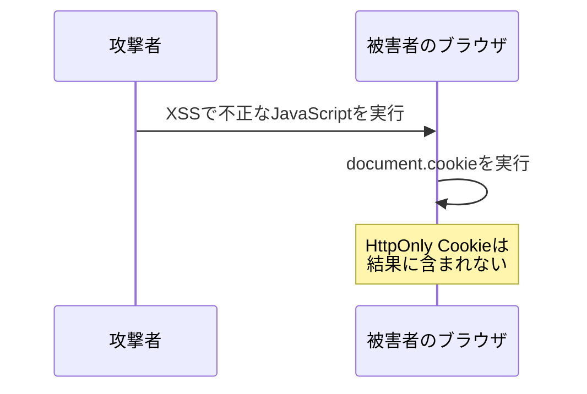

`HttpOnly`は、セッションCookieを直接読み取って外部へ持ち出す攻撃への対策になります。

---

## 10. `HttpOnly`だけでは防げないこと

`HttpOnly`はCookieを暗号化する仕組みでも、XSSそのものを防ぐ仕組みでもありません。

不正なJavaScriptからCookieの値を読めなくても、そのJavaScriptが利用者のブラウザ上でサーバーへリクエストを送れる場合があります。

```javascript
fetch("/account/settings", {
  method: "POST",
  body: "..."
});
```

ブラウザがそのリクエストへCookieを自動的に付ければ、不正な操作が成立する可能性があります。

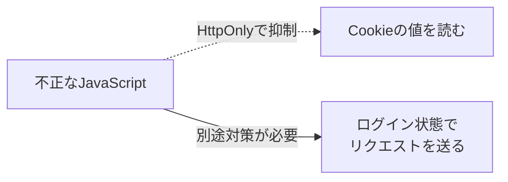

`HttpOnly`だけでは、次の問題を完全には防げません。

- XSSそのもの
- XSSによるログイン済み操作
- CSRF
- サーバー側からのCookie漏えい
- 端末やブラウザ自体が侵害された場合の窃取

複数の対策を組み合わせることが重要です。

---

## 11. 主なCookie属性

セッションCookieでは、`HttpOnly`以外の属性も組み合わせます。

```http
Set-Cookie: session_id=abc123; Path=/; Secure; HttpOnly; SameSite=Lax
```

| 属性 | 主な役割 |
|---|---|
| `HttpOnly` | スクリプト用APIからのCookieアクセスを制限する |
| `Secure` | 安全な通信でのみCookieを送信する |
| `SameSite` | 別サイトを起点とするリクエストでの送信を制御する |
| `Domain` | Cookieを送信できるドメインの範囲を指定する |
| `Path` | Cookieを送信できるURLパスの範囲を指定する |
| `Expires` | Cookieの失効日時を指定する |
| `Max-Age` | Cookieの有効期間を秒数で指定する |

属性ごとに目的が異なります。

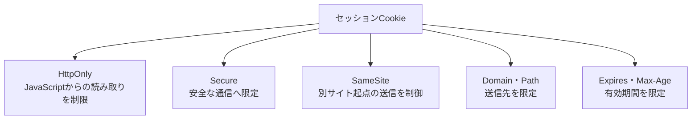

`HttpOnly`と`Secure`は独立した属性です。`HttpOnly`を付けたからHTTPS限定になるわけではなく、HTTPSへ限定するには`Secure`も指定します。

---

## 12. JavaScriptから`HttpOnly`を設定できるか

JavaScriptは、`document.cookie`を使って通常のCookieを設定できます。

```javascript
document.cookie = "theme=dark; Path=/";
```

しかし、JavaScriptから`HttpOnly` Cookieを作ることはできません。

```javascript
// HttpOnly Cookieとしては設定できない
document.cookie = "session_id=abc123; HttpOnly";
```

JavaScript自身が`HttpOnly`を設定できると、スクリプトから操作できないCookieという目的と矛盾するためです。

セッションIDなどの重要なCookieへ`HttpOnly`を付ける場合は、サーバーのHTTPレスポンスで設定します。

---

## 13. curlでCookieが表示されなかった理由

通常のcurlは、ブラウザが保存しているCookieを自動的に共有しません。

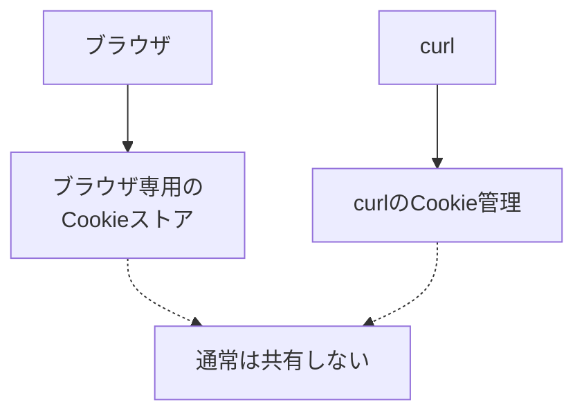

ブラウザでログイン済みでも、通常のcurlはそのログインCookieを持っていません。そのため、次のリクエストヘッダーは表示されません。

```text
> Cookie: ...
```

また、アクセスしたサーバーがそのレスポンスでCookieを発行しなければ、次のレスポンスヘッダーも表示されません。

```text
< Set-Cookie: ...
```

したがって、`Cookie`と`Set-Cookie`がどちらもない場合、確実に言えるのは次の範囲です。

> そのcurlリクエストではCookieを送信せず、そのHTTPレスポンスではCookieが発行されなかった。

サイト全体でCookieを使っていないとは断定できません。

---

## 14. ほかの通信でCookieが設定される場合

最初のHTMLレスポンスに`Set-Cookie`がなくても、ブラウザでページを開いた後にCookieが設定される場合があります。

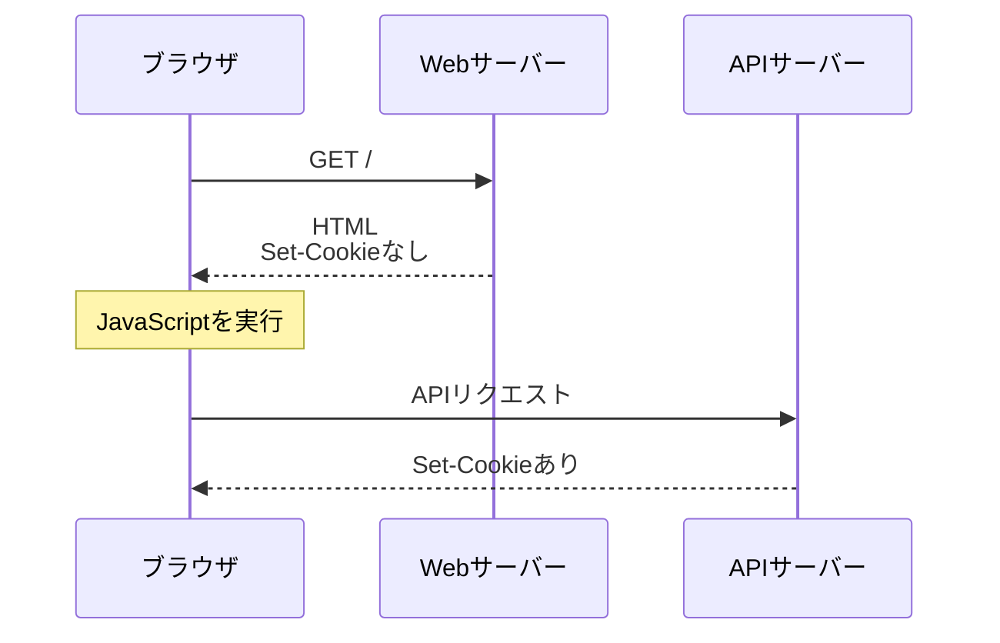

Cookieが設定される可能性のある場所には、次のものがあります。

- ログインレスポンス
- リダイレクト途中のレスポンス
- JavaScriptから呼び出したAPIのレスポンス
- 別のサブドメインからのレスポンス
- JavaScriptの`document.cookie`
- 計測などに使う別リソースの通信

curlはJavaScriptを実行しないため、JavaScriptによって行われるCookie操作や追加のAPI通信は自動的には再現しません。

---

## 15. curlでCookieを保存・送信する

### Cookieを受信して保存する

```bash
curl -v -c cookies.txt https://example.com/
```

`-c`または`--cookie-jar`は、curlのCookieエンジンを有効にし、受信したCookieをファイルへ書き出します。

レスポンスでCookieが発行されると、次のような行を確認できます。

```text
< Set-Cookie: session_id=abc123; Path=/; Secure; HttpOnly
```

### 保存済みCookieを読み込んで送る

```bash
curl -v -b cookies.txt https://example.com/
```

`-b`または`--cookie`はCookieファイルを読み込み、送信条件に一致するCookieをリクエストへ付けます。

```text
> Cookie: session_id=abc123
```

### 同じファイルから読み込み、更新結果を書き出す

```bash
curl -v \
  -b cookies.txt \
  -c cookies.txt \
  https://example.com/
```

| オプション | 役割 |
|---|---|
| `-b cookies.txt` | 実行開始時にCookieを読み込む |
| `-c cookies.txt` | 実行終了時にCookieを書き出す |

### Cookieを手動で送る

```bash
curl -v -b 'session_id=abc123' https://example.com/
```

実際のセッションCookieをコマンドラインへ直接書くと、シェル履歴などに残る可能性があります。機密性のあるCookieの取り扱いには注意します。

---

## 16. curlとブラウザの違い

| 項目 | ブラウザ | curl |
|---|---|---|
| Cookieの継続保存 | 通常は自動 | ファイルなどを明示する |
| 条件に一致するCookieの送信 | 通常は自動 | Cookieエンジンを有効にして送る |
| ブラウザのCookieストア | 使用する | 通常は共有しない |
| JavaScriptの実行 | 実行する | 実行しない |
| JavaScriptによるCookie設定 | 可能 | 再現しない |
| `Set-Cookie`の観察 | 開発者ツールなど | `curl -v`で確認可能 |

ブラウザで行われた通信をcurlで再現する場合は、Cookieだけでなく、JavaScriptによる通信やリダイレクトなども考慮する必要があります。

---

## 17. `curl -v`での観察ポイント

### レスポンスでCookieが発行されたか

```text
< Set-Cookie: session_id=abc123; HttpOnly
```

確認する項目は次のとおりです。

- Cookieの名前
- `HttpOnly`の有無
- `Secure`の有無
- `SameSite`の値
- `Domain`と`Path`
- `Expires`または`Max-Age`

### リクエストでCookieを送ったか

```text
> Cookie: session_id=abc123
```

リクエストにはCookieの名前と値が含まれますが、`HttpOnly`などの属性は含まれません。

### 情報を共有するときの注意

`Cookie`や`Set-Cookie`には、ログイン状態を示すセッションIDなどが含まれる場合があります。

```text
Cookie: session_id=REDACTED
Set-Cookie: session_id=REDACTED; HttpOnly
```

curlのログを公開したりGitへ保存したりするときは、Cookieの値をマスキングします。

---

## 18. よくある誤解

| 誤解 | 正しい理解 |
|---|---|
| Cookieはブラウザ内部だけにあり、HTTP通信には現れない | `Set-Cookie`と`Cookie`というHTTPヘッダーで送受信される |
| ブラウザのCookieはcurlにも自動的に引き継がれる | 通常は別々に管理される |
| `HttpOnly`はブラウザが勝手に付ける | サーバーが`Set-Cookie`で指定する |
| リクエストにも`HttpOnly`が付く | リクエストではCookieの名前と値だけを送る |
| `HttpOnly` Cookieはサーバーにも送られない | ブラウザは条件に一致するHTTPリクエストへ自動的に付ける |
| `HttpOnly`はCookieを暗号化する | JavaScriptなどのスクリプト用APIからのアクセスを制限する |
| `HttpOnly`があればXSSを完全に防げる | Cookie窃取の危険を減らすが、XSS自体や不正操作には別の対策も必要 |
| `Set-Cookie`がなければサイトはCookieを使っていない | 別のレスポンスやJavaScriptで設定される可能性がある |

---

## 19. 今回の疑問への回答

### Cookieはリクエストやレスポンスに含まれるか

含まれる場合があります。

- サーバーからクライアント：`Set-Cookie`
- クライアントからサーバー：`Cookie`

ただし、Cookieを設定・送信しない通信では表示されません。

### `HttpOnly`はCookieを読み取られにくくするのか

ブラウザ上のJavaScriptから、そのCookieを読み取れないようにします。特に、XSSによるセッションCookieの直接的な窃取リスクを減らします。

### `HttpOnly`はブラウザがリクエストへセットするのか

いいえ。サーバーがレスポンスの`Set-Cookie`で指定します。ブラウザはその属性を保存し、制限を実行します。

### サーバーのレスポンスに`HttpOnly`が付くのか

正確には、サーバーのレスポンスにある特定の`Set-Cookie`ヘッダーへ`HttpOnly`属性が付きます。

```http
Set-Cookie: session_id=abc123; HttpOnly
```

後続のリクエストでは、`HttpOnly`属性を除いた名前と値を送ります。

```http
Cookie: session_id=abc123
```

---

## 20. 要点

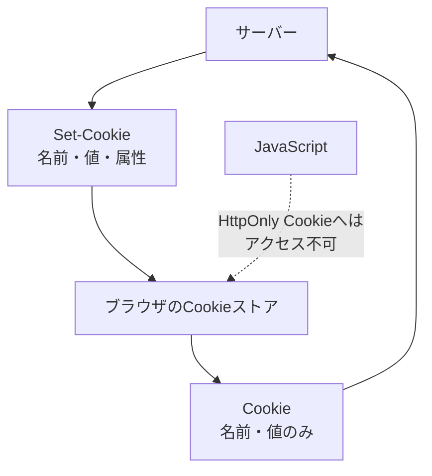

- CookieはHTTPヘッダーで送受信される
- サーバーはレスポンスの`Set-Cookie`でCookieを設定する
- ブラウザはCookieと属性を保存する
- ブラウザは条件に一致するCookieをリクエストの`Cookie`で送る
- Cookie属性はリクエストで送り返さない
- `HttpOnly`はサーバーが指定し、ブラウザが制限を実行する
- `HttpOnly`はJavaScriptからのCookieアクセスを制限する
- `HttpOnly` CookieもHTTPリクエストではサーバーへ送られる
- curlとブラウザは通常、Cookieストアを共有しない
- `curl -v`には機密性のあるCookieが表示される可能性がある

---

## 21. 関連ドキュメント

- [`curl -v`で観察するHTTPレスポンス](http-response-structure-and-headers.md)
- [CloudFrontの中継とキャッシュの仕組み](cloudfront-intermediary-and-cache.md)
- [HTTP/1.1とHTTP/2のストリーム](http1.1-vs-http2-streams.md)
- [TLS証明書と認証局による信頼](tls-certificates-and-ca-trust.md)

---

## 22. 参考資料

- [RFC 6265：HTTP State Management Mechanism](https://www.rfc-editor.org/rfc/rfc6265.html)
- [curl：HTTP Cookies](https://curl.se/docs/http-cookies.html)
- [curl：コマンドラインオプション](https://curl.se/docs/manpage.html)
