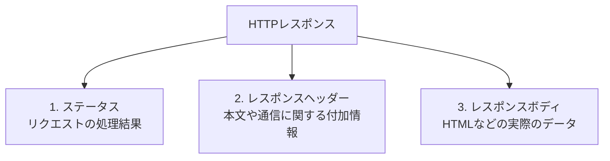
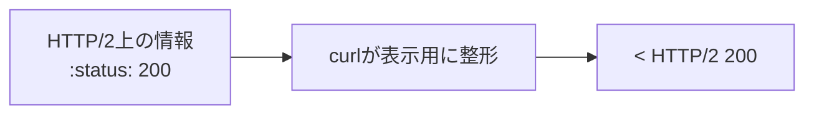
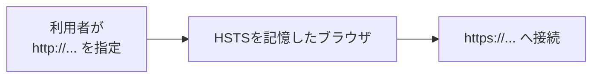
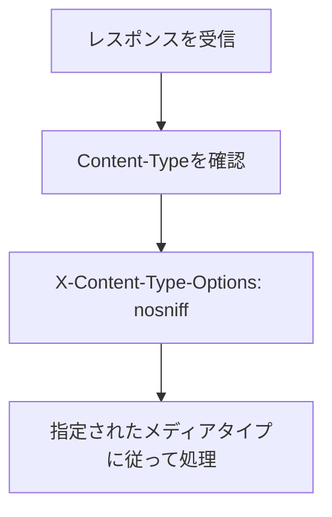
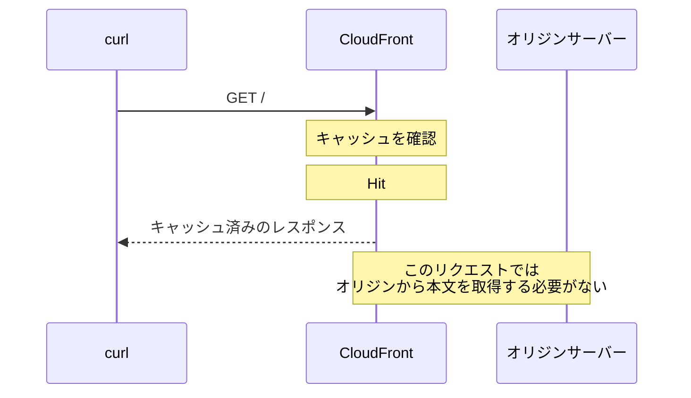
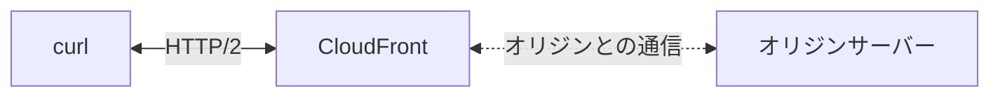
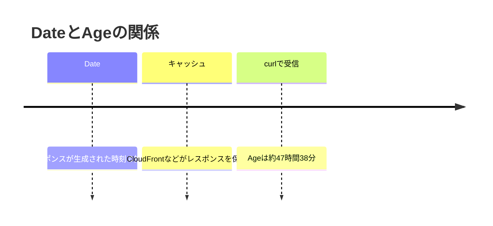
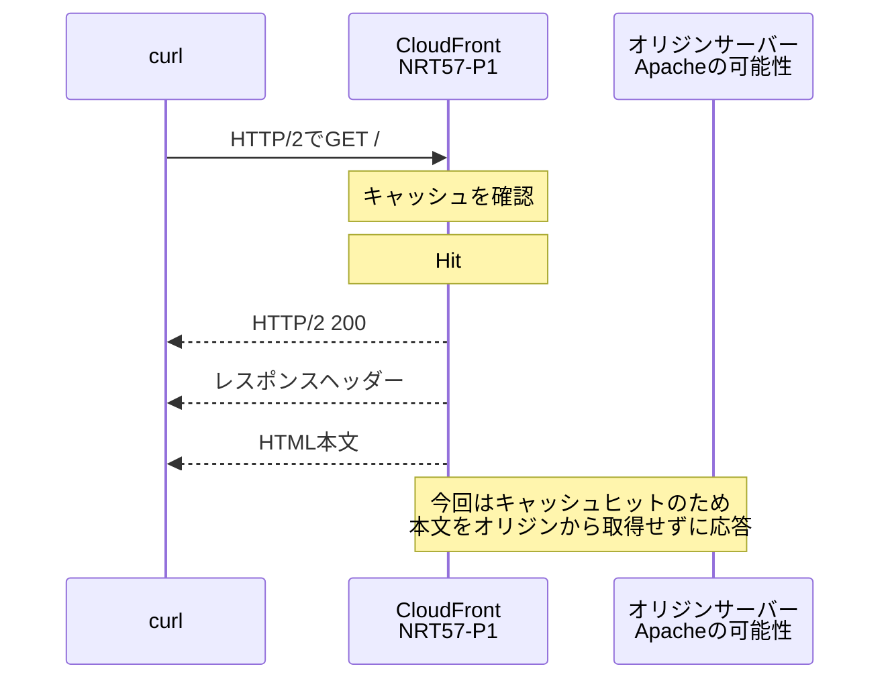
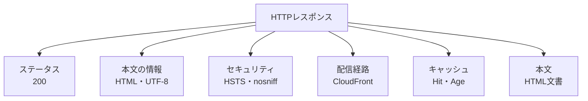

# `curl -v`で観察するHTTPレスポンス

## この文書の目的

この文書では、`curl -v`で受信した次のHTTPレスポンスを例に、レスポンスの構造と各行の意味を説明します。

```text
< HTTP/2 200
< content-type: text/html; charset=UTF-8
< date: Fri, 24 Jul 2026 05:07:23 GMT
< strict-transport-security: max-age=31536000; includeSubDomains; preload
< x-content-type-options: nosniff
< server: Apache
< x-cache: Hit from cloudfront
< via: 1.1 a0c8ca5c55854408aacaabfb864516d0.cloudfront.net (CloudFront)
< x-amz-cf-pop: NRT57-P1
< x-amz-cf-id: stynVAgnn9bWjLQaS9fHmfDU4AjzOZzJcrpQ4bZO471Lhvn6Z91dzA==
< age: 171510
<
<!DOCTYPE html>
〜 省略 〜
</body></html>%
```

この出力から、次のことを読み取れるようになることを目標とします。

- HTTPリクエストに対する処理結果
- 返されたデータの種類
- ブラウザへ指示するセキュリティ設定
- CloudFrontの利用とキャッシュの状態
- レスポンスヘッダーとレスポンスボディの境界
- `curl`やシェルが付けた表示と、サーバーから受信したデータの違い

---

## 1. `curl -v`の記号

`curl -v`は、行の先頭に記号を付けて情報の向きを表します。

| 記号 | 意味 |
|---|---|
| `>` | curlからサーバーへ送信したHTTPヘッダー |
| `<` | サーバーからcurlが受信したHTTPヘッダー |
| `*` | 接続、TLS、プロトコル選択などに関するcurlの補足情報 |

今回扱う行の先頭には`<`があるため、サーバーから受信したレスポンスヘッダーだと分かります。

```text
< content-type: text/html; charset=UTF-8
^
curlが「受信したヘッダー」であることを示す記号
```

`<`は`curl -v`が人間向けの表示に付けた記号です。実際のHTTPヘッダーに含まれているわけではありません。

レスポンスボディには`<`が付きません。

```text
< content-type: text/html; charset=UTF-8  ← レスポンスヘッダー
<
<!DOCTYPE html>                           ← レスポンスボディ
```

---

## 2. HTTPレスポンスの基本構造

HTTPレスポンスは、概念的には次の3つの部分から構成されます。



今回のレスポンスを構造に当てはめると、次のようになります。

```text
HTTP/2 200                                      ┐
                                                └─ ステータス

content-type: text/html; charset=UTF-8          ┐
date: Fri, 24 Jul 2026 05:07:23 GMT             │
strict-transport-security: ...                  │
x-content-type-options: nosniff                 │
server: Apache                                  │
x-cache: Hit from cloudfront                    ├─ レスポンスヘッダー
via: ... (CloudFront)                           │
x-amz-cf-pop: NRT57-P1                          │
x-amz-cf-id: ...                                │
age: 171510                                     ┘

                                                ← 空行

<!DOCTYPE html>                                 ┐
〜 省略 〜                                      ├─ レスポンスボディ
</body></html>                                  ┘
```

空行は、レスポンスヘッダーとレスポンスボディの境界です。

---

## 3. `< HTTP/2 200`

```text
< HTTP/2 200
  ────── ───
     │    │
     │    └─ HTTPステータスコード
     └────── HTTP/2で受信したことを示すcurlの表示
```

### `HTTP/2`

curlと接続先の間でHTTP/2が使われたことを示します。

ただし、HTTP/2の通信では、`HTTP/2 200`というテキストのステータス行をそのまま送信するわけではありません。HTTP/2では、ステータスコードを次の疑似ヘッダーとしてHEADERSフレームに格納します。

```text
:status: 200
```

`curl -v`は、それを人間が理解しやすいように`HTTP/2 200`と表示しています。



### `200`

`200`は、リクエストが正常に処理されたことを表すステータスコードです。

今回の場合は、次の意味になります。

> `GET /`リクエストの処理に成功し、要求されたコンテンツをレスポンスボディで返す。

ステータスコードは、先頭の数字によって大まかに分類できます。

| 範囲 | 分類 | 例 |
|---|---|---|
| `100`番台 | 情報レスポンス | `103 Early Hints` |
| `200`番台 | 成功 | `200 OK` |
| `300`番台 | リダイレクト | `301 Moved Permanently` |
| `400`番台 | クライアント側のエラー | `404 Not Found` |
| `500`番台 | サーバー側のエラー | `500 Internal Server Error` |

---

## 4. `< content-type: text/html; charset=UTF-8`

```text
content-type: text/html; charset=UTF-8
              ─────────  ─────────────
                  │             │
                  │             └─ 文字エンコーディング
                  └─────────────── メディアタイプ
```

`Content-Type`は、レスポンスボディのデータ形式と、そのデータをどのように処理すべきかをクライアントへ伝えます。

### `text/html`

レスポンスボディがHTML文書であることを示します。

ブラウザは、この情報をもとにレスポンスボディをWebページとして解釈します。

### `charset=UTF-8`

HTML文書の文字エンコーディングがUTF-8であることを示します。

クライアントは、この指定を使って、受信したバイト列を日本語などの文字へ変換します。

代表的なメディアタイプには、次のものがあります。

| メディアタイプ | 主なデータ |
|---|---|
| `text/html` | HTML文書 |
| `text/css` | CSS |
| `application/json` | JSON |
| `image/png` | PNG画像 |
| `application/pdf` | PDF |

---

## 5. `< date: Fri, 24 Jul 2026 05:07:23 GMT`

`Date`は、HTTPメッセージが生成された日時の推定値を示します。

```text
date: Fri, 24 Jul 2026 05:07:23 GMT
```

HTTPの日時は通常GMT、すなわちUTCで表されます。日本標準時はUTCより9時間進んでいるため、今回の値は次の日時に相当します。

```text
UTC: 2026年7月24日 05:07:23
JST: 2026年7月24日 14:07:23
```

このレスポンスはCloudFrontのキャッシュから返されています。そのため、`Date`は必ずしもcurlを実行した時刻ではありません。

後述する`Age`と一緒に観察すると、キャッシュされたレスポンスの古さを読み取れます。

---

## 6. `< strict-transport-security: ...`

```text
strict-transport-security: max-age=31536000; includeSubDomains; preload
```

`Strict-Transport-Security`は、HSTS（HTTP Strict Transport Security）を設定するセキュリティヘッダーです。

HSTSを記憶したブラウザは、そのサイトへ接続するときにHTTPSを使用します。



### `max-age=31536000`

ブラウザがHSTS設定を記憶する期間を秒数で示します。

```text
31,536,000秒 = 365日
```

### `includeSubDomains`

HSTS設定をサブドメインにも適用するよう指示します。

例えば、登録対象のドメインに対して、次のようなホストも対象になります。

```text
www.example.com
api.example.com
shop.example.com
```

### `preload`

ブラウザのHSTSプリロードリストへの登録意思を示すディレクティブです。

プリロードリストに実際に登録されると、そのサイトを過去に訪問していないブラウザでも、初回からHTTPSを使用できます。

ただし、ヘッダーに`preload`があることだけでは、実際にプリロードリストへ登録済みだとは断定できません。

---

## 7. `< x-content-type-options: nosniff`

```text
x-content-type-options: nosniff
```

このセキュリティヘッダーは、レスポンスの内容からデータ形式を推測するMIMEスニッフィングを抑制します。

`nosniff`が指定されている場合、ブラウザは基本的に`Content-Type`で示された形式を尊重します。



意図しない形式としてコンテンツが実行される可能性を減らすための設定です。

---

## 8. `< server: Apache`

```text
server: Apache
```

`Server`ヘッダーは、レスポンスを生成したサーバーソフトウェアに関する情報を示すために使われます。

この値からは、オリジンサーバーでApache HTTP Serverが使われている可能性を考えられます。

ただし、この情報だけで実際の構成を断定することはできません。

- `Server`ヘッダーは変更または削除できる
- CloudFrontがオリジンから受け取った値である可能性がある
- 実際の処理が別のサーバーやアプリケーションで行われている可能性がある

観察結果には、次のように記録するのが適切です。

> `Server`ヘッダーの値は`Apache`だった。Apacheを使用している可能性はあるが、このヘッダーだけではサーバー構成を断定できない。

---

## 9. `< x-cache: Hit from cloudfront`

```text
x-cache: Hit from cloudfront
         ───
          └─ CloudFront上に利用可能なキャッシュがあった
```

この行は、CloudFrontのキャッシュからレスポンスが提供されたことを示します。

今回のリクエストでは、CloudFrontが保持しているHTMLをcurlへ返したと考えられます。



キャッシュがなければ、CloudFrontはオリジンサーバーからレスポンスを取得する必要があります。その場合は`Miss from cloudfront`などと表示されることがあります。

---

## 10. `< via: ... (CloudFront)`

```text
via: 1.1 a0c8ca5c55854408aacaabfb864516d0.cloudfront.net (CloudFront)
```

`Via`は、メッセージがプロキシやCDNなどの中継点を通過したことを示します。

今回の値から、CloudFrontがレスポンスの中継に関わっていることが分かります。



`Via`にある`1.1`を、先頭行の`HTTP/2`と混同しないように注意します。

- `HTTP/2 200`は、curlとCloudFrontの間でHTTP/2を使ったことを示す
- `Via`の`1.1`は、中継点が受信したメッセージのプロトコル情報として記録した値

つまり、今回のレスポンス全体がHTTP/1.1で返されたという意味ではありません。

---

## 11. `< x-amz-cf-pop: NRT57-P1`

```text
x-amz-cf-pop: NRT57-P1
```

このヘッダーは、リクエストを処理したCloudFrontのPOP（Point of Presence、接続拠点）を識別するコードです。

`NRT`は東京地域を示すコードとして使われています。そのため、東京地域のCloudFront拠点で処理されたと読み取れます。

ただし、`NRT57-P1`の詳細な設備や物理的な所在地まで、この値だけで特定できるわけではありません。

---

## 12. `< x-amz-cf-id: ...`

```text
x-amz-cf-id: stynVAgnn9bWjLQaS9fHmfDU4AjzOZzJcrpQ4bZO471Lhvn6Z91dzA==
```

CloudFrontがリクエストの追跡に使用する一意な識別子です。

主に、AWSサポートを含む障害調査やリクエストの追跡に使われます。利用者がこの文字列を復号して通信内容を読み取るためのものではありません。

---

## 13. `< age: 171510`

```text
age: 171510
```

`Age`は、共有キャッシュが見積もった「オリジンサーバーでレスポンスが生成または正常に再検証されてからの経過時間」を秒単位で示します。

`171510`秒を時間へ変換すると、次のようになります。

```text
171,510秒
= 47時間38分30秒
= 約1日23時間38分
```

これは、単純なファイルの作成時刻や、必ず同じCloudFront拠点に保存され続けた時間を示す値ではありません。

`Date`と`Age`の関係は、次のように理解できます。



今回の`x-cache`と合わせると、次のことが分かります。

```text
x-cache: Hit from cloudfront
age: 171510
```

> CloudFrontに利用可能なキャッシュがあり、オリジンでの生成または再検証から約47時間38分が経過したレスポンスが返された。

---

## 14. `<`だけの空行

```text
<
```

これは、レスポンスヘッダーが終了したことを示す空行です。

HTTPでは、ヘッダー部分とボディ部分を空行で区切ります。

```text
< age: 171510       ← 最後のレスポンスヘッダー
<                   ← ヘッダーとボディを区切る空行
<!DOCTYPE html>     ← レスポンスボディの開始
```

ここに表示される`<`自体はcurlの表示記号です。通信上の意味は「空行」にあります。

---

## 15. `<!DOCTYPE html>`

空行より後ろは、レスポンスボディです。

```html
<!DOCTYPE html>
```

`<!DOCTYPE html>`は、文書をHTMLとして扱うためのDOCTYPE宣言です。

先ほどの`Content-Type`とも対応しています。

```text
レスポンスヘッダー
  content-type: text/html; charset=UTF-8
                    │
                    └────────┐
                             ▼
レスポンスボディ
  <!DOCTYPE html> ... </html>
```

レスポンスボディには、ブラウザが画面を組み立てるためのHTMLが含まれています。

---

## 16. `</body></html>%`

```text
</body></html>%
```

### `</body>`

HTMLの本文部分が終了したことを示します。

### `</html>`

HTML文書全体が終了したことを示します。

### 最後の`%`

末尾の`%`は、サーバーから受信したHTMLに含まれているとは限りません。

レスポンスボディの末尾に改行がない場合、zshがそのことを示すために`%`を表示することがあります。

```text
</body></html>  ← サーバーから受信したHTML
%               ← 改行がないことを示すzsh側の表示である可能性が高い
```

実際のレスポンス本文に`%`が含まれるかを確認したい場合は、本文をファイルへ保存して調べられます。

```bash
curl -sS https://www.pokemon.co.jp/ -o response.html
tail -c 30 response.html
```

---

## 17. 今回の通信経路

レスポンスヘッダーをまとめると、通信経路はおおむね次のように推測できます。



ここで、確実に観察できる事実と、ヘッダーからの推測を分けることが重要です。

| 分類 | 観察内容 |
|---|---|
| 出力から確認できる | curlとの通信ではHTTP/2が使われ、ステータスコードは`200`だった |
| 出力から確認できる | 本文はUTF-8のHTMLとして返された |
| 出力から確認できる | CloudFrontのキャッシュからレスポンスが返された |
| 出力から確認できる | 処理したCloudFront POPのコードは`NRT57-P1`だった |
| 推測を含む | `Server: Apache`から、オリジンでApacheを使っている可能性がある |
| この出力だけでは不明 | オリジンサーバーの物理的な場所や、アプリケーション内部の構成 |

---

## 18. セキュリティの観点で確認できること

今回のレスポンスでは、次のセキュリティヘッダーを確認できます。

| ヘッダー | 主な目的 |
|---|---|
| `Strict-Transport-Security` | ブラウザにHTTPSの利用を指示する |
| `X-Content-Type-Options: nosniff` | MIMEスニッフィングを抑制する |

一方、あるセキュリティヘッダーが表示されていないことだけで、直ちに脆弱だとは断定できません。

- 別の仕組みで同様の制御を行っている可能性がある
- ページの目的によって必要な設定が異なる
- セキュリティはレスポンスヘッダーだけで決まらない

観察では、「存在する」「存在しない」という事実と、「安全である」「脆弱である」という評価を分けて記録します。

---

## 19. `curl`でレスポンスを観察するコマンド

### 接続情報、リクエスト、レスポンスをまとめて見る

```bash
curl -v https://www.pokemon.co.jp/
```

`-v`の出力には、認証情報やCookieなどの機密情報が含まれる場合があります。結果を公開するときは内容を確認します。

### レスポンスヘッダーだけを取得する

```bash
curl -sS -D - -o /dev/null https://www.pokemon.co.jp/
```

- `-sS`：通常の進捗表示を抑制しつつ、エラーは表示する
- `-D -`：レスポンスヘッダーを標準出力へ出す
- `-o /dev/null`：レスポンスボディを破棄する

### レスポンスヘッダーとボディを別々に保存する

```bash
curl -sS \
  -D response-headers.txt \
  -o response-body.html \
  https://www.pokemon.co.jp/
```

---

## 20. 観察結果の記録例

```markdown
- HTTPレスポンス：
  - curlと接続先の間ではHTTP/2が使用された。
  - ステータスコードは`200`であり、GETリクエストは正常に処理された。
  - レスポンスボディはUTF-8で符号化されたHTMLだった。
  - `Strict-Transport-Security`があり、HSTSの有効期間は365日だった。
  - `X-Content-Type-Options: nosniff`が指定されていた。
  - `X-Cache: Hit from cloudfront`から、CloudFrontのキャッシュが使用されたことを確認した。
  - 処理したCloudFront POPのコードは`NRT57-P1`だった。
  - `Age`は`171510`秒で、オリジンでの生成または再検証から約47時間38分経過したレスポンスだった。
  - `Server`ヘッダーは`Apache`だったが、この情報だけでは実際のサーバー構成を断定できない。
```

---

## 21. 要点



- `<`は、curlがサーバーから受信したHTTPヘッダーを示す
- `HTTP/2 200`は、HTTP/2で正常なレスポンスを受信したことを示す
- `Content-Type`は、レスポンスボディのデータ形式を示す
- HSTSと`nosniff`は、ブラウザへセキュリティ上の動作を指示する
- `X-Cache`、`Via`、`X-Amz-Cf-Pop`からCloudFrontの利用状況を観察できる
- `Date`と`Age`を組み合わせると、キャッシュされたレスポンスの古さを読み取れる
- 空行より前がレスポンスヘッダー、空行より後ろがレスポンスボディ
- `Server`ヘッダーのように、値だけでは実際の構成を断定できない情報もある

---

## 22. 関連ドキュメント

- [HTTP/1.1とHTTP/2のストリーム](http1.1-vs-http2-streams.md)
- [`curl -v`で観察するTLS 1.3ハンドシェイク](tls-1.3-handshake-flow.md)
- [TLS証明書と認証局による信頼](tls-certificates-and-ca-trust.md)

---

## 23. 参考資料

- [curl：コマンドラインオプション](https://curl.se/docs/manpage.html)
- [RFC 9110：HTTP Semantics](https://www.rfc-editor.org/rfc/rfc9110.html)
- [RFC 9111：HTTP Caching](https://www.rfc-editor.org/rfc/rfc9111.html)
- [RFC 9113：HTTP/2](https://www.rfc-editor.org/rfc/rfc9113.html)
- [RFC 6797：HTTP Strict Transport Security（HSTS）](https://www.rfc-editor.org/rfc/rfc6797.html)
- [WHATWG Fetch：X-Content-Type-Options](https://fetch.spec.whatwg.org/#x-content-type-options-header)
- [Amazon CloudFront：レスポンスヘッダーポリシー](https://docs.aws.amazon.com/AmazonCloudFront/latest/DeveloperGuide/understanding-response-headers-policies.html)
