# HTTP/1.1とHTTP/2のストリーム

## この文書の目的

この文書では、`curl -v`で表示された次の行を出発点として、HTTP/2のストリームを説明します。

```text
* [HTTP/2] [1] OPENED stream for https://www.pokemon.co.jp/
```

最初に「ストリームとは何か」を整理し、その後にHTTP/1.1とHTTP/2の通信方法を比較します。

主な疑問は次のとおりです。

- HTTP/2のストリームとは何か
- TCP接続とHTTP/2ストリームは何が違うのか
- ストリームIDの`1`は何を示すのか
- フレームとストリームは何が違うのか
- HTTP/1.1にもストリームはあるのか
- HTTP/1.1とHTTP/2では複数リクエストの扱いがどう違うのか
- HTTP/2では、なぜ1つの接続で複数リクエストを並行処理できるのか

---

## 第1部：ストリームとは何か

## 1. HTTP/2のストリーム

HTTP/2のストリームは、次のように定義できます。

> 1つのHTTP/2接続の中で、特定のリクエストとレスポンスに使われる、独立した双方向のフレームの流れ。

1つのHTTP/2接続には、複数のストリームを同時に作成できます。

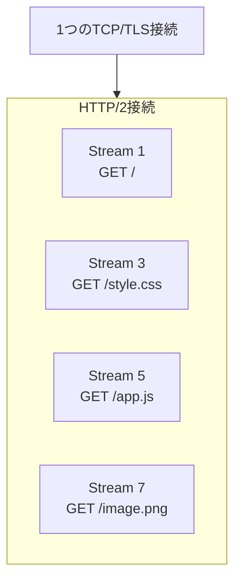

ここで重要なのは、ストリームごとにTCP接続を作っているわけではないことです。

```text
誤った理解
  Stream 1 = TCP接続1
  Stream 3 = TCP接続2

正しい理解
  1つのTCP接続
    ├── Stream 1
    ├── Stream 3
    ├── Stream 5
    └── Stream 7
```

---

## 2. 接続、ストリーム、メッセージ、フレーム

HTTP/2を理解するには、次の4つを区別する必要があります。

| 用語 | 役割 |
|---|---|
| 接続 | クライアントとサーバーの間に作られる通信経路 |
| ストリーム | 接続内に作られる、独立した双方向の通信単位 |
| HTTPメッセージ | リクエストまたはレスポンス |
| フレーム | HTTP/2接続上で送信する最小の通信単位 |

それぞれの関係は次のようになります。

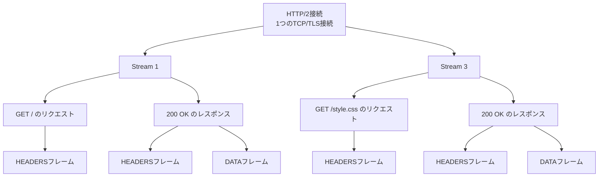

階層として表すと、次の順番です。

```text
接続
  └── ストリーム
      └── HTTPメッセージ
          └── フレーム
```

---

## 3. ストリームは双方向

1つのストリームでは、クライアントからのリクエストと、サーバーからのレスポンスを扱います。

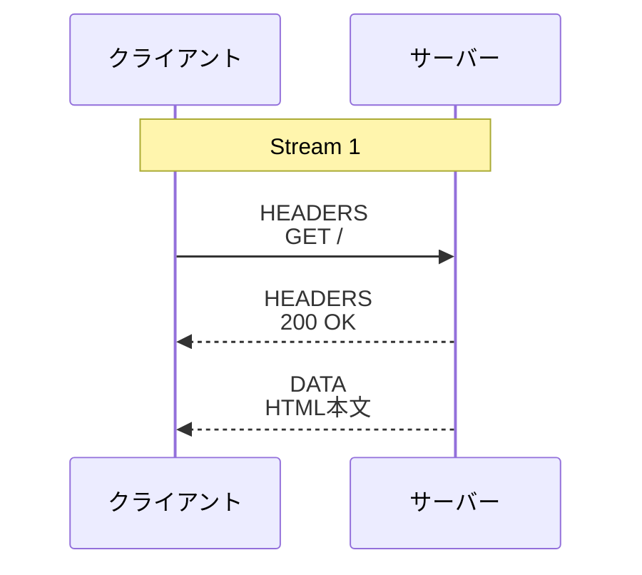

ストリームは、クライアントからサーバーへの一方向だけではありません。

```text
クライアント → サーバー
  リクエストHEADERS
  リクエストDATAがある場合はその本文

サーバー → クライアント
  レスポンスHEADERS
  レスポンスDATA
```

1つのHTTPリクエストと、それに対応するHTTPレスポンスは、同じストリームIDを使います。

---

## 4. HTTP/2フレーム

HTTP/2では、HTTPメッセージをそのままテキストとして送るのではなく、複数種類のフレームへ分けて送信します。

代表的なフレームは次のとおりです。

| フレーム | 主な役割 |
|---|---|
| `HEADERS` | メソッド、パス、ステータスコード、ヘッダーなどを送る |
| `DATA` | リクエストボディやレスポンスボディを送る |
| `SETTINGS` | HTTP/2接続の設定を伝える |
| `WINDOW_UPDATE` | フロー制御で送信可能量を増やす |
| `RST_STREAM` | 特定のストリームを中断する |
| `GOAWAY` | HTTP/2接続を終了することを通知する |

例えば、1つのレスポンスは次のように分割できます。

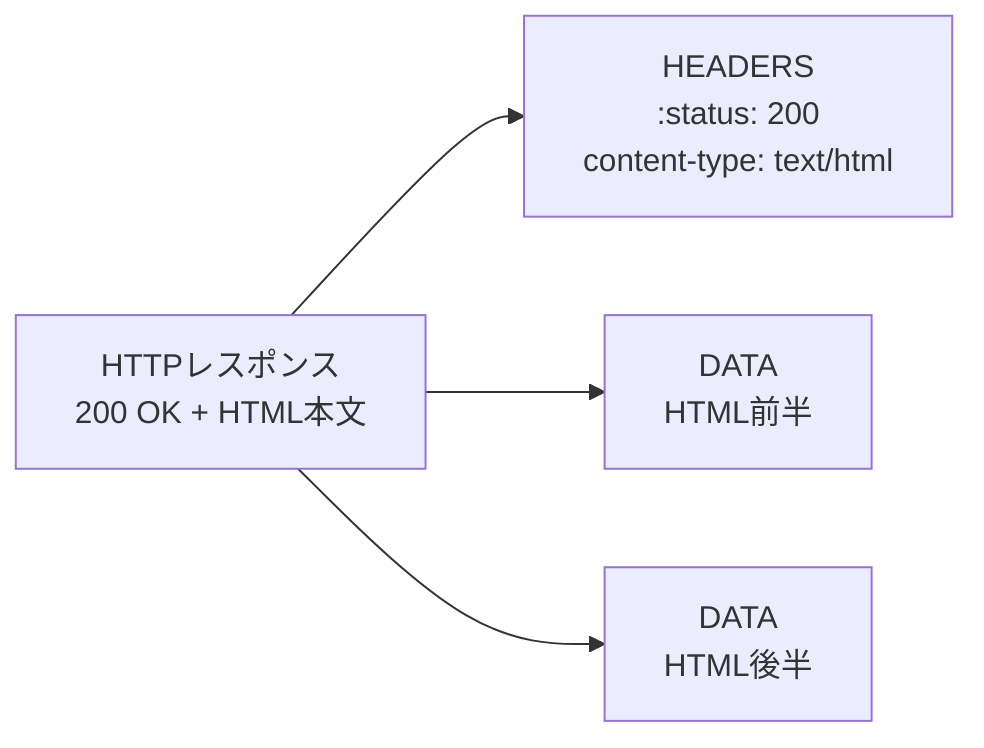

各ストリーム用のフレームにはストリームIDが付いています。

```text
HEADERS  Stream 1
DATA     Stream 1
HEADERS  Stream 3
DATA     Stream 3
```

受信側はストリームIDを見て、フレームがどのリクエスト・レスポンスに属するのかを判断します。

---

## 5. ストリームID

HTTP/2ストリームは整数のIDで識別されます。

今回のcurl出力では、ストリームIDは `1`です。

```text
* [HTTP/2] [1] OPENED stream for https://www.pokemon.co.jp/
             ^
             ストリームID
```

クライアントが開始するストリームには、奇数のIDが使われます。

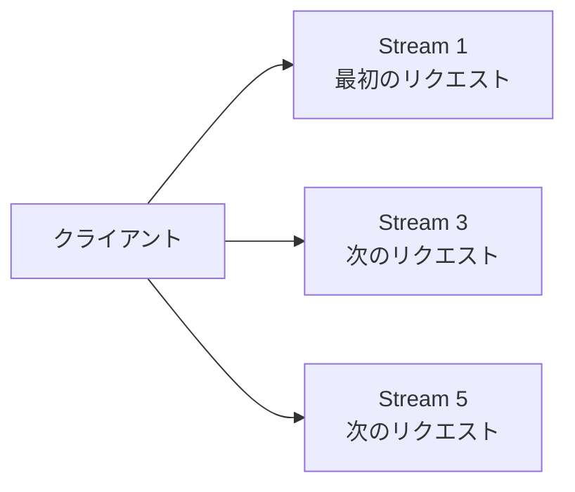

主な規則は次のとおりです。

- クライアント開始ストリームは奇数
- サーバーがServer Pushのために開始するストリームは偶数
- ストリームID `0`は接続全体の制御に使う
- 新しいストリームIDは、同じ側が以前に開始したIDより大きくなる
- 一度使ったストリームIDは再利用しない

今回の `[1]`は次のものではありません。

- TCPポート番号
- HTTPステータスコード
- スレッド番号
- リクエスト件数そのもの

---

## 6. ストリームの状態

ストリームにはライフサイクルがあります。

一般的なGETリクエストでは、概ね次のように変化します。

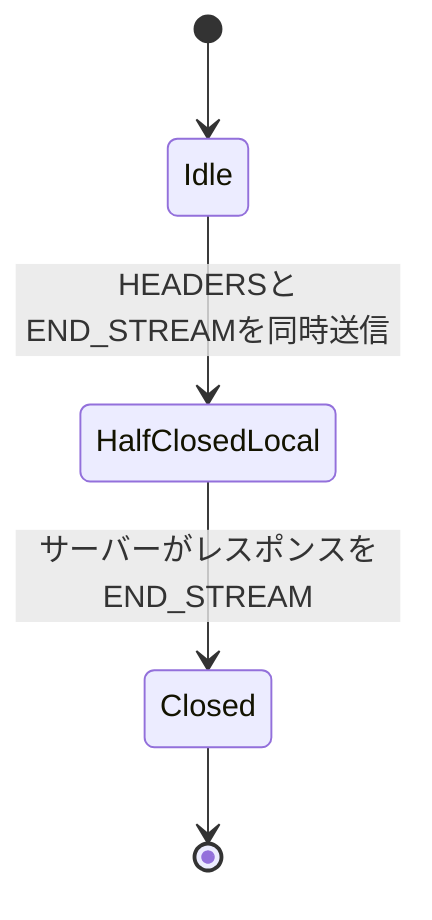

リクエストボディがある場合は、HEADERSで `open`になり、リクエストボディの最後で `half-closed (local)`へ移ります。

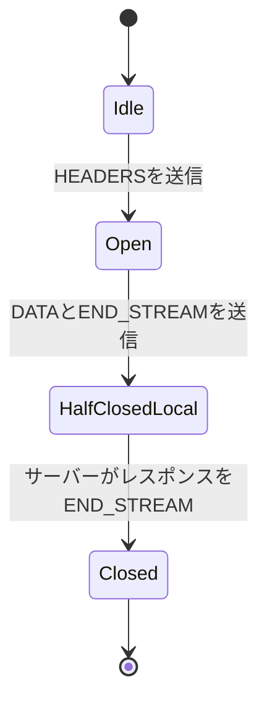

| 状態 | 意味 |
|---|---|
| `idle` | まだストリームが開かれていない |
| `open` | 双方がフレームを送信できる |
| `half-closed (local)` | 自分からの送信は完了し、相手から受信できる |
| `half-closed (remote)` | 相手からの送信は完了し、自分から送信できる |
| `closed` | ストリーム上の通信が完了した |

リクエストボディのないGETでは、クライアントはHEADERSを送ると同時に、リクエスト側の送信終了を示せます。

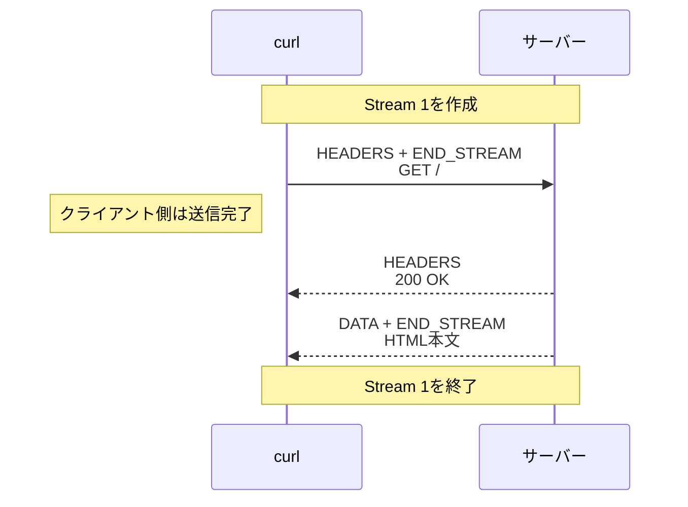

---

## 7. 今回のcurl出力とストリーム

```text
* [HTTP/2] [1] OPENED stream for https://www.pokemon.co.jp/
* [HTTP/2] [1] [:method: GET]
* [HTTP/2] [1] [:scheme: https]
* [HTTP/2] [1] [:authority: www.pokemon.co.jp]
* [HTTP/2] [1] [:path: /]
* [HTTP/2] [1] [user-agent: curl/8.7.1]
* [HTTP/2] [1] [accept: */*]
```

この出力は、次のHTTPリクエストをストリーム1で送る準備を表しています。

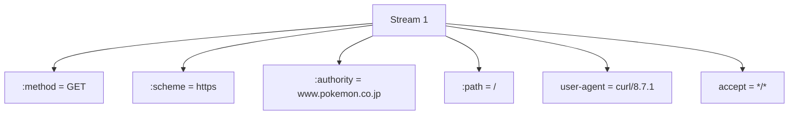

疑似ヘッダーと通常のヘッダーは、HEADERSフレームとしてストリーム1に関連付けられます。

```text
Stream 1
  └── HEADERS
      ├── :method: GET
      ├── :scheme: https
      ├── :authority: www.pokemon.co.jp
      ├── :path: /
      ├── user-agent: curl/8.7.1
      └── accept: */*
```

---

## 第2部：HTTP/1.1とHTTP/2の違い

## 8. HTTP/1.1の通信モデル

HTTP/1.1には、HTTP/2のように、1つの接続内でリクエストごとに識別される独立したプロトコル上のストリームはありません。

TCP自体は順序を持ったバイトストリームですが、これはHTTP/2のストリームとは別の概念です。

```text
HTTP/1.1
  1つのTCP接続を順序付きのHTTPメッセージとして使用する

HTTP/2
  1つのTCP接続内に複数のHTTP/2ストリームを作る
```

### 1つずつ処理する場合

HTTP/1.1の持続的接続を再利用して、リクエストとレスポンスを1つずつ処理すると、次のようになります。

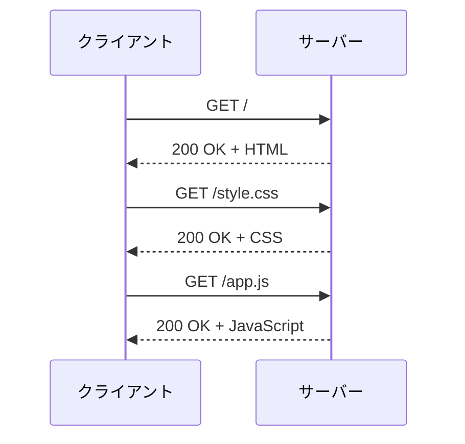

同じTCP接続を再利用できますが、前のレスポンスを待ってから次のリクエストを送ると、通信は直列になります。

---

## 9. HTTP/1.1のパイプライン処理

HTTP/1.1には、前のレスポンスを待たずに複数のリクエストを送るパイプライン処理があります。

ただし、同じ接続上のレスポンスは、リクエストを受信した順番で返す必要があります。

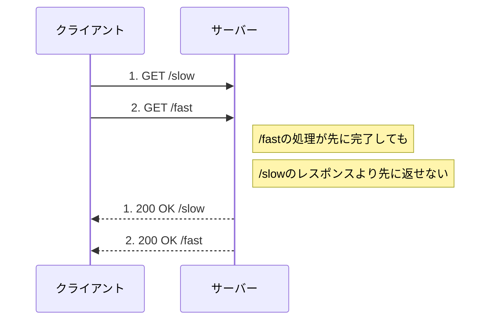

HTTP/1.1には、HTTP/2のストリームIDのように、レスポンスを任意の順番で返してリクエストへ対応付ける識別子がありません。

```text
送信順
  1. GET /slow
  2. GET /fast

レスポンス順
  1. /slowのレスポンス
  2. /fastのレスポンス
```

先頭の遅いレスポンスが後続を待たせる状態を、HTTPレベルのHead-of-Line Blockingとして説明できます。

HTTP/1.1のパイプライン処理には再試行などの扱いも複雑になるため、一般的なブラウザでは広く活用されませんでした。

---

## 10. HTTP/1.1で複数接続を使う

HTTP/1.1では、並行性を高めるために、同じホストへ複数のTCP接続を作る方法が使われます。

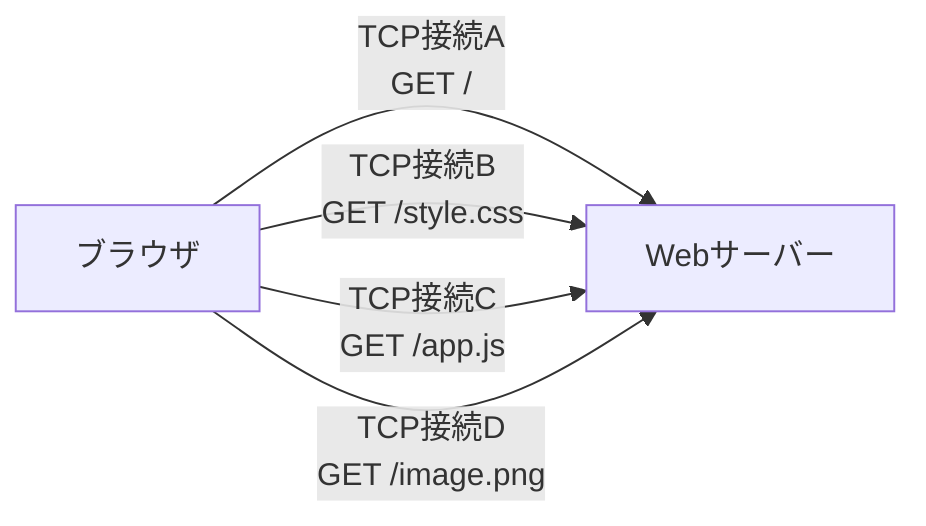

複数接続にすれば、ある接続の遅いレスポンスが、別の接続を直接待たせることはありません。

一方で、接続ごとに次のコストが発生します。

- TCP接続の確立
- HTTPSの場合はTLSハンドシェイク
- 接続状態の管理
- ソケットやメモリの使用
- ネットワーク混雑制御の状態

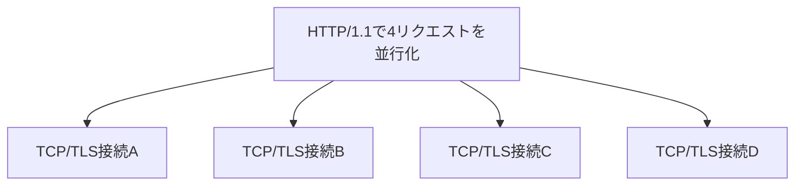

---

## 11. HTTP/2の多重化

HTTP/2では、1つの接続内に複数のストリームを作り、各ストリームのフレームを交互に送信できます。

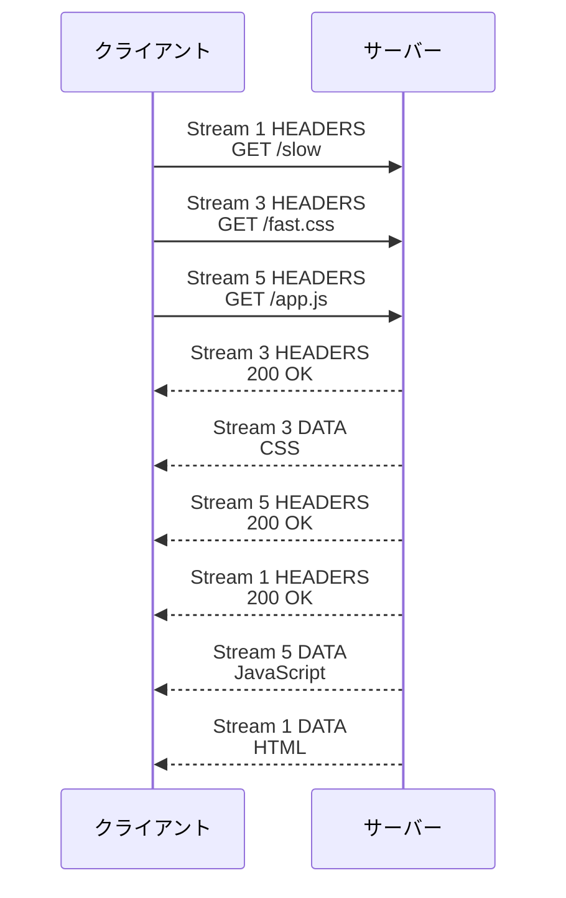

ストリームIDによって各フレームの所属先が分かるため、ストリーム3のレスポンスをストリーム1より先に返せます。

```text
Stream 1
  GET /slow

Stream 3
  GET /fast.css

Stream 5
  GET /app.js

完了順
  Stream 3
  Stream 5
  Stream 1
```

これを多重化、Multiplexingと呼びます。

---

## 12. フレームが交互に流れる仕組み

HTTP/2接続上では、複数ストリームのフレームを交互に配置できます。

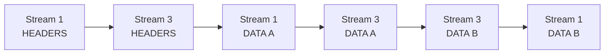

受信側はストリームIDごとにフレームを組み立て直します。

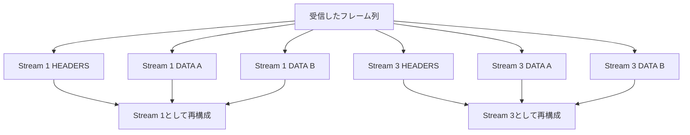

この仕組みにより、1つの大きなレスポンスだけで接続全体を使い続けず、ほかのストリームのデータも途中に挟めます。

---

## 13. ストリーム単位の中断

HTTP/2では、特定のストリームだけを `RST_STREAM`で中断できます。

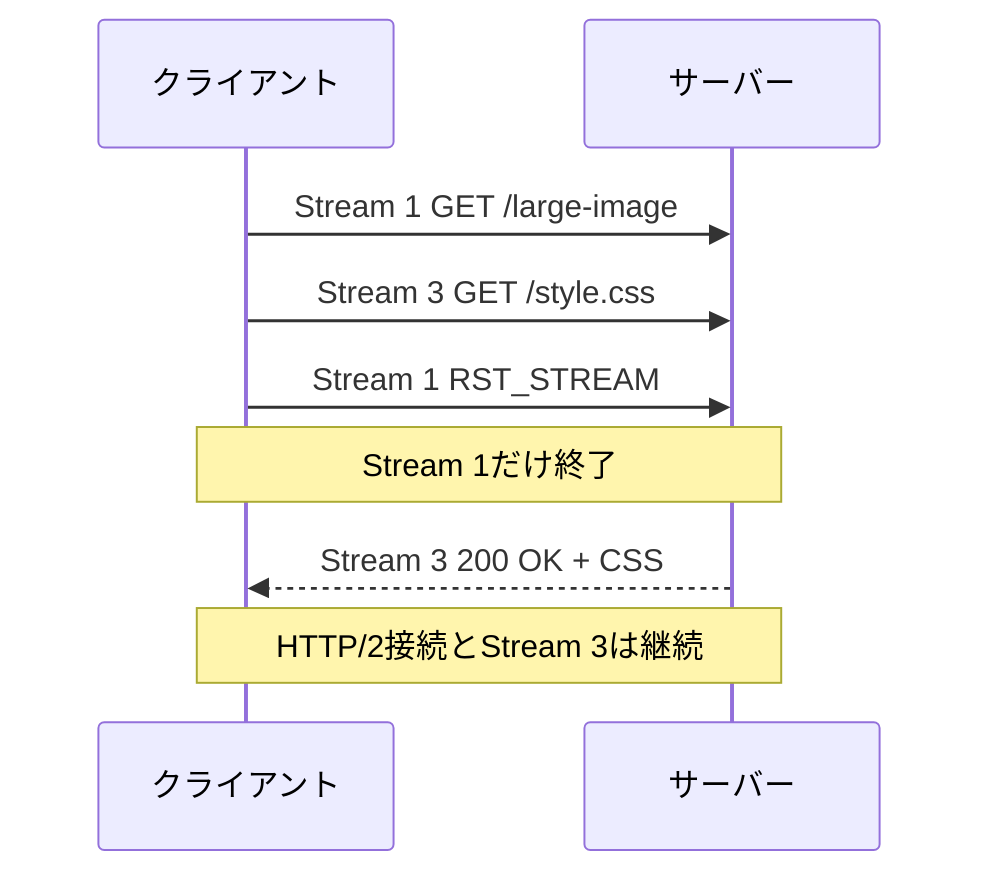

ストリーム単位のエラーであれば、HTTP/2接続全体を閉じずに済む場合があります。

ただし、接続全体に関わるプロトコルエラーでは、すべてのストリームに影響します。

---

## 14. HTTP/1.1とHTTP/2の構造比較

### HTTP/1.1

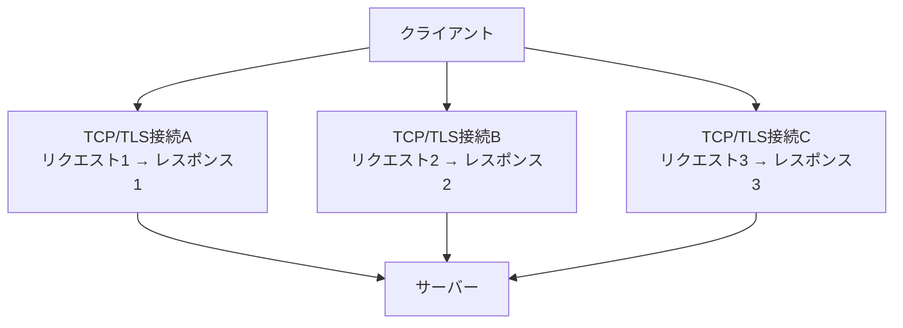

### HTTP/2

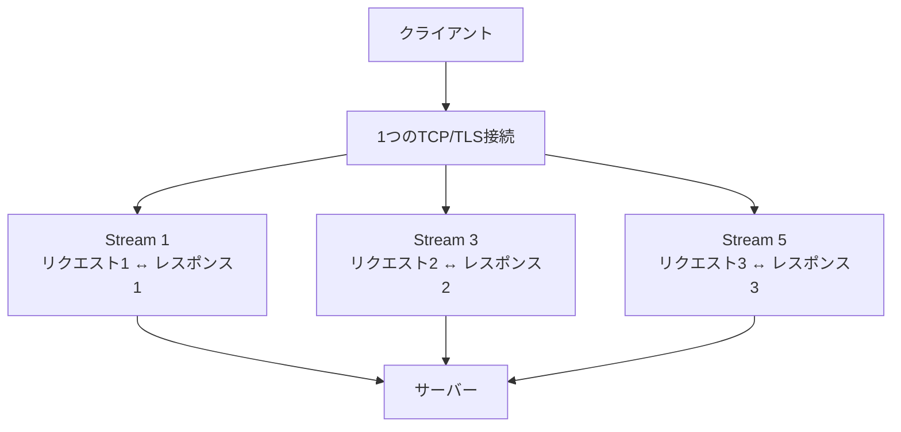

---

## 15. HTTP/1.1とHTTP/2の比較表

| 観点 | HTTP/1.1 | HTTP/2 |
|---|---|---|
| HTTPレベルの独立ストリーム | ない | ある |
| 1接続内の並行処理 | 制約が大きい | 複数ストリームを多重化できる |
| リクエストとの対応付け | 同一接続上の順序に依存 | ストリームIDで識別 |
| レスポンス順 | パイプラインではリクエスト順 | ストリームごとに独立 |
| 通信表現 | テキスト形式の開始行とヘッダー | バイナリフレーム |
| ヘッダー | 各リクエストでテキスト送信 | HPACKで圧縮 |
| 並行化の代表的手段 | 複数TCP接続 | 1接続内の複数ストリーム |
| 個別通信の中断 | 接続への影響が大きくなりやすい | `RST_STREAM`で個別に中断可能 |
| TCP接続数 | 複数になりやすい | 少数にまとめやすい |
| HTTPの意味 | メソッド、ステータスなど | メソッド、ステータスなどは同じ |

HTTP/2になっても、HTTPの意味そのものが別物になるわけではありません。

```text
変わらないもの
├── GET、POSTなどのメソッド
├── ステータスコード
├── ヘッダーの意味
├── リクエストボディ
└── レスポンスボディ

主に変わるもの
├── メッセージの表現方法
├── フレームへの分割
├── ストリームによる識別
└── 1接続内での多重化
```

---

## 16. Head-of-Line Blockingの違い

HTTP/2は、HTTP/1.1の同一接続上でレスポンス順に依存する問題を改善します。

ただし、HTTP/2はTCP上で動作するため、TCPレベルのHead-of-Line Blockingは残ります。

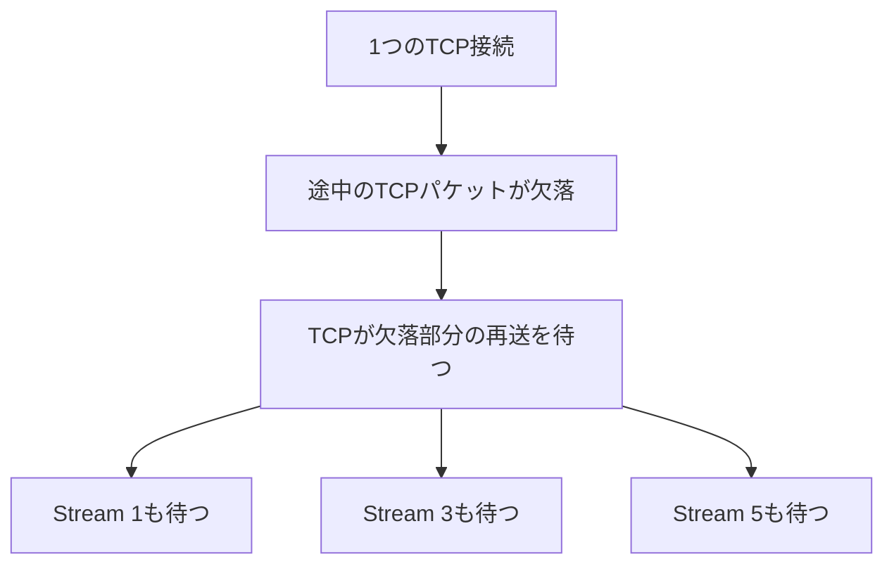

TCPは順序どおりのバイト列をHTTP/2へ渡すため、途中のデータが欠けると、その後ろに届いた別ストリームのデータもすぐにはHTTP/2へ渡せません。

```text
HTTP/2が改善するもの
  HTTPレベルでレスポンス順に縛られる問題

HTTP/2にも残るもの
  TCPパケット欠落による接続全体の待ち
```

HTTP/3はTCPではなくQUICを利用し、この点も改善することを目的の1つとしています。HTTP/3の詳細はこの文書の対象外です。

---

## 17. curlで比較する

HTTP/1.1を明示する場合は、次のように実行できます。

```bash
curl -v --http1.1 -o /dev/null https://www.pokemon.co.jp/
```

HTTP/2を使用する場合は、次のように実行できます。

```bash
curl -v --http2 -o /dev/null https://www.pokemon.co.jp/
```

HTTP/2がALPNで選択された場合は、次のような表示を確認できます。

```text
* ALPN: server accepted h2
* using HTTP/2
* [HTTP/2] [1] OPENED stream for ...
```

比較するときは、次に注目します。

- ALPNでどのHTTPバージョンが選択されたか
- HTTP/1.1ではリクエストラインがどのように表示されるか
- HTTP/2では疑似ヘッダーがどのように表示されるか
- HTTP/2ではストリームIDが表示されるか

1回のcurlコマンドで1件だけリクエストする場合、HTTP/2の多重化そのものは観察しにくい点に注意します。多重化は、同じ接続上で複数リクエストが同時進行するときに現れる仕組みです。

---

## 18. 今回の出力を一文で説明する

```text
* [HTTP/2] [1] OPENED stream for https://www.pokemon.co.jp/
```

この行は、次のように説明できます。

> curlは、確立済みの1つのHTTP/2接続内に、GETリクエストとそのレスポンスを扱うためのストリームを作成した。このリクエストはクライアントが最初に開始したため、ストリームIDは1になっている。

---

## 19. 要点

```mermaid
flowchart TB
    Start["ストリームとは何か"]
    Start --> Definition["HTTP/2接続内の<br/>独立した双方向のフレームの流れ"]

    Definition --> H1["HTTP/1.1"]
    Definition --> H2["HTTP/2"]

    H1 --> H1A["HTTP/2型のストリームIDはない"]
    H1 --> H1B["同一接続では順序の制約がある"]
    H1 --> H1C["並行化には複数接続を使いやすい"]

    H2 --> H2A["1接続に複数ストリーム"]
    H2 --> H2B["フレームを交互に送信"]
    H2 --> H2C["ストリームIDで再構成"]
```

- HTTP/2ストリームは、1つのHTTP/2接続内にある独立した双方向のフレームの流れ
- 1つのリクエストとレスポンスが、1つのストリームを使用する
- HTTP/2ではストリームIDによって複数の通信を識別する
- 複数ストリームのフレームは、1つの接続上で交互に送信できる
- HTTP/1.1には、HTTP/2と同じプロトコルレベルのストリームはない
- HTTP/1.1のパイプラインでは、レスポンスの順番を入れ替えられない
- HTTP/1.1では、並行化のために複数のTCP接続を使うことが多い
- HTTP/2はHTTPレベルの待ちを改善するが、TCPレベルの待ちは残る

---

## 20. 関連ドキュメント

- [`curl -v`で観察するHTTPレスポンス](http-response-structure-and-headers.md)
- [`curl -v`で観察するTLS 1.3ハンドシェイク](tls-1.3-handshake-flow.md)
- [TLS証明書と認証局による信頼](tls-certificates-and-ca-trust.md)

---

## 21. 参考資料

- [RFC 9112：HTTP/1.1](https://www.rfc-editor.org/rfc/rfc9112.html)
- [RFC 9113：HTTP/2](https://www.rfc-editor.org/rfc/rfc9113.html)
- [RFC 9114：HTTP/3](https://www.rfc-editor.org/rfc/rfc9114.html)
