# HTTP/1.1とHTTP/2のストリーム

## この文書の目的

この文書では、`curl -v`で表示された次の行を出発点として、HTTP/2のストリームを説明します。

```text
* [HTTP/2] [1] OPENED stream for https://www.pokemon.co.jp/
```

最初に「ストリームとは何か」を整理し、その後にHTTP/1.1とHTTP/2の通信方法を比較します。

主な疑問は次のとおりです。

- HTTP/2のストリームとは何か
- TCP接続とHTTP/2ストリームは何が違うのか
- ストリームIDの`1`は何を示すのか
- フレームとストリームは何が違うのか
- HTTP/1.1にもストリームはあるのか
- HTTP/1.1とHTTP/2では複数リクエストの扱いがどう違うのか
- HTTP/2では、なぜ1つの接続で複数リクエストを並行処理できるのか
- ストリームはAPI、HTTPメソッド、リクエストのどれを単位に作られるのか
- 独立したHTTPリクエストに、ストリームを設けるメリットは何か
- 複数ストリームによって速度やパフォーマンスは向上するのか
- ストリームがブラウザのメモリを使い、不要なままたまることはないのか
- 複数のタブやブラウザからアクセスした場合、TCP接続は共有されるのか
- 複数ブラウザからのアクセスでもHTTP/2は有利なのか
- 1つのブラウザで1ページを開いた場合、HTTPリクエストは1件だけなのか
- 本当にリクエストが1件だけなら、複数ストリームの恩恵はあるのか
- 1回の操作から複数のHTTPリクエストが発生するのはなぜか

---

## 第1部：ストリームとは何か

## 1. HTTP/2のストリーム

HTTP/2のストリームは、次のように定義できます。

> 1つのHTTP/2接続の中で、特定のリクエストとレスポンスに使われる、独立した双方向のフレームの流れ。

1つのHTTP/2接続には、複数のストリームを同時に作成できます。

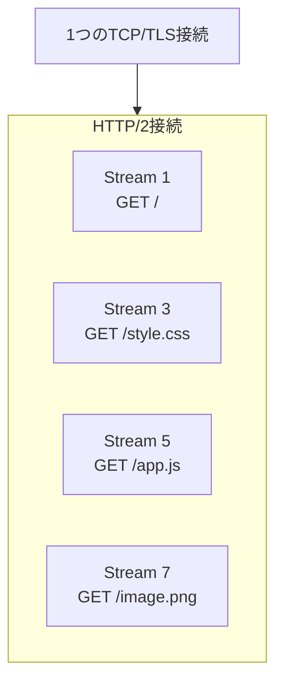

ここで重要なのは、ストリームごとにTCP接続を作っているわけではないことです。

```text
誤った理解
  Stream 1 = TCP接続1
  Stream 3 = TCP接続2

正しい理解
  1つのTCP接続
    ├── Stream 1
    ├── Stream 3
    ├── Stream 5
    └── Stream 7
```

---

## 2. 接続、ストリーム、メッセージ、フレーム

HTTP/2を理解するには、次の4つを区別する必要があります。

| 用語 | 役割 |
|---|---|
| 接続 | クライアントとサーバーの間に作られる通信経路 |
| ストリーム | 接続内に作られる、独立した双方向の通信単位 |
| HTTPメッセージ | リクエストまたはレスポンス |
| フレーム | HTTP/2接続上で送信する最小の通信単位 |

それぞれの関係は次のようになります。

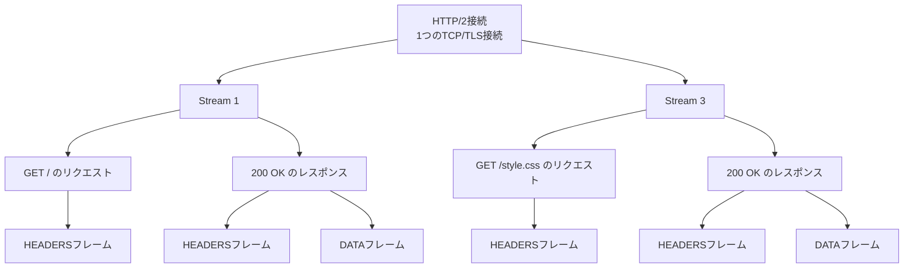

階層として表すと、次の順番です。

```text
接続
  └── ストリーム
      └── HTTPメッセージ
          └── フレーム
```

---

## 3. ストリームは双方向

1つのストリームでは、クライアントからのリクエストと、サーバーからのレスポンスを扱います。

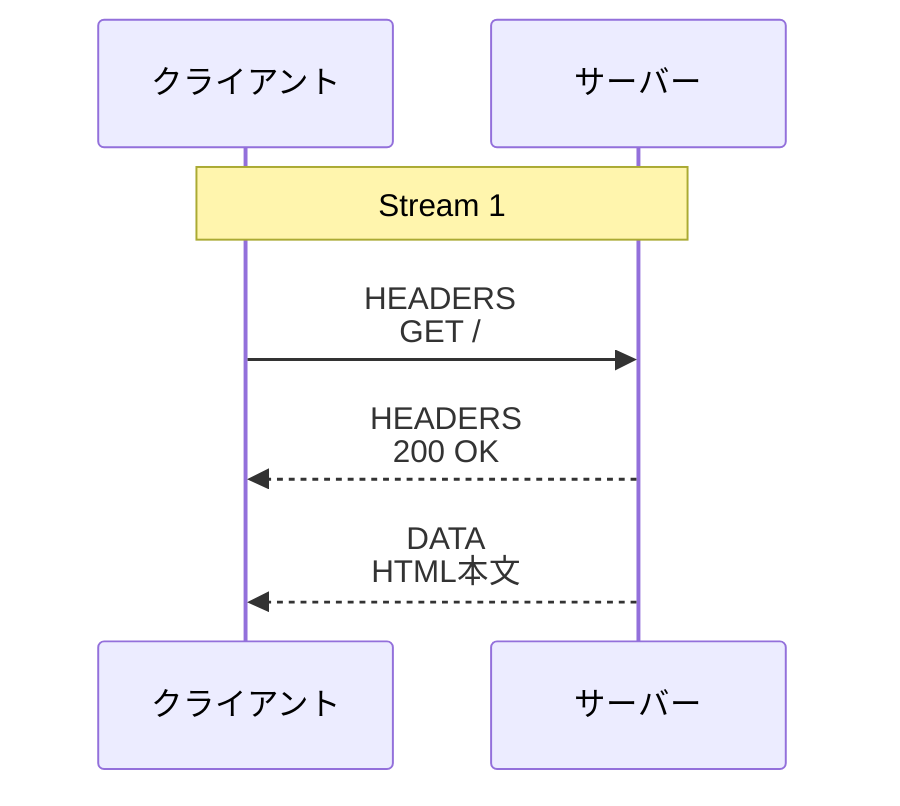

ストリームは、クライアントからサーバーへの一方向だけではありません。

```text
クライアント → サーバー
  リクエストHEADERS
  リクエストDATAがある場合はその本文

サーバー → クライアント
  レスポンスHEADERS
  レスポンスDATA
```

1つのHTTPリクエストと、それに対応するHTTPレスポンスは、同じストリームIDを使います。

---

## 4. HTTP/2フレーム

HTTP/2では、HTTPメッセージをそのままテキストとして送るのではなく、複数種類のフレームへ分けて送信します。

代表的なフレームは次のとおりです。

| フレーム | 主な役割 |
|---|---|
| `HEADERS` | メソッド、パス、ステータスコード、ヘッダーなどを送る |
| `DATA` | リクエストボディやレスポンスボディを送る |
| `SETTINGS` | HTTP/2接続の設定を伝える |
| `WINDOW_UPDATE` | フロー制御で送信可能量を増やす |
| `RST_STREAM` | 特定のストリームを中断する |
| `GOAWAY` | HTTP/2接続を終了することを通知する |

例えば、1つのレスポンスは次のように分割できます。

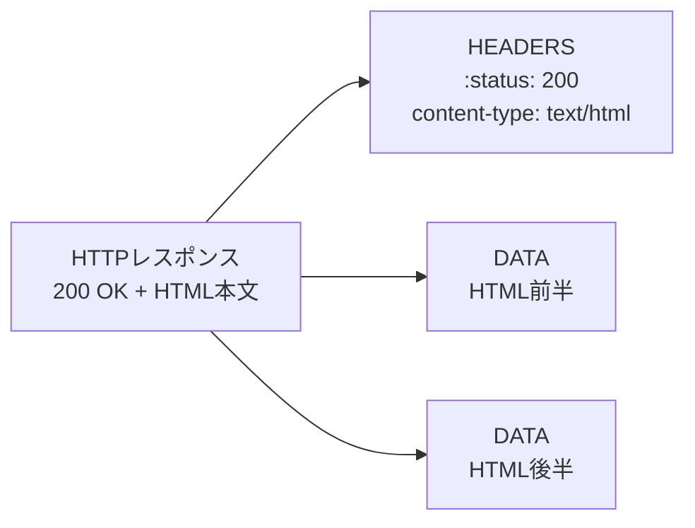

各ストリーム用のフレームにはストリームIDが付いています。

```text
HEADERS  Stream 1
DATA     Stream 1
HEADERS  Stream 3
DATA     Stream 3
```

受信側はストリームIDを見て、フレームがどのリクエスト・レスポンスに属するのかを判断します。

---

## 5. ストリームID

HTTP/2ストリームは整数のIDで識別されます。

今回のcurl出力では、ストリームIDは `1`です。

```text
* [HTTP/2] [1] OPENED stream for https://www.pokemon.co.jp/
             ^
             ストリームID
```

クライアントが開始するストリームには、奇数のIDが使われます。

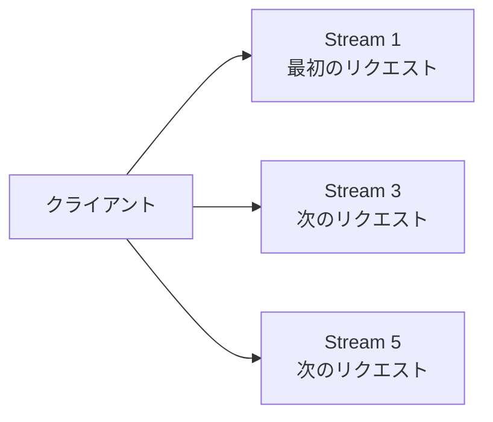

主な規則は次のとおりです。

- クライアント開始ストリームは奇数
- サーバーがServer Pushのために開始するストリームは偶数
- ストリームID `0`は接続全体の制御に使う
- 新しいストリームIDは、同じ側が以前に開始したIDより大きくなる
- 一度使ったストリームIDは再利用しない

今回の `[1]`は次のものではありません。

- TCPポート番号
- HTTPステータスコード
- スレッド番号
- リクエスト件数そのもの

---

## 6. ストリームの状態

ストリームにはライフサイクルがあります。

一般的なGETリクエストでは、概ね次のように変化します。

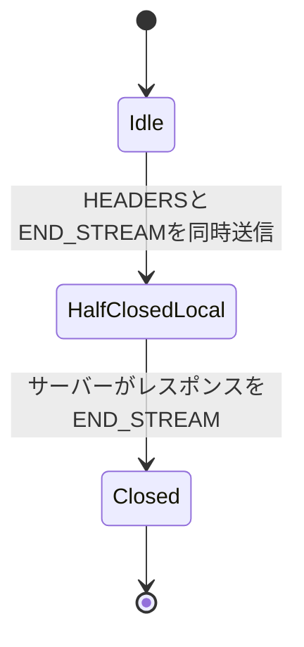

リクエストボディがある場合は、HEADERSで `open`になり、リクエストボディの最後で `half-closed (local)`へ移ります。

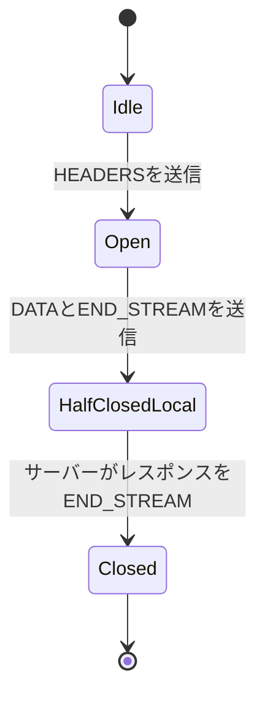

| 状態 | 意味 |
|---|---|
| `idle` | まだストリームが開かれていない |
| `open` | 双方がフレームを送信できる |
| `half-closed (local)` | 自分からの送信は完了し、相手から受信できる |
| `half-closed (remote)` | 相手からの送信は完了し、自分から送信できる |
| `closed` | ストリーム上の通信が完了した |

リクエストボディのないGETでは、クライアントはHEADERSを送ると同時に、リクエスト側の送信終了を示せます。

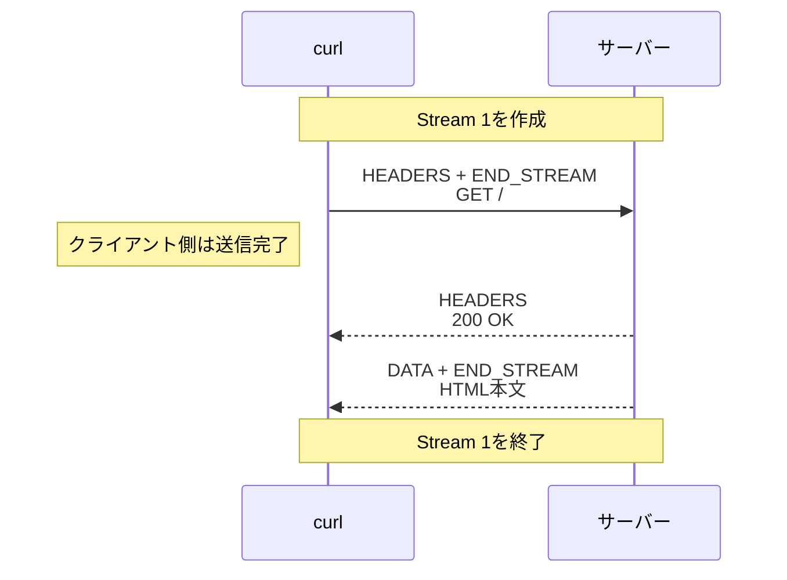

---

## 7. 今回のcurl出力とストリーム

```text
* [HTTP/2] [1] OPENED stream for https://www.pokemon.co.jp/
* [HTTP/2] [1] [:method: GET]
* [HTTP/2] [1] [:scheme: https]
* [HTTP/2] [1] [:authority: www.pokemon.co.jp]
* [HTTP/2] [1] [:path: /]
* [HTTP/2] [1] [user-agent: curl/8.7.1]
* [HTTP/2] [1] [accept: */*]
```

この出力は、次のHTTPリクエストをストリーム1で送る準備を表しています。

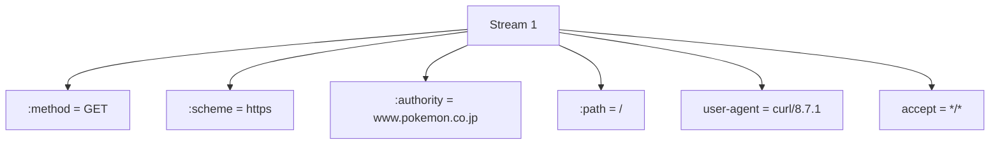

疑似ヘッダーと通常のヘッダーは、HEADERSフレームとしてストリーム1に関連付けられます。

```text
Stream 1
  └── HEADERS
      ├── :method: GET
      ├── :scheme: https
      ├── :authority: www.pokemon.co.jp
      ├── :path: /
      ├── user-agent: curl/8.7.1
      └── accept: */*
```

---

## 第2部：HTTP/1.1とHTTP/2の違い

## 8. HTTP/1.1の通信モデル

HTTP/1.1には、HTTP/2のように、1つの接続内でリクエストごとに識別される独立したプロトコル上のストリームはありません。

TCP自体は順序を持ったバイトストリームですが、これはHTTP/2のストリームとは別の概念です。

```text
HTTP/1.1
  1つのTCP接続を順序付きのHTTPメッセージとして使用する

HTTP/2
  1つのTCP接続内に複数のHTTP/2ストリームを作る
```

### 1つずつ処理する場合

HTTP/1.1の持続的接続を再利用して、リクエストとレスポンスを1つずつ処理すると、次のようになります。

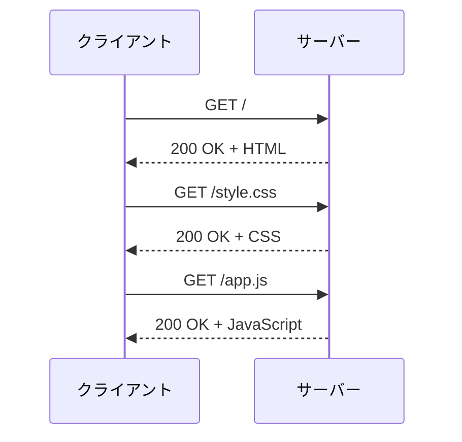

同じTCP接続を再利用できますが、前のレスポンスを待ってから次のリクエストを送ると、通信は直列になります。

---

## 9. HTTP/1.1のパイプライン処理

HTTP/1.1には、前のレスポンスを待たずに複数のリクエストを送るパイプライン処理があります。

ただし、同じ接続上のレスポンスは、リクエストを受信した順番で返す必要があります。

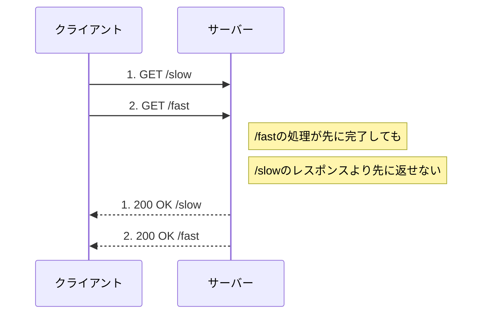

HTTP/1.1には、HTTP/2のストリームIDのように、レスポンスを任意の順番で返してリクエストへ対応付ける識別子がありません。

```text
送信順
  1. GET /slow
  2. GET /fast

レスポンス順
  1. /slowのレスポンス
  2. /fastのレスポンス
```

先頭の遅いレスポンスが後続を待たせる状態を、HTTPレベルのHead-of-Line Blockingとして説明できます。

HTTP/1.1のパイプライン処理には再試行などの扱いも複雑になるため、一般的なブラウザでは広く活用されませんでした。

---

## 10. HTTP/1.1で複数接続を使う

HTTP/1.1では、並行性を高めるために、同じホストへ複数のTCP接続を作る方法が使われます。

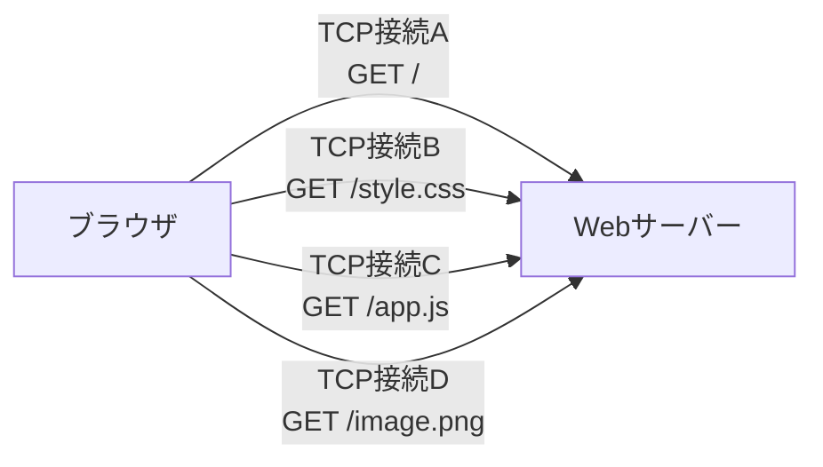

複数接続にすれば、ある接続の遅いレスポンスが、別の接続を直接待たせることはありません。

一方で、接続ごとに次のコストが発生します。

- TCP接続の確立
- HTTPSの場合はTLSハンドシェイク
- 接続状態の管理
- ソケットやメモリの使用
- ネットワーク混雑制御の状態

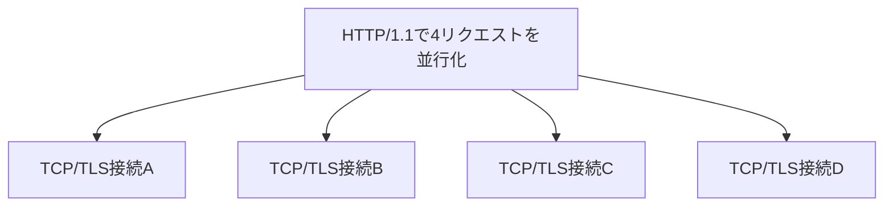

---

## 11. HTTP/2の多重化

HTTP/2では、1つの接続内に複数のストリームを作り、各ストリームのフレームを交互に送信できます。

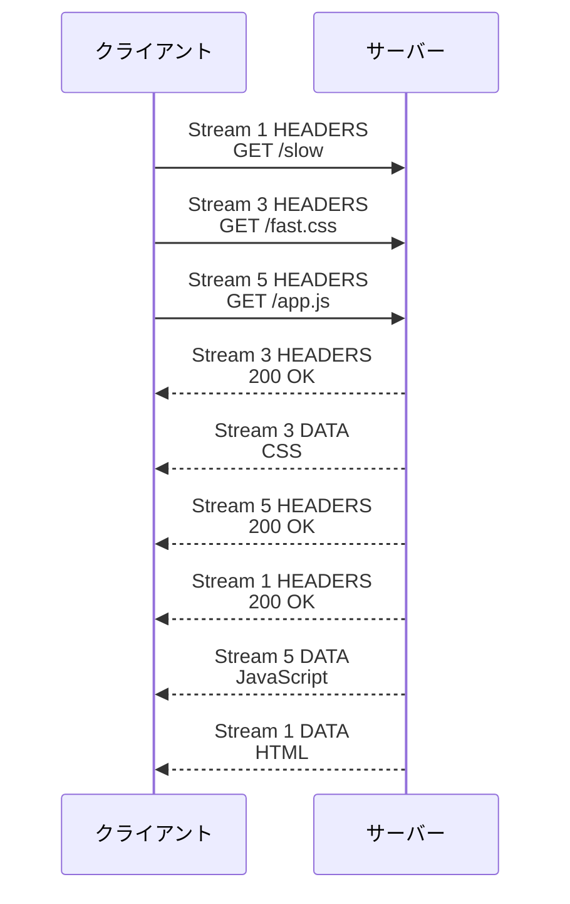

ストリームIDによって各フレームの所属先が分かるため、ストリーム3のレスポンスをストリーム1より先に返せます。

```text
Stream 1
  GET /slow

Stream 3
  GET /fast.css

Stream 5
  GET /app.js

完了順
  Stream 3
  Stream 5
  Stream 1
```

これを多重化、Multiplexingと呼びます。

---

## 12. フレームが交互に流れる仕組み

HTTP/2接続上では、複数ストリームのフレームを交互に配置できます。

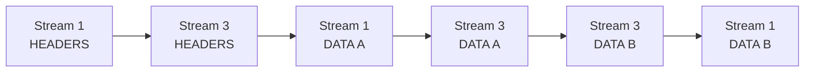

受信側はストリームIDごとにフレームを組み立て直します。

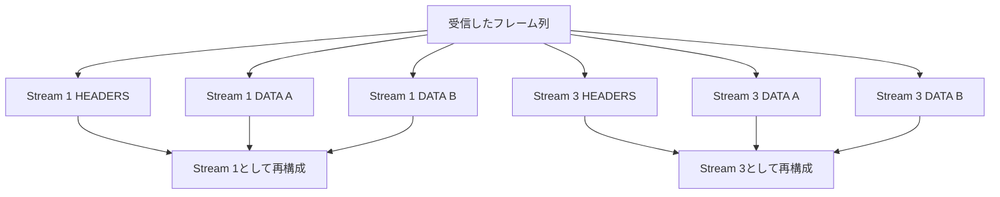

この仕組みにより、1つの大きなレスポンスだけで接続全体を使い続けず、ほかのストリームのデータも途中に挟めます。

---

## 13. ストリーム単位の中断

HTTP/2では、特定のストリームだけを `RST_STREAM`で中断できます。

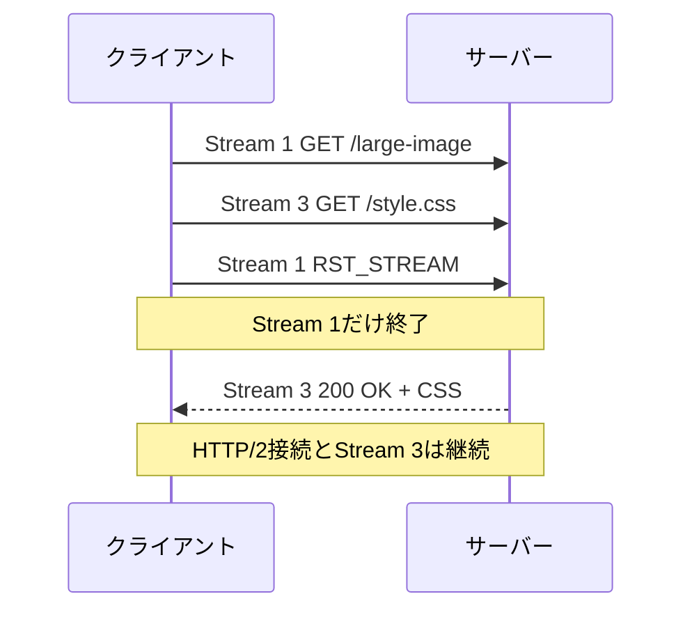

ストリーム単位のエラーであれば、HTTP/2接続全体を閉じずに済む場合があります。

ただし、接続全体に関わるプロトコルエラーでは、すべてのストリームに影響します。

---

## 14. HTTP/1.1とHTTP/2の構造比較

### HTTP/1.1

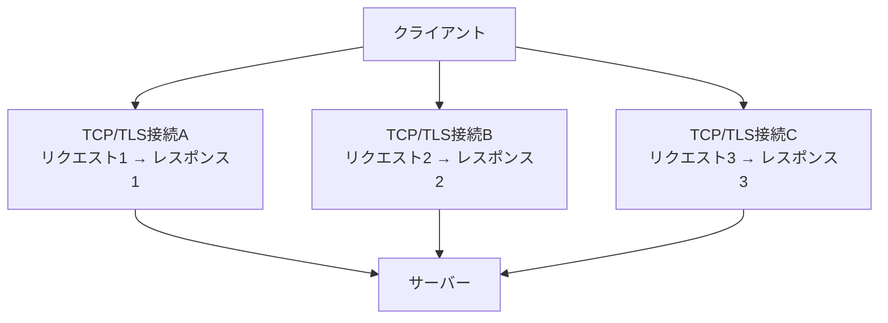

### HTTP/2

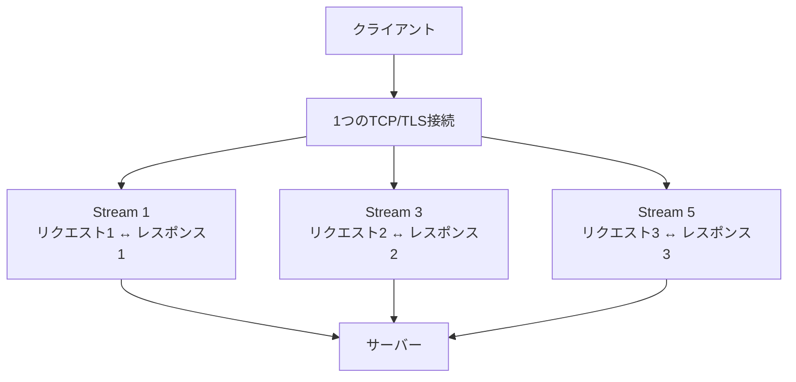

---

## 15. HTTP/1.1とHTTP/2の比較表

| 観点 | HTTP/1.1 | HTTP/2 |
|---|---|---|
| HTTPレベルの独立ストリーム | ない | ある |
| 1接続内の並行処理 | 制約が大きい | 複数ストリームを多重化できる |
| リクエストとの対応付け | 同一接続上の順序に依存 | ストリームIDで識別 |
| レスポンス順 | パイプラインではリクエスト順 | ストリームごとに独立 |
| 通信表現 | テキスト形式の開始行とヘッダー | バイナリフレーム |
| ヘッダー | 各リクエストでテキスト送信 | HPACKで圧縮 |
| 並行化の代表的手段 | 複数TCP接続 | 1接続内の複数ストリーム |
| 個別通信の中断 | 接続への影響が大きくなりやすい | `RST_STREAM`で個別に中断可能 |
| TCP接続数 | 複数になりやすい | 少数にまとめやすい |
| HTTPの意味 | メソッド、ステータスなど | メソッド、ステータスなどは同じ |

HTTP/2になっても、HTTPの意味そのものが別物になるわけではありません。

```text
変わらないもの
├── GET、POSTなどのメソッド
├── ステータスコード
├── ヘッダーの意味
├── リクエストボディ
└── レスポンスボディ

主に変わるもの
├── メッセージの表現方法
├── フレームへの分割
├── ストリームによる識別
└── 1接続内での多重化
```

---

## 16. Head-of-Line Blockingの違い

HTTP/2は、HTTP/1.1の同一接続上でレスポンス順に依存する問題を改善します。

ただし、HTTP/2はTCP上で動作するため、TCPレベルのHead-of-Line Blockingは残ります。

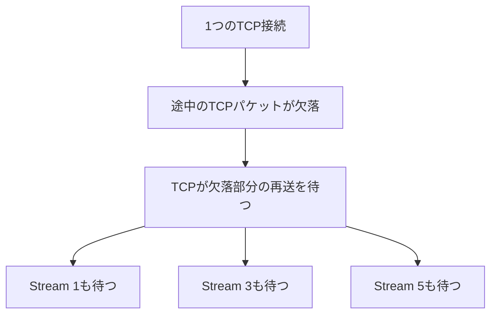

TCPは順序どおりのバイト列をHTTP/2へ渡すため、途中のデータが欠けると、その後ろに届いた別ストリームのデータもすぐにはHTTP/2へ渡せません。

```text
HTTP/2が改善するもの
  HTTPレベルでレスポンス順に縛られる問題

HTTP/2にも残るもの
  TCPパケット欠落による接続全体の待ち
```

HTTP/3はTCPではなくQUICを利用し、この点も改善することを目的の1つとしています。HTTP/3の詳細はこの文書の対象外です。

---

## 第3部：ストリームの単位、メリット、資源管理

## 17. ストリームは何を単位に作られるのか

HTTP/2ストリームは、基本的に1回のHTTPリクエストと、それに対応する1回のHTTPレスポンスを単位に作られます。

```text
1回のHTTPリクエスト
    ＋
対応するHTTPレスポンス
    ＝
1つのHTTP/2ストリーム
```

```mermaid
flowchart TB
    Connection["1つのHTTP/2接続"]

    Connection --> S1["Stream 1<br/>GET /users<br/>＋レスポンス"]
    Connection --> S3["Stream 3<br/>POST /orders<br/>＋レスポンス"]
    Connection --> S5["Stream 5<br/>GET /products<br/>＋レスポンス"]
```

APIの種類、URLパス、HTTPメソッドごとにストリームが固定されるわけではありません。

| 候補 | ストリームを分ける単位か |
|---|---:|
| APIの種類 | いいえ |
| URLパス | いいえ |
| `GET`や`POST`などのHTTPメソッド | いいえ |
| ファイルの種類 | いいえ |
| 1回のHTTPリクエストとレスポンス | 基本的には、はい |

### 同じAPIを複数回呼び出した場合

同じAPIを同じメソッドで複数回呼び出しても、呼び出しごとに新しいストリームを使用します。

```mermaid
flowchart LR
    Client["クライアント"]

    Client --> S1["Stream 1<br/>1回目のGET /users/1"]
    Client --> S3["Stream 3<br/>2回目のGET /users/1"]
    Client --> S5["Stream 5<br/>3回目のGET /users/1"]
```

```text
誤った理解
  GET /users/1というAPIは、常にStream 1を使う

正しい理解
  1回目のGET /users/1 → Stream 1
  2回目のGET /users/1 → Stream 3
  3回目のGET /users/1 → Stream 5
```

### 同じHTTPメソッドを使う場合

すべて`GET`であっても、別々のリクエストなら別々のストリームです。

```mermaid
flowchart TB
    Connection["1つのHTTP/2接続"]

    Connection --> HTML["Stream 1<br/>GET /index.html"]
    Connection --> CSS["Stream 3<br/>GET /style.css"]
    Connection --> JS["Stream 5<br/>GET /app.js"]
    Connection --> IMG["Stream 7<br/>GET /image.png"]
```

`GET`専用ストリームや`POST`専用ストリームがあるわけではありません。

### ストリームは使い回さない

1つのリクエストとレスポンスが完了した後、そのストリームを別のリクエストに使い回すことはありません。

```text
Stream 1: GET /users    → 完了・クローズ
Stream 3: GET /products → 新しく作成
```

ストリームIDも再利用されません。

### gRPCなどの補足

通常のHTTP APIでは、1ストリームが1回のリクエストとレスポンスに対応します。

gRPCストリーミングなどでは、1つのHTTP/2ストリームのDATAフレーム内で、複数のアプリケーションメッセージを送受信する場合があります。

```mermaid
sequenceDiagram
    participant C as gRPCクライアント
    participant S as gRPCサーバー

    Note over C,S: 1つのHTTP/2ストリーム
    C->>S: gRPCメッセージ1
    C->>S: gRPCメッセージ2
    S-->>C: gRPCメッセージ1
    S-->>C: gRPCメッセージ2
```

アプリケーションメッセージが複数あっても、HTTPの観点では1回のリクエストとレスポンスです。

---

## 18. 独立したリクエストにストリームが必要な理由

HTTPリクエストは、意味の上ではそれぞれ独立しています。

```text
GET /index.html
GET /style.css
GET /app.js
```

しかし、これらを1本のTCP接続で同時に運ぶには、受信側が次のことを判断できなければなりません。

- どのデータがどのリクエストに属するのか
- どのレスポンスがどのリクエストへの回答なのか
- どのリクエストまたはレスポンスが完了したのか
- どの通信をキャンセルしたのか

TCPが提供するのは、順序を持った1本のバイト列です。TCP自体は、その中のデータがどのHTTPリクエストに属するかを管理しません。

```mermaid
flowchart LR
    TCP["TCPが運ぶ<br/>順序付きバイト列"]
    Question["どのリクエストの<br/>データか区別が必要"]
    Stream["HTTP/2の<br/>ストリームID"]

    TCP --> Question --> Stream
```

HTTP/2は、各フレームにストリームIDを付けます。

```text
HEADERS  Stream 1
HEADERS  Stream 3
DATA     Stream 3
DATA     Stream 1
HEADERS  Stream 5
DATA     Stream 5
```

フレームが交互に届いても、受信側はストリームIDごとに再構成できます。

```mermaid
flowchart TB
    Input["1本の接続で受信したフレーム"]

    Input --> F1["HEADERS<br/>Stream 1"]
    Input --> F3["HEADERS<br/>Stream 3"]
    Input --> D3["DATA<br/>Stream 3"]
    Input --> D1["DATA<br/>Stream 1"]

    F1 --> S1["Stream 1<br/>GET /index.html"]
    D1 --> S1

    F3 --> S3["Stream 3<br/>GET /style.css"]
    D3 --> S3
```

つまり、ストリームは次のために存在します。

> 独立した複数のHTTP通信を、独立性を保ったまま、1本のTCP接続上で混ぜて運ぶ。

---

## 19. ストリームによる多重化のメリット

### 19.1 複数リクエストを同時進行できる

HTTP/2では、大きなレスポンスの途中に、別のストリームのフレームを挟めます。

```mermaid
sequenceDiagram
    participant C as クライアント
    participant S as サーバー

    C->>S: Stream 1<br/>GET /large-image
    C->>S: Stream 3<br/>GET /style.css
    C->>S: Stream 5<br/>GET /app.js

    S-->>C: Stream 1<br/>画像の一部
    S-->>C: Stream 3<br/>CSS全部
    S-->>C: Stream 1<br/>画像の続き
    S-->>C: Stream 5<br/>JavaScript全部
    S-->>C: Stream 1<br/>画像の残り
```

大きな画像の完了を待たずに、小さなCSSやJavaScriptを先に完了させられます。

```text
HTTP/1.1の1接続で順番に処理

HTML ──────────→ 完了
                 CSS ─────→ 完了
                            JavaScript ─────→ 完了
```

```text
HTTP/2の1接続で多重化

HTML       ─────────────────→
CSS          ─────→
JavaScript     ───────→
画像         ───────────────────→
```

### 19.2 TCP/TLS接続を少数にまとめやすい

HTTP/1.1では、並行性を得るために複数のTCP接続を使うことがあります。HTTP/2では、複数ストリームが1つのTCP/TLS接続を共有できます。

```mermaid
flowchart TB
    subgraph H1["HTTP/1.1で並行化"]
        H1C1["TCP/TLS接続A"]
        H1C2["TCP/TLS接続B"]
        H1C3["TCP/TLS接続C"]
    end

    subgraph H2["HTTP/2で多重化"]
        H2C["1つのTCP/TLS接続"]
        H2C --> S1["Stream 1"]
        H2C --> S3["Stream 3"]
        H2C --> S5["Stream 5"]
    end
```

TCP/TLS接続を少数にまとめると、次のコストを抑えやすくなります。

- TCP接続の確立
- TLSハンドシェイク
- ソケットや暗号化状態の管理
- 接続ごとのバッファー
- 接続ごとの輻輳制御

### 19.3 遅いレスポンスがほかを待たせにくい

HTTP/1.1のパイプラインでは、レスポンスをリクエスト順に返す必要があります。

HTTP/2ではストリームIDで対応付けるため、後から送ったリクエストのレスポンスを先に完了できます。

```mermaid
flowchart LR
    Slow["Stream 1<br/>大きな画像<br/>処理中"]
    Fast1["Stream 3<br/>CSS<br/>完了可能"]
    Fast2["Stream 5<br/>APIレスポンス<br/>完了可能"]

    Slow -.->|"HTTPレベルでは<br/>完了を待たせない"| Fast1
    Slow -.->|"HTTPレベルでは<br/>完了を待たせない"| Fast2
```

### 19.4 ストリーム単位で中止できる

不要になったリソースは、`RST_STREAM`で個別に中止できます。

```mermaid
sequenceDiagram
    participant B as ブラウザ
    participant S as サーバー

    B->>S: Stream 7<br/>GET /large-image
    S-->>B: Stream 7<br/>画像の一部
    Note over B: ページ移動により<br/>画像が不要になった
    B->>S: RST_STREAM<br/>Stream 7を中止
    Note over B,S: ほかのストリームと<br/>接続は継続
```

HTTP/2接続全体を切断せず、不要な通信だけを終了できます。

---

## 20. HTTP/2なら必ず速くなるのか

HTTP/2は、多数のリクエストを同じ接続先へ送る場合に効率化しやすい仕組みです。しかし、常にHTTP/1.1より速いとは限りません。

### 多重化の効果が出やすい場合

- HTML、CSS、JavaScript、画像など多数のリソースを取得する
- 同じ接続先へ複数のAPIリクエストを送る
- 大きさや処理時間が異なるレスポンスを並行して受け取る
- TCP/TLS接続の作成回数を抑えたい

### 効果が小さい、または別のコストが目立つ場合

- HTTPリクエストが1件しかない
- 接続先がそれぞれ異なり、同じ接続を共有できない
- フレーム処理やヘッダー圧縮などのCPUコストが影響する
- ネットワークでTCPパケットが欠落する
- 1つの接続が切断され、そこにある複数ストリームが影響を受ける

特に、HTTP/2はTCP上で動作するため、TCPパケットの欠落による接続全体の待ちは残ります。

```mermaid
flowchart TB
    Connection["1つのTCP接続"]
    Lost["TCPパケットが欠落"]
    Retry["欠落部分の再送を待つ"]

    Connection --> Lost --> Retry
    Retry --> S1["Stream 1も待つ"]
    Retry --> S3["Stream 3も待つ"]
    Retry --> S5["Stream 5も待つ"]
```

速度については、次のように理解するのが適切です。

> HTTP/2ストリームは、多数のHTTP通信を効率よく並行処理することで、待ち時間と接続管理のコストを減らしやすい。ただし、通信条件によっては効果が小さく、必ず高速になるわけではない。

---

## 21. ストリームとメモリ・資源管理

### 21.1 ストリームもメモリを使う

ブラウザとサーバーは、アクティブなストリームごとに一定の状態を管理します。

```mermaid
flowchart TB
    Stream["1つのアクティブなストリーム"]

    Stream --> ID["ストリームID"]
    Stream --> State["ストリームの状態"]
    Stream --> Headers["ヘッダー情報"]
    Stream --> Buffer["送受信バッファー"]
    Stream --> Window["フロー制御情報"]
    Stream --> Error["エラー・中止情報"]
```

したがって、ストリームのメモリ使用量はゼロではありません。

ただし、ストリームはTCP接続そのものではなく、既存のHTTP/2接続内にある論理的な管理単位です。一般的には、リクエストごとに新しいTCP/TLS接続を作るより軽量です。

| 作成するもの | 主な管理対象 |
|---|---|
| TCP/TLS接続 | ソケット、TCP状態、暗号化状態、バッファー、輻輳制御など |
| HTTP/2ストリーム | 接続内の論理状態、ヘッダー、バッファー、フロー制御など |

### 21.2 完了したストリームは閉じられる

ストリームにはライフサイクルがあります。リクエストとレスポンスが完了すると`closed`になります。

```mermaid
stateDiagram-v2
    [*] --> Idle
    Idle --> Open: リクエスト開始
    Open --> HalfClosed: 片方向の送信完了
    HalfClosed --> Closed: レスポンス完了
    Closed --> [*]
```

閉じた後、本文、ヘッダー、送受信バッファーなど、通信処理に不要な資源は解放できます。実装がプロトコル処理に必要な情報を一時的に保持することはあります。

```text
Stream 1を作成
    ↓
リクエストを送信
    ↓
レスポンスを受信
    ↓
Stream 1を閉じる
    ↓
不要になった資源を解放
```

ストリームIDは再利用されませんが、過去のレスポンス本文やバッファーを永遠にメモリへ残すという意味ではありません。

ストリームIDを使い切って新しいストリームを作れなくなった場合は、新しいHTTP/2接続を作成できます。

### 21.3 必要なときにストリームを作る

通常、ブラウザは必要なHTTPリクエストが発生したときにストリームを作ります。

```mermaid
flowchart TB
    Page["ページを開く"]
    HTML["HTMLが必要<br/>Stream 1"]
    Parse["HTMLを解析"]
    CSS["CSSが必要<br/>Stream 3"]
    JS["JavaScriptが必要<br/>Stream 5"]
    Image["画像が必要<br/>Stream 7"]

    Page --> HTML --> Parse
    Parse --> CSS
    Parse --> JS
    Parse --> Image
```

将来使うか分からないストリームを、無制限に作り続けるわけではありません。

### 21.4 同時に開ける数を制限できる

HTTP/2では、`SETTINGS_MAX_CONCURRENT_STREAMS`によって、同時にアクティブにできるストリーム数を相手へ通知できます。

```mermaid
sequenceDiagram
    participant B as ブラウザ
    participant S as サーバー

    S-->>B: SETTINGS_MAX_CONCURRENT_STREAMS
    Note over B: 通知された上限を超えて<br/>ストリームを同時に開かない
```

上限の対象は、これまで作成したストリームの総数ではなく、現在アクティブなストリーム数です。

```text
これまで作成した総数: 1,000
現在アクティブな数:      20
通知された同時実行上限: 100

→ 現在の数は上限以内
```

`open`と`half-closed`のストリームが同時実行数へ数えられ、`closed`になったストリームは数えられません。

### 21.5 フロー制御で受信量を調整する

HTTP/2には、DATAフレームをどこまで送ってよいか受信側が通知するフロー制御があります。

```mermaid
sequenceDiagram
    participant B as ブラウザ
    participant S as サーバー

    Note over B: 現在受信できる量を管理
    B-->>S: WINDOW_UPDATE
    S->>B: 許可された範囲でDATAを送信
    Note over B: データを処理
    B-->>S: さらに受信可能な量を通知
```

フロー制御は、次の両方にあります。

- ストリームごとのフロー制御
- HTTP/2接続全体のフロー制御

受信側が処理できる量に合わせて送信を調整し、特定のストリームがほかの通信や受信側の資源を圧迫することを抑えます。

### 21.6 不要になったストリームは中止できる

通信の途中でリソースが不要になった場合は、`RST_STREAM`によって個別に中止できます。

```text
ページ移動
  ↓
読み込み中の画像が不要になる
  ↓
画像用ストリームへRST_STREAM
  ↓
そのストリームを終了
```

HTTP/2接続全体と、ほかのストリームは継続できます。

### 21.7 長時間開くストリーム

次のような通信は、意図的にストリームを長時間開く場合があります。

- 大きなファイルのダウンロード
- gRPCストリーミング
- Server-Sent Events
- 長時間動作するAPI

これは不要なストリームが残っているのではなく、リクエストまたはレスポンスが完了していないためです。

長時間開くストリームも、同時実行数とフロー制御の対象です。

---

## 22. 今回の疑問と回答

### 疑問1：ストリームの振り分け単位はAPIか、HTTPメソッドか

> HTTP/2には複数のストリームがあるが、振り分けの単位はAPIごとなのか、それともHTTPメソッドごとなのか。

どちらでもありません。基本的には、1回のHTTPリクエストと、そのレスポンスごとに新しいストリームを使います。同じAPIを同じメソッドで複数回呼び出した場合も、それぞれ別のストリームです。

### 疑問2：HTTPリクエストは独立しているのに、複数ストリームを設ける意味はあるか

> HTTPリクエストはもともと独立しているため、複数ストリームを設けても意味がないのではないか。

ストリームは、独立した複数のリクエストを1本のTCP接続で同時進行させるために必要です。各フレームのストリームIDによって、混ざって届いたデータを正しいリクエストとレスポンスへ振り分けます。

### 疑問3：ストリームによって速度やパフォーマンスは向上するか

> ストリームがあると、速度やパフォーマンスが向上するのか。

多数のリクエストを同じ接続先へ送る場合は、向上しやすくなります。複数リクエストを1つのTCP/TLS接続上で並行処理し、接続確立やHTTPレベルの順番待ちを減らせるためです。ただし、リクエストが1件だけの場合やTCPパケットが欠落した場合など、必ず高速になるわけではありません。

### 疑問4：ストリームはブラウザのメモリを多く使うか

> ストリームを作ると、ブラウザのメモリ使用量が増えるのではないか。

ストリームごとに状態やバッファーを持つため、一定のメモリは使います。ただし、ストリームは既存のHTTP/2接続内の論理的な単位であり、リクエストごとにTCP/TLS接続を作るより一般的に軽量です。

### 疑問5：不要なストリームがたまり続けないか

> 使用済みまたは不要なストリームが、ブラウザ内にたまり続けるのではないか。

通常はたまり続けません。完了したストリームは閉じられ、不要な資源を解放できます。同時に開く数には上限を設定でき、受信量はフロー制御で調整でき、不要になったストリームは`RST_STREAM`で中止できます。

### 一覧

| 疑問 | 端的な回答 |
|---|---|
| 振り分け単位はAPIかメソッドか | どちらでもなく、基本的に1回のリクエストとレスポンス |
| 独立したリクエストにストリームは必要か | 1本の接続上で同時進行し、データを識別するために必要 |
| 速度は上がるか | 多数のリクエストでは効率化しやすいが、常に速いとは限らない |
| メモリを使うか | 一定量を使うが、一般にTCP/TLS接続を増やすより軽量 |
| 不要なストリームはたまるか | 完了後に閉じられ、同時実行数や受信量も制御できる |

---

## 第4部：複数タブ・複数ブラウザとTCP接続

## 23. 「複数のブラウザ」を3つに分けて考える

「複数のブラウザを開く」という表現には、次のような異なる状況があります。

| 状況 | 例 |
|---|---|
| 同じブラウザの複数タブ | Chromeのタブ1、タブ2、タブ3 |
| 同じブラウザの複数ウィンドウ | Chromeのウィンドウ1、ウィンドウ2 |
| 異なるブラウザアプリ | Chrome、Safari、Firefox |
| 異なる端末 | PC、スマートフォン、別のPC |

TCP接続を共有できるかは、この区別によって変わります。

```mermaid
flowchart TB
    Question["複数のブラウザを開く"]

    Question --> Same["同じブラウザアプリ<br/>同じプロファイル"]
    Question --> Different["異なるブラウザアプリ"]
    Question --> Device["異なる端末"]

    Same --> Maybe["接続を共有する場合がある"]
    Different --> Separate1["通常は別々のTCP接続"]
    Device --> Separate2["別々のTCP接続"]
```

---

## 24. 同じブラウザの複数タブ

同じブラウザ、同じプロファイル、同じ接続先などの条件が揃っていれば、複数タブが同じHTTP/2接続を共有する場合があります。

```text
タブ1: https://example.com/
タブ2: https://example.com/products
タブ3: https://example.com/mypage
```

```mermaid
flowchart LR
    T1["タブ1<br/>GET /"]
    T2["タブ2<br/>GET /products"]
    T3["タブ3<br/>GET /mypage"]

    Pool["ブラウザ内部の<br/>接続プール"]
    Connection["example.comへの<br/>1つのHTTP/2接続"]

    T1 --> Pool
    T2 --> Pool
    T3 --> Pool

    Pool --> Connection

    Connection --> S1["Stream 1<br/>タブ1"]
    Connection --> S3["Stream 3<br/>タブ2"]
    Connection --> S5["Stream 5<br/>タブ3"]
```

TCP接続を直接管理するのは、個々のWebページではなくブラウザのネットワーク機能です。

ブラウザは、利用できる接続が接続プールにあれば、新しいTCP/TLS接続を毎回作るのではなく、その接続を再利用できます。

### 同じブラウザの複数ウィンドウ

同じブラウザアプリと同じプロファイルであれば、複数ウィンドウも同じ接続プールを利用する場合があります。

```mermaid
flowchart TB
    Browser["同じブラウザ<br/>同じプロファイル"]

    W1["ウィンドウ1"] --> Pool["共通の接続プール"]
    W2["ウィンドウ2"] --> Pool
    W3["ウィンドウ3"] --> Pool

    Pool --> H2["example.comへの<br/>HTTP/2接続"]
```

ただし、ブラウザの実装やプライバシー上の分離規則によって接続が分けられる場合もあります。「同じブラウザなら必ず1本」とは限りません。

---

## 25. 異なるブラウザアプリと異なる端末

Chrome、Safari、Firefoxなどの異なるブラウザアプリは、通常、それぞれ独自のプロセスとネットワーク機能を持ちます。

そのため、同じWebサイトへアクセスしても、TCP接続は共有しません。

```mermaid
flowchart LR
    Chrome["Chrome"] -->|"TCP/TLS接続A<br/>HTTP/2"| Server["example.com"]
    Safari["Safari"] -->|"TCP/TLS接続B<br/>HTTP/2"| Server
    Firefox["Firefox"] -->|"TCP/TLS接続C<br/>HTTP/2"| Server
```

異なるPCやスマートフォンも、それぞれ別のTCP接続を作ります。

```mermaid
flowchart LR
    PC["PC"] -->|"TCP接続A"| Server["Webサーバー"]
    Phone["スマートフォン"] -->|"TCP接続B"| Server
    Other["別のPC"] -->|"TCP接続C"| Server
```

HTTP/2が、別々のブラウザや端末の通信を1本のTCP接続へ統合するわけではありません。

TCP接続は、送信元と送信先のIPアドレス・ポート番号などの組み合わせで区別されます。異なるブラウザが同じサーバーへ接続すると、送信元ポートなどが異なる別接続になります。

```text
Chrome
  クライアントIP:51001 → サーバーIP:443

Safari
  クライアントIP:51002 → サーバーIP:443
                         ^
                         送信先は同じでも別のTCP接続
```

### ストリームIDも接続ごとに独立する

ChromeとSafariの両方に`Stream 1`があっても、同じストリームではありません。

```text
ChromeのTCP接続A
├── Stream 1
├── Stream 3
└── Stream 5

SafariのTCP接続B
├── Stream 1
└── Stream 3
```

ストリームIDは、HTTP/2接続の内側でのみ意味を持ちます。

---

## 26. 同じブラウザでも接続が分かれる場合

同じブラウザ内であっても、常に1本のTCP接続を共有するわけではありません。

### 接続先が異なる場合

次のURLはホスト名が異なります。

```text
https://example.com/
https://api.example.com/
https://other.example.net/
```

基本的には、接続先ごとに別のTCP/TLS接続を使用します。

```mermaid
flowchart LR
    Browser["ブラウザ"]

    Browser --> C1["example.comへの接続"]
    Browser --> C2["api.example.comへの接続"]
    Browser --> C3["other.example.netへの接続"]
```

HTTP/2には、サーバーの権限、IPアドレス、TLS証明書などの条件を満たす複数オリジンで、1つの接続を再利用するConnection Coalescingという仕組みもあります。

ただし、複数ホストなら必ず共有されるわけではありません。

### 通常ウィンドウとプライベートウィンドウ

通常のブラウジングと、シークレットモードやプライベートブラウジングでは、Cookieやキャッシュなどの管理領域が分離されます。

ネットワーク接続も、一般的には別の管理単位になります。

```text
通常プロファイル
└── TCP/TLS接続A

プライベートプロファイル
└── TCP/TLS接続B
```

### 接続条件が異なる場合

次のような条件によっても、同じサイトへの接続が分かれる場合があります。

- ブラウザプロファイル
- プロキシ設定
- VPNやネットワーク経路
- TLSクライアント証明書
- ブラウザのネットワーク分離・プライバシー設定
- 既存接続の障害や終了
- TLS鍵や接続を更新する必要
- 使用可能なストリームIDの枯渇

したがって、実際の接続数はHTTPバージョンだけでなく、ブラウザの実装と通信条件によって決まります。

---

## 27. サーバー側から見た接続とストリーム

サーバーは、複数のクライアントから複数のTCP接続を受け付けます。

その各HTTP/2接続の内側に、複数のストリームがあります。

```mermaid
flowchart TB
    Server["Webサーバー"]

    subgraph ChromeConnection["ChromeのTCP接続A"]
        CS1["Stream 1"]
        CS3["Stream 3"]
        CS5["Stream 5"]
    end

    subgraph SafariConnection["SafariのTCP接続B"]
        SS1["Stream 1"]
        SS3["Stream 3"]
    end

    subgraph PhoneConnection["スマートフォンのTCP接続C"]
        PS1["Stream 1"]
        PS3["Stream 3"]
        PS5["Stream 5"]
    end

    ChromeConnection --> Server
    SafariConnection --> Server
    PhoneConnection --> Server
```

階層として表すと、次のようになります。

```text
Webサーバー
├── クライアントAのTCP接続
│   ├── Stream 1
│   ├── Stream 3
│   └── Stream 5
│
├── クライアントBのTCP接続
│   ├── Stream 1
│   └── Stream 3
│
└── クライアントCのTCP接続
    ├── Stream 1
    ├── Stream 3
    └── Stream 5
```

HTTP/2の多重化が機能する範囲は、それぞれのHTTP/2接続の内側です。

---

## 28. 複数ブラウザの場合にHTTP/2は有利か

別々のブラウザアプリが、1本のTCP接続を共有するという意味で有利になるわけではありません。

```text
Chrome  ── TCP接続A ── サーバー
Safari  ── TCP接続B ── サーバー
Firefox ─ TCP接続C ── サーバー
```

しかし、それぞれのブラウザの接続内では、HTTP/2のメリットがあります。

```mermaid
flowchart TB
    Server["Webサーバー"]

    subgraph Chrome["ChromeのHTTP/2接続"]
        C1["Stream 1"]
        C3["Stream 3"]
        C5["Stream 5"]
    end

    subgraph Safari["SafariのHTTP/2接続"]
        S1["Stream 1"]
        S3["Stream 3"]
        S5["Stream 5"]
    end

    Chrome --> Server
    Safari --> Server
```

HTTP/1.1では、各ブラウザが並行処理のために同じサーバーへ複数のTCP接続を作ることがあります。

```text
HTTP/1.1

Chrome
├── TCP接続1
├── TCP接続2
└── TCP接続3

Safari
├── TCP接続4
├── TCP接続5
└── TCP接続6
```

HTTP/2では、ブラウザごとに少数のTCP接続へまとめやすくなります。

```text
HTTP/2

Chrome
└── TCP接続A
    ├── Stream 1
    ├── Stream 3
    └── Stream 5

Safari
└── TCP接続B
    ├── Stream 1
    ├── Stream 3
    └── Stream 5
```

HTTP/2による利点は、次のように整理できます。

| 観点 | HTTP/2の効果 |
|---|---|
| 複数タブ | 条件が合えば同じHTTP/2接続を共有できる |
| 別ブラウザ | 接続自体は共有しないが、それぞれの接続内で多重化できる |
| サーバーの接続数 | ブラウザごとに複数接続を作る場合より減らしやすい |
| 接続確立 | TCP/TLS接続の作成回数を抑えやすい |
| リクエスト処理 | 各接続内で複数リクエストを並行処理できる |

サーバー全体のTCP接続が1本になるわけではありません。

> HTTP/2は、すべてのブラウザを1本の接続へまとめるのではなく、各クライアントが使用する接続数を減らし、その接続内で複数リクエストを効率よく扱う。

---

## 29. TCP接続とログイン状態は別の概念

TCP接続は、ログインユーザーやセッションそのものを表しているわけではありません。

ログイン状態は、各HTTPリクエストの`Cookie`や`Authorization`などによってサーバーへ伝えます。

```mermaid
sequenceDiagram
    participant T1 as タブ1
    participant T2 as タブ2
    participant H2 as 共通のHTTP/2接続
    participant S as サーバー

    T1->>H2: Stream 1<br/>Cookie: session_id=abc123
    H2->>S: Stream 1
    T2->>H2: Stream 3<br/>Cookie: session_id=abc123
    H2->>S: Stream 3
```

同じブラウザプロファイルのタブは、Cookieストアを共有することがあります。その場合、同じログイン状態で同じHTTP/2接続を利用できます。

異なるブラウザアプリは、通常、CookieストアもTCP接続も別々です。

```text
Chrome
├── ChromeのCookieストア
└── ChromeのTCP/TLS接続

Safari
├── SafariのCookieストア
└── SafariのTCP/TLS接続
```

同じ接続を使っているから同じ利用者なのではなく、それぞれのリクエストに含まれる認証情報によってサーバーが利用者を識別します。

---

## 30. 複数ブラウザに関する疑問と回答

### 疑問1：複数のブラウザを開くとTCP接続は複数になるか

> 複数のブラウザを開いた場合、TCP接続も複数作られるのか。それともTCP接続は1つなのか。

同じブラウザの複数タブ・ウィンドウでは、条件が合えば同じHTTP/2接続を共有する場合があります。ChromeとSafariのような異なるブラウザアプリや、異なる端末では、通常それぞれ別のTCP接続を作ります。

### 疑問2：TCP接続が1つなら、複数ブラウザの処理でHTTP/2が有利か

> 複数ブラウザのリクエストを1つのTCP接続で処理するなら、HTTP/2が有利なのではないか。

同じブラウザ内の複数タブが1つのHTTP/2接続を共有する場合は、その考え方で合っています。各タブのリクエストを別ストリームで並行処理できます。

一方、独立したブラウザアプリ同士はTCP接続を共有しません。それでも、各ブラウザは自分のHTTP/2接続内で多重化できるため、HTTP/1.1より接続数を減らしやすいという利点があります。

### ケース別の一覧

| 状況 | TCP接続の考え方 |
|---|---|
| 同じブラウザ・同じプロファイル・同じサイトの複数タブ | 同じHTTP/2接続を共有する場合がある |
| 同じブラウザの複数ウィンドウ | 同じ接続プールを共有する場合がある |
| 同じブラウザでも異なるサイト | 基本的には別接続。ただし接続再利用の例外がある |
| 通常ウィンドウとプライベートウィンドウ | 一般的には別の管理単位 |
| ChromeとSafari | 別々のTCP接続 |
| ChromeとFirefox | 別々のTCP接続 |
| 異なるPCやスマートフォン | 別々のTCP接続 |

---

## 第5部：1回のページ表示で発生する複数リクエスト

## 31. 「1回の操作」と「1回のHTTPリクエスト」は別

ブラウザのアドレスバーへURLを入力してページを開く操作は1回です。

```text
https://example.com/
```

しかし、利用者の操作が1回だからといって、HTTPリクエストも1件だけとは限りません。

```mermaid
flowchart TB
    Action["利用者の操作<br/>ページを1回開く"]
    HTML["GET /<br/>HTMLを取得"]
    Parse["ブラウザがHTMLを解析"]

    Action --> HTML --> Parse

    Parse --> CSS["GET /style.css"]
    Parse --> JS["GET /app.js"]
    Parse --> IMG["GET /logo.png"]
    Parse --> Font["GET /font.woff2"]
    Parse --> API["GET /api/data"]
```

ここでは、利用者の操作は1回ですが、HTTPリクエストは複数発生しています。

| 数える対象 | 回数 |
|---|---:|
| 利用者がページを開いた操作 | 1回 |
| HTMLの取得 | 1リクエスト |
| CSSの取得 | 1リクエスト |
| JavaScriptの取得 | 1リクエスト |
| 画像の取得 | 1リクエスト |
| APIの呼び出し | 1リクエスト |

---

## 32. HTMLから追加リソースが見つかる

ブラウザは、最初にHTMLを取得します。

```http
GET / HTTP/2
```

返されたHTMLには、CSS、JavaScript、画像などへの参照が含まれる場合があります。

```html
<!DOCTYPE html>
<html>
<head>
    <link rel="stylesheet" href="/style.css">
    <script src="/app.js"></script>
</head>
<body>
    
</body>
</html>
```

ブラウザはHTMLを解析し、ページ表示に必要なリソースを追加で取得します。

```mermaid
sequenceDiagram
    participant B as ブラウザ
    participant S as example.com

    B->>S: Stream 1<br/>GET /
    S-->>B: Stream 1<br/>HTML

    Note over B: HTMLを解析

    par 追加リソースを並行取得
        B->>S: Stream 3<br/>GET /style.css
        S-->>B: Stream 3<br/>CSS
    and
        B->>S: Stream 5<br/>GET /app.js
        S-->>B: Stream 5<br/>JavaScript
    and
        B->>S: Stream 7<br/>GET /logo.png
        S-->>B: Stream 7<br/>画像
    end
```

1ページを構成する代表的なリソースは次のとおりです。

| リソース | リクエスト例 |
|---|---|
| HTML | `GET /` |
| CSS | `GET /style.css` |
| JavaScript | `GET /app.js` |
| 画像 | `GET /images/logo.png` |
| Webフォント | `GET /fonts/example.woff2` |
| ファビコン | `GET /favicon.ico` |
| 動画・音声 | `GET /movie.mp4` |
| APIデータ | `GET /api/products` |

ブラウザキャッシュに利用可能なリソースがある場合など、実際にネットワークへ送るリクエスト数は状況によって変わります。

---

## 33. JavaScriptも追加リクエストを発生させる

ブラウザはJavaScriptを取得した後、そのJavaScriptを実行します。

JavaScriptから`fetch`などを呼び出すと、追加のHTTPリクエストが発生します。

```javascript
fetch("/api/products");
fetch("/api/recommendations");
fetch("/api/notifications");
```

```mermaid
sequenceDiagram
    participant B as ブラウザ
    participant S as サーバー

    B->>S: Stream 1<br/>GET /
    S-->>B: HTML

    B->>S: Stream 3<br/>GET /app.js
    S-->>B: JavaScript

    Note over B: JavaScriptを実行

    B->>S: Stream 5<br/>GET /api/products
    B->>S: Stream 7<br/>GET /api/recommendations
    B->>S: Stream 9<br/>GET /api/notifications

    S-->>B: Stream 9<br/>通知
    S-->>B: Stream 5<br/>商品
    S-->>B: Stream 7<br/>おすすめ
```

APIごとに処理時間が違っても、ストリームIDがあるため、レスポンスを正しいリクエストへ対応付けられます。

---

## 34. 1リクエストが複数リクエストへ分割されるのか

HTTP/2が、1つのHTTPリクエストを勝手に複数のHTTPリクエストへ分割するわけではありません。

HTTP/2では、1つのHTTPリクエストを複数のフレームに分ける場合があります。

```mermaid
flowchart TB
    Request["1つのHTTPリクエスト<br/>POST /upload"]

    Request --> H["HEADERSフレーム<br/>Stream 1"]
    Request --> D1["DATAフレーム1<br/>Stream 1"]
    Request --> D2["DATAフレーム2<br/>Stream 1"]
    Request --> D3["DATAフレーム3<br/>Stream 1"]
```

すべてのフレームは、同じストリームに属します。

| 数える対象 | 数 |
|---|---:|
| HTTPリクエスト | 1件 |
| HTTP/2ストリーム | 1つ |
| HTTP/2フレーム | 複数になる場合がある |

```text
1つのPOSTリクエスト
└── Stream 1
    ├── HEADERS
    ├── DATA 1
    ├── DATA 2
    └── DATA 3
```

サーバーアプリケーションが、受け取ったリクエストを処理するために内部で複数サービスを呼び出すことはあります。しかし、それはブラウザとサーバー間のHTTP/2ストリームとは別の、サーバー内部の処理です。

---

## 35. 追加のHTTPリクエストが発生する例

最初は1件のリクエストでも、その結果を受けてブラウザが別のリクエストを送る場合があります。

### 35.1 リダイレクト

サーバーがリダイレクトを返すと、ブラウザは新しいURLへ別のリクエストを送ります。

```mermaid
sequenceDiagram
    participant B as ブラウザ
    participant S as サーバー

    B->>S: Stream 1<br/>GET /old
    S-->>B: Stream 1<br/>301 Location: /new
    B->>S: Stream 3<br/>GET /new
    S-->>B: Stream 3<br/>200 OK
```

これは2件のHTTPリクエストです。

```text
1件目: GET /old
2件目: GET /new
```

HTTP/2が1件目を分割したのではなく、リダイレクトを受け取ったブラウザが2件目を新しく送っています。

### 35.2 CORSプリフライト

別オリジンへ送る特定のリクエストでは、ブラウザが本来のリクエストより前に`OPTIONS`リクエストを送る場合があります。

```mermaid
sequenceDiagram
    participant B as ブラウザ
    participant API as APIサーバー

    B->>API: Stream 1<br/>OPTIONS /api/orders
    API-->>B: CORSを許可
    B->>API: Stream 3<br/>POST /api/orders
    API-->>B: 作成結果
```

アプリケーションから見ると1回の操作でも、HTTP通信では次の2件になります。

```text
OPTIONS /api/orders
POST /api/orders
```

すべての別オリジンリクエストにプリフライトが発生するわけではなく、メソッドやヘッダーなどの条件によって決まります。

### 35.3 認証やログイン画面への遷移

未ログイン状態で保護されたページへアクセスすると、ログイン画面へリダイレクトされる場合があります。

```text
GET /mypage
  ↓ 302 Location: /login
GET /login
```

### 35.4 キャッシュの再検証

ブラウザにキャッシュがあっても、その内容がまだ有効かサーバーへ確認する条件付きリクエストが発生する場合があります。

```http
GET /style.css
If-None-Match: "example-etag"
```

サーバーが`304 Not Modified`を返せば、ブラウザは保存済みの本文を再利用できます。

### 35.5 再試行

接続エラーなどが発生した場合、条件を満たすリクエストをブラウザやHTTPクライアントが再試行することがあります。

再試行は新しいHTTPリクエストとして扱われます。

---

## 36. 接続先が違えば接続も分かれる

1ページ内のリソースが、すべて同じ接続先から提供されるとは限りません。

```text
HTML:         www.example.com
CSS・画像:    static.example.com
API:          api.example.com
アクセス解析: analytics.example.net
```

基本的には接続先ごとにTCP/TLS接続が作られ、各HTTP/2接続の中で複数ストリームを使います。

```mermaid
flowchart TB
    Browser["1つのブラウザ"]

    Browser --> Web["www.example.comへの接続"]
    Browser --> Static["static.example.comへの接続"]
    Browser --> API["api.example.comへの接続"]

    Web --> W1["Stream 1<br/>HTML"]
    Static --> S1["Stream 1<br/>CSS"]
    Static --> S3["Stream 3<br/>画像"]
    API --> A1["Stream 1<br/>API"]
```

したがって、1ページの表示では次の両方が存在する場合があります。

- 複数のTCP/TLS接続
- 各HTTP/2接続内の複数ストリーム

Connection Coalescingの条件を満たす場合など、複数オリジンで接続を再利用する例外もあります。

---

## 37. 本当に1リクエストだけならどうなるか

次の条件をすべて満たし、本当にHTTPリクエストが1件だけなら、使用するストリームも1つです。

- リクエストを1件だけ送る
- リダイレクトがない
- HTMLから追加リソースを取得しない
- JavaScriptによるAPI通信がない
- CORSプリフライトがない
- 再試行やキャッシュ再検証がない

```mermaid
sequenceDiagram
    participant C as クライアント
    participant S as サーバー

    C->>S: Stream 1<br/>GET /single-resource
    S-->>C: Stream 1<br/>200 OK
    Note over C,S: ほかのストリームは作らない
```

この場合、複数ストリームによる多重化の大きなメリットはありません。

> 本当に1リクエストしか送らないなら、複数ストリームによる並行処理の恩恵はほとんどない。

ただし、同じ接続を後続のリクエストへ再利用することはできます。

```text
時刻1: Stream 1でGET /a
       ↓ 完了

時刻2: Stream 3でGET /b
       ↓ 完了

時刻3: Stream 5でGET /c
```

TCP/TLS接続を再利用できること自体は、HTTP/1.1の持続的接続にもある性質です。

HTTP/2固有の多重化による効果が大きくなるのは、複数のリクエストが同時または近いタイミングで発生する場合です。

---

## 38. curlとブラウザの違い

次のcurlコマンドは、基本的に1件のHTTPリクエストを送ります。

```bash
curl -v https://www.pokemon.co.jp/
```

curlは受信したHTMLをWebページとして解析し、そこに記載されたCSS、JavaScript、画像などを自動的に取得しません。

```text
curl
└── GET /
```

一方、ブラウザはHTMLを解析し、ページ表示に必要なリソースを追加で取得します。

```text
ブラウザ
├── GET /
├── GET /style.css
├── GET /app.js
├── GET /logo.png
└── GET /api/data
```

そのため、`curl -v`では`Stream 1`しか表示されなくても、ブラウザで同じページを表示すると複数のストリームが使われる可能性があります。

### ブラウザで確認する方法

1. ブラウザで対象ページを開く
2. 開発者ツールを開く
3. `Network`タブを選択する
4. ページを再読み込みする
5. HTML、CSS、JavaScript、画像、APIなどの通信を確認する

開発者ツールで`Protocol`列を表示できる場合、`h2`はHTTP/2を示します。

---

## 39. 1ページと複数リクエストに関する疑問と回答

### 疑問1：1つのブラウザからは1リクエストしか送れないのか

> 1つのブラウザから1つのサイトへアクセスする場合、1リクエストしか送れないのではないか。

いいえ。1つのブラウザは複数のHTTPリクエストを送れます。1ページを開くだけでも、HTML、CSS、JavaScript、画像、フォント、APIなどのリクエストが発生します。

### 疑問2：複数リクエストは複数ブラウザから発生するものか

> 複数リクエストが発生するのは、複数のブラウザからリクエストを送った場合ではないか。

複数ブラウザでなくても発生します。1つのブラウザの1つのタブが、ページ表示に必要な複数リソースを取得します。異なるブラウザアプリは、通常、別々のHTTP/2接続を使用します。

### 疑問3：1リクエストが複数リクエストとして処理されることはあるか

> 1つのブラウザから1リクエストを送った場合でも、複数リクエストとして処理される場合があるのか。

HTTP/2が1つのリクエストを複数のHTTPリクエストへ分割することはありません。ただし、HTMLの解析、JavaScript、リダイレクト、CORSプリフライトなどをきっかけに、ブラウザが新しいHTTPリクエストを追加で送ることがあります。

### 疑問4：本当に1リクエストならHTTP/2の恩恵は小さいか

> 本当に1リクエストしかない場合、複数ストリームの恩恵は小さいのではないか。

はい。1件だけならストリームも1つであり、多重化の恩恵はほとんどありません。HTTP/2の多重化が特に役立つのは、同じ接続上で複数リクエストが同時または近いタイミングで発生する場合です。

### 一覧

| 疑問 | 端的な回答 |
|---|---|
| 1つのブラウザは1リクエストしか送れないか | いいえ。複数のリクエストを送れる |
| 1ページを開く操作は1リクエストか | 通常は複数。追加リソースやAPIを取得する |
| 複数ストリームは複数ブラウザのためか | 主に1接続上の複数リクエストを並行処理するため |
| 1リクエストが複数リクエストに分割されるか | 分割されない。複数フレームには分割される場合がある |
| 追加リクエストが発生することはあるか | HTML解析、JavaScript、リダイレクト、CORSなどで発生する |
| 本当に1リクエストだけならどうなるか | 1ストリームだけを使い、多重化の恩恵は小さい |

---

## 40. curlで比較する

HTTP/1.1を明示する場合は、次のように実行できます。

```bash
curl -v --http1.1 -o /dev/null https://www.pokemon.co.jp/
```

HTTP/2を使用する場合は、次のように実行できます。

```bash
curl -v --http2 -o /dev/null https://www.pokemon.co.jp/
```

HTTP/2がALPNで選択された場合は、次のような表示を確認できます。

```text
* ALPN: server accepted h2
* using HTTP/2
* [HTTP/2] [1] OPENED stream for ...
```

比較するときは、次に注目します。

- ALPNでどのHTTPバージョンが選択されたか
- HTTP/1.1ではリクエストラインがどのように表示されるか
- HTTP/2では疑似ヘッダーがどのように表示されるか
- HTTP/2ではストリームIDが表示されるか

1回のcurlコマンドで1件だけリクエストする場合、HTTP/2の多重化そのものは観察しにくい点に注意します。多重化は、同じ接続上で複数リクエストが同時進行するときに現れる仕組みです。

---

## 41. 今回の出力を一文で説明する

```text
* [HTTP/2] [1] OPENED stream for https://www.pokemon.co.jp/
```

この行は、次のように説明できます。

> curlは、確立済みの1つのHTTP/2接続内に、GETリクエストとそのレスポンスを扱うためのストリームを作成した。このリクエストはクライアントが最初に開始したため、ストリームIDは1になっている。

---

## 42. 要点

```mermaid
flowchart TB
    Start["ストリームとは何か"]
    Start --> Definition["HTTP/2接続内の<br/>独立した双方向のフレームの流れ"]

    Definition --> H1["HTTP/1.1"]
    Definition --> H2["HTTP/2"]

    H1 --> H1A["HTTP/2型のストリームIDはない"]
    H1 --> H1B["同一接続では順序の制約がある"]
    H1 --> H1C["並行化には複数接続を使いやすい"]

    H2 --> H2A["1接続に複数ストリーム"]
    H2 --> H2B["フレームを交互に送信"]
    H2 --> H2C["ストリームIDで再構成"]
    H2 --> H2D["完了後はクローズ"]
    H2 --> H2E["同じブラウザの複数タブで<br/>接続を共有する場合がある"]
    H2 --> H2F["1ページの複数リクエストを<br/>別ストリームで処理"]
```

- HTTP/2ストリームは、1つのHTTP/2接続内にある独立した双方向のフレームの流れ
- 1つのリクエストとレスポンスが、1つのストリームを使用する
- APIやHTTPメソッドごとではなく、リクエストを送るたびに新しいストリームを使用する
- HTTP/2ではストリームIDによって複数の通信を識別する
- 複数ストリームのフレームは、1つの接続上で交互に送信できる
- HTTP/1.1には、HTTP/2と同じプロトコルレベルのストリームはない
- HTTP/1.1のパイプラインでは、レスポンスの順番を入れ替えられない
- HTTP/1.1では、並行化のために複数のTCP接続を使うことが多い
- HTTP/2はHTTPレベルの待ちを改善するが、TCPレベルの待ちは残る
- ストリームには一定の管理コストがあるが、TCP/TLS接続そのものではない
- 完了したストリームは閉じられ、同時実行数と受信量を制御する仕組みもある
- 同じブラウザの複数タブは、条件が合えば同じHTTP/2接続を共有できる
- 異なるブラウザアプリや端末は、通常それぞれ別のTCP接続を使用する
- HTTP/2の多重化は各接続内で機能し、世界中のクライアントを1接続へまとめるものではない
- 1ページを開く操作でも、HTML、CSS、JavaScript、画像、APIなど複数リクエストが発生する
- 1つのHTTPリクエストは1ストリームを使い、必要に応じて複数フレームへ分割される
- 本当に1リクエストだけなら、HTTP/2の多重化による恩恵は小さい

---

## 43. 関連ドキュメント

- [HTTP Cookieと`HttpOnly`の仕組み](http-cookies-and-httponly.md)
- [`curl -v`で観察するHTTPレスポンス](http-response-structure-and-headers.md)
- [`curl -v`で観察するTLS 1.3ハンドシェイク](tls-1.3-handshake-flow.md)
- [TLS証明書と認証局による信頼](tls-certificates-and-ca-trust.md)

---

## 44. 参考資料

- [RFC 9112：HTTP/1.1](https://www.rfc-editor.org/rfc/rfc9112.html)
- [RFC 9113：HTTP/2](https://www.rfc-editor.org/rfc/rfc9113.html)
- [RFC 9113 Section 5：Streams and Multiplexing](https://www.rfc-editor.org/rfc/rfc9113.html#section-5)
- [RFC 9113 Section 5.1.2：Stream Concurrency](https://www.rfc-editor.org/rfc/rfc9113.html#section-5.1.2)
- [RFC 9113 Section 5.2：Flow Control](https://www.rfc-editor.org/rfc/rfc9113.html#section-5.2)
- [RFC 9113 Section 6.4：RST_STREAM](https://www.rfc-editor.org/rfc/rfc9113.html#section-6.4)
- [RFC 9113 Section 9.1：Connection Management](https://www.rfc-editor.org/rfc/rfc9113.html#section-9.1)
- [RFC 9113 Section 9.1.1：Connection Reuse](https://www.rfc-editor.org/rfc/rfc9113.html#section-9.1.1)
- [Chromium：Connection Pools](https://www.chromium.org/developers/design-documents/network-stack/preconnect/)
- [RFC 9114：HTTP/3](https://www.rfc-editor.org/rfc/rfc9114.html)
