# グローバルIPから理解するポート・ルーター・HTTPの階層

## この文書の目的

この文書では、HTTP確認サービスのレスポンスにグローバルIPが表示されたことから始まった疑問を、ネットワークの基礎、ポートの待受、ルーター、NAT、ポートフォワード、公開サービスの安全性、HTTPを運ぶプロトコルの階層まで一続きの仕組みとして整理します。

主な到達目標は次のとおりです。

- IPアドレス、ネットワークインターフェース、ポート番号を区別できる
- 「ポートにデータが届く」「待ち受ける」「公開される」を区別できる
- 同じネットワーク内の通信と、ルーターを越える通信を説明できる
- ルーティング、NAT、NAPT、ポートフォワードの役割を区別できる
- `127.0.0.1:8080`、`0.0.0.0:8080`、`:8080`の違いを説明できる
- 公開ポートが直ちに侵入を意味しない理由と、侵入が成立する条件を説明できる
- HTTP、TLS、TCP、UDP、QUIC、IP、Ethernetの役割を階層で説明できる
- 自分のMacとルーターについて、意図しない公開がないか安全に確認できる

文書は次の順序で進みます。

| 区分 | 章 | 内容 |
|---|---:|---|
| 基礎 | 1〜3 | 通信の端点、IP、インターフェース、ポート、待受 |
| ネットワーク | 4〜6 | ルーター、ルーティング、NAT、ポートフォワード |
| プロトコル | 7〜8 | TCP/IP階層、HTTP・TLS・TCP・UDP・QUIC |
| セキュリティ | 9〜10 | グローバルIP、公開ポート、侵入が成立する条件 |
| 実践 | 11〜12 | 公開状態の確認、Goサーバーの安全な待受 |
| 統合 | 13〜16 | HTTPS通信の全体像、疑問対応表、チェックリスト、資料 |

最初に、全体の結論を示します。

```text
HTTP
→ Webのリクエストとレスポンスの意味を決める

TCP・QUIC
→ アプリケーション間でデータを運ぶ

IP
→ 宛先コンピューターまでパケットを運ぶ

Ethernet・Wi-Fi
→ 同じリンク上の機器までデータを運ぶ

ルーター
→ 異なるIPネットワーク間でパケットを転送する

公開ポート
→ 外部から開始された新しい通信が、待受アプリまで到達できる入口
```

---

## 1. 通信はクライアントとサーバーの間で行われる

### 1.1 クライアントとサーバーは通信ごとの役割

クライアントとサーバーは、コンピューターの種類ではなく、ある通信における役割です。

| 役割 | 動作 |
|---|---|
| クライアント | 接続を開始し、リクエストを送る |
| サーバー | 接続を待ち受け、リクエストを処理してレスポンスを返す |

同じMacが両方の役割を同時に持つことがあります。

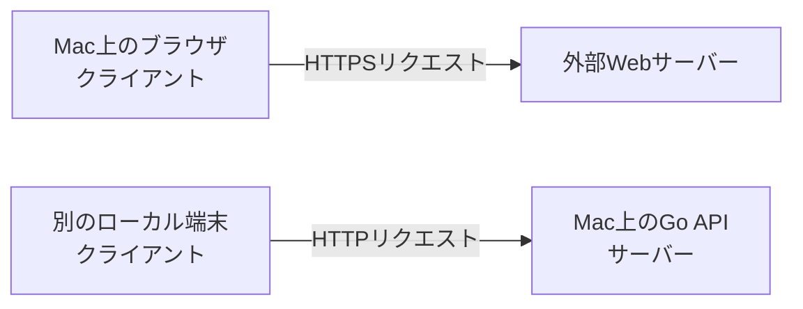

ブラウザでWebサイトを見る通信では自分のMacがクライアントです。一方、Go APIを起動して別のプロセスや端末からリクエストを受ける通信では、自分のMacがサーバーです。

### 1.2 自分のPCがサーバー側になるのか

> **疑問1：ポートを待ち受ける場合、自分のPCがサーバー側になるのか。無闇に待ち受けないほうがよいのか。**

待受アプリケーションが外部からの接続を受ける通信では、自分のPCがサーバー側になります。

必要のない待受を減らすことは、攻撃対象となる入口を減らす基本的な対策です。ただし、待受そのものが悪いわけではありません。必要なサービスを、必要なアドレスとネットワークに限定して待ち受けることが重要です。

```text
適切な考え方
× ポートは一切待ち受けてはいけない
○ 目的と到達範囲を説明できるポートだけ待ち受ける
```

---

## 2. IPアドレスとネットワークインターフェース

### 2.1 ネットワークインターフェースとは

ネットワークインターフェースは、コンピューターがネットワークへ接続するための論理的または物理的な接点です。

1台のMacが複数のインターフェースとIPアドレスを同時に持つことがあります。

| インターフェースの例 | IPv4アドレスの例 | 主な用途 |
|---|---|---|
| ループバック | `127.0.0.1` | 同じMac内の通信 |
| Wi-Fi | `192.168.1.20` | 家庭内LANの通信 |
| Ethernet | `192.168.1.30` | 有線LANの通信 |
| VPN | `10.10.0.5` | VPN内の通信 |
| 仮想インターフェース | 環境による | コンテナや仮想マシンなど |

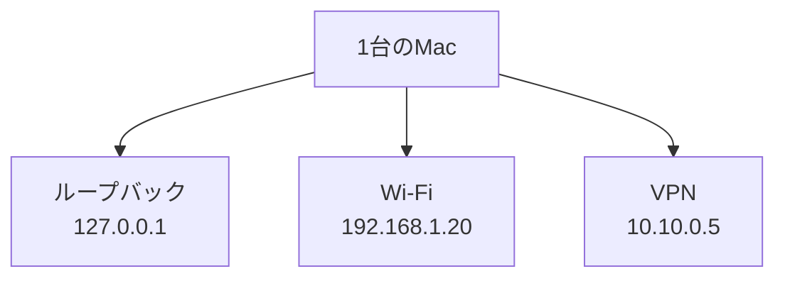

### 2.2 IPv4アドレスの主な種類

| 種類 | 例 | 主な到達範囲 |
|---|---|---|
| ループバック | `127.0.0.1` | 同じ端末だけ |
| プライベートIP | `192.168.1.20` | 家庭や組織の内部ネットワーク |
| グローバルIP | 回線やサーバーへ割り当てられた値 | インターネット上で経路制御される |
| 未指定アドレス | `0.0.0.0` | 待受時に「すべてのローカルIPv4」を表すなどの特殊用途 |

`0.0.0.0`は、通常クライアントが接続先として指定するアドレスではありません。サーバーが待受設定で使用するワイルドカードです。

### 2.3 `0.0.0.0:8080`とは何か

> **疑問2：`0.0.0.0:8080`の「PCのすべてのIPv4インターフェース」とは、どのIPの端末からでも接続を受け付けるという意味か。**

`0.0.0.0:8080`は、**自分のPCが持つすべてのローカルIPv4アドレスで、TCP 8080番ポートを待ち受ける**という意味です。

自分のMacが次のアドレスを持つとします。

```text
127.0.0.1
192.168.1.20
10.10.0.5
```

`0.0.0.0:8080`で待ち受けると、概念的には次の宛先でアプリが接続を待ちます。

```text
127.0.0.1:8080
192.168.1.20:8080
10.10.0.5:8080
```

これは接続元のIPを無条件に許可する設定ではありません。

```text
待受アドレス
→ 自分側のどの宛先アドレスでアプリが待つか

ファイアウォール
→ どの接続元・通信を通すか

ルーター
→ その宛先までパケットを届ける経路があるか
```

### 2.4 「どのIPから」ではなく「どのIP宛て」

> **疑問3：自分のPCが持つIPv4のどのIPからでも、8080番ポートへの通信を許可するという理解でよいか。**

ほぼ近い理解ですが、「どのIP**から**」ではなく「自分のPCが持つどのIPv4アドレス**宛て**」が正確です。また、`0.0.0.0`が表すのはアプリの待受範囲であり、ファイアウォールによる通信許可そのものではありません。

```text
正確な表現
0.0.0.0:8080
→ このPCが持つすべてのローカルIPv4アドレス宛ての
  TCP 8080接続を、アプリケーションが待ち受ける
```

### 2.5 別端末は`0.0.0.0`へ接続しない

別端末は、サーバーPCが実際に持つIPアドレスを接続先にします。

```text
サーバー側の待受指定
0.0.0.0:8080

同じLANのクライアントが使うURL
http://192.168.1.20:8080
```

`0.0.0.0`は「この端末の全IPv4」というサーバー内部の指定であり、ネットワーク上で端末を特定する宛先ではありません。

### 2.6 `:8080`との違い

Goでは次のようにホスト部分を省略できます。

```go
http.ListenAndServe(":8080", handler)
```

これは未指定アドレスでの待受を要求します。OSやGoのネットワーク動作によってはIPv4だけでなくIPv6も受け付ける場合があるため、`0.0.0.0:8080`と常に完全に同じとは限りません。

用途を明確にするなら、ローカル学習では次の指定が分かりやすく安全です。

```go
http.ListenAndServe("127.0.0.1:8080", handler)
```

---

## 3. ポート、待受、接続、公開を区別する

### 3.1 ポート番号とは

ポート番号は、TCPやUDPが同じコンピューター内の通信先・通信元アプリケーションを識別するために使う番号です。

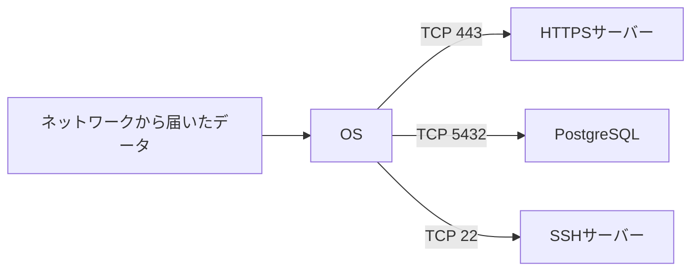

ポート番号はデータが常に流れている物理的な穴ではなく、通信の端点を識別する情報です。

### 3.2 1つのTCP通信には2つのポートがある

TCP通信には、送信元と宛先の両方にIPアドレスとポート番号があります。

```text
192.168.1.20:53124  →  203.0.113.10:443
───────────────         ───────────────
クライアント側            サーバー側
一時的な送信元ポート       HTTPSの待受ポート
```

TCP接続は、主に次の組み合わせで区別されます。

```text
送信元IP
送信元ポート
宛先IP
宛先ポート
トランスポートプロトコル
```

そのため、サーバーは同じ443番ポートで複数クライアントの接続を同時に扱えます。詳しくは[DB接続プールとTCPポートの関係](db-connection-pool-and-tcp-ports.md)も参照してください。

### 3.3 待受とは

待受は、アプリケーションがOSに対して「このアドレスとポートへの新しい接続を受け取る」と登録している状態です。TCPでは一般に`LISTEN`状態として観察できます。

```text
Goアプリ
  ↓ 127.0.0.1:8080を使うとOSへ登録
OSの待受ソケット
  ↓ 新しい接続を受け付ける
確立済みTCP接続
```

### 3.4 データが届くことと公開ポートは異なる

> **疑問4：ポートにデータが流れてくることと、公開ポートは違うのか。インターネットにつながっているだけではポート公開ではないのか。**

その理解で合っています。

ブラウザでWebサイトを見るとき、自分のPCは一時的な送信元ポートを使い、自分から通信を開始します。レスポンスはその通信に対応するデータとして戻ります。

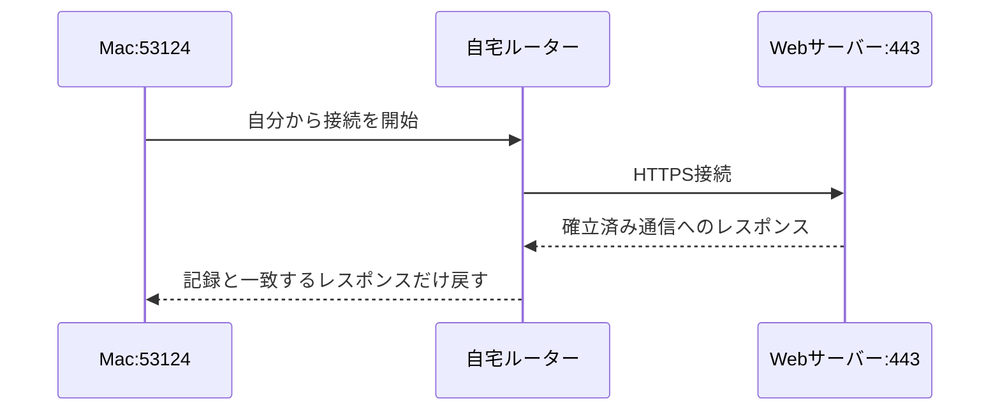

このとき自分のPCのポートへレスポンスデータは届きますが、第三者からの無関係な新規接続を受け付けているわけではありません。

```text
確立済み通信に属する返事が届く
≠
外部から任意の新規接続を開始できる
```

### 3.5 「公開ポート」とはどのような状態か

一般に公開ポートとは、ある接続元から対象の`IPアドレス:ポート番号`へ新しい通信を開始し、待受アプリケーションまで到達できる状態を指します。

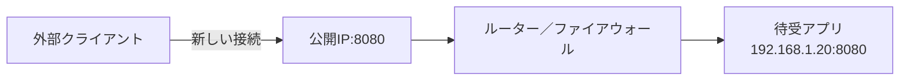

到達範囲は段階的です。

| 状態 | 到達できる接続元の例 |
|---|---|
| ループバック待受 | 同じPCのプロセス |
| LAN内公開 | 同じLANの端末 |
| VPN内公開 | 許可されたVPN参加端末 |
| インターネット公開 | インターネット上の端末 |

「公開」という言葉だけでは範囲が曖昧なため、実際には「localhostだけ」「LAN内」「インターネット」のどこまで到達可能かを明示します。

---

## 4. 同じネットワークと異なるネットワーク

### 4.1 同じネットワーク内では基本的に直接通信する

同じIPサブネットにいる端末同士は、通常、IPパケットを別のネットワークへルーティングせずに通信します。

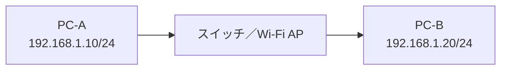

家庭用Wi-Fiルーターという1台の機械を経由して見えても、同一LAN内では、その機械に内蔵されたスイッチやWi-Fiアクセスポイントの機能で転送され、IPルーター機能を使わない場合があります。

### 4.2 `0.0.0.0:8080`への接続には同じネットワークが必要か

> **疑問5：`0.0.0.0:8080`で待ち受けるサーバーへ接続するには、別端末も同じネットワークにいることが前提か。**

同じネットワークであることは必須ではありません。クライアントがサーバーPCの実際のIPアドレスへ到達でき、途中のファイアウォールが許可していれば、別ネットワークからも接続できます。

同じLANの場合は、特別なルーティング設定を追加せず接続しやすい代表例です。

```text
同じLANの端末
→ http://192.168.1.20:8080

別サブネットの端末
→ ルーターが192.168.1.20への経路を持ち、通信を許可していれば接続可能

インターネット上の端末
→ 通常はグローバルIP、NATのポート転送、ファイアウォール許可などが必要
```

### 4.3 異なるネットワーク間でも転送されれば通信できるか

> **疑問6：ルーターを介し、適切に転送されていれば異なるネットワーク間でも通信できるか。**

はい。異なるローカルネットワーク間では、通常は「ポート転送」ではなく**ルーティング**によって通信します。

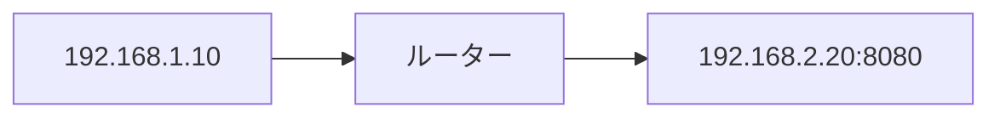

必要な条件は次のとおりです。

- 送信側が異なるネットワーク宛てのパケットをルーターへ渡す
- ルーターが宛先ネットワークへの経路を知っている
- 途中のファイアウォールが通信を許可する
- 宛先端末のファイアウォールが許可する
- 宛先アプリが該当アドレスとポートで待ち受けている

---

## 5. ルーター、ルーティング、家庭用ルーター

### 5.1 ルーターの基本的な役割

> **疑問7：ルーターは異なるネットワーク同士をつなぐものという理解でよいか。**

はい。ルーターの基本的な役割は、異なるIPネットワークの境界で、宛先IPアドレスに基づいてパケットを次のネットワークへ転送することです。

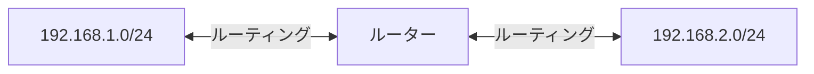

端末はサブネットマスクを使い、宛先が自分と同じネットワークかを判断します。

```text
同じネットワーク
→ 宛先端末へ直接届ける

異なるネットワーク
→ デフォルトゲートウェイであるルーターへ渡す
```

### 5.2 家庭用Wi-Fiルーターは複合機器

家庭で「ルーター」と呼ぶ機器には、通常、複数の機能が入っています。

| 機能 | 役割 |
|---|---|
| ルーター | 異なるIPネットワーク間を転送する |
| NAT・NAPT | 内部と外部のIPアドレスやポートを変換する |
| ファイアウォール | 通信を許可・遮断する |
| DHCPサーバー | LAN内の端末へIP設定を配る |
| DNSリレー | 端末のDNS問い合わせを中継する |
| Ethernetスイッチ | 同じ有線LAN内でフレームを転送する |
| Wi-Fiアクセスポイント | 無線端末をLANへ接続する |

そのため、「ルーターを通った」という表現だけでは、純粋なルーティング、NAT、ファイアウォール、スイッチングのどれが働いたかを分けて考える必要があります。

### 5.3 ルーターは同じポート同士へ転送するのか

> **疑問8：ルーターが転送する先は、同じポート同士なのか。**

純粋なルーティングでは、TCPやUDPのポート番号を基本的に変更しません。ルーターは主に宛先IPアドレスを見て次の経路を選びます。

```text
ルーティング前
192.168.1.10:53000 → 192.168.2.20:8080

ルーティング後
192.168.1.10:53000 → 192.168.2.20:8080
```

一方、家庭用ルーターのNAT・NAPTやポートフォワードでは、IPアドレスやポート番号を変更する場合があります。

| 処理 | ポート番号 |
|---|---|
| 通常のルーティング | 基本的に変更しない |
| 外向きNAPT | 送信元ポートを変更することがある |
| ポートフォワード | 外部ポートと内部ポートを同じにも別にもできる |

---

## 6. NAT・NAPT・ポートフォワード

### 6.1 外向き通信でのNAPT

家庭内の複数端末は、通常、ルーターの1つのグローバルIPv4アドレスを共有します。ルーターは内部のIPアドレスと送信元ポートを、外部用のIPアドレスとポートへ対応付けます。

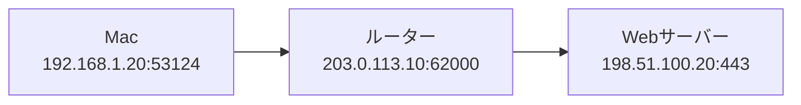

ルーターは対応関係を一時的に記録します。

| 内部側 | 外部側 | 宛先 |
|---|---|---|
| `192.168.1.20:53124` | `203.0.113.10:62000` | `198.51.100.20:443` |

Webサーバーからの返事が戻ると、ルーターは記録を使ってMacへ戻します。

```text
内部から開始した通信
→ 対応表を一時的に作る

対応するレスポンス
→ 元の内部端末へ戻す

無関係な外部からの新しい接続
→ 通常は対応表がなく、ファイアウォールでも拒否する
```

### 6.2 ポートフォワードとは

> **疑問9：ポートフォワードとは何か。**

ポートフォワードは、ルーターの外側にある特定のポートへ届いた新規通信を、LAN内の特定端末・ポートへ転送する固定ルールです。「ポートマッピング」「仮想サーバー」「静的NAT」などの名称も使われます。

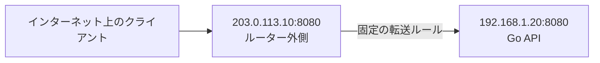

一般的な設定項目は次のとおりです。

| 設定項目 | 例 |
|---|---|
| プロトコル | TCP |
| 外部ポート | `8080` |
| 転送先IP | `192.168.1.20` |
| 転送先ポート | `8080` |

外部と内部のポートは異なっても構いません。

```text
203.0.113.10:443
        ↓ ポートフォワード
192.168.1.20:8443
```

この場合、外部クライアントは443へ接続し、内部アプリは8443で待ち受けます。

### 6.3 ルーティングとポートフォワードの違い

| 観点 | ルーティング | ポートフォワード |
|---|---|---|
| 主な目的 | 異なるIPネットワーク間を転送する | 外部の特定ポートを内部端末へ対応付ける |
| 主な判断材料 | 宛先IPと経路表 | プロトコル、外部ポート、転送先IP・ポート |
| IP・ポートの変更 | 通常は変更しない | 宛先IP・ポートを変更する |
| 家庭での例 | LANからインターネットへ経路を選ぶ | インターネットから自宅Webサーバーへ転送する |

### 6.4 IPv6では考え方が変わる

IPv6では、各端末がグローバルに経路制御可能なIPv6アドレスを持つ場合があります。その場合、IPv4のようなポートフォワードを使わず、ルーターのIPv6ファイアウォールが外部からの到達を制御する構成があります。

```text
IPv4家庭環境の典型
グローバルIPv4 → NAT／ポートフォワード → プライベートIPv4

IPv6環境の一例
グローバルIPv6 → IPv6ファイアウォール → 端末のグローバルIPv6
```

「NATがないから無条件に危険」でも、「NATがあるから安全」でもありません。外部からの新規通信をファイアウォールがどう扱うかを確認します。

---

## 7. ネットワークプロトコルの階層

### 7.1 TCP/IPモデルで整理する

> **疑問10：レイヤーごとに使われる代表的なプロトコルは何か。**

実際のインターネット通信は、TCP/IPモデルで整理すると理解しやすくなります。

| TCP/IPモデル | 主な役割 | 代表的なプロトコル・規格 | 主な識別情報 |
|---|---|---|---|
| アプリケーション層 | アプリ同士の会話の意味 | HTTP、DNS、SMTP、IMAP、SSH、DHCP、NTP、TLS | URL、ドメイン名など |
| トランスポート層 | プロセス間でデータを運ぶ | TCP、UDP、QUIC、SCTP | ポート番号 |
| インターネット層 | 異なるIPネットワーク間で運ぶ | IPv4、IPv6、ICMP、IPsec | IPアドレス |
| ネットワークアクセス層 | 同じリンク上の機器間で運ぶ | Ethernet、Wi-Fi、ARP、NDP、VLAN、PPP | MACアドレスなど |
| 物理層として分ける場合 | 信号として送る | 有線LAN、光、Wi-Fiの物理規格 | 電気・光・電波 |

TLSやQUICのように複数層にまたがる役割を持つプロトコルもあり、すべてを1つの層へ完全に分類できるわけではありません。レイヤーは役割を理解するためのモデルです。

### 7.2 OSI参照モデルとの対応

| OSI層 | 名称 | TCP/IPモデルとの大まかな対応 | 例 |
|---:|---|---|---|
| 7 | アプリケーション層 | アプリケーション層 | HTTP、DNS、SMTP、SSH |
| 6 | プレゼンテーション層 | アプリケーション層 | 暗号化、文字コード、データ表現 |
| 5 | セッション層 | アプリケーション層 | セッション管理 |
| 4 | トランスポート層 | トランスポート層 | TCP、UDP、QUIC |
| 3 | ネットワーク層 | インターネット層 | IPv4、IPv6、ICMP |
| 2 | データリンク層 | ネットワークアクセス層 | Ethernet、Wi-Fi、VLAN |
| 1 | 物理層 | ネットワークアクセス層・物理層 | ケーブル、光、電波 |

実務で使われる`L7`、`L4`、`L3`、`L2`という表現は、このOSI層番号を指すことが多くあります。

```text
L7 → HTTPなどのアプリケーションプロトコル
L4 → TCP・UDP、ポート番号
L3 → IP、ルーター
L2 → Ethernet・Wi-Fi、MACアドレス
L1 → 電気・光・電波
```

### 7.3 データは上位層から下位層へ包まれる

HTTP/1.1をTLSとTCPで送る場合、データは概念的に次のように包まれます。

```text
Ethernet／Wi-Fiのフレーム
└── IPパケット
    └── TCPセグメント
        └── TLSレコード
            └── HTTPメッセージ
```

送信側は上から下へ情報を付け、受信側は下から上へ取り出します。

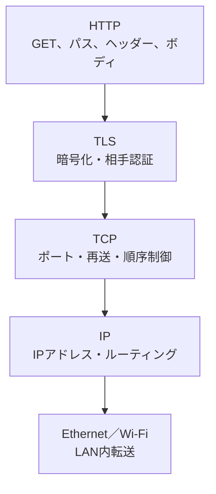

---

## 8. HTTP、TCP、UDP、QUICの違い

### 8.1 HTTPとTCPは何が違うのか

> **疑問11：HTTPとTCPは何が違うのか。**

HTTPはWebのリクエストとレスポンスの意味を定義します。TCPはHTTPなどが作ったバイト列を、ポート間で順序どおり、欠落時には再送しながら運びます。

| 観点 | HTTP | TCP |
|---|---|---|
| 層 | アプリケーション層 | トランスポート層 |
| 理解するもの | メソッド、パス、ヘッダー、ボディ、ステータス | バイト列、接続、順序、再送、ポート |
| 例 | `GET /tasks HTTP/1.1` | `53124 → 443`のTCP接続 |
| 担当しないこと | パケット再送や経路制御 | `GET`や`404`の意味の解釈 |

次のHTTPメッセージを考えます。

```http
GET /tasks?limit=10 HTTP/1.1
Host: example.com
Accept: application/json
```

HTTPは、`GET`、`/tasks`、`limit=10`などの意味を定義します。TCPはその意味を理解せず、HTTPメッセージを構成するバイト列を運びます。

```text
HTTP
→ 何を伝えるか、どう解釈するか

TCP
→ そのバイト列をどう確実に運ぶか

IP
→ どのコンピューターへ運ぶか
```

### 8.2 HTTPSの443とTCPポートの関係

> **疑問12：HTTPSのポートは443だが、TCPのポート番号は決まっているのか。**

HTTPSの443は、HTTPS用として標準的に登録されたTCPの宛先ポートです。「HTTPSのポート」と「TCPのポート」という2種類の別番号があるわけではありません。

```text
クライアント                     HTTPSサーバー
192.168.1.20:53124  ─────────→  203.0.113.10:443
                 TCP接続
```

| 端点 | ポートの例 | 決め方 |
|---|---:|---|
| クライアント | `53124` | OSが一時的な送信元ポートを選ぶ |
| HTTPSサーバー | `443` | HTTPSの標準的な宛先ポート |

TCPのポート番号は16ビットで表され、範囲は`0`〜`65535`です。IANAは用途を次の範囲に整理しています。

| 範囲 | 名称 | 主な用途 |
|---:|---|---|
| `0`〜`1023` | System Ports | 広く知られた標準サービス |
| `1024`〜`49151` | User Ports | 登録済みサービスなど |
| `49152`〜`65535` | Dynamic/Private Ports | 一時的・私的な利用 |

HTTPSは443以外でも動かせます。

```text
https://example.com/
→ 標準の443を使用

https://example.com:8443/
→ 明示した8443を使用
```

ポート番号はサービスを推測する手掛かりですが、番号だけで実際のプロトコルや安全性は確定しません。443番ポートでHTTPS以外のアプリを動かすことも技術的には可能です。

### 8.3 HTTPの下は必ずTCPかUDPか

> **疑問13：HTTPの下位プロトコルは必ずTCPまたはUDPなのか。ほかの場合はないのか。**

HTTPの意味は特定のトランスポートからある程度独立しています。ただし、現在の一般的なインターネット上のHTTPは、最終的にTCPまたはUDPを利用します。

| HTTPの方式 | 一般的な階層 |
|---|---|
| 平文のHTTP/1.1 | HTTP/1.1 → TCP → IP |
| HTTPSのHTTP/1.1 | HTTP/1.1 → TLS → TCP → IP |
| HTTPSのHTTP/2 | HTTP/2 → TLS → TCP → IP |
| HTTP/3 | HTTP/3 → QUIC → UDP → IP |

HTTP/3はUDPを直接利用するのではありません。UDPの上にあるQUICが、暗号化、接続、再送、ストリームごとの順序制御などを提供します。

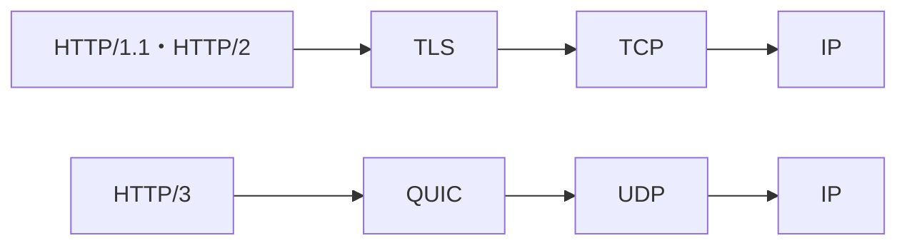

ローカルプロセス間では、HTTPメッセージをUnixドメインソケットで運ぶ構成もあります。

```text
HTTP
  ↓
Unixドメインソケット
  ↓
OS内部のプロセス間通信
```

この場合、通信経路にはTCP、UDP、IPを使いません。ただし、一般的なブラウザとWebサーバーが任意の方式に対応するわけではなく、両端が同じ対応付けを実装している必要があります。

### 8.4 `curl -v`で見える層

`curl -v`の出力には、異なる層の情報が混在します。

```text
* Connected to example.com (...) port 443
```

これは接続先IPやポートなど、主にTCP・IP接続に関する`curl`の診断情報です。

```text
* SSL connection using TLSv1.3
```

これはTLSの情報です。

```text
> GET /anything?name=pikachu HTTP/2
> host: example.com
```

これはHTTPリクエストです。

```text
< HTTP/2 200
< content-type: application/json
```

これはHTTPレスポンスのステータスとヘッダーです。

```text
{"method":"GET", ...}
```

これはHTTPレスポンスボディです。

---

## 9. グローバルIPが見えることの意味

### 9.1 HTTP確認サービスの`origin`

HTTP確認サービスがレスポンスに返す`origin`は、通常、そのサービスから見えた接続元IPを表します。自宅から直接`curl`を実行した場合、多くの環境では家庭のインターネット出口に使われたグローバルIPです。

ただし、常に個人専用の回線IPとは限りません。

| 利用環境 | 相手から見える可能性が高いIP |
|---|---|
| 家庭用ルーター | 回線の出口となるグローバルIP |
| VPN | VPNサーバーの出口IP |
| 会社・学校 | 組織のインターネット出口IP |
| プロキシ | プロキシのIP |
| CGNAT | 複数契約者で共有される事業者側のIP |

`X-Forwarded-For`は、プロキシが元の接続元IPを後段サーバーへ伝えるためによく使うヘッダーです。複数の中継を通ると複数の値が並ぶ場合があります。また、クライアントが値を偽装できるため、サーバーは信頼できるプロキシが追加・検証した部分だけを利用します。

### 9.2 グローバルIPが知られると何が問題か

> **疑問14：グローバルIPが知られると、何か問題があるか。**

グローバルIPだけで直ちにPCへ侵入されたり、正確な住所や氏名が確定したりするわけではありません。Webサイトへ接続するには、通常、接続先サービスから送信元IPが見えます。

一方、完全に無害な情報でもありません。

| リスク | 内容 |
|---|---|
| おおよその地域・ISPの推測 | IP位置情報データベースなどから推測される場合がある |
| 行動の関連付け | IP、時刻、アカウントなどを組み合わせてアクセスを関連付けられる場合がある |
| 公開サービスの探索 | そのIPで外部から到達可能なポートやサービスを調査される可能性がある |
| DoS・DDoS | 固定IPや公開サーバーでは通信を集中させる対象になり得る |

危険性は環境によって変わります。

```text
動的IP・CGNAT・外部公開なし
→ 単独のIP漏えいによる実害は一般に限定的

固定IP・公開サーバー・脆弱な管理画面
→ IPが直接の攻撃対象を示すため重要度が高い
```

### 9.3 IPが見えたこととポート公開は別

HTTP確認サービスに`origin`が表示されたことは、そのサービスまで送信元IP情報が届いたことを示します。それだけで、自宅ルーターやMacの待受ポートがインターネットへ公開されていることは示しません。

```text
外部サービスから自分の出口IPが見える
≠
外部サービスから自分のPCへ新規接続できる
```

### 9.4 記録とGit履歴での扱い

学習記録へIPアドレスが含まれる場合は、コミット前にマスクします。

```json
{
  "origin": "[MASKED]",
  "X-Forwarded-For": ["[MASKED]"]
}
```

最新ファイルでマスクしても、すでにコミット・プッシュした値は過去のGit履歴に残ります。

```text
新しいコミットで置換
→ 現在のファイルからは見えなくなる
→ 過去コミットはそのまま残る

履歴から除去
→ Git履歴の書き換えと強制プッシュが必要
→ 既存クローン、フォーク、キャッシュからの完全回収は保証できない
```

IPアドレスと、パスワード・APIキー・セッショントークンは重要度が異なります。認証情報を誤って公開した場合は、履歴操作だけに頼らず、必ず失効・変更・再発行を先に行います。

---

## 10. 公開ポートと侵入が成立する条件

### 10.1 公開されるのはルーターか、コンピューターか

> **疑問15：公開ポートとはルーターのポートか、それともルーターにつながったコンピューターのポートか。**

どちらの場合もあります。インターネット側からは、まず`グローバルIP:ポート`が接続先として見えます。その通信を誰が処理するかで意味が変わります。

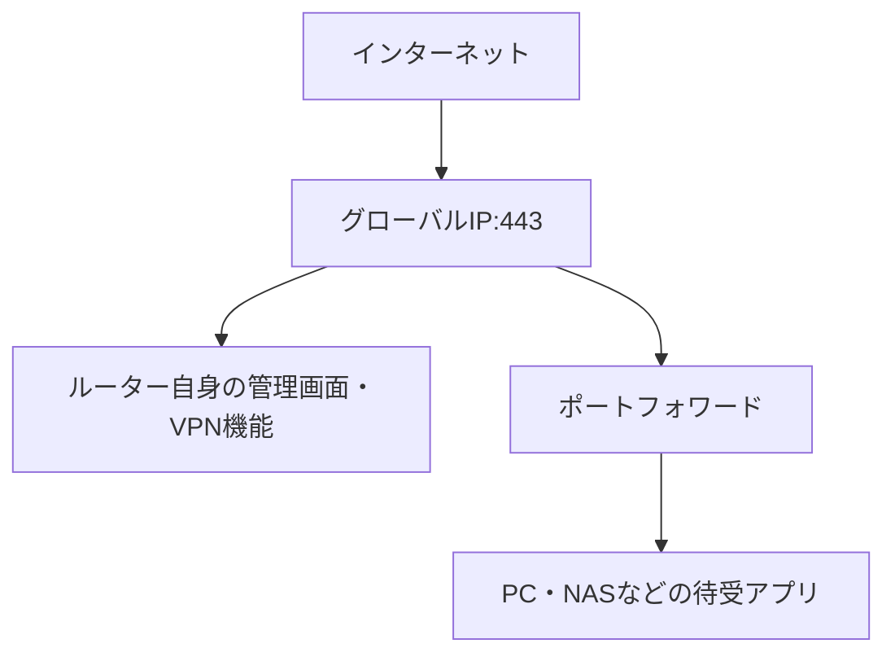

| 公開の形 | 例 |
|---|---|
| ルーター自身が応答 | WAN側管理画面、VPNサーバー |
| 内部端末へ転送 | Go API、Webサーバー、NAS、ゲームサーバー |
| IPv6で端末へ直接到達 | 端末のグローバルIPv6とファイアウォール許可 |

### 10.2 グローバルIPのポートが待受状態なら危険か

> **疑問16：グローバルIPのポートが待ち受け状態になっていると危険なのか。**

より正確には、IPアドレス自体が待ち受けるのではなく、ルーターまたは端末上のアプリケーションがアドレスとポートへ待受ソケットを作ります。そして、外部からその待受まで到達できれば公開状態です。

公開ポートは直ちに侵入を意味しませんが、外部からアプリへ入力を届けられるため、攻撃対象となる面が増えます。

```text
公開ポート
→ 外部から受付まで到達できる

適切に保護されたアプリ
→ 不正な要求を拒否する

脆弱・設定不備のアプリ
→ 不正アクセスや侵入につながる可能性がある
```

意図した公開Webサーバーの443番は必要な入口です。一方、意図せず公開されたルーター管理画面、NAS、データベース、開発用デバッグ画面は高いリスクになります。

### 10.3 侵入はどのような場合に成立するか

> **疑問17：待ち受けているだけでは侵入とは限らないなら、どのような場合に侵入されるのか。**

公開サービスへ攻撃者の入力が届き、その先の認証、認可、入力処理、設定、ソフトウェアなどの弱点を悪用して、本来許可されない操作に成功するとセキュリティ侵害が成立します。


| 弱点 | 侵害の例 |
|---|---|
| 初期・弱い・使い回しパスワード | ルーターや管理画面へログインされる |
| 認証の不備 | 本人確認を回避される |
| 認可の不備 | 一般ユーザーが他人のデータや管理機能を操作する |
| 未更新ソフトウェア | 既知の脆弱性を悪用される |
| 入力検証の不備 | DBやOSへ意図しない命令を実行される |
| 設定不備 | 管理画面、データ、デバッグ機能が無認証で公開される |
| セッション情報の窃取 | 正規ユーザーになりすまされる |

「侵入」はOS全体の乗っ取りだけを意味しません。権限のないデータ閲覧、変更、削除、管理機能の実行もセキュリティ侵害です。

APIの例では、サーバーが認可を行わないと問題になります。

```http
DELETE /users/123 HTTP/1.1
Authorization: Bearer ...
```

```text
必要な検証
1. 認証済みか
2. ユーザー123を削除する権限があるか
3. 入力形式と状態は妥当か
4. 許可された場合だけ削除する
```

### 10.4 HTTPSの443番でも攻撃は届く

TLSは通信中の盗聴や改ざんを防ぎ、接続相手を証明書で確認するために使います。アプリケーションの認証・認可・入力検証の代わりではありません。

```text
TLS
→ 通信を暗号化・保護する

HTTPアプリケーション
→ リクエストを実行してよいか判断する
```

攻撃者もHTTPSを使って暗号化された不正リクエストを送れます。したがって、443番ポートだから安全なのではなく、その先のアプリケーションが安全に設計・運用されている必要があります。

### 10.5 公開ポートがなくても侵害される経路

公開ポートを閉じると、外部から直接新規接続される経路は減ります。しかし、次のように内部から開始する通信を利用した侵害もあります。


- フィッシングで認証情報を入力する
- 悪意あるファイルやアプリを実行する
- 偽のアップデートを導入する
- 脆弱なブラウザやアプリが受信データを処理する
- 侵害された依存関係や配布物を取り込む

ポート公開の削減は重要な一対策ですが、更新、認証、権限制御、利用者教育などと組み合わせます。

---

## 11. 公開状態を確認する方法

### 11.1 何を確認するか

> **疑問18：ルーターやコンピューターのポートが公開されているか確認できるか。**

確認できます。ただし、次の3段階を分けます。

| 段階 | 確認できること |
|---|---|
| 端末上の待受確認 | どのアプリがどのアドレス・ポートで待っているか |
| ルーター設定の確認 | 外部から内部へ転送・許可する明示的な設定があるか |
| 外部からの到達確認 | インターネットから実際に新規接続できるか |

### 11.2 macOS上の待受を確認する

TCPの待受は次のコマンドで確認できます。

```bash
sudo lsof -nP -iTCP -sTCP:LISTEN
```

UDPを使用中のプロセスも確認する場合は次を使います。UDPにはTCPと同じ`LISTEN`状態がない点に注意します。

```bash
sudo lsof -nP -iUDP
```

表示されたアドレスを次のように読みます。

| 表示例 | 意味 |
|---|---|
| `127.0.0.1:8080` | 同じMacからのIPv4通信を待受 |
| `[::1]:8080` | 同じMacからのIPv6通信を待受 |
| `192.168.1.20:8080` | Wi-Fiなど特定のLAN側IPv4で待受 |
| `*:8080` | 複数またはすべての対象インターフェースで待受 |

この結果だけではインターネット公開を断定できません。ルーターやファイアウォールで遮断されている可能性があるためです。

### 11.3 macOSの共有とファイアウォールを確認する

macOSでは、少なくとも次を確認します。

- 「システム設定」→「一般」→「共有」
- 「システム設定」→「ネットワーク」→「ファイアウォール」
- 不要なファイル共有、画面共有、リモートログインが有効でないか
- ファイアウォールで不要なアプリの受信を許可していないか

待受アプリがあってもファイアウォールが遮断する場合があります。反対に、必要な共有機能を有効にすると対応する受信が許可される場合があります。

### 11.4 ルーターで確認する項目

ルーターの管理画面では、メーカーにより名称が異なりますが、次を確認します。

- ポート転送、ポートマッピング、仮想サーバー
- UPnPが作成したポートマッピング
- DMZホスト
- WAN側リモート管理
- VPNサーバー
- IPv6ファイアウォール
- 不要な公開サービス

### 11.5 外部から確認する

実際にインターネットから到達できるかは、自分が所有または明示的に許可された対象だけを、同じWi-Fiの外から確認します。同じLANから自宅のグローバルIPを検査すると、NATループバックなどにより外部とは異なる結果になる場合があります。

Nmapを使用し、自分が管理するIPv4の代表的なTCPポートだけを確認する例です。

```bash
nmap -Pn -sT --reason \
  -p 22,80,443,445,3389,5900,8080 \
  <自分が管理するグローバルIPv4>
```

結果は、検査元から見た状態です。

| Nmapの状態 | 意味 |
|---|---|
| `open` | アプリケーションが接続を受け付けた |
| `closed` | 対象へ到達したが、待受サービスがなかった |
| `filtered` | ファイアウォールなどのため開閉を判断できない |

許可のない第三者のIPやサービスをスキャンしてはいけません。このリポジトリでは、原則としてlocalhostまたは自分が管理する隔離環境だけを検証します。

### 11.6 CGNAT・二重ルーターの注意

ルーターのWAN側IPv4と、外部サービスから見える`origin`が異なる場合、CGNATや二重ルーターの可能性があります。

```text
自宅ルーターのWAN側IP
≠
外部サービスから見えるグローバルIP
```

CGNATでは、外部から見えるIPv4を複数契約者で共有している場合があります。この場合、そのグローバルIP全体を自分専用の検査対象とみなさず、回線事業者の構成を確認します。

---

## 12. Goサーバーでの待受範囲

### 12.1 localhostだけで待ち受ける

```go
http.ListenAndServe("127.0.0.1:8080", handler)
```

```text
同じMacのcurl・ブラウザ
→ 接続可能

同じLANの別端末
→ 通常は接続不可

インターネット
→ 接続不可
```

このリポジトリの学習用サーバーでは、原則としてこの形が適しています。

### 12.2 すべてのローカルIPv4で待ち受ける

```go
http.ListenAndServe("0.0.0.0:8080", handler)
```

```text
同じMac
→ 接続可能

同じLANの別端末
→ ファイアウォールが許可すれば接続可能

VPNなど別インターフェース
→ 経路とファイアウォールが許可すれば接続可能

インターネット
→ さらにルーターの転送・許可などがなければ通常は接続不可
```

### 12.3 ポートフォワードを加えた場合


この構成ではGo APIがインターネットから到達可能になるため、単なるローカル学習用サーバーではなく公開サーバーとして扱う必要があります。

一方、Goアプリが`127.0.0.1:8080`だけで待ち受けている場合、ルーターからLAN側アドレスへ転送された通信を通常は受け取りません。

### 12.4 このリポジトリでの安全な方針

- [ ] 学習用サーバーは`127.0.0.1`で待ち受ける
- [ ] 脆弱な学習実装をインターネットへ公開しない
- [ ] 使用後は学習用サーバーを停止する
- [ ] 不要なポートフォワードを設定しない
- [ ] UPnPやDMZで意図せず公開されていないか確認する
- [ ] 本物の認証情報や個人情報をテストに使わない
- [ ] 許可のない対象へスキャンや攻撃手法を使わない

---

## 13. HTTPSリクエストを全体で追う

ここまでの概念を、`curl`でHTTPS APIへGETする例に統合します。

```bash
curl -v 'https://example.com/tasks?limit=10'
```

### 13.1 クライアントがHTTPリクエストを作る

```http
GET /tasks?limit=10 HTTP/1.1
Host: example.com
Accept: */*
```

HTTPは、メソッド、パス、クエリ、ヘッダーの意味を定義します。

### 13.2 TLSで保護する

HTTPSでは、HTTPメッセージをTLSで暗号化します。証明書を使い、接続先ホストの正当性も検証します。

### 13.3 TCP接続を使う

HTTP/1.1またはHTTP/2なら、一般にTCP接続を利用します。

```text
Mac
192.168.1.20:53124
        ↓ TCP
example.com:443
```

### 13.4 ルーターがNAPTする

家庭用ルーターは内部の送信元を外部用へ変換し、対応を記録します。

```text
192.168.1.20:53124
        ↓ NAPT
203.0.113.10:62000
        ↓
example.com:443
```

### 13.5 IPが宛先ネットワークまで運ぶ

各ルーターが宛先IPに基づいて次の経路を選び、最終的にWebサーバーへ届けます。

### 13.6 サーバーが443で受け付ける

Webサーバーは公開された443番ポートで接続を受け、TLSを処理した後にHTTPリクエストを解釈します。

### 13.7 レスポンスが確立済み通信を戻る

レスポンスは既存のTCP接続を使って戻ります。自宅ルーターはNAPTの記録を参照し、Macへ転送します。

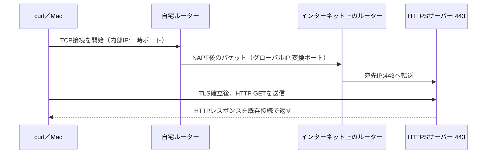

この一連の通信では、自宅ルーターの443番ポートを公開する必要はありません。443番ポートを公開して待ち受けているのは接続先のWebサーバーです。

---

## 14. 疑問と回答の対応表

この議論で生じた疑問と、最終的な理解を一覧にします。

| No. | 疑問 | 回答の要点 |
|---:|---|---|
| 1 | 自分のPCがサーバー側になるのか。無闇に待受しないほうがよいか | 接続を待って処理する通信ではサーバー役。必要な範囲の待受だけにする |
| 2 | `0.0.0.0:8080`は、どのIPの端末からでも接続を受ける意味か | 接続元ではなく、自分のPCが持つ全ローカルIPv4宛てで待ち受ける指定 |
| 3 | 自分のPCのどのIPv4からでも8080への通信を許可するのか | 「どのIPから」ではなく「どの自分側IP宛て」。実際の許可はファイアウォールにも依存する |
| 4 | データがポートに届くことと公開ポートは違うか | 違う。既存通信への返事の受信は、第三者から新規接続できる公開状態を意味しない |
| 5 | `0.0.0.0:8080`への接続には同じネットワークが必要か | 必須ではない。実際のIPまで経路があり、ファイアウォールが許可すれば別ネットワークからも届く |
| 6 | ルーターが転送すれば異なるネットワーク間でも通信できるか | できる。ローカルネットワーク間では主にルーティングとファイアウォール許可が必要 |
| 7 | ルーターは異なるネットワークをつなぐものか | 基本的にはそのとおり。宛先IPと経路表に基づいてパケットを転送する |
| 8 | ルーターの転送先は同じポートか | 純粋なルーティングでは通常維持する。NAT・NAPT・ポートフォワードでは変更できる |
| 9 | ポートフォワードとは何か | 外部の特定ポートへの新規通信を、内部の特定IP・ポートへ転送する固定ルール |
| 10 | 各レイヤーの代表的プロトコルは何か | L7にHTTP、L4にTCP・UDP・QUIC、L3にIP、L2にEthernet・Wi-Fiなどがある |
| 11 | HTTPとTCPは何が違うか | HTTPは会話の意味、TCPはバイト列の信頼できる運搬を担当する |
| 12 | HTTPSが443ならTCPのポートは決まっているか | 443自体が標準的なHTTPSのTCP宛先ポート。TCP全体には多数のポート番号がある |
| 13 | HTTPの下は必ずTCPかUDPか | 一般的なWebではTCP、またはQUIC経由のUDP。Unixドメインソケットなど別方式も可能 |
| 14 | グローバルIPが知られると問題か | 単独で直ちに侵入はされないが、位置・行動の推測、公開サービス探索、DoSの手掛かりになり得る |
| 15 | 公開ポートはルーターか内部PCか | ルーター自身が応答する場合と、内部端末へ転送する場合の両方がある |
| 16 | グローバルIPのポートが待受なら危険か | 公開は攻撃面を増やすが、直ちに侵入ではない。サービスの保護状態で危険性が変わる |
| 17 | どのような場合に侵入されるか | 到達した入力が認証・認可・設定・入力処理・未更新ソフトウェアなどの弱点を突破した場合 |
| 18 | ルーターやPCの公開ポートを確認できるか | 端末の待受、ルーター設定、外部からの到達性を分けて確認できる |

### 補足：`origin`と`X-Forwarded-For`

議論の出発点となったHTTP確認サービスの値も、次のように整理できます。

| 項目 | 意味の要点 |
|---|---|
| `origin` | HTTP確認サービスが接続元として認識したIP |
| `X-Forwarded-For` | プロキシが元の接続元IPを伝えるためによく使うヘッダー。信頼境界を考慮する |
| 値が表示されたこと | 相手に出口IPが見えたことを示すが、自宅のポート公開を示すものではない |

---

## 15. 理解確認チェックリスト

### IP・インターフェース

- [ ] ループバック、プライベートIP、グローバルIPを区別できる
- [ ] 1台のPCが複数のネットワークインターフェースとIPを持てると説明できる
- [ ] `0.0.0.0`は接続先ではなく、待受時のワイルドカードだと説明できる
- [ ] 「接続元IP」と「自分側の待受IP」を区別できる

### ポート・待受・公開

- [ ] ポート番号はアプリケーションの通信端点を識別する情報だと説明できる
- [ ] 1本の通信には送信元ポートと宛先ポートがあると説明できる
- [ ] 待受中とインターネット公開中を区別できる
- [ ] 既存通信へのレスポンス受信がポート公開ではないと説明できる
- [ ] `open`、`closed`、`filtered`が観測地点に依存すると説明できる

### ルーター・NAT

- [ ] 同一サブネット内では基本的に直接通信すると説明できる
- [ ] 異なるIPネットワークではルーターが経路を選ぶと説明できる
- [ ] ルーティングとポートフォワードを区別できる
- [ ] 外向きNAPTの一時的対応と、固定のポートフォワードを区別できる
- [ ] IPv4のNATとIPv6ファイアウォールを混同していない

### HTTPとプロトコル階層

- [ ] HTTP、TCP、IPの役割をそれぞれ説明できる
- [ ] HTTPSではHTTP、TLS、TCPが別の役割を持つと説明できる
- [ ] HTTP/3はQUICを介してUDPを使うと説明できる
- [ ] 443はHTTPSで標準的に使うTCP・UDPのポート番号だと説明できる
- [ ] `curl -v`出力の接続情報、TLS情報、HTTP情報を区別できる

### 安全性

- [ ] グローバルIPが見えることと公開ポートを区別できる
- [ ] 公開ポートが直ちに侵入を意味しないと説明できる
- [ ] 認証、認可、入力検証、更新、設定の重要性を説明できる
- [ ] 学習用Goサーバーを`127.0.0.1`へ限定できる
- [ ] 許可された対象だけを検査する
- [ ] IP、Cookie、セッションIDなどを学習記録へ残す前に確認する

---

## 16. 参考資料

### このリポジトリ内

- [セキュリティ方針](../09-security-policy.md)
- [ロードマップ](../10-roadmap.md)
- [Phase 0進捗](../progress/phase-0-progress.md)
- [`curl -v`で観察するHTTPレスポンス](http-response-structure-and-headers.md)
- [HTTP/1.1とHTTP/2の接続・ストリーム・フレーム](http1.1-vs-http2-streams.md)
- [DB接続プールとTCPポートの関係](db-connection-pool-and-tcp-ports.md)
- [クエリ付きGETから学ぶHTTP・API設計・サーバー側検証](query-get-api-design-and-server-validation.md)

### 仕様・公式資料

- [RFC 9110：HTTP Semantics](https://www.rfc-editor.org/rfc/rfc9110.html)
- [RFC 9112：HTTP/1.1](https://www.rfc-editor.org/rfc/rfc9112.html)
- [RFC 9113：HTTP/2](https://www.rfc-editor.org/rfc/rfc9113.html)
- [RFC 9114：HTTP/3](https://www.rfc-editor.org/rfc/rfc9114.html)
- [RFC 9293：Transmission Control Protocol（TCP）](https://www.rfc-editor.org/rfc/rfc9293.html)
- [RFC 768：User Datagram Protocol（UDP）](https://www.rfc-editor.org/rfc/rfc768.html)
- [RFC 8200：Internet Protocol, Version 6（IPv6）](https://www.rfc-editor.org/rfc/rfc8200.html)
- [RFC 1918：Address Allocation for Private Internets](https://www.rfc-editor.org/rfc/rfc1918.html)
- [RFC 6598：Shared Address Space（CGNATで使われる共有アドレス空間）](https://www.rfc-editor.org/rfc/rfc6598.html)
- [RFC 7239：Forwarded HTTP Extension](https://www.rfc-editor.org/rfc/rfc7239.html)
- [IANA：Service Name and Transport Protocol Port Number Registry](https://www.iana.org/assignments/service-names-port-numbers/service-names-port-numbers.xhtml)
- [Apple：Change Firewall settings on Mac](https://support.apple.com/guide/mac-help/mh11783/mac)
- [Nmap：Port Scanning Overview](https://nmap.org/book/port-scanning.html)
- [CISA：Internet Exposure Reduction Guidance](https://www.cisa.gov/resources-tools/resources/exposure-reduction)
- [OWASP Top 10:2025](https://owasp.org/Top10/2025/0x00_2025-Introduction/)
