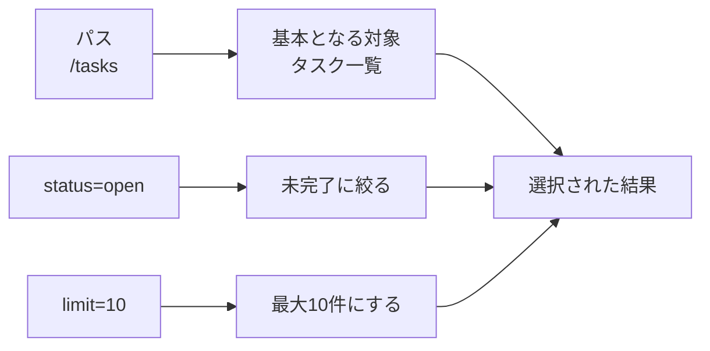
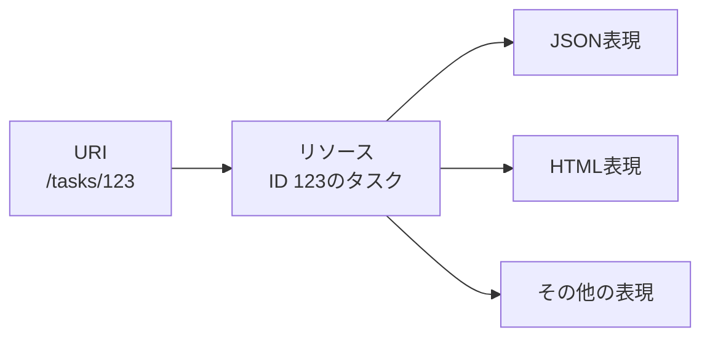
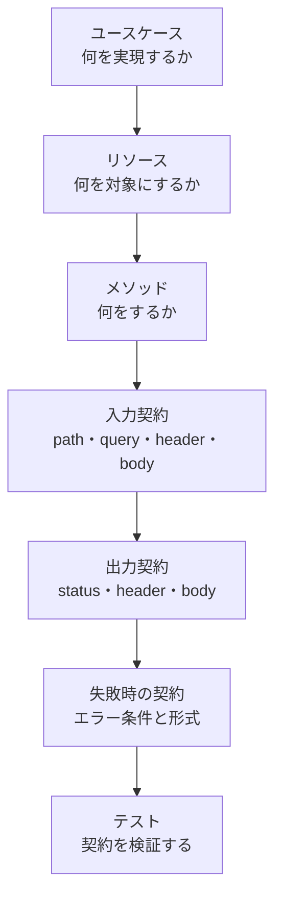
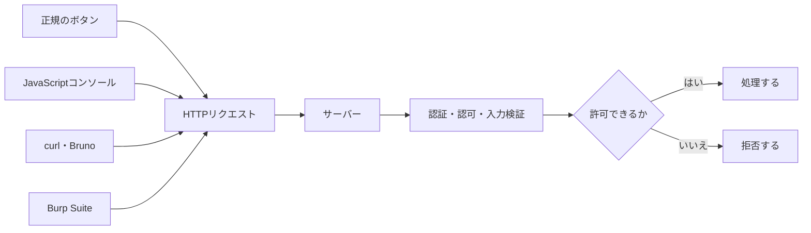
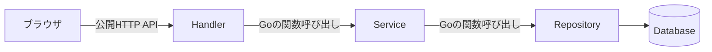
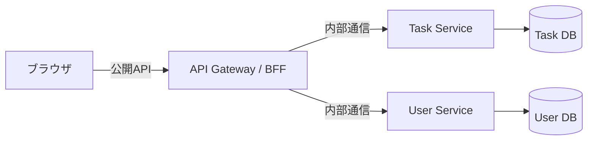
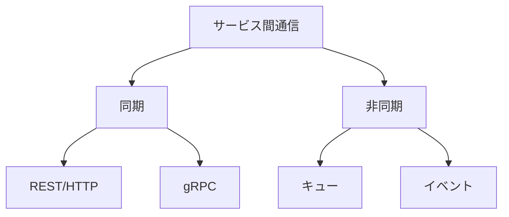

# クエリ付きGETから学ぶHTTP・API設計・サーバー側検証

## この文書の目的

この文書では、クエリ付きGETの観察から始まった疑問を、HTTPとAPI設計の基礎から、クライアントを信用しないセキュリティ設計、内部API、大規模システムの構成まで順番に整理します。

主な到達目標は次のとおりです。

- URLのパスとクエリを区別できる
- クエリ付きGETでもHTTPメソッドは`GET`のままだと説明できる
- リソースと、その表現であるレスポンスデータを区別できる
- メソッド、パス、クエリ、ヘッダー、ボディの役割を説明できる
- API開発者がクエリパラメータについて設計する内容を説明できる
- ブラウザが作ったリクエストもサーバー側で検証する理由を説明できる
- 公開APIと内部処理・内部APIを分ける目的とコストを説明できる

文書は次の順序で進みます。

| 区分 | 章 | 内容 |
|---|---:|---|
| 基礎 | 1〜4 | クエリ付きGET、パス、クエリ、リソース、表現 |
| 観察 | 5 | Postman Echoと`curl -v`による比較 |
| API設計 | 6 | API契約、クエリ仕様、メソッド、タスクAPIの例 |
| クライアントとセキュリティ | 7〜10 | メソッド指定、リクエスト改変、サーバー検証、内部API |
| システム構成 | 11 | 同期・非同期通信、独立サービス、モジュラーモノリス |
| 確認 | 12〜14 | 疑問対応表、チェックリスト、参考資料 |

最初に重要な結論をまとめると、次のようになります。

```text
パス
→ APIが扱う基本的な対象を表す

クエリ
→ 対象の選択条件や、返し方のオプションを表すことが多い

HTTPメソッド
→ 対象に対して何をしたいかを表す

サーバー
→ クライアントから届くすべての値を検証し、処理を許可するか最終判断する
```

---

## 1. クエリ付きGETの基本

### 1.1 クエリ付きGETとは

> **疑問1：クエリ付きGETとは何か。**

クエリ付きGETとは、URLにクエリを含めて送信するGETリクエストです。

```text
https://postman-echo.com/get?name=pikachu&limit=10
```

このURLは次の要素に分けられます。

```text
https://postman-echo.com/get?name=pikachu&limit=10
─────   ──────────────── ─── ─────────────────────
  │             │          │             │
  │             │          │             └─ クエリ
  │             │          └─────────────── パス
  │             └────────────────────────── ホスト
  └──────────────────────────────────────── スキーム
```

| 要素 | 値 | 役割 |
|---|---|---|
| スキーム | `https` | 通信方法を示す |
| ホスト | `postman-echo.com` | 接続先を示す |
| パス | `/get` | 基本となる対象や処理の入口を示す |
| クエリ | `name=pikachu&limit=10` | 追加の条件やオプションを示す |

クエリの中は、一般的に名前と値の組み合わせとして扱います。

| パラメータ名 | 値 |
|---|---|
| `name` | `pikachu` |
| `limit` | `10` |

- `?`はパスとクエリの区切り
- `&`は複数のクエリパラメータの区切り
- `=`はパラメータ名と値の区切り

一般的には「クエリ付きパラメータ」ではなく、`name`や`limit`を**クエリパラメータ**、URLの`?`より後ろを**クエリ**または**クエリ文字列**と呼びます。

### 1.2 クエリを付けてもメソッドは変わらない

クエリがあっても、メソッドは`GET`のままです。

```http
GET /get?name=pikachu&limit=10 HTTP/1.1
Host: postman-echo.com
```

このリクエスト行は次のように分けられます。

```text
GET /get?name=pikachu&limit=10 HTTP/1.1
─── ─────────────────────────── ────────
 │               │                 │
 │               │                 └─ HTTPバージョン
 │               └─────────────────── リクエストターゲット
 └─────────────────────────────────── HTTPメソッド
```

HTTP/2の`curl -v`出力では、同じ情報が疑似ヘッダーとして見えます。

```text
:method: GET
:path: /get?name=pikachu&limit=10
```

| 疑似ヘッダー | 値 | 意味 |
|---|---|---|
| `:method` | `GET` | HTTPメソッド |
| `:path` | `/get?name=pikachu&limit=10` | パスとクエリを含むリクエストターゲット |

したがって、クエリありとクエリなしの比較で変わるのは、メソッドではなく主に`:path`です。

### 1.3 シェルではURLを引用符で囲む

zshなどのシェルでは、`&`にバックグラウンド実行という特別な意味があります。そのため、クエリを含むURLは引用符で囲みます。

```bash
curl -v 'https://postman-echo.com/get?name=pikachu&limit=10'
```

クエリにはパスワード、セッションID、APIキーなどの秘密情報を入れません。URLはブラウザ履歴、アクセスログ、監視記録などに残る可能性があるためです。

---

## 2. パスは誰が決めるのか

### 2.1 `/search`は決められた共通パスではない

> **疑問2：`/search`は決まっているパスなのか。ほかのパスもあるのか。**

`/search`は説明用の例であり、HTTPであらかじめ決められた共通パスではありません。どのパスを提供するかは、WebサイトやAPIの開発者が設計します。

タスク管理APIなら、例えば次のパスを設計できます。

| パス | 想定する対象 |
|---|---|
| `/health` | アプリケーションの稼働状態 |
| `/api/tasks` | タスクの一覧 |
| `/api/tasks/123` | IDが`123`のタスク |
| `/api/users` | ユーザーの一覧 |
| `/api/me` | 現在認証されているユーザー |

同じパスでも、メソッドが異なれば操作の意味が変わります。

| メソッドとパス | 意味の例 |
|---|---|
| `GET /api/tasks` | タスク一覧を取得する |
| `POST /api/tasks` | 新しいタスクを作成する |
| `GET /api/tasks/123` | タスク`123`を取得する |
| `PATCH /api/tasks/123` | タスク`123`の一部を更新する |
| `DELETE /api/tasks/123` | タスク`123`を削除する |

このように、APIの操作はURLだけではなく、少なくとも**メソッドとパスの組み合わせ**で識別します。

### 2.2 クライアントはHTMLの構造を知る必要があるか

> **疑問3：クエリは対象ページを検索するものか。ページ構造を知らないと使えないのか。**

クエリは、対象ページを探すためだけのものではありません。検索、絞り込み、並び替え、件数制限など、パスが示す対象へ条件やオプションを加えるためによく使います。

クライアントが知る必要があるのはHTMLの内部構造ではなく、APIが公開している**契約**です。

```text
APIの契約
├─ 使用するメソッド
├─ パス
├─ 利用できるクエリパラメータ
├─ 必要なヘッダー
├─ リクエストボディの形式
├─ レスポンスの形式
└─ エラーの条件
```

契約を知る方法には、次のものがあります。

- APIドキュメントを読む
- Webサイトのリンクや検索フォームが生成するURLを見る
- ブラウザのNetworkタブで通信を確認する
- 自分で作るAPIなら、仕様を自分で設計して文書化する

### 2.3 文書化されていないAPIは分からないのか

> **疑問4：公開されているAPI以外は、クライアントから分からないのか。**

どこにも記録されず、一度も呼び出されないパスを、クライアントが自動的にすべて一覧取得できるとは限りません。しかし、文書化されていないAPIでも、次の場所から発見・推測される可能性があります。

- Networkタブに表示された通信
- HTMLのリンクやフォーム
- 配信されたJavaScript
- `sitemap.xml`などの公開ファイル
- エラーメッセージ
- `/api/users`や`/api/admin`などの一般的な命名規則

```text
画面にリンクがない
≠ APIが存在しない

APIを文書化していない
≠ APIを発見されない

APIのパスを知られている
≠ 実行を許可しなければならない
```

APIのパスを秘密にすることは、認証や認可の代わりになりません。パスを知られても、権限のないリクエストをサーバーが拒否できる設計が必要です。

---

## 3. クエリが表すもの

### 3.1 クエリの代表的な役割

クエリは、リソースの取得条件や返し方のオプションを表すためによく使います。

| 用途 | 例 | 意味 |
|---|---|---|
| 検索 | `/tasks?keyword=HTTP` | `HTTP`を含むタスクを探す |
| 絞り込み | `/tasks?status=open` | 未完了タスクに絞る |
| 並び替え | `/tasks?sort=created_at` | 作成日時で並べる |
| 並び順 | `/tasks?order=desc` | 降順にする |
| 件数制限 | `/tasks?limit=10` | 最大10件返す |
| ページ指定 | `/tasks?page=2` | 2ページ目を返す |
| 表現の選択 | `/reports?format=summary` | 要約形式で返す |

例えば、次のURLを考えます。

```text
/tasks?status=open&limit=10
```



説明を単純にする場合は「パスが基本となるリソースを示し、クエリが条件を追加する」と考えられます。

厳密には、URIのパスとクエリの両方がリソースの識別に関わります。したがって、次の2つは異なる対象URIです。

```text
/tasks
/tasks?status=open
```

### 3.2 APIの機能をクエリで表現するのか

> **疑問5：API開発者は`name`や`limit`の機能も設計するのか。APIの機能をクエリで表現すると考えてよいか。**

API開発者がクエリパラメータの意味や制約を設計する、という理解は正しいです。ただし、APIのすべての機能をクエリで表すわけではありません。

APIの動作は、主に次の組み合わせで決まります。

| 要素 | 主な役割 | 例 |
|---|---|---|
| メソッド | 対象へ何をするか | `GET`、`POST`、`DELETE` |
| パス | 基本となる対象 | `/tasks/123` |
| クエリ | 選択条件やオプション | `?status=open` |
| ヘッダー | 表現形式、認証情報などの付加情報 | `Accept`、`Content-Type` |
| ボディ | 作成・更新する内容など | JSONのタスク情報 |

```http
GET /tasks?status=open&limit=10
```

この例では、役割を次のように分担しています。

```text
GET
→ 取得する

/tasks
→ タスク一覧を対象にする

status=open
→ 未完了に絞る

limit=10
→ 最大10件にする
```

削除のような状態変更を、GETのクエリだけで表す設計は避けます。

```http
# 避けたい例
GET /tasks/123?action=delete

# 操作の意味が明確な例
DELETE /tasks/123
```

GETは、クライアントがサーバーの状態変更を要求しない安全なメソッドとして設計します。

### 3.3 Postman Echoの`name`と`limit`は検索機能ではない

次のリクエストで使用した`name`と`limit`は、Postman Echoがポケモン検索や件数制限として設計した機能ではありません。

```text
https://postman-echo.com/get?name=pikachu&limit=10
```

Postman Echoの`/get`は、受け取ったクエリを確認用にそのまま返します。

```json
{
  "args": {
    "name": "pikachu",
    "limit": "10"
  }
}
```

この`limit=10`によって、何かの検索結果が10件に制限されているわけではありません。`name`と`limit`は、クエリの送受信を観察するためにクライアント側で選んだ名前です。

---

## 4. リソースと表現

### 4.1 「対象」とはリソースを指す

> **疑問6：クエリを追加する「対象」とはデータなのか、リソースなのか。そもそもリソースとは何か。**

HTTPリクエストの対象は、**リソース**と呼ばれます。リソースは、HTTPを通して取得や操作を行う概念上の対象です。

| URIの例 | リソースの例 |
|---|---|
| `/tasks` | タスクの集合 |
| `/tasks/123` | IDが`123`のタスク |
| `/users/10` | IDが`10`のユーザー |
| `/health` | アプリケーションの現在の稼働状態 |
| `/reports/daily` | その時点で生成される日次レポート |

リソースは、必ずしもデータベースの1行や保存済みファイルではありません。`/health`のように、その場で計算される状態もリソースとして扱えます。

### 4.2 レスポンスボディはリソースの表現

次のリクエストを考えます。

```http
GET /tasks/123
```

リソースは「IDが`123`のタスク」です。レスポンスのJSONは、そのリソースを通信可能な形式にした**表現**です。

```json
{
  "id": 123,
  "title": "HTTPを学ぶ",
  "status": "open"
}
```



| 用語 | 意味 |
|---|---|
| リソース | クライアントが取得・操作したい概念上の対象 |
| 表現 | リソースをJSONやHTMLなどで表したデータ |
| DBレコード | リソースを実装するために保存された内部データの一つ |

したがって、「対象はデータか、リソースか」への回答は次のようになります。

> 対象はリソースであり、サーバーはそのリソースをJSONなどのデータで表現して返す。リソースがDBデータに対応することはあるが、同じ概念ではない。

---

## 5. `curl -v`でクエリの有無を比較する

### 5.1 なぜPostman Echoを使うのか

> **疑問7：クエリ付きGETのリクエストとレスポンスを観察するには、どのサイトが適しているか。**

学習では、通常のWebサイトよりもHTTPの確認用サービスが適しています。Postman Echoは、受け取ったメソッド、クエリ、ヘッダー、URLなどをレスポンスへ反映するため、リクエストとレスポンスの対応を観察できます。

```text
送信
GET /get?name=pikachu&limit=10

応答
{
  "args": {
    "name": "pikachu",
    "limit": "10"
  }
}
```

実在する一般サイトの未知のAPIを推測して試すのではなく、HTTP確認用として提供されたサービス、自分のlocalhost、または明示的に許可された環境を利用します。

### 5.2 比較ではパスをそろえる

> **疑問8：クエリありとクエリなしでは、メソッドの部分だけが変わるのか。違いが分かりにくいのはなぜか。**

メソッドはどちらも`GET`なので変わりません。クエリの有無だけを比較するには、パスやほかの条件をそろえる必要があります。

クエリの有無だけを比較する場合、パスを同じにします。

```bash
# クエリなし
curl -v 'https://postman-echo.com/get'

# クエリあり
curl -v 'https://postman-echo.com/get?name=pikachu&limit=10'
```

次の比較では、パスまで異なるため、クエリだけの比較にはなりません。

```bash
# /getと/が異なる
curl -v 'https://postman-echo.com/get?name=pikachu&limit=10'
curl -v 'https://postman-echo.com/'
```

`/`がリダイレクト用、`/get`がJSON応答用として設計されていれば、クエリとは関係なくレスポンスのステータスや形式が変わります。

### 5.3 リクエストの比較

| 項目 | クエリなし | クエリあり |
|---|---|---|
| メソッド | `GET` | `GET` |
| パス | `/get` | `/get` |
| クエリ | なし | `name=pikachu&limit=10` |
| `:path` | `/get` | `/get?name=pikachu&limit=10` |
| リクエストボディ | 空 | 空 |

```text
クエリなし
> GET /get HTTP/2

クエリあり
> GET /get?name=pikachu&limit=10 HTTP/2
```

メソッドは両方とも`GET`です。`GET`の後ろにあるリクエストターゲットが変化しています。

### 5.4 レスポンスの比較

Postman Echoでは、クエリの有無がレスポンスボディの`args`と`url`に反映されます。

```json
{
  "args": {},
  "url": "https://postman-echo.com/get"
}
```

```json
{
  "args": {
    "name": "pikachu",
    "limit": "10"
  },
  "url": "https://postman-echo.com/get?name=pikachu&limit=10"
}
```

| 項目 | クエリなし | クエリあり |
|---|---|---|
| `args` | `{}` | `{"name":"pikachu","limit":"10"}` |
| `url` | `/get`で終わる | クエリを含む |
| `Content-Length`、`ETag` | ボディに応じた値 | ボディに応じて変化し得る |

`Date`、`Set-Cookie`の値、CDNのリクエストID、処理時間などは、クエリとは無関係にリクエストごとに変化する場合があります。クエリの効果を調べるときは、まず`:path`、`args`、`url`へ注目します。

### 5.5 JSONはレスポンスボディか

> **疑問9：`{"args":{}, ...}`の部分はレスポンスボディか。**

はい。`{`から`}`までのJSONがレスポンスボディです。

```text
<                                      ← ヘッダーとボディの境界
* Connection #0 ... left intact        ← curlの補足情報
{"args":{}, ...}                       ← レスポンスボディ
%                                      ← zshの表示
```

| 表示 | 生成元 | HTTPレスポンスボディに含まれるか |
|---|---|---|
| `<` | curlのverbose表示 | 含まれない |
| `* Connection #0 ...` | curlの接続情報 | 含まれない |
| `{"args":{}, ...}` | サーバー | 含まれる |
| 末尾の`%` | zsh | 含まれない |

レスポンス本文の末尾に改行がない場合、zshが`%`を表示することがあります。

### 5.6 記録時はCookie値をマスクする

`curl -v`の出力に`Set-Cookie`が含まれる場合、Cookie値をそのままGitへ保存しません。

```http
Set-Cookie: sails.sid=[MASKED]; Path=/; HttpOnly
Set-Cookie: __cf_bm=[MASKED]; HttpOnly; SameSite=None; Secure
Set-Cookie: _cfuvid=[MASKED]; HttpOnly; SameSite=None; Secure
```

属性を観察する目的なら、名前と`Path`、`HttpOnly`、`Secure`、`SameSite`などを残し、値だけをマスクします。

---

## 6. API開発者が設計すること

### 6.1 APIは契約である

API開発者は、コードを書く前に、クライアントとサーバーの間で守る契約を設計します。



設計対象には次が含まれます。

- どのリソースを扱うか
- どのメソッドとパスを提供するか
- どのクエリパラメータを受け付けるか
- どのヘッダーが必要か
- リクエストボディとレスポンスボディをどの形式にするか
- 正常時と異常時にどのステータスコードを返すか
- 誰がどのリソースを操作できるか
- 同じリクエストを再送した場合にどうなるか

### 6.2 クエリパラメータの設計項目

例えば`limit`を提供するなら、名前だけでなく次を設計します。

| 設計項目 | 仕様例 |
|---|---|
| 名前 | `limit` |
| 意味 | 最大取得件数 |
| 型 | 整数 |
| 必須か | 任意 |
| 省略時 | `20` |
| 最小値 | `1` |
| 最大値 | `100` |
| 不正な文字列 | `400 Bad Request` |
| 同じ名前が複数ある場合 | 拒否する、最初を使うなどを決める |

検討すべき入力例は次のとおりです。

```text
?limit=10
?limit=0
?limit=-1
?limit=abc
?limit=1000000
?limit=10&limit=20
?limit=
```

検索用の`name`なら、次のような設計項目があります。

- 完全一致か部分一致か
- 大文字と小文字を区別するか
- 前後の空白をどう扱うか
- 空文字を許可するか
- 最大文字数はいくつか
- Unicodeをどう扱うか
- 複数指定を許可するか
- URLエンコードされた値をどう解釈するか

### 6.3 メソッドの役割

代表的なメソッドの設計上の意味は次のとおりです。

| メソッド | 主な目的 | 安全 | 冪等 |
|---|---|---:|---:|
| `GET` | 現在の表現を取得する | はい | はい |
| `POST` | 作成や処理を依頼する | いいえ | 通常はいいえ |
| `PUT` | 対象を置き換える | いいえ | はい |
| `PATCH` | 対象の一部を変更する | いいえ | 設計による |
| `DELETE` | 対象との関連を削除する | いいえ | はい |

- **安全**：クライアントがサーバー状態の変更を要求しない
- **冪等**：同じリクエストを複数回実行しても、意図された最終状態が1回の場合と同じ

安全なメソッドでも、アクセスログの記録などの付随的な変化は起こり得ます。重要なのは、GETを送ったクライアントが削除や更新を要求していないことです。

未対応のメソッドを受け取った場合は、例えば次のように返します。

```http
HTTP/1.1 405 Method Not Allowed
Allow: GET, PATCH, DELETE
```

### 6.4 タスクAPIの設計例

```http
GET    /api/tasks
GET    /api/tasks/{id}
POST   /api/tasks
PATCH  /api/tasks/{id}
DELETE /api/tasks/{id}
```

一覧取得に条件を追加します。

```http
GET /api/tasks?status=open&sort=created_at&order=desc&limit=20
```

| 要素 | 設計上の意味 |
|---|---|
| `GET` | 取得する |
| `/api/tasks` | タスクの集合を対象にする |
| `status=open` | 未完了に絞る |
| `sort=created_at` | 作成日時を並び替えの基準にする |
| `order=desc` | 降順にする |
| `limit=20` | 最大20件返す |

新規作成する内容は、通常はクエリではなくボディへ入れます。

```http
POST /api/tasks HTTP/1.1
Content-Type: application/json

{
  "title": "HTTPを学ぶ"
}
```

設計の中心は、特定の形を暗記することではありません。要求、責務、制約、失敗条件を整理し、なぜそのメソッド・パス・入力形式を選んだか説明できることが重要です。

---

## 7. ユーザーはメソッドを指定できるか

### 7.1 URLだけではメソッドは決まらない

> **疑問10：ユーザーはメソッドを指定してAPIを実行できるか。URL欄から実行する場合、メソッドまで指定できるか。**

URLとHTTPメソッドは別の情報です。同じURLに異なるメソッドを送れます。

```http
GET /api/tasks/123
```

```http
DELETE /api/tasks/123
```

ブラウザのアドレス欄にURLを入力して移動すると、基本的にGETリクエストになります。アドレス欄のURLへ`DELETE`などを書き足して指定することはできません。

ただし、別のHTTPクライアントやJavaScriptを使えばメソッドを指定できます。

| 操作方法 | 主に指定できるメソッド |
|---|---|
| ブラウザのアドレス欄 | `GET` |
| 通常のリンク | `GET` |
| HTMLフォーム | `GET`、`POST` |
| JavaScriptの`fetch` | `GET`、`POST`、`PUT`、`PATCH`、`DELETE`など |
| curl、Bruno、Postman | 任意のメソッド |
| Burp Suite | 取得したリクエストのメソッドを変更可能 |

curlでは、例えば次のように指定できます。

```bash
curl -v -X DELETE 'https://example.com/api/tasks/123'
```

```bash
curl -v -X PATCH \
  -H 'Content-Type: application/json' \
  -d '{"title":"変更後のタイトル"}' \
  'https://example.com/api/tasks/123'
```

ユーザーが任意のメソッドを送信できることと、その処理が許可されることは別です。

```text
DELETEリクエストを送信できる
≠ 削除を許可されている
```

サーバーが、メソッド、認証状態、権限、入力値を検証して最終判断します。

---

## 8. フロントエンドからのリクエストも信用しない

### 8.1 読み取りと状態変更は性質が異なる

> **疑問11：削除ボタンから発生するAPIと、ユーザーが指定するクエリ付きGETは性質が違うのではないか。ユーザーがリソースを直接変更できるのは問題ではないか。**

GETとDELETEでは、操作の性質が異なります。

| リクエスト | 性質 |
|---|---|
| `GET /tasks?status=open` | 条件に合うリソースの表現を取得する |
| `DELETE /tasks/123` | リソースとの関連を削除し、サーバー状態を変更する |

ユーザーが削除APIを呼べること自体は問題ではありません。自分のタスクを削除できるという仕様なら、それは意図した機能です。

問題は、次のような操作ができる場合です。

- 他人のタスクを削除できる
- 一般ユーザーが管理者機能を実行できる
- 許可されていない状態へ変更できる
- 入力値を書き換えて業務ルールを回避できる

つまり、重要なのは「APIを呼べるか」ではなく、「そのユーザーに、そのリソースへの、その操作を許可してよいか」です。

### 8.2 ボタンが作るリクエストも変更できる

> **疑問12：フロントエンドが自動で組み立てるAPIもサーバー側で検証すべきか。ボタンから送るAPIは書き換えられるか。**

必ずサーバー側で検証します。フロントエンドはユーザーの端末上で動くため、信頼できる境界ではありません。

削除ボタンが次の処理を呼ぶとします。

```javascript
fetch("/api/tasks/123", {
  method: "DELETE"
})
```

ユーザーはNetworkタブで通信を確認し、別のリクエストとして再構成できます。

```javascript
fetch("/api/tasks/124", {
  method: "DELETE"
})
```

元のJavaScriptファイルそのものを書き換える必要はありません。NetworkタブからcURLとしてコピーしたり、JavaScriptコンソール、curl、Bruno、Burp Suiteなどで別のリクエストを送れます。



サーバーから見ると、正規のボタンから届いたリクエストか、手作りされたリクエストかを、セキュリティ判断の根拠として確実に区別できません。

### 8.3 フロントエンド検証とサーバー検証の役割

| 検証場所 | 主な目的 | 信頼できるか |
|---|---|---:|
| フロントエンド | 入力ミスを早く知らせ、操作性を上げる | いいえ |
| サーバー | 不正なリクエストを拒否し、データと業務ルールを守る | 最終判断を行う |

タイトルを必須にする場合は、両方で検証します。

```text
フロントエンド
→ 空欄なら送信前にエラーを表示する

サーバー
→ 空文字を受け取ったら400 Bad Requestとして拒否する
```

フロントエンドの必須入力は、curlなどから回避できます。

```bash
curl -X POST \
  -H 'Content-Type: application/json' \
  -d '{"title":""}' \
  'https://example.com/api/tasks'
```

### 8.4 サーバー側で検証する内容

```text
1. メソッド
   → このパスで許可されたメソッドか

2. 認証
   → 誰がリクエストしたか

3. 認可
   → そのユーザーが、その対象へ、その操作を実行できるか

4. 入力形式
   → パス、クエリ、ヘッダー、JSONが正しいか

5. 業務ルール
   → 許可された状態変更か

6. ブラウザ固有の攻撃への対策
   → Cookie認証ならCSRF対策などが必要か
```

代表的な失敗時のステータスは次のとおりです。

| 状況 | ステータスの例 |
|---|---|
| 入力形式が不正 | `400 Bad Request` |
| 認証されていない | `401 Unauthorized` |
| 認証済みだが権限がない | `403 Forbidden` |
| 対象が存在しない、または存在を隠す | `404 Not Found` |
| メソッドが許可されていない | `405 Method Not Allowed` |

### 8.5 IDを書き換える攻撃を防ぐ

ユーザー`10`が自分のタスク`123`を削除できるとしても、タスク`124`が他人のものなら拒否する必要があります。

```text
認証されたユーザー：10
対象タスク：123
タスクの所有者：10
→ 許可

認証されたユーザー：10
対象タスク：124
タスクの所有者：20
→ 拒否
```

DB操作では、対象IDだけでなく、認証済みユーザーのIDを条件へ含める方法があります。

```sql
DELETE FROM tasks
WHERE id = ? AND user_id = ?;
```

この`user_id`には、クライアントがJSONやクエリで送った値ではなく、認証済みセッションから取得した値を使います。

パスやクエリのIDを書き換えて他人のリソースへアクセスできる問題は、Broken Object Level Authorization（BOLA）と呼ばれます。メソッドやパスを変えて管理者機能などを実行できる問題は、Broken Function Level Authorization（BFLA）に関係します。

### 8.6 GETにも認可が必要

GETは状態を変更しないという意味では安全ですが、誰でもデータを読んでよいという意味ではありません。

```http
GET /api/tasks?user_id=20
```

クエリを書き換えて他人のタスクを取得できるなら、読み取りAPIにも認可の問題があります。

```text
GETだから安全
→ 状態変更を要求しないという意味

GETだから認可不要
→ 誤り
```

---

## 9. ブラウザからAPIのパスを隠せるか

### 9.1 ブラウザが直接呼ぶパスは完全には隠せない

> **疑問13：ブラウザ側でAPIのパスを見せないアプリケーションを実装できないか。**

画面上に文字として表示しないことはできます。しかし、ブラウザが直接呼び出すAPIのパスを、そのブラウザの利用者から完全に隠すことはできません。

ブラウザは、リクエストを送る時点で最終的な送信先を知る必要があります。

```text
ブラウザ
  │
  │ DELETE /api/tasks/123
  ▼
公開API
```

最終的なURLは、Networkタブやプロキシで確認できます。

次の方法も、セキュリティ上の隠蔽にはなりません。

- パスをJavaScript内で分割して組み立てる
- JavaScriptをminify・難読化する
- ボタンやリンクを非表示にする
- 推測しにくいパス名を使う
- APIドキュメントへ記載しない

```javascript
const a = "/api";
const b = "/tasks";
fetch(a + b + "/123");
```

ソースを読みにくくしても、送信時には`/api/tasks/123`として観察できます。

### 9.2 CORSも認可の代わりではない

CORSは、主にブラウザが異なるオリジンのレスポンスをスクリプトへ公開してよいかを制御する仕組みです。curl、Bruno、Burp SuiteなどのHTTPクライアントそのものを止める仕組みではありません。

```text
CORSで許可していない
≠ APIへリクエストを送れない

CORSで許可している
≠ そのユーザーに操作権限がある
```

CORSとは別に、サーバー側の認証・認可が必要です。

---

## 10. 公開API、内部処理、内部API

### 10.1 内部処理を公開しない意味

> **疑問14：内部処理や内部APIを外部から見えなくすればセキュリティは上がるのか。設計・運用コストも上がるのか。**

外部から直接到達できる入口を減らし、ネットワーク制御やサービス間認証を適用できれば、セキュリティは向上します。ただし、単にパスを秘密にするだけでは十分ではありません。また、別プロセスや別サービスへ分けると、通信障害、認証、監視、デプロイなどの設計・運用コストが増えます。

ブラウザが直接呼ぶ必要のない処理は、外部から直接接続できないようにできます。



この構成では、外部へ公開されるのはHTTP Handlerのルートだけです。ServiceやRepositoryは、Goアプリケーション内部の関数として実装できます。

```text
外部から接続できる
→ HTTP Handler

外部から直接接続できない
→ Service、Repository、DB
```

Goの`internal/`ディレクトリは、パッケージのimport範囲を制限する仕組みです。責務境界を表す助けになりますが、それ自体がネットワーク上の認証・認可を行うものではありません。

### 10.2 独立した内部サービス

規模や組織上の必要がある場合は、内部処理を別プロセス・別サービスへ分けます。



ブラウザには内部サービスのアドレスを公開せず、次のような制限を適用できます。

- インターネットから内部サービスへ直接接続できない
- API Gatewayや許可されたサービスからだけ接続できる
- サービス間で認証する
- ネットワークポリシーやファイアウォールで通信元を制限する

この場合にセキュリティが向上する理由は、パスが秘密になったからではありません。外部から到達できる入口を減らし、ネットワークと認証で直接アクセスを制限したからです。

### 10.3 内部APIを隠しても公開APIの認可は必要

```text
攻撃者
  ↓ DELETE /api/tasks/他人のID
公開API
  ↓ 認可に失敗している
内部サービス
  ↓
他人のデータを削除
```

内部サービスを外部から直接呼べなくても、公開APIの認可に不備があれば、公開APIを経由して内部機能が悪用されます。

```text
内部サービスを非公開にする
＋
公開APIで認証・認可・入力検証する
＋
必要に応じてサービス間も認証する
```

これらを組み合わせて、多層的に保護します。

---

## 11. 大規模システムの内部通信

### 11.1 すべてを独立HTTPサービスにはしない

> **疑問15：大規模システムでは内部APIを独立したHTTPサービスにすることが多いのか。ほかの実装が多いのか。**

独立した内部サービスは広く使われていますが、すべての内部処理をREST/JSONのHTTP APIにするわけではありません。実際のシステムでは、処理の性質に合わせて複数方式を組み合わせます。

| 方式 | 適する場面 | 主なトレードオフ |
|---|---|---|
| 同一プロセスの関数・モジュール | 独立デプロイや個別スケールが不要 | 単純で高速だが、プロセス単位で一緒にデプロイする |
| REST/JSON over HTTP | 即時応答、汎用性、調査しやすさを重視 | 分かりやすいが、通信とJSON変換のコストがある |
| gRPC | 型定義、通信効率、内部RPCを重視 | 専用ツールやスキーマ管理が必要 |
| キュー | 後で処理でき、負荷を平準化したい | 再試行、重複、順序の設計が必要 |
| イベント配信 | 複数サービスへ出来事を通知したい | 結果整合性と追跡が難しくなる |
| バッチ・ジョブ | 集計、請求、レポートなど | 即時応答には向かない |

大きく分けると、通信は同期と非同期があります。



| 性質 | 同期 | 非同期 |
|---|---|---|
| 呼び出し元 | 応答を待つ | 通常は処理完了を待たない |
| 適する例 | 在庫の即時確認 | メール通知、監査ログ |
| 主な課題 | 遅延、下流障害の連鎖 | 重複、順序、結果整合性 |

### 11.2 独立サービスに分ける判断材料

次の必要性が明確な場合に、独立サービスを検討します。

- 別チームが独立して所有・開発・運用する
- その機能だけ個別にデプロイする
- その機能だけ個別にスケールする
- 障害の影響をプロセス単位で分離する
- 業務上の責任範囲が明確に分かれている
- 異なる技術やデータストアを選ぶ必要がある

「内部処理を隠したい」だけで分割すると、得られる効果よりコストが大きくなる場合があります。

### 11.3 独立サービスのコスト

| 分類 | 増える設計・運用項目 |
|---|---|
| 通信 | タイムアウト、再試行、接続管理 |
| 障害対応 | Circuit Breaker、部分障害、フォールバック |
| セキュリティ | サービス間認証、証明書、秘密情報管理 |
| データ | 分散トランザクション、結果整合性 |
| 変更管理 | API契約、バージョニング、互換性 |
| 可観測性 | 集約ログ、メトリクス、分散トレース |
| 運用 | 複数サービスのデプロイ、監視、スケール |
| 性能 | ネットワーク遅延、シリアライズ |

独立サービスは、各サービスを単純に見せる一方で、システム全体を分散システムとして複雑にします。

### 11.4 このリポジトリでの考え方

このリポジトリでは、最初は単一のGoアプリケーションとして実装し、必要になった責務だけを関数やパッケージへ分ける方針が適しています。

```text
main.go
  ↓
HTTP Handler
  ↓
必要に応じてService相当の処理
  ↓
必要に応じてRepository相当の処理
  ↓
Database
```

このように、1つのデプロイ単位を保ちながら内部の責務を分ける構成は、モジュラーモノリスと呼ばれることがあります。

最初からレイヤーやマイクロサービスを完成形として用意するのではなく、次を説明できるときに分割します。

- 何の責務を分けたいか
- 分けることで何が改善するか
- 関数呼び出しではなくネットワーク通信にする必要があるか
- 増える障害要因と運用コストを受け入れられるか
- どのテストで境界の契約を保証するか

将来、独立デプロイや個別スケールが本当に必要になった場合は、内部モジュールの境界をHTTP、gRPC、メッセージングなどの境界へ変更することを検討します。

---

## 12. 疑問と回答の対応表

この議論で生じた疑問と、最終的な理解を一覧にします。

| No. | 疑問 | 回答の要点 |
|---:|---|---|
| 1 | クエリ付きGETとは何か | GETメソッドのURLにクエリを含めたリクエスト。メソッドはGETのまま |
| 2 | `/search`は決められたパスか | 例にすぎない。利用可能なパスはAPI開発者が設計する |
| 3 | クエリはページを検索するものか。ページ構造を知る必要があるか | 検索だけでなく条件・オプションを表す。必要なのはHTML構造ではなくAPI契約 |
| 4 | 非公開・未文書化APIはクライアントに分からないか | 自動的に一覧化できるとは限らないが、通信、JavaScript、命名規則などから発見・推測され得る |
| 5 | API開発者はクエリも設計するか。機能をクエリで表すのか | 意味、型、既定値、制約を設計する。ただし操作全体はメソッド・パス・クエリなどの組み合わせで表す |
| 6 | クエリを追加する対象はデータか、リソースか | 対象はリソース。JSONなどのデータはリソースの表現 |
| 7 | クエリ付きGETの観察にはどのサイトが適するか | HTTP確認用のPostman Echo、自分のlocalhost、または明示的に許可された環境を使う |
| 8 | クエリあり・なしで何が変わるか | メソッドではなく`:path`が変わり、Postman Echoではレスポンスの`args`と`url`に反映される |
| 9 | `curl -v`末尾のJSONはレスポンスボディか | JSONだけがボディ。`* Connection...`はcurl、末尾の`%`はzshの表示 |
| 10 | ユーザーはメソッドを指定できるか | アドレス欄は基本GET。fetch、curl、Bruno、Burp Suiteなどでは各種メソッドを送れる |
| 11 | 削除APIとクエリ付きGETは性質が違うか | GETは取得、DELETEは状態変更。どちらも権限と入力をサーバーが検証する |
| 12 | フロントエンドが作るAPIも検証が必要か。変更できるか | 必要。正規リクエストを観察して、パス、メソッド、ヘッダー、ボディを変えた別のリクエストを送れる |
| 13 | ブラウザからAPIパスを隠せるか | ブラウザが直接呼ぶ最終パスは完全には隠せない。知られても拒否できる設計にする |
| 14 | 内部APIを隠すと安全になるか。コストも上がるか | 到達経路を制限すれば安全性は上がるが、サービス分割は認証・通信・監視・運用のコストを増やす |
| 15 | 大規模システムは内部HTTP APIが中心か | 独立サービスは多いが、関数、REST、gRPC、キュー、イベントなどを要件に応じて組み合わせる |

---

## 13. 設計・実装時の確認チェックリスト

### クエリパラメータ

- [ ] パラメータの名前と意味を説明できる
- [ ] 型、必須・任意、既定値を決めた
- [ ] 最小値、最大値、最大文字数を決めた
- [ ] 空文字、不正値、重複指定の扱いを決めた
- [ ] 不正時のステータスとエラー形式を決めた
- [ ] 秘密情報をクエリへ入れていない

### HTTP API

- [ ] リソースを言葉で説明できる
- [ ] メソッドとパスの組み合わせを説明できる
- [ ] GETで意図的な状態変更を行っていない
- [ ] リクエストとレスポンスの契約を記録した
- [ ] 未対応メソッドを適切に拒否する
- [ ] 正常系だけでなく異常系と境界値を考えた

### セキュリティ

- [ ] パス、クエリ、ヘッダー、ボディを変更可能な入力として扱う
- [ ] フロントエンドの検証だけに依存していない
- [ ] 認証済みユーザーをサーバー側で特定する
- [ ] リソース単位と機能単位の認可を行う
- [ ] Cookie認証に必要なCSRF対策を検討した
- [ ] Cookie、セッションID、トークンをログやGitへ残していない
- [ ] CORSや非表示ボタンを認可の代わりにしていない

### 構成

- [ ] 外部公開が必要なHTTPルートだけを公開している
- [ ] 内部処理をまず関数・パッケージとして分けられないか検討した
- [ ] 独立サービスにする具体的な理由がある
- [ ] 通信障害、認証、監視、デプロイのコストを比較した
- [ ] 現在のPhaseと規模に対して過剰設計になっていない

---

## 14. 参考資料

### このリポジトリ内

- [設計方針](../04-design-policy.md)
- [セキュリティ方針](../09-security-policy.md)
- [ロードマップ](../10-roadmap.md)
- [Phase 0進捗](../progress/phase-0-progress.md)
- [`curl -v`で観察するHTTPレスポンス](http-response-structure-and-headers.md)
- [HTTP Cookieと`HttpOnly`の仕組み](http-cookies-and-httponly.md)
- [HTTP/1.1とHTTP/2の接続・ストリーム・フレーム](http1.1-vs-http2-streams.md)

### 仕様・公式資料

- [RFC 3986：URI Generic Syntax](https://www.rfc-editor.org/rfc/rfc3986.html)
- [RFC 9110：HTTP Semantics](https://www.rfc-editor.org/rfc/rfc9110.html)
- [Postman Echo API](https://learning.postman.com/docs/developer/echo-api/)
- [curl manual](https://curl.se/docs/manpage.html)
- [OWASP API1:2023 Broken Object Level Authorization](https://owasp.org/API-Security/editions/2023/en/0xa1-broken-object-level-authorization/)
- [OWASP API5:2023 Broken Function Level Authorization](https://owasp.org/API-Security/editions/2023/en/0xa5-broken-function-level-authorization/)
- [Azure Architecture Center：マイクロサービスのサービス間通信](https://learn.microsoft.com/ja-jp/azure/architecture/microservices/design/interservice-communication)
- [AWS Prescriptive Guidance：Communication patterns](https://docs.aws.amazon.com/prescriptive-guidance/latest/modernization-integrating-microservices/communication-patterns.html)
