# Webキャッシュの基本と責任分担

## この文書の目的

この文書では、Chrome DevToolsのNetworkパネルに表示された`memory cache`と`disk cache`を出発点として、Webキャッシュの基本から応用までを整理します。

特に、次の疑問へ答えられる状態を目指します。

1. Webキャッシュは何のためにあるのか
2. `memory cache`と`disk cache`はどこに保存されるのか
3. ブラウザとアプリケーション開発者は、それぞれ何を担当するのか
4. `Cache-Control`や`ETag`は何を制御するのか
5. ブラウザキャッシュ、Service Worker、CDN、サーバー内部のキャッシュは何が違うのか
6. ユーザー固有情報を誤ってキャッシュしないために、何へ注意するのか

最初に基本事項を説明し、その後にHTTPヘッダー、再検証、Service Worker、CDNなどの応用へ進みます。

---

## 第1部：キャッシュの基本

## 1. キャッシュとは何か

キャッシュは、一度取得または計算したデータを保存し、後から再利用する仕組みです。

Webブラウザで同じ画像、CSS、JavaScriptなどを何度も利用するたびに、毎回サーバーからすべてダウンロードすると、時間と通信量がかかります。

```text
キャッシュを使わない場合

ブラウザ ── リクエスト ──> サーバー
ブラウザ <── 全データ ──── サーバー

ページを再表示

ブラウザ ── リクエスト ──> サーバー
ブラウザ <── 全データ ──── サーバー
```

キャッシュを使うと、保存済みのレスポンスを再利用できる場合があります。

```text
キャッシュを使う場合

1回目
ブラウザ ── リクエスト ──> サーバー
ブラウザ <── 全データ ──── サーバー
    │
    └── レスポンスを保存

2回目
ブラウザ ── 保存済みレスポンスを再利用
```

### キャッシュの主な目的

- ページを速く表示する
- ネットワーク通信量を減らす
- サーバーの処理負荷を減らす
- 同じデータを繰り返し生成・転送する無駄を減らす
- 通信状態が悪い場合の影響を小さくする

### キャッシュの難しさ

キャッシュには、古いデータを返す可能性があります。

```text
サーバー上のデータ
  新しい内容へ更新済み

ブラウザのキャッシュ
  古い内容が残っている
```

そのため、Webキャッシュでは次の2つを両立させる必要があります。

```text
できるだけ再利用して速くする
              +
必要なときは新しい内容へ更新する
```

---

## 2. HTTPキャッシュで登場する用語

| 用語 | 意味 |
|---|---|
| キャッシュ | レスポンスを保存し、後のリクエストへ再利用する仕組み |
| キャッシュエントリ | 保存されたレスポンスと、その管理情報 |
| キャッシュキー | どの保存済みレスポンスを利用するか識別する情報 |
| Fresh | まだ新鮮で、通常は再検証せず利用できる状態 |
| Stale | 新鮮さの有効期間を過ぎた状態 |
| Cache Hit | 利用可能なキャッシュが見つかった状態 |
| Cache Miss | 利用可能なキャッシュが見つからなかった状態 |
| Revalidation | 保存済みレスポンスを再利用できるか、サーバーへ確認すること |
| Private Cache | 原則として1人の利用者が使うキャッシュ |
| Shared Cache | 複数の利用者で共有するキャッシュ |

### Private CacheとShared Cache

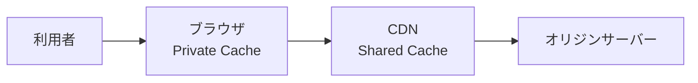

| 種類 | 主な利用者 | 例 |
|---|---|---|
| Private Cache | 1人の利用者 | ブラウザのHTTPキャッシュ |
| Shared Cache | 複数の利用者 | CDN、プロキシキャッシュ |

Chrome DevToolsに表示される`memory cache`と`disk cache`は、主にブラウザが管理するPrivate Cacheの保存方法です。

CloudFrontなどのShared Cacheについては、[CloudFrontの中継とキャッシュの仕組み](cloudfront-intermediary-and-cache.md)で詳しく扱います。

---

## 3. `memory cache`とは何か

`memory cache`は、ブラウザが主にPCのメモリ上で管理しているキャッシュです。

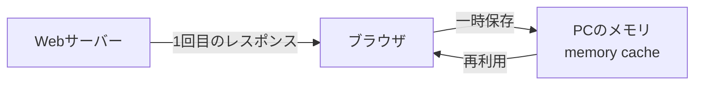

### 特徴

- 主にRAM上に保持される
- 読み出しが速い
- ブラウザのタブやプロセスを閉じると失われる場合がある
- メモリ不足などにより、ブラウザが削除する場合がある
- 保存期間や使用量はブラウザの実装と状態に左右される

厳密には、OSの仮想メモリやブラウザ内部の実装も関係します。そのため、「必ず物理RAMの特定の場所にある」とまでは断定できません。

学習上は、次の理解で問題ありません。

> `memory cache`は、ブラウザが主にPCのメモリ上で管理する、一時的で高速なキャッシュである。

---

## 4. `disk cache`とは何か

`disk cache`は、ブラウザがPCの永続ストレージ上で管理しているキャッシュです。

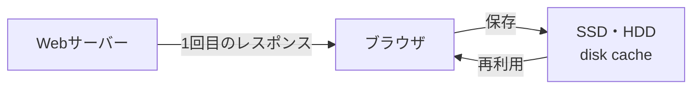

### 保存先

- SSDを使用するPCでは、通常はSSD上
- HDDを使用するPCでは、通常はHDD上
- ブラウザが管理するキャッシュ用領域へ保存される

### 特徴

- ブラウザやPCを再起動した後も残る場合がある
- memory cacheより読み出しに時間がかかる場合がある
- ネットワークから再取得するより速いことが多い
- 保存容量の上限や削除時期はブラウザが管理する

学習上は、次の理解で問題ありません。

> `disk cache`は、ブラウザがPCのSSDまたはHDD上で管理するキャッシュである。

---

## 5. memoryとdiskは誰が選ぶのか

アプリケーション開発者は、HTTPヘッダーを使って「保存してよいか」「どれくらい新鮮と扱うか」を伝えられます。

一方、次のような保存方法の詳細は、基本的にブラウザが決めます。

- memory cacheへ保存するか
- disk cacheへ保存するか
- 両方をどのように組み合わせるか
- いつメモリから削除するか
- いつディスクから削除するか

```text
アプリケーション開発者
  「このCSSは1年間、新鮮と扱ってよい」
                 ↓
ブラウザ
  「保存できる」
  「memoryとdiskのどちらを使うか判断する」
  「後のリクエストで再利用する」
```

次のような要因によって、ブラウザの判断は変化します。

- レスポンスのHTTPキャッシュヘッダー
- リソースの種類とサイズ
- 利用可能なメモリやディスク容量
- ブラウザの実装
- 通常モードかプライベートブラウジングか
- キャッシュが削除されたか
- 利用者が再読み込みや強制再読み込みを行ったか

したがって、アプリ側から「必ずmemory cacheへ入れる」と指定するものではありません。

---

## 6. 誰が何を担当するのか

Webキャッシュでは、ブラウザとアプリケーションの両方が役割を持ちます。

### 責任分担の全体像

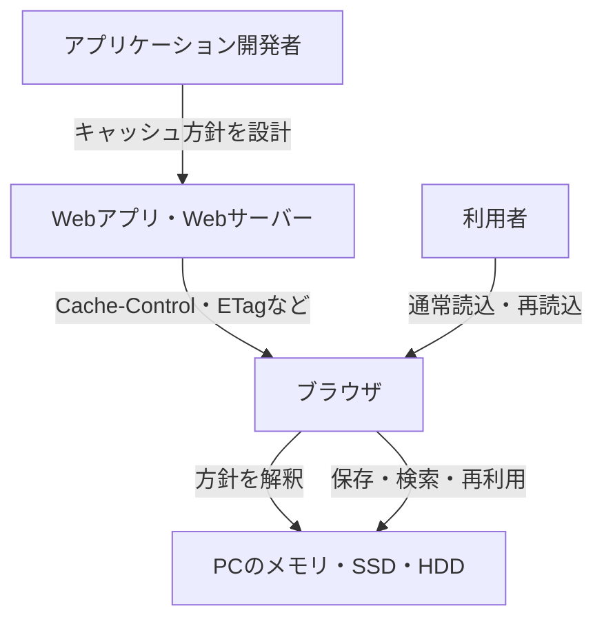

### ブラウザが担当すること

- HTTPレスポンスのキャッシュ用ヘッダーを解釈する
- キャッシュ可能なレスポンスを保存する
- 保存済みレスポンスを検索する
- キャッシュキーに合うレスポンスを選択する
- Freshなレスポンスを再利用する
- 必要に応じて条件付きリクエストを作る
- memoryまたはdiskなどの保存方法を選択する
- 容量不足などに応じてキャッシュを削除する

### アプリケーション開発者が担当すること

- どのレスポンスをキャッシュしてよいか決める
- どのくらいの期間をFreshとするか決める
- ユーザー固有情報や機密情報をどう扱うか決める
- `Cache-Control`などのレスポンスヘッダーを設定する
- `ETag`や`Last-Modified`など、更新確認用の情報を提供する
- リソース更新時に、古いキャッシュが問題にならない設計を行う
- CDNを使う場合は、共有してよいレスポンスとキャッシュキーを設計する
- 設定した方針をブラウザ、curl、テストで確認する

### Webサーバーやフレームワークが担当すること

- アプリケーションの設定に従ってHTTPヘッダーを出力する
- 条件付きリクエストを評価する
- 更新がなければ`304 Not Modified`を返す
- 静的ファイルに自動でキャッシュ用ヘッダーを付ける場合がある

フレームワークが自動設定する場合でも、最終的なHTTPレスポンスを確認する責任はアプリケーション開発者に残ります。

### OSとストレージが担当すること

- ブラウザが要求したデータをメモリやファイルとして保持する
- メモリ、SSD、HDDへの読み書きを提供する

OSは、そのデータがユーザー固有情報か、1年間キャッシュしてよいCSSかを判断しません。HTTP上の意味を判断するのはブラウザとアプリケーションです。

### 利用者が行えること

- 通常の再読み込み
- 強制再読み込み
- ブラウザキャッシュの削除
- DevToolsによる一時的なキャッシュ無効化

### 責任分担のまとめ

| 判断・処理 | 主な担当 |
|---|---|
| キャッシュ方針を決める | アプリケーション開発者 |
| HTTPヘッダーを返す | Webアプリ・Webサーバー |
| ヘッダーを解釈する | ブラウザ・CDN |
| memoryかdiskかを選ぶ | ブラウザ |
| 実際に保存・検索・再利用する | ブラウザ |
| 条件付きリクエストを送る | ブラウザ・キャッシュ |
| `304`を返すか判断する | オリジンサーバー・中継キャッシュ |
| CDNの共有範囲を設定する | 開発者・インフラ担当者 |
| Service Workerの戦略を実装する | フロントエンド開発者 |
| キャッシュの挙動を検証する | 開発者・テスト担当者 |

重要なのは、次の区別です。

```text
保存機能そのもの
  → ブラウザに実装されている

保存してよいデータと期間
  → アプリケーション側でも明示する
```

---

## 7. ブラウザキャッシュの基本的な流れ

通常のWeb開発では、主に`GET`と`HEAD`のレスポンスをHTTPキャッシュの対象として考えます。
HTTP仕様上は条件を満たす別のメソッドも保存可能ですが、ブラウザキャッシュへ`POST`レスポンスを保存・再利用することを前提にした設計は一般的ではありません。

### 1回目のリクエスト

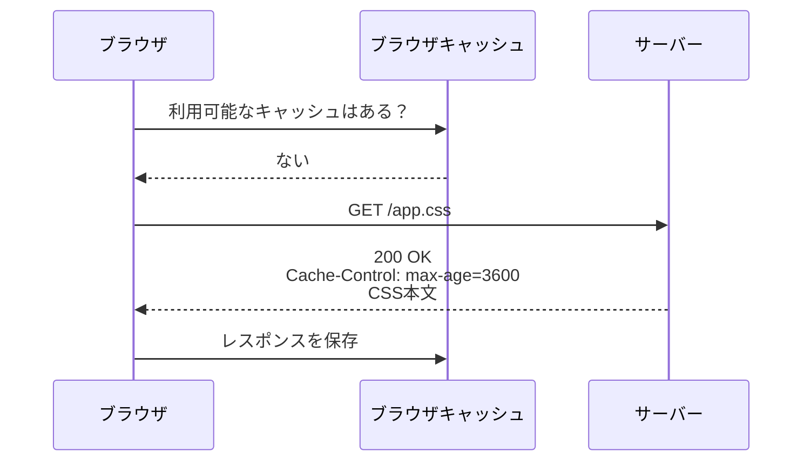

### Freshな間の2回目のリクエスト

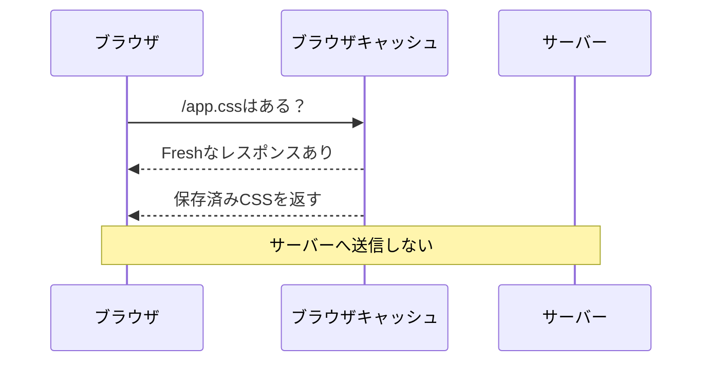

### Staleになった後

保存済みレスポンスがStaleになっても、すぐ削除されるとは限りません。`ETag`などがあれば、サーバーへ更新確認できます。

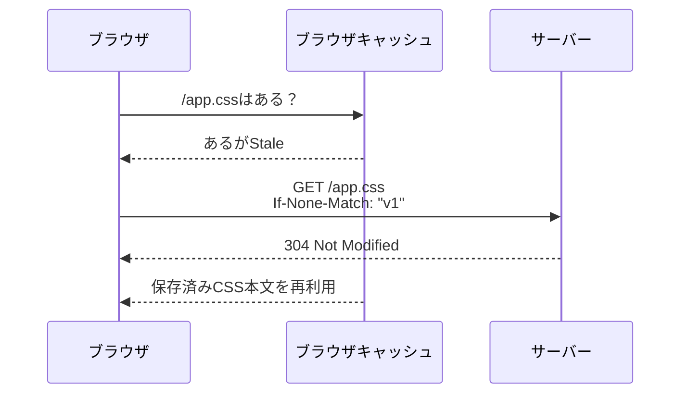

---

## 8. Chrome DevToolsでの見え方

Networkパネルの`Size`列には、次のような表示が現れる場合があります。

| 表示 | 主な意味 |
|---|---|
| `12.4 kB` | ネットワーク経由でレスポンスを取得した |
| `(memory cache)` | 主にメモリ上のブラウザキャッシュから再利用した |
| `(disk cache)` | 主にディスク上のブラウザキャッシュから再利用した |
| `304` | サーバーなどへ更新確認し、保存済み本文を再利用した |

### `memory cache`と`304`の違い

```text
memory cache
  保存済みデータをブラウザ内で再利用
  サーバー通信が発生しない場合がある

304 Not Modified
  サーバーなどへ条件付きリクエストを送る
  更新されていないことを確認する
  保存済みレスポンスボディを再利用する
```

### キャッシュを無効にして確認する

Chrome DevToolsでは、DevToolsを開いている間に`Disable cache`を有効化できます。

```text
Networkパネル
  ↓
Disable cacheを有効化
  ↓
ページを再読み込み
```

これは、キャッシュがない初回訪問に近い通信を観察するときに役立ちます。

ただし、`Disable cache`を有効にした状態だけを見ていると、通常利用時のキャッシュ挙動を確認できません。

次の両方を観察します。

1. キャッシュを有効にした通常の再読み込み
2. `Disable cache`を有効にした再読み込み

---

## 第2部：HTTPによるキャッシュ制御

## 9. アプリはHTTPヘッダーで方針を伝える

アプリケーションは、主にHTTPレスポンスヘッダーを使ってキャッシュ方針を伝えます。

```http
HTTP/1.1 200 OK
Content-Type: text/css
Cache-Control: public, max-age=3600
ETag: "css-v1"

body { color: black; }
```

主なヘッダーは次のとおりです。

| ヘッダー | 役割 |
|---|---|
| `Cache-Control` | 保存可否、新鮮さ、再検証などの方針 |
| `ETag` | リソースの版を識別する値 |
| `Last-Modified` | リソースの最終更新日時 |
| `Expires` | レスポンスが期限切れになる日時 |
| `Vary` | どのリクエストヘッダーの違いでレスポンスを分けるか |
| `Age` | 生成または再検証からの推定経過秒数 |

現在は、期限の指定には`Expires`より`Cache-Control: max-age=...`を中心に使う方が分かりやすいです。

---

## 10. 主な`Cache-Control`ディレクティブ

### `max-age`

レスポンスを何秒間Freshとして扱えるかを指定します。

```http
Cache-Control: max-age=3600
```

```text
3600秒 = 1時間
```

Freshな間は、通常、サーバーへ更新確認せず再利用できます。

### `no-cache`

名前から「保存禁止」に見えますが、保存そのものを禁止する指示ではありません。

```http
Cache-Control: no-cache
```

意味は次のとおりです。

> 保存済みレスポンスを再利用する前に、サーバーなどで正常に再検証する必要がある。

```text
保存
  → できる

確認なしの再利用
  → できない
```

### `no-store`

キャッシュへ保存しないよう指示します。

```http
Cache-Control: no-store
```

```text
no-cache
  保存できる
  再利用前に検証する

no-store
  保存しない
```

認証情報や機密性の高い個人情報を含むレスポンスでは、`no-store`を検討します。

ただし、`no-store`だけで通信や端末の安全性がすべて保証されるわけではありません。HTTPS、アクセス制御、ログ管理なども必要です。

### `private`

Shared Cacheへ保存させず、Private Cacheに限定する指示です。

```http
Cache-Control: private, max-age=60
```

```text
ブラウザのPrivate Cache
  → 保存できる

CDNなどのShared Cache
  → 保存してはいけない
```

### `public`

Shared Cacheへ保存可能であることを明示します。

```http
Cache-Control: public, max-age=3600
```

静的ファイルや、すべての利用者へ同じ内容を返す公開情報などで利用を検討します。

### `s-maxage`

Shared Cacheに対するFresh期間を指定します。

```http
Cache-Control: public, max-age=60, s-maxage=300
```

```text
ブラウザ
  max-age=60
  → 60秒

CDN
  s-maxage=300
  → 300秒
```

### `must-revalidate`

レスポンスがStaleになった後、正常な再検証なしで再利用しないよう求めます。

```http
Cache-Control: max-age=60, must-revalidate
```

### `immutable`

Freshな期間中は内容が変化しないことを示します。

```http
Cache-Control: public, max-age=31536000, immutable
```

主に、内容が変わるとURLも変わる静的ファイルで使います。

```text
更新前
/assets/app.a1b2c3.js

更新後
/assets/app.d4e5f6.js
```

同じURLの内容を変更しないため、1年間キャッシュしても新しいURLから新しいファイルを取得できます。

---

## 11. FreshnessとRevalidation

キャッシュされたレスポンスには、次の2つの状態があります。

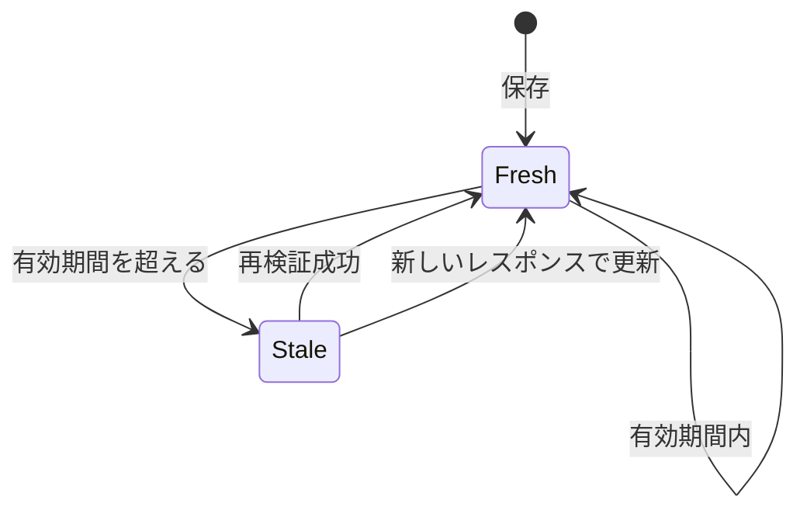

### Fresh

- 新鮮さの有効期間内
- 通常はサーバーへ確認せず利用できる

### Stale

- 新鮮さの有効期間を超えている
- そのまま再利用できるとは限らない
- 再検証または再取得が必要になる

重要なのは、Staleと「削除済み」は同じではないことです。

```text
Stale
  保存データは残っている可能性がある
  ただし、そのまま使えるとは限らない

削除済み
  保存データ自体がない
```

---

## 12. `ETag`による更新確認

`ETag`は、サーバーがレスポンスの版を識別するために付ける値です。

### 1回目

```http
HTTP/1.1 200 OK
Cache-Control: no-cache
ETag: "task-list-v1"
Content-Type: application/json

{"tasks":[]}
```

ブラウザはレスポンスと`ETag`を保存できます。

### 2回目

ブラウザは保存した`ETag`を使って条件付きリクエストを送れます。

```http
GET /api/tasks HTTP/1.1
If-None-Match: "task-list-v1"
```

内容が変わっていなければ、サーバーは次のように返せます。

```http
HTTP/1.1 304 Not Modified
ETag: "task-list-v1"
```

`304`には、通常、完全なレスポンスボディを含めません。ブラウザは保存済みのボディを再利用します。

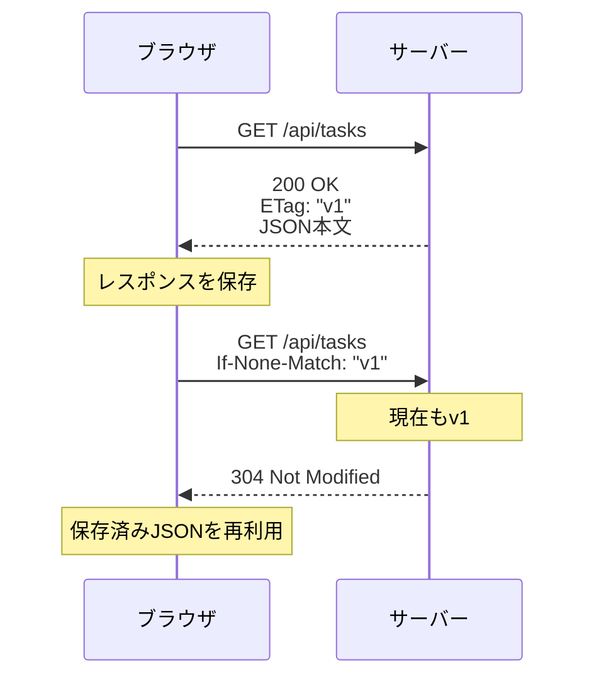

### 内容が変わった場合

```http
HTTP/1.1 200 OK
ETag: "task-list-v2"
Content-Type: application/json

{"tasks":[{"id":1,"title":"HTTPを学ぶ"}]}
```

サーバーは新しいボディと新しい`ETag`を返します。

---

## 13. `Last-Modified`による更新確認

サーバーは、リソースの最終更新日時を返すこともできます。

```http
Last-Modified: Fri, 31 Jul 2026 03:00:00 GMT
```

次回、ブラウザやキャッシュは次のようなリクエストを送れます。

```http
If-Modified-Since: Fri, 31 Jul 2026 03:00:00 GMT
```

更新されていなければ、サーバーは`304 Not Modified`を返せます。

| 検証方式 | レスポンス | 次回リクエスト |
|---|---|---|
| Entity Tag | `ETag` | `If-None-Match` |
| 更新日時 | `Last-Modified` | `If-Modified-Since` |

一般に`ETag`は、時刻だけでは表しにくい変更も識別できるため、より柔軟です。

---

## 14. `Vary`とキャッシュキー

同じURLでも、リクエストヘッダーによってレスポンス内容が変わる場合があります。

例えば、圧縮方式によってレスポンスが変わる場合です。

```http
Vary: Accept-Encoding
```

```text
Accept-Encoding: gzip
  → gzip版のレスポンス

Accept-Encoding: br
  → Brotli版のレスポンス
```

`Vary`は、どのリクエストヘッダーの違いを考慮して保存済みレスポンスを選ぶか、キャッシュへ伝えます。

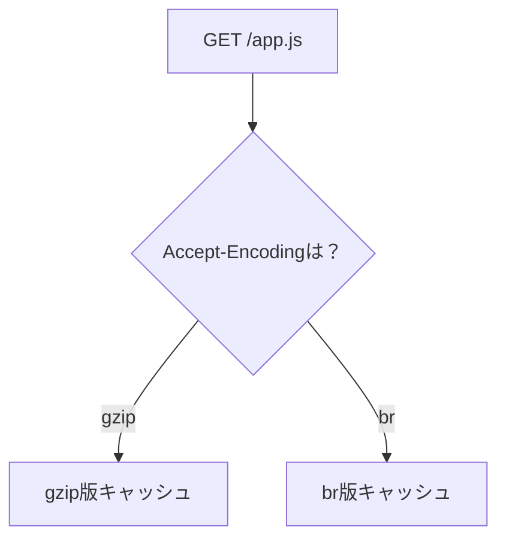

`Vary`へ多くのヘッダーを指定すると、キャッシュが細かく分かれ、Cache Hitしにくくなる可能性があります。

また、利用者ごとに異なるレスポンスをShared Cacheへ保存する設計では、キャッシュキーの誤りが他人のデータ漏えいにつながる可能性があります。

---

## 第3部：アプリケーションでの設計

## 15. リソース別の基本方針

すべてのレスポンスへ同じキャッシュ設定を付けるのではなく、データの性質に合わせます。

| リソース | 方針の例 | 理由 |
|---|---|---|
| ハッシュ付きCSS・JavaScript | 長い`max-age`と`immutable` | 内容変更時にURLも変わる |
| 頻繁に更新するHTML | `no-cache` | 保存できるが、再利用前に確認する |
| 公開API | 短い`max-age`を検討 | 全利用者で同じ内容なら再利用しやすい |
| ユーザー固有API | `private`または`no-store`を検討 | Shared Cacheで共有してはいけない |
| パスワードや機密情報を含むレスポンス | `no-store`を検討 | 保存自体を避けたい |
| プロフィール画像 | URL更新または再検証を設計 | 更新後も古い画像が残らないようにする |

これは出発点であり、すべてのアプリに同じ設定が正しいわけではありません。

### 静的ファイル

```http
Cache-Control: public, max-age=31536000, immutable
```

次の条件を満たす設計と組み合わせます。

- 内容が変わったらURLも変える
- ファイル名へ内容のハッシュを含める
- HTTPSで配信する

### 頻繁に更新するHTML

```http
Cache-Control: no-cache
ETag: "page-v5"
```

保存は許可しつつ、再利用前に更新確認できます。

### ユーザー固有情報

保存自体を避ける場合は、次を検討します。

```http
Cache-Control: no-store
```

ブラウザのPrivate Cacheへの保存は許可し、Shared Cacheへの保存だけを禁止する場合は、次のような方針を検討できます。

```http
Cache-Control: private, no-cache
ETag: "profile-v1"
```

`no-store`はPrivate CacheとShared Cacheの両方へ保存しないよう求めるため、保存制御としては`private`を追加しなくても成立します。

性能やオフライン要件などによっては、`private`でブラウザキャッシュだけを許可する設計も考えられます。

重要なのは、次の問いへ回答できることです。

- ほかの利用者と共有してよいレスポンスか
- PCへ保存されてもよい情報か
- 古い内容が表示された場合に何が起きるか
- ログアウト後も残ってよいか
- URLやCookieが異なる場合に同じキャッシュを使ってよいか

---

## 16. GoのHTTPハンドラーで方針を返す

Goの`net/http`では、レスポンスを書き込む前にヘッダーを設定します。

### 保存させない例

```go
func profileHandler(w http.ResponseWriter, r *http.Request) {
	w.Header().Set("Cache-Control", "no-store")
	w.Header().Set("Content-Type", "application/json")

	w.WriteHeader(http.StatusOK)
	_, _ = w.Write([]byte(`{"name":"megamaru"}`))
}
```

### 公開情報を短時間キャッシュする例

```go
func publicTasksHandler(w http.ResponseWriter, r *http.Request) {
	w.Header().Set("Cache-Control", "public, max-age=60")
	w.Header().Set("Content-Type", "application/json")

	w.WriteHeader(http.StatusOK)
	_, _ = w.Write([]byte(`{"tasks":[]}`))
}
```

`WriteHeader`や`Write`を先に呼び出すと、ヘッダー変更がレスポンスへ反映されない場合があります。

また、これらはキャッシュ方針の説明用の最小例です。実際のAPIでは、メソッド検証、エラー処理、JSONエンコードなども必要です。

---

## 17. HTTPキャッシュとService Workerの違い

通常のHTTPキャッシュと、Service WorkerのCache APIは別の仕組みです。

| 項目 | HTTPキャッシュ | Service WorkerのCache API |
|---|---|---|
| 主な制御者 | ブラウザとHTTPヘッダー | フロントエンドのJavaScript |
| 保存 | ブラウザが自動判断 | アプリが明示的に保存 |
| 取得 | HTTPキャッシュ規則に従う | Service Workerが戦略を実装 |
| 更新 | FreshnessやRevalidation | アプリが更新・削除を実装 |
| 主な用途 | 通常の通信効率化 | オフライン対応、独自キャッシュ戦略 |

### Service Workerの位置

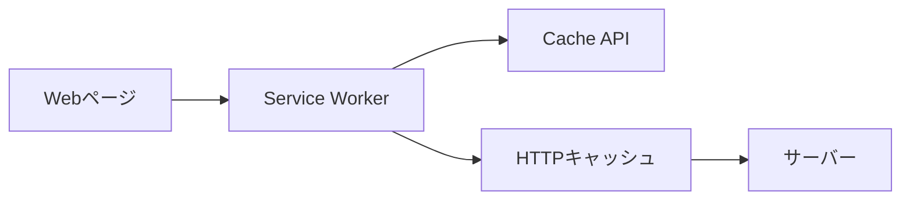

Service Workerでは、例えば次のような戦略を実装できます。

- Cache First：キャッシュを先に探す
- Network First：ネットワークを先に試す
- Stale While Revalidate：保存済みデータを返しながら裏で更新する

Cache APIはHTTPキャッシュ用ヘッダーを自動的には尊重しません。また、保存項目は明示的に更新・削除しない限り、自動で期限切れになりません。

そのため、Service Workerを使う場合は、アプリケーション側が次を設計します。

- 何を保存するか
- いつ更新するか
- いつ削除するか
- キャッシュ名をどうバージョン管理するか
- ユーザー固有情報を保存してよいか

---

## 18. CDNキャッシュとの違い

CDNは複数の利用者で利用するShared Cacheです。

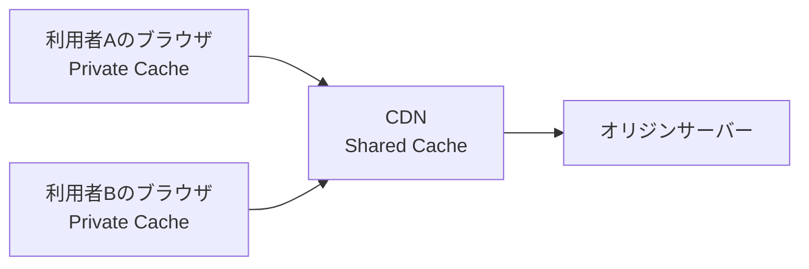

| 観点 | ブラウザキャッシュ | CDNキャッシュ |
|---|---|---|
| 利用者 | 原則として1人 | 複数の利用者 |
| 保存場所 | 利用者の端末 | CDNのエッジ拠点 |
| 主な目的 | 再訪時の高速化 | 配信高速化、オリジン負荷削減 |
| 主な管理者 | ブラウザ | インフラ担当者・CDN |
| 特に注意すること | 端末へ情報が残る | 他人のレスポンスを共有しない |

CDNでは、誤ったキャッシュ設定が複数利用者へ影響します。

```text
利用者Aの個人情報
  ↓ 誤ってCDNへ保存
Shared Cache
  ↓
利用者Bへ返してしまう
```

ユーザー固有情報は、安易にShared Cacheへ保存しません。`private`や`no-store`、CDNのキャッシュキー、CookieやAuthorizationの扱いを設計します。

CloudFront固有の仕組みは、[CloudFrontの中継とキャッシュの仕組み](cloudfront-intermediary-and-cache.md)を参照してください。

---

## 19. サーバー内部のキャッシュとの違い

ブラウザやCDN以外にも、バックエンドアプリケーション内部でデータをキャッシュする場合があります。

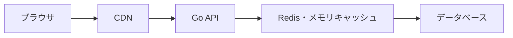

| キャッシュ | 保存するものの例 | 実装・設定する人 |
|---|---|---|
| ブラウザHTTPキャッシュ | HTTPレスポンス | ブラウザとWeb開発者 |
| CDNキャッシュ | HTTPレスポンス | インフラ・Web開発者 |
| Service Worker Cache API | RequestとResponse | フロントエンド開発者 |
| Goプロセス内キャッシュ | 計算結果、DB取得結果 | バックエンド開発者 |
| Redis | セッション、検索結果など | バックエンド・インフラ担当者 |
| DBのキャッシュ | データページ、実行計画など | DB自身とDB管理者 |

サーバー内部のキャッシュは、ブラウザの`memory cache`とは別物です。

```text
Chromeのmemory cache
  利用者のPCにある

Goアプリのメモリキャッシュ
  APIサーバーのメモリにある
```

同じ「メモリキャッシュ」という言葉でも、どのコンピューターの、どのソフトウェアが管理しているかを確認します。

---

## 20. セキュリティ上の注意

### ユーザー固有情報を共有しない

ログイン後のレスポンスをShared Cacheへ保存すると、他人へ返される危険があります。

- ユーザーID
- メールアドレス
- タスク一覧
- 管理者画面
- セッションに依存するHTML

このようなレスポンスでは、`private`や`no-store`を検討します。

### URLへ秘密情報を入れない

URLは、ブラウザ履歴、アクセスログ、監視ツール、キャッシュキーなどへ残る可能性があります。

```text
避ける例

GET /reset-password?token=SECRET
GET /profile?session_id=SECRET
```

一時トークンが必要な設計でも、露出範囲と有効期間を最小化します。

### ログアウトとキャッシュ

ログアウトしても、すでにブラウザへ表示・保存された情報が自動的に完全消去されるとは限りません。

```text
ログアウト
  セッションを無効化する

キャッシュ削除
  保存済みレスポンスを削除する

この2つは別の処理
```

サーバー側の認可は、キャッシュの有無に関係なく毎回正しく設計する必要があります。

### `no-store`だけへ依存しない

`no-store`は重要ですが、次の代わりにはなりません。

- HTTPS
- 認証
- 認可
- Cookie属性
- 秘密情報をログへ出さないこと
- XSS対策
- 端末自体のセキュリティ

---

## 21. よくある誤解

| 誤解 | 実際 |
|---|---|
| memory cacheはサーバーのメモリにある | Chrome表示の場合、主に利用者PC上のブラウザキャッシュ |
| disk cacheはサーバーのディスクにある | Chrome表示の場合、主に利用者PCのSSD・HDD上 |
| アプリがmemoryかdiskかを指定する | 保存方法の詳細は主にブラウザが判断する |
| キャッシュはすべてブラウザが自動で正しく判断する | アプリ側もHTTPヘッダーで明確な方針を示す |
| `no-cache`は保存禁止 | 保存できるが、再利用前に再検証が必要 |
| `no-store`ならセキュリティ対策は完了 | HTTPS、認証、認可なども必要 |
| Staleになったら直ちに削除される | 保存されたまま、再検証に使われる場合がある |
| `304`はキャッシュだけで完結している | サーバーまたは中継キャッシュへの更新確認が発生している |
| Service WorkerのCache APIもHTTPキャッシュと同じ | 別の仕組みであり、アプリが更新・削除を管理する |
| CDNキャッシュとブラウザキャッシュは同じ | Shared CacheとPrivate Cacheという違いがある |

---

## 22. 調査・デバッグの手順

キャッシュの挙動を調べるときは、次の順序で確認します。

### ブラウザ

1. DevToolsを開く
2. Networkパネルを開く
3. `Disable cache`を無効にする
4. ページを読み込む
5. 同じページをもう一度読み込む
6. `Status`、`Size`、`Time`を比較する
7. リクエストを選び、Response Headersの`Cache-Control`、`ETag`、`Age`、`Vary`を確認する
8. Request Headersの`If-None-Match`、`If-Modified-Since`を確認する
9. `Disable cache`を有効にして違いを確認する

### curl

レスポンスヘッダーを確認します。

```bash
curl -sS -D - -o /dev/null https://example.com/app.css
```

`ETag`が返された場合は、条件付きリクエストを試せます。

```bash
curl -sS -D - -o /dev/null \
  -H 'If-None-Match: "取得したETag"' \
  https://example.com/app.css
```

curlは、通常のブラウザのように自動でHTTPキャッシュを継続管理しません。条件付きリクエストを試す場合は、ヘッダーを明示します。

### 確認する問い

- レスポンスは保存可能か
- Freshな期間は何秒か
- Private CacheとShared Cacheのどちらが保存できるか
- Staleになった後は再検証できるか
- `ETag`または`Last-Modified`があるか
- URLやヘッダーの違いを正しく区別できるか
- ユーザー固有情報が共有される可能性はないか
- フロントエンド更新後に古いJavaScriptが残らないか

---

## 23. 設計時のチェックリスト

### 基本方針

- [ ] キャッシュ対象となるレスポンスを把握した
- [ ] キャッシュする目的を説明できる
- [ ] どのくらい古いデータを許容できるか決めた
- [ ] ブラウザだけでなくCDNの有無も確認した

### HTTPヘッダー

- [ ] `Cache-Control`を明示した
- [ ] `no-cache`と`no-store`の違いを確認した
- [ ] 必要に応じて`ETag`または`Last-Modified`を設定した
- [ ] `Vary`の対象がレスポンスの変化条件と一致している
- [ ] 長期キャッシュする静的ファイルはURLをバージョン化した

### セキュリティ

- [ ] ユーザー固有情報をShared Cacheへ保存しない
- [ ] 機密情報を含むレスポンスで`no-store`を検討した
- [ ] URLへ秘密情報を含めていない
- [ ] ログアウトとキャッシュ削除を同じものとして扱っていない
- [ ] キャッシュがあってもサーバー側で認可を確認している

### 検証

- [ ] 初回アクセスと再アクセスを比較した
- [ ] DevToolsの`memory cache`と`disk cache`を確認した
- [ ] `Disable cache`有効・無効の両方を試した
- [ ] 条件付きリクエストと`304`を確認した
- [ ] 更新後に古いキャッシュが残らないことを確認した

---

## 24. 要点

```text
memory cache
  ブラウザが主にPCのメモリ上で管理する

disk cache
  ブラウザが主にPCのSSD・HDD上で管理する

ブラウザ
  保存・検索・再利用・削除を行う
  memoryかdiskかを判断する

アプリケーション開発者
  保存してよいレスポンスを決める
  Freshな期間を決める
  機密情報の扱いを決める
  Cache-ControlやETagを返す

CDN
  複数利用者向けのShared Cache

Service Worker
  JavaScriptで独自のキャッシュ戦略を実装する
```

最も重要な責任分担は、次のとおりです。

> ブラウザはキャッシュを保存・再利用する機能を持つ。アプリケーション開発者は、何を、どの範囲で、どの期間キャッシュしてよいかを設計し、HTTPヘッダーで伝える。

---

## 25. 関連ドキュメント

- [CloudFrontの中継とキャッシュの仕組み](cloudfront-intermediary-and-cache.md)
- [`curl -v`で観察するHTTPレスポンス](http-response-structure-and-headers.md)
- [HTTP Cookieと`HttpOnly`の仕組み](http-cookies-and-httponly.md)
- [HTTP/1.1とHTTP/2のストリーム](http1.1-vs-http2-streams.md)

---

## 26. 参考資料

- [RFC 9111：HTTP Caching](https://www.rfc-editor.org/rfc/rfc9111.html)
- [RFC 9110：HTTP Semantics](https://www.rfc-editor.org/rfc/rfc9110.html)
- [RFC 8246：HTTP Immutable Responses](https://www.rfc-editor.org/rfc/rfc8246.html)
- [Chrome DevTools：Network features reference](https://developer.chrome.com/docs/devtools/network/reference/)
- [Chrome DevTools：Inspect network activity](https://developer.chrome.com/docs/devtools/network/)
- [Service Workers specification](https://www.w3.org/TR/service-workers/)
- [MDN：Cache API](https://developer.mozilla.org/en-US/docs/Web/API/Cache)
- [MDN：HTTP caching](https://developer.mozilla.org/en-US/docs/Web/HTTP/Guides/Caching)
