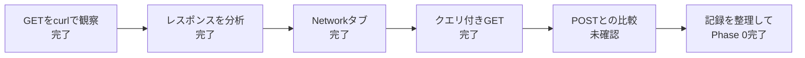

# Phase 0 レビュー結果

- レビュー日：2026/7/31
- 再レビュー日：2026/8/6
- レビュー対象：[Phase 0進捗](../progress/phase-0-progress.md)
- 完了条件：[ロードマップのPhase 0](../10-roadmap.md#phase-0開発環境とhttp通信の観察)
- 判定：**進行中**

## 1. レビュー概要

`curl -v`と`curl -i`によるGET通信、ブラウザのNetworkタブに加え、Postman Echoを使ったクエリ付きGETの実行と観察結果を確認できました。
特に、TLS、HTTP/2、リクエスト、レスポンスを分けて調べた点はよいです。

クエリあり・なしを同じ`/get`パスで比較し、レスポンスボディの`args`へクエリが反映されることも記録できています。また、`Set-Cookie`の名前と属性を残し、値を適切にマスクしています。

一方、パスとクエリの説明には修正が必要です。また、POSTは「やったこと」に列挙されていますが、実行内容や観察結果が記録されていません。
そのため、現在の記録だけではPhase 0の完了条件をすべて満たしたとは判断できません。

> [!NOTE]
> このレビューでは、リポジトリに記録された内容を根拠に判定しています。
> すでに実施していても記録がない項目は「未確認」としています。



## 2. 完了条件の判定

| 完了条件 | 判定 | レビュー結果 |
|---|---|---|
| リクエストのメソッド、パス、クエリ、ヘッダー、ボディを説明できる | 一部完了 | クエリ付きGETは実行済み。ただし、パスとクエリの違いに関する観察の修正が必要 |
| レスポンスのステータスコード、ヘッダー、ボディを説明できる | 完了 | 3つを分けて説明できている |
| GETとPOSTの違いを説明できる | 未確認 | GETだけが記録されている |
| Networkタブで通信を確認した | 完了 | 対象URL、ブラウザ、リクエスト詳細などの観察記録がある |
| `curl -v`と`curl -i`を使用した | 完了 | コマンド、結果、観察内容が記録されている |
| 観察した通信の各要素を記録した | 一部完了 | curlによるGETとレスポンス、ブラウザ、クエリ付きGETは記録済み。POSTの記録が不足 |

## 3. できている点

### 3.1 実行結果を残している

- 実行したコマンドと対象URLが記録されている
- `curl`の出力を省略しすぎず、後から確認できる
- `curl -v`と`curl -i`の表示の違いを観察している

### 3.2 リクエストとレスポンスを区別できている

`curl -v`の記号を、次のように正しく分類できています。

| 記号 | 意味 |
|---|---|
| `*` | curlが表示する接続やTLSなどの補足情報 |
| `>` | curlから送信したHTTPリクエスト |
| `<` | curlが受信したHTTPレスポンス |

また、HTTPレスポンスを次の3つに分けて説明できています。

```text
ステータスコード
  ↓
レスポンスヘッダー
  ↓
空行
  ↓
レスポンスボディ
```

### 3.3 疑問を言葉にできている

- CloudFrontは中継サーバーか、キャッシュサーバーか
- `Via`の値が変化した理由は何か
- `Age`はクライアントごとに管理されるのか
- 公開鍵と秘密鍵を十分に理解できていない

分からないことを曖昧なままにせず、疑問として残せている点はよいです。

### 3.4 追加調査が丁寧である

`docs/reference/`には、TLS、HTTP/2、Cookie、CloudFrontなどの調査結果が整理されています。
参考資料やRFCへのリンクもあり、後から再確認できる状態です。

### 3.5 クエリ付きGETを同じパスで比較している

- クエリなし：`https://postman-echo.com/get`
- クエリあり：`https://postman-echo.com/get?name=pikachu&limit=10`
- 両方の実行コマンドと`curl -v`の出力が記録されている
- クエリありでは、レスポンスボディの`args`に`name`と`limit`が反映されている
- `Set-Cookie`の値を`[MASKED]`へ置き換え、名前と属性だけを安全に記録している

## 4. 不足している点

### 4.1 ブラウザのNetworkタブの記録を補う

ブラウザから発生する通信の観察と、その結果の記録は確認できました。
ただし、最低1件について、次の実際の値が分かるように記録を補ってください。

- Request URL
- HTTPメソッド
- ステータスコード
- Request Headers
- Response Headers
- ResponseまたはPreview
- Cookieがある場合は名前と属性

Cookieや認証情報の値は、そのままリポジトリへ保存せずマスクします。

### 4.2 クエリパラメータ

クエリ付きGETの実行と結果の記録は完了しています。ただし、次の観察は修正が必要です。

```text
現在の記録
リクエストを比較すると、パスの部分だけ違う。

正しい区別
パス：どちらも /get
クエリ（クエリなし）：なし
クエリ（クエリあり）：name=pikachu&limit=10
:path全体（クエリなし）：/get
:path全体（クエリあり）：/get?name=pikachu&limit=10
```

`curl`のHTTP/2表示では、パスとクエリが`:path`へまとめて表示されます。しかし、URLの構成要素としてのパスは両方とも`/get`です。

```text
パス
/get

クエリ
name=pikachu&limit=10

リクエストターゲット
/get?name=pikachu&limit=10
```

進捗メモの観察を上記の内容へ修正したら、「パスとクエリを分けて説明した」を完了にできます。

### 4.3 GETとPOSTの比較

2026/8/6の「やったこと」にはGETとPOSTの比較が記載されていますが、POSTのコマンド、リクエスト、レスポンス、比較結果がないため、完了を確認できません。
自分が管理する環境か、HTTP確認用に提供されているサービスを使用して観察します。

| 観察項目 | クエリ付きGET | JSONを送るPOST |
|---|---|---|
| メソッド | `GET` | `POST` |
| データの主な配置場所 | URLのクエリ | リクエストボディ |
| `Content-Type` | 通常は不要 | JSONなら`application/json` |
| `Content-Length` | ボディがなければ通常は不要 | curlがボディの長さを設定する |
| 主な用途 | リソースの取得 | データの送信や処理の依頼 |

データの配置だけでなく、メソッドが表す意味も比較してください。

### 4.4 Phase進捗の基本情報

[Phase 0進捗](../progress/phase-0-progress.md#フェーズ基本情報)の次の項目が未記入です。

- 完了日
- 予定期間
- 実際の経過期間
- 実際の作業時間
- 現在の状態
- 予定との差と理由
- 次のPhaseでの調整

調査範囲がTLSやHTTP/2まで広がったことは、予定との差が生じた理由として記録できます。

## 5. 間違っている点・直したい表現

### 5.1 技術的な修正

| 場所 | 現在の説明 | 修正内容 |
|---|---|---|
| [`Age`](../progress/phase-0-progress.md#レスポンスについて) | キャッシュに保存されてからの経過時間 | オリジンで生成または正常に再検証されてからの推定経過時間 |
| [`Via`](../progress/phase-0-progress.md#curl--iでレスポンスヘッダーを確認する) | CloudFrontは変わったが中継サーバーは変わっていない | 同じPOPだったが、`Via`内のCloudFront識別情報が異なった。物理サーバーの変化は断定できない |
| `</html>%` | `%`までレスポンスボディに見える | `%`は、本文末尾に改行がない場合にzshが表示する記号であり、レスポンスには含まれない |
| `Server: Apache` | レスポンスを処理したサーバーはApache | Apacheを使用している可能性はあるが、ヘッダーだけでは実際の構成を断定できない |
| TLSの鍵 | 通信に使う鍵を安全に共有する | TLS 1.3では鍵そのものを送らず、交換した情報と秘密値から双方が同じ鍵を導出する |
| HTTP/2の表示 | `GET / HTTP/2`というテキストをそのまま送るように見える | curlによる人間向け表示。実際のHTTP/2では疑似ヘッダーをHEADERSフレームで送る |

より詳しい説明は、次の参考資料にあります。

- [`Age`の説明](../reference/http-response-structure-and-headers.md#13-age-171510)
- [`Via`の説明](../reference/cloudfront-intermediary-and-cache.md#7-同じpopでもviaの値が変わった理由)
- [末尾の`%`の説明](../reference/http-response-structure-and-headers.md#16-bodyhtml)
- [HTTP/2フレーム](../reference/http1.1-vs-http2-streams.md#4-http2フレーム)
- [TLS 1.3の鍵導出](../reference/tls-1.3-handshake-flow.md#5-server-hello-2)

### 5.2 誤記

| 修正前 | 修正後 |
|---|---|
| `vervose` | `verbose` |
| メディアタイム | メディアタイプ |
| `aplication/json` | `application/json` |
| `Serverhello` | `ServerHello` |
| `Finished`` | `Finished` |

## 6. 修正チェックリスト

### 6.1 Phase 0の必須作業

- [x] ブラウザのNetworkタブで1件以上の通信を観察した
- [x] Networkタブの観察結果を進捗メモへ記録した
- [x] クエリ付きGETを実行した
- [ ] パスとクエリを分けて説明した
- [ ] ボディ付きPOSTを実行した
- [ ] GETとPOSTのリクエストを表で比較した
- [x] Cookieまたは`Set-Cookie`を確認した。確認できなかった場合は、その事実を記録した

### 6.2 説明の修正

- [ ] `Age`の説明を修正した
- [ ] `Via`の観察結果を修正した
- [ ] 末尾の`%`がzshの表示であることを追記した
- [ ] `Server: Apache`だけでは構成を断定できないことを追記した
- [ ] TLS 1.3の鍵の説明を修正した
- [ ] HTTP/2のcurl表示と実際のフレームの違いを追記した
- [ ] 誤記5件を修正した

### 6.3 記録の整理

- [ ] Phase進捗の基本情報を記入した
- [ ] CloudFront、`Via`、`Age`の疑問に結論を追記した
- [ ] 公開鍵と秘密鍵の疑問を[未解決事項](../questions/unresolved-questions.md)へ登録した
- [ ] Phase 0の振り返りを`docs/retrospectives/`へ作成した
- [ ] [READMEの現在地](../../README.md#現在地)を更新した
- [ ] AIによって理解や判断が大きく変わった場合は、`docs/ai/consultations/`へ記録した

## 7. Phase 0完了チェック

修正後、ロードマップの完了条件をもう一度確認します。
現在確認できている項目にはチェックを付けています。

### 理解

- [ ] HTTPリクエストのメソッド、パス、クエリ、ヘッダー、ボディを区別して説明できる
- [x] HTTPレスポンスのステータスコード、ヘッダー、ボディを区別して説明できる
- [ ] GETとPOSTで、送信されるHTTPメッセージがどのように異なるか説明できる

### 手動確認・記録

- [x] ブラウザ開発者ツールのNetworkタブで、1件以上の通信を確認した
- [x] `curl -v`と`curl -i`を使って通信を確認した
- [ ] 観察した通信の各要素を学習メモへ記録した

すべてにチェックが付いたら、進捗を「完了」へ変更し、Phase 1へ進みます。

## 8. 次に行う順序

```text
1. クエリ付きGETの観察を「パスは同じで、クエリが異なる」へ修正する
  ↓
2. POSTを観察してGETと表で比較する
  ↓
3. Networkタブの記録に実際のステータスコード、ヘッダー、Cookieの確認結果を補う
  ↓
4. 技術説明と誤記を修正する
  ↓
5. 進捗・未解決事項・振り返りを更新する
  ↓
6. Phase 0を完了し、Phase 1へ進む
```

TLSやHTTP/2を完全に理解するまでPhase 0に留まる必要はありません。
Phase 0の中心である「HTTPリクエストとレスポンスを観察して説明すること」を満たしたら、残った疑問を記録して次へ進みます。
